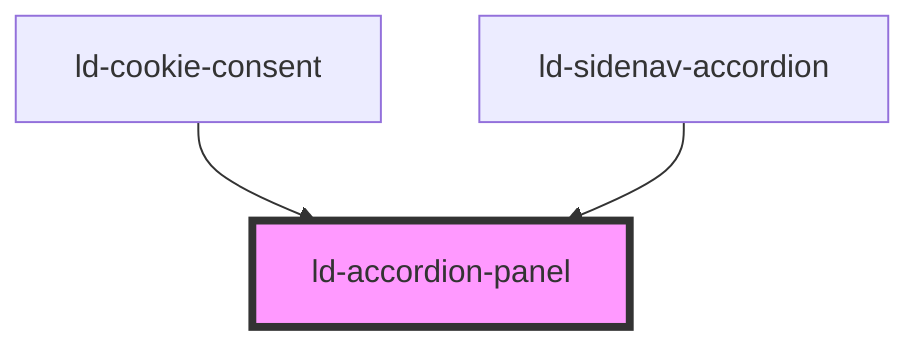

---
eleventyNavigation:
  key: Accordion Panel
  parent: Accordion
layout: layout.njk
title: Accordion Panel
permalink: components/ld-accordion/ld-accordion-panel/
---

# ld-accordion-panel

The `ld-accordion-panel` component is a subcomponent for `ld-accordion`.

Please refer to the [`ld-accordion` documentation](components/ld-accordion) for usage examples.

---

<!-- Auto Generated Below -->

## Properties

| Property | Attribute | Description                                              | Type               | Default     |
| -------- | --------- | -------------------------------------------------------- | ------------------ | ----------- |
| `key`    | `key`     | for tracking the node's identity when working with lists | `string \| number` | `undefined` |
| `ref`    | `ref`     | reference to component                                   | `any`              | `undefined` |

## Shadow Parts

| Part        | Description |
| ----------- | ----------- |
| `"content"` |             |

## Dependencies

### Used by

 - [ld-cookie-consent](../../ld-cookie-consent)
 - [ld-sidenav-accordion](../../ld-sidenav/ld-sidenav-accordion)

### Graph

----------------------------------------------

*Built with [StencilJS](https://stenciljs.com/)*
