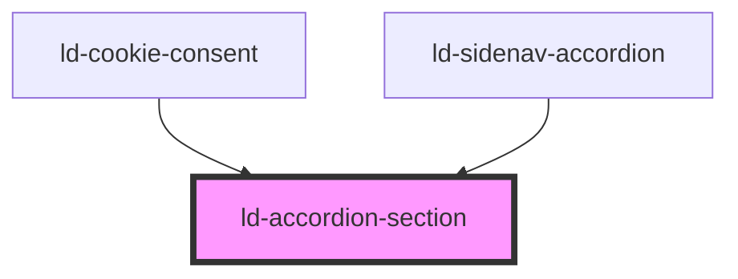

---
eleventyNavigation:
  key: Accordion Section
  parent: Accordion
layout: layout.njk
title: Accordion Section
permalink: components/ld-accordion/ld-accordion-section/
---

# ld-accordion-section

The `ld-accordion-section` component is a subcomponent for `ld-accordion`.

Please refer to the [`ld-accordion` documentation](components/ld-accordion) for usage examples.

---

<!-- Auto Generated Below -->

## Properties

| Property   | Attribute  | Description                                              | Type               | Default     |
| ---------- | ---------- | -------------------------------------------------------- | ------------------ | ----------- |
| `expanded` | `expanded` | Indicates that the accordion section is expanded.        | `boolean`          | `undefined` |
| `key`      | `key`      | for tracking the node's identity when working with lists | `string \| number` | `undefined` |
| `ref`      | `ref`      | reference to component                                   | `any`              | `undefined` |

## Events

| Event               | Description                        | Type                   |
| ------------------- | ---------------------------------- | ---------------------- |
| `ldaccordionchange` | Emitted on expansion and collapse. | `CustomEvent<boolean>` |

## Dependencies

### Used by

 - [ld-cookie-consent](../../ld-cookie-consent)
 - [ld-sidenav-accordion](../../ld-sidenav/ld-sidenav-accordion)

### Graph

----------------------------------------------

*Built with [StencilJS](https://stenciljs.com/)*
