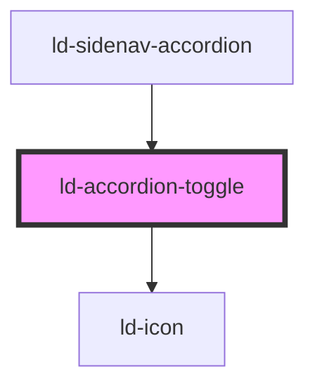

---
eleventyNavigation:
  key: Accordion Toggle
  parent: Accordion
layout: layout.njk
title: Accordion Toggle
permalink: components/ld-accordion/ld-accordion-toggle/
---

# ld-accordion-toggle

The `ld-accordion-toggle` component is a subcomponent for `ld-accordion`.

Please refer to the [`ld-accordion` documentation](components/ld-accordion) for usage examples.

---

<!-- Auto Generated Below -->

## Properties

| Property      | Attribute      | Description                                                                                                                                                          | Type                | Default     |
| ------------- | -------------- | -------------------------------------------------------------------------------------------------------------------------------------------------------------------- | ------------------- | ----------- |
| `disabled`    | `disabled`     | Disables the toggle.                                                                                                                                                 | `boolean`           | `undefined` |
| `key`         | `key`          | for tracking the node's identity when working with lists                                                                                                             | `string \| number`  | `undefined` |
| `labelTag`    | `label-tag`    | Tag to be used for the toggle label in split mode. This prop is especially usefull, if you want to place your own focusable element inside the toggle label element. | `"button" \| "div"` | `'button'`  |
| `ldTabindex`  | `ld-tabindex`  | Tab index of the toggle.                                                                                                                                             | `number`            | `undefined` |
| `ref`         | `ref`          | reference to component                                                                                                                                               | `any`               | `undefined` |
| `split`       | `split`        | Split the toggle in two parts with the second part containing the caret icon and being responsible for expanding / collapsing the accordion panel.                   | `boolean`           | `undefined` |
| `toggleLabel` | `toggle-label` | Used as aria-label value on the toggle trigger element.                                                                                                              | `string`            | `'Toggle'`  |

## Events

| Event                    | Description                                       | Type                     |
| ------------------------ | ------------------------------------------------- | ------------------------ |
| `ldaccordionlabelclick`  | Emitted on click of the accordion toggle label.   | `CustomEvent<undefined>` |
| `ldaccordiontoggleclick` | Emitted on click of the accordion toggle trigger. | `CustomEvent<undefined>` |

## Methods

### `focusInner() => Promise<void>`

Focuses the toggle

#### Returns

Type: `Promise<void>`

## Shadow Parts

| Part                | Description |
| ------------------- | ----------- |
| `"content"`         |             |
| `"focusable"`       |             |
| `"label"`           |             |
| `"label-content"`   |             |
| `"toggle"`          |             |
| `"trigger"`         |             |
| `"trigger-content"` |             |
| `"trigger-icon"`    |             |

## Dependencies

### Used by

 - [ld-sidenav-accordion](../../ld-sidenav/ld-sidenav-accordion)

### Depends on

- [ld-icon](../../ld-icon)

### Graph

----------------------------------------------

 
