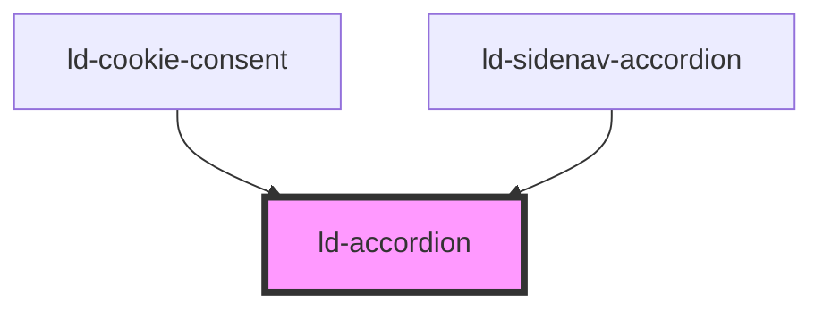

---
eleventyNavigation:
  key: Accordion
  parent: Components
layout: layout.njk
title: Accordion
permalink: components/ld-accordion/
tags:
  - squeezebox
  - garmon
  - bandoneon
---

# ld-accordion

The `ld-accordion` component hides content in expandable sections and thereby helps to place content in a space-saving manner.

---

## Usage

### Default


<ld-accordion>
  <ld-accordion-section expanded>
    <ld-accordion-toggle>Fruits</ld-accordion-toggle>
    <ld-accordion-panel>
      <ld-typo variant="body-s" style="padding: var(--ld-sp-12) var(--ld-accordion-padding-x)">Lorem ipsum dolor sit amet, consectetur adipiscing elit. Dolor quisque lectus morbi mauris, tortor dictum elementum. Morbi volutpat senectus lacus sapien viverra quis volutpat. Mauris sed lacus ipsum dictumst egestas. Elit cras at interdum id porta magnis accumsan sit pulvinar. Mi dignissim gravida venenatis, nibh dignissim tincidunt enim. Lectus diam lobortis pharetra amet et nec. Est vitae vitae porttitor varius ac. Faucibus enim augue ac sollicitudin massa. Ipsum quis elementum amet tristique. A felis nunc iaculis maecenas id.</ld-typo>
    </ld-accordion-panel>
  </ld-accordion-section>
  <ld-accordion-section>
    <ld-accordion-toggle>Vegetables</ld-accordion-toggle>
    <ld-accordion-panel>
      <ld-typo variant="body-s" style="padding: var(--ld-sp-12) var(--ld-accordion-padding-x)">Lorem ipsum dolor sit amet, consectetur adipiscing elit. Dolor quisque lectus morbi mauris, tortor dictum elementum. Morbi volutpat senectus lacus sapien viverra quis volutpat. Mauris sed lacus ipsum dictumst egestas. Elit cras at interdum id porta magnis accumsan sit pulvinar. Mi dignissim gravida venenatis, nibh dignissim tincidunt enim. Lectus diam lobortis pharetra amet et nec. Est vitae vitae porttitor varius ac. Faucibus enim augue ac sollicitudin massa. Ipsum quis elementum amet tristique. A felis nunc iaculis maecenas id.</ld-typo>
    </ld-accordion-panel>
  </ld-accordion-section>
  <ld-accordion-section>
    <ld-accordion-toggle disabled>Nuts</ld-accordion-toggle>
    <ld-accordion-panel>
      <ld-typo variant="body-s" style="padding: var(--ld-sp-12) var(--ld-accordion-padding-x)">Lorem ipsum dolor sit amet, consectetur adipiscing elit. Dolor quisque lectus morbi mauris, tortor dictum elementum. Morbi volutpat senectus lacus sapien viverra quis volutpat. Mauris sed lacus ipsum dictumst egestas. Elit cras at interdum id porta magnis accumsan sit pulvinar. Mi dignissim gravida venenatis, nibh dignissim tincidunt enim. Lectus diam lobortis pharetra amet et nec. Est vitae vitae porttitor varius ac. Faucibus enim augue ac sollicitudin massa. Ipsum quis elementum amet tristique. A felis nunc iaculis maecenas id.</ld-typo>
    </ld-accordion-panel>
  </ld-accordion-section>
</ld-accordion>

<!-- React component -->

<LdAccordion>
  <LdAccordionSection expanded>
    <LdAccordionToggle>Fruits</LdAccordionToggle>
    <LdAccordionPanel>
      <LdTypo variant="body-s" style={ { padding: 'var(--ld-sp-12) var(--ld-accordion-padding-x)' } }>Lorem ipsum dolor sit amet, consectetur adipiscing elit. Dolor quisque lectus morbi mauris, tortor dictum elementum. Morbi volutpat senectus lacus sapien viverra quis volutpat. Mauris sed lacus ipsum dictumst egestas. Elit cras at interdum id porta magnis accumsan sit pulvinar. Mi dignissim gravida venenatis, nibh dignissim tincidunt enim. Lectus diam lobortis pharetra amet et nec. Est vitae vitae porttitor varius ac. Faucibus enim augue ac sollicitudin massa. Ipsum quis elementum amet tristique. A felis nunc iaculis maecenas id.</LdTypo>
    </LdAccordionPanel>
  </LdAccordionSection>
  <LdAccordionSection>
    <LdAccordionToggle>Vegetables</LdAccordionToggle>
    <LdAccordionPanel>
      <LdTypo variant="body-s" style={ { padding: 'var(--ld-sp-12) var(--ld-accordion-padding-x)' } }>Lorem ipsum dolor sit amet, consectetur adipiscing elit. Dolor quisque lectus morbi mauris, tortor dictum elementum. Morbi volutpat senectus lacus sapien viverra quis volutpat. Mauris sed lacus ipsum dictumst egestas. Elit cras at interdum id porta magnis accumsan sit pulvinar. Mi dignissim gravida venenatis, nibh dignissim tincidunt enim. Lectus diam lobortis pharetra amet et nec. Est vitae vitae porttitor varius ac. Faucibus enim augue ac sollicitudin massa. Ipsum quis elementum amet tristique. A felis nunc iaculis maecenas id.</LdTypo>
    </LdAccordionPanel>
  </LdAccordionSection>
  <LdAccordionSection>
    <LdAccordionToggle disabled>Nuts</LdAccordionToggle>
    <LdAccordionPanel>
      <LdTypo variant="body-s" style={ { padding: 'var(--ld-sp-12) var(--ld-accordion-padding-x)' } }>Lorem ipsum dolor sit amet, consectetur adipiscing elit. Dolor quisque lectus morbi mauris, tortor dictum elementum. Morbi volutpat senectus lacus sapien viverra quis volutpat. Mauris sed lacus ipsum dictumst egestas. Elit cras at interdum id porta magnis accumsan sit pulvinar. Mi dignissim gravida venenatis, nibh dignissim tincidunt enim. Lectus diam lobortis pharetra amet et nec. Est vitae vitae porttitor varius ac. Faucibus enim augue ac sollicitudin massa. Ipsum quis elementum amet tristique. A felis nunc iaculis maecenas id.</LdTypo>
    </LdAccordionPanel>
  </LdAccordionSection>
</LdAccordion>


### Rounded

Use the `rounded` prop to apply small border-radii to the accordion sections.


<ld-accordion rounded>
  <ld-accordion-section>
    <ld-accordion-toggle>Fruits</ld-accordion-toggle>
    <ld-accordion-panel>
      <ld-typo variant="body-s" style="padding: var(--ld-sp-12) var(--ld-accordion-padding-x)">Lorem ipsum dolor sit amet, consectetur adipiscing elit. Dolor quisque lectus morbi mauris, tortor dictum elementum. Morbi volutpat senectus lacus sapien viverra quis volutpat. Mauris sed lacus ipsum dictumst egestas. Elit cras at interdum id porta magnis accumsan sit pulvinar. Mi dignissim gravida venenatis, nibh dignissim tincidunt enim. Lectus diam lobortis pharetra amet et nec. Est vitae vitae porttitor varius ac. Faucibus enim augue ac sollicitudin massa. Ipsum quis elementum amet tristique. A felis nunc iaculis maecenas id.</ld-typo>
    </ld-accordion-panel>
  </ld-accordion-section>
  <ld-accordion-section>
    <ld-accordion-toggle>Vegetables</ld-accordion-toggle>
    <ld-accordion-panel>
      <ld-typo variant="body-s" style="padding: var(--ld-sp-12) var(--ld-accordion-padding-x)">Lorem ipsum dolor sit amet, consectetur adipiscing elit. Dolor quisque lectus morbi mauris, tortor dictum elementum. Morbi volutpat senectus lacus sapien viverra quis volutpat. Mauris sed lacus ipsum dictumst egestas. Elit cras at interdum id porta magnis accumsan sit pulvinar. Mi dignissim gravida venenatis, nibh dignissim tincidunt enim. Lectus diam lobortis pharetra amet et nec. Est vitae vitae porttitor varius ac. Faucibus enim augue ac sollicitudin massa. Ipsum quis elementum amet tristique. A felis nunc iaculis maecenas id.</ld-typo>
    </ld-accordion-panel>
  </ld-accordion-section>
  <ld-accordion-section>
    <ld-accordion-toggle disabled>Nuts</ld-accordion-toggle>
    <ld-accordion-panel>
      <ld-typo variant="body-s" style="padding: var(--ld-sp-12) var(--ld-accordion-padding-x)">Lorem ipsum dolor sit amet, consectetur adipiscing elit. Dolor quisque lectus morbi mauris, tortor dictum elementum. Morbi volutpat senectus lacus sapien viverra quis volutpat. Mauris sed lacus ipsum dictumst egestas. Elit cras at interdum id porta magnis accumsan sit pulvinar. Mi dignissim gravida venenatis, nibh dignissim tincidunt enim. Lectus diam lobortis pharetra amet et nec. Est vitae vitae porttitor varius ac. Faucibus enim augue ac sollicitudin massa. Ipsum quis elementum amet tristique. A felis nunc iaculis maecenas id.</ld-typo>
    </ld-accordion-panel>
  </ld-accordion-section>
</ld-accordion>

<!-- React component -->

<LdAccordion rounded>
  <LdAccordionSection>
    <LdAccordionToggle>Fruits</LdAccordionToggle>
    <LdAccordionPanel>
      <LdTypo variant="body-s" style={ { padding: 'var(--ld-sp-12) var(--ld-accordion-padding-x)' } }>Lorem ipsum dolor sit amet, consectetur adipiscing elit. Dolor quisque lectus morbi mauris, tortor dictum elementum. Morbi volutpat senectus lacus sapien viverra quis volutpat. Mauris sed lacus ipsum dictumst egestas. Elit cras at interdum id porta magnis accumsan sit pulvinar. Mi dignissim gravida venenatis, nibh dignissim tincidunt enim. Lectus diam lobortis pharetra amet et nec. Est vitae vitae porttitor varius ac. Faucibus enim augue ac sollicitudin massa. Ipsum quis elementum amet tristique. A felis nunc iaculis maecenas id.</LdTypo>
    </LdAccordionPanel>
  </LdAccordionSection>
  <LdAccordionSection>
    <LdAccordionToggle>Vegetables</LdAccordionToggle>
    <LdAccordionPanel>
      <LdTypo variant="body-s" style={ { padding: 'var(--ld-sp-12) var(--ld-accordion-padding-x)' } }>Lorem ipsum dolor sit amet, consectetur adipiscing elit. Dolor quisque lectus morbi mauris, tortor dictum elementum. Morbi volutpat senectus lacus sapien viverra quis volutpat. Mauris sed lacus ipsum dictumst egestas. Elit cras at interdum id porta magnis accumsan sit pulvinar. Mi dignissim gravida venenatis, nibh dignissim tincidunt enim. Lectus diam lobortis pharetra amet et nec. Est vitae vitae porttitor varius ac. Faucibus enim augue ac sollicitudin massa. Ipsum quis elementum amet tristique. A felis nunc iaculis maecenas id.</LdTypo>
    </LdAccordionPanel>
  </LdAccordionSection>
  <LdAccordionSection>
    <LdAccordionToggle disabled>Nuts</LdAccordionToggle>
    <LdAccordionPanel>
      <LdTypo variant="body-s" style={ { padding: 'var(--ld-sp-12) var(--ld-accordion-padding-x)' } }>Lorem ipsum dolor sit amet, consectetur adipiscing elit. Dolor quisque lectus morbi mauris, tortor dictum elementum. Morbi volutpat senectus lacus sapien viverra quis volutpat. Mauris sed lacus ipsum dictumst egestas. Elit cras at interdum id porta magnis accumsan sit pulvinar. Mi dignissim gravida venenatis, nibh dignissim tincidunt enim. Lectus diam lobortis pharetra amet et nec. Est vitae vitae porttitor varius ac. Faucibus enim augue ac sollicitudin massa. Ipsum quis elementum amet tristique. A felis nunc iaculis maecenas id.</LdTypo>
    </LdAccordionPanel>
  </LdAccordionSection>
</LdAccordion>


### Dark

Use this mode on a white background.


<ld-accordion rounded tone="dark">
  <ld-accordion-section>
    <ld-accordion-toggle>Fruits</ld-accordion-toggle>
    <ld-accordion-panel>
      <ld-typo variant="body-s" style="padding: var(--ld-sp-12) var(--ld-accordion-padding-x)">Lorem ipsum dolor sit amet, consectetur adipiscing elit. Dolor quisque lectus morbi mauris, tortor dictum elementum. Morbi volutpat senectus lacus sapien viverra quis volutpat. Mauris sed lacus ipsum dictumst egestas. Elit cras at interdum id porta magnis accumsan sit pulvinar. Mi dignissim gravida venenatis, nibh dignissim tincidunt enim. Lectus diam lobortis pharetra amet et nec. Est vitae vitae porttitor varius ac. Faucibus enim augue ac sollicitudin massa. Ipsum quis elementum amet tristique. A felis nunc iaculis maecenas id.</ld-typo>
    </ld-accordion-panel>
  </ld-accordion-section>
  <ld-accordion-section>
    <ld-accordion-toggle>Vegetables</ld-accordion-toggle>
    <ld-accordion-panel>
      <ld-typo variant="body-s" style="padding: var(--ld-sp-12) var(--ld-accordion-padding-x)">Lorem ipsum dolor sit amet, consectetur adipiscing elit. Dolor quisque lectus morbi mauris, tortor dictum elementum. Morbi volutpat senectus lacus sapien viverra quis volutpat. Mauris sed lacus ipsum dictumst egestas. Elit cras at interdum id porta magnis accumsan sit pulvinar. Mi dignissim gravida venenatis, nibh dignissim tincidunt enim. Lectus diam lobortis pharetra amet et nec. Est vitae vitae porttitor varius ac. Faucibus enim augue ac sollicitudin massa. Ipsum quis elementum amet tristique. A felis nunc iaculis maecenas id.</ld-typo>
    </ld-accordion-panel>
  </ld-accordion-section>
  <ld-accordion-section>
    <ld-accordion-toggle disabled>Nuts</ld-accordion-toggle>
    <ld-accordion-panel>
      <ld-typo variant="body-s" style="padding: var(--ld-sp-12) var(--ld-accordion-padding-x)">Lorem ipsum dolor sit amet, consectetur adipiscing elit. Dolor quisque lectus morbi mauris, tortor dictum elementum. Morbi volutpat senectus lacus sapien viverra quis volutpat. Mauris sed lacus ipsum dictumst egestas. Elit cras at interdum id porta magnis accumsan sit pulvinar. Mi dignissim gravida venenatis, nibh dignissim tincidunt enim. Lectus diam lobortis pharetra amet et nec. Est vitae vitae porttitor varius ac. Faucibus enim augue ac sollicitudin massa. Ipsum quis elementum amet tristique. A felis nunc iaculis maecenas id.</ld-typo>
    </ld-accordion-panel>
  </ld-accordion-section>
</ld-accordion>

<!-- React component -->

<LdAccordion rounded tone="dark">
  <LdAccordionSection>
    <LdAccordionToggle>Fruits</LdAccordionToggle>
    <LdAccordionPanel>
      <LdTypo variant="body-s" style={ { padding: 'var(--ld-sp-12) var(--ld-accordion-padding-x)' } }>Lorem ipsum dolor sit amet, consectetur adipiscing elit. Dolor quisque lectus morbi mauris, tortor dictum elementum. Morbi volutpat senectus lacus sapien viverra quis volutpat. Mauris sed lacus ipsum dictumst egestas. Elit cras at interdum id porta magnis accumsan sit pulvinar. Mi dignissim gravida venenatis, nibh dignissim tincidunt enim. Lectus diam lobortis pharetra amet et nec. Est vitae vitae porttitor varius ac. Faucibus enim augue ac sollicitudin massa. Ipsum quis elementum amet tristique. A felis nunc iaculis maecenas id.</LdTypo>
    </LdAccordionPanel>
  </LdAccordionSection>
  <LdAccordionSection>
    <LdAccordionToggle>Vegetables</LdAccordionToggle>
    <LdAccordionPanel>
      <LdTypo variant="body-s" style={ { padding: 'var(--ld-sp-12) var(--ld-accordion-padding-x)' } }>Lorem ipsum dolor sit amet, consectetur adipiscing elit. Dolor quisque lectus morbi mauris, tortor dictum elementum. Morbi volutpat senectus lacus sapien viverra quis volutpat. Mauris sed lacus ipsum dictumst egestas. Elit cras at interdum id porta magnis accumsan sit pulvinar. Mi dignissim gravida venenatis, nibh dignissim tincidunt enim. Lectus diam lobortis pharetra amet et nec. Est vitae vitae porttitor varius ac. Faucibus enim augue ac sollicitudin massa. Ipsum quis elementum amet tristique. A felis nunc iaculis maecenas id.</LdTypo>
    </LdAccordionPanel>
  </LdAccordionSection>
  <LdAccordionSection>
    <LdAccordionToggle disabled>Nuts</LdAccordionToggle>
    <LdAccordionPanel>
      <LdTypo variant="body-s" style={ { padding: 'var(--ld-sp-12) var(--ld-accordion-padding-x)' } }>Lorem ipsum dolor sit amet, consectetur adipiscing elit. Dolor quisque lectus morbi mauris, tortor dictum elementum. Morbi volutpat senectus lacus sapien viverra quis volutpat. Mauris sed lacus ipsum dictumst egestas. Elit cras at interdum id porta magnis accumsan sit pulvinar. Mi dignissim gravida venenatis, nibh dignissim tincidunt enim. Lectus diam lobortis pharetra amet et nec. Est vitae vitae porttitor varius ac. Faucibus enim augue ac sollicitudin massa. Ipsum quis elementum amet tristique. A felis nunc iaculis maecenas id.</LdTypo>
    </LdAccordionPanel>
  </LdAccordionSection>
</LdAccordion>


### On brand color

Use this mode on backgrounds with brand color.


<ld-accordion rounded brand-color>
  <ld-accordion-section>
    <ld-accordion-toggle>Fruits</ld-accordion-toggle>
    <ld-accordion-panel>
      <ld-typo variant="body-s" style="padding: var(--ld-sp-12) var(--ld-accordion-padding-x)">Lorem ipsum dolor sit amet, consectetur adipiscing elit. Dolor quisque lectus morbi mauris, tortor dictum elementum. Morbi volutpat senectus lacus sapien viverra quis volutpat. Mauris sed lacus ipsum dictumst egestas. Elit cras at interdum id porta magnis accumsan sit pulvinar. Mi dignissim gravida venenatis, nibh dignissim tincidunt enim. Lectus diam lobortis pharetra amet et nec. Est vitae vitae porttitor varius ac. Faucibus enim augue ac sollicitudin massa. Ipsum quis elementum amet tristique. A felis nunc iaculis maecenas id.</ld-typo>
    </ld-accordion-panel>
  </ld-accordion-section>
  <ld-accordion-section>
    <ld-accordion-toggle>Vegetables</ld-accordion-toggle>
    <ld-accordion-panel>
      <ld-typo variant="body-s" style="padding: var(--ld-sp-12) var(--ld-accordion-padding-x)">Lorem ipsum dolor sit amet, consectetur adipiscing elit. Dolor quisque lectus morbi mauris, tortor dictum elementum. Morbi volutpat senectus lacus sapien viverra quis volutpat. Mauris sed lacus ipsum dictumst egestas. Elit cras at interdum id porta magnis accumsan sit pulvinar. Mi dignissim gravida venenatis, nibh dignissim tincidunt enim. Lectus diam lobortis pharetra amet et nec. Est vitae vitae porttitor varius ac. Faucibus enim augue ac sollicitudin massa. Ipsum quis elementum amet tristique. A felis nunc iaculis maecenas id.</ld-typo>
    </ld-accordion-panel>
  </ld-accordion-section>
  <ld-accordion-section>
    <ld-accordion-toggle disabled>Nuts</ld-accordion-toggle>
    <ld-accordion-panel>
      <ld-typo variant="body-s" style="padding: var(--ld-sp-12) var(--ld-accordion-padding-x)">Lorem ipsum dolor sit amet, consectetur adipiscing elit. Dolor quisque lectus morbi mauris, tortor dictum elementum. Morbi volutpat senectus lacus sapien viverra quis volutpat. Mauris sed lacus ipsum dictumst egestas. Elit cras at interdum id porta magnis accumsan sit pulvinar. Mi dignissim gravida venenatis, nibh dignissim tincidunt enim. Lectus diam lobortis pharetra amet et nec. Est vitae vitae porttitor varius ac. Faucibus enim augue ac sollicitudin massa. Ipsum quis elementum amet tristique. A felis nunc iaculis maecenas id.</ld-typo>
    </ld-accordion-panel>
  </ld-accordion-section>
</ld-accordion>

<!-- React component -->

<LdAccordion rounded brandColor>
  <LdAccordionSection>
    <LdAccordionToggle>Fruits</LdAccordionToggle>
    <LdAccordionPanel>
      <LdTypo variant="body-s" style={ { padding: 'var(--ld-sp-12) var(--ld-accordion-padding-x)' } }>Lorem ipsum dolor sit amet, consectetur adipiscing elit. Dolor quisque lectus morbi mauris, tortor dictum elementum. Morbi volutpat senectus lacus sapien viverra quis volutpat. Mauris sed lacus ipsum dictumst egestas. Elit cras at interdum id porta magnis accumsan sit pulvinar. Mi dignissim gravida venenatis, nibh dignissim tincidunt enim. Lectus diam lobortis pharetra amet et nec. Est vitae vitae porttitor varius ac. Faucibus enim augue ac sollicitudin massa. Ipsum quis elementum amet tristique. A felis nunc iaculis maecenas id.</LdTypo>
    </LdAccordionPanel>
  </LdAccordionSection>
  <LdAccordionSection>
    <LdAccordionToggle>Vegetables</LdAccordionToggle>
    <LdAccordionPanel>
      <LdTypo variant="body-s" style={ { padding: 'var(--ld-sp-12) var(--ld-accordion-padding-x)' } }>Lorem ipsum dolor sit amet, consectetur adipiscing elit. Dolor quisque lectus morbi mauris, tortor dictum elementum. Morbi volutpat senectus lacus sapien viverra quis volutpat. Mauris sed lacus ipsum dictumst egestas. Elit cras at interdum id porta magnis accumsan sit pulvinar. Mi dignissim gravida venenatis, nibh dignissim tincidunt enim. Lectus diam lobortis pharetra amet et nec. Est vitae vitae porttitor varius ac. Faucibus enim augue ac sollicitudin massa. Ipsum quis elementum amet tristique. A felis nunc iaculis maecenas id.</LdTypo>
    </LdAccordionPanel>
  </LdAccordionSection>
  <LdAccordionSection>
    <LdAccordionToggle disabled>Nuts</LdAccordionToggle>
    <LdAccordionPanel>
      <LdTypo variant="body-s" style={ { padding: 'var(--ld-sp-12) var(--ld-accordion-padding-x)' } }>Lorem ipsum dolor sit amet, consectetur adipiscing elit. Dolor quisque lectus morbi mauris, tortor dictum elementum. Morbi volutpat senectus lacus sapien viverra quis volutpat. Mauris sed lacus ipsum dictumst egestas. Elit cras at interdum id porta magnis accumsan sit pulvinar. Mi dignissim gravida venenatis, nibh dignissim tincidunt enim. Lectus diam lobortis pharetra amet et nec. Est vitae vitae porttitor varius ac. Faucibus enim augue ac sollicitudin massa. Ipsum quis elementum amet tristique. A felis nunc iaculis maecenas id.</LdTypo>
    </LdAccordionPanel>
  </LdAccordionSection>
</LdAccordion>


### Single mode

When the prop `single` is set, only a single accordion panel can be expanded at a time.  


<ld-accordion rounded single>
  <ld-accordion-section>
    <ld-accordion-toggle>Fruits</ld-accordion-toggle>
    <ld-accordion-panel>
      <ld-typo variant="body-s" style="padding: var(--ld-sp-12) var(--ld-accordion-padding-x)">Lorem ipsum dolor sit amet, consectetur adipiscing elit. Dolor quisque lectus morbi mauris, tortor dictum elementum. Morbi volutpat senectus lacus sapien viverra quis volutpat. Mauris sed lacus ipsum dictumst egestas. Elit cras at interdum id porta magnis accumsan sit pulvinar. Mi dignissim gravida venenatis, nibh dignissim tincidunt enim. Lectus diam lobortis pharetra amet et nec. Est vitae vitae porttitor varius ac. Faucibus enim augue ac sollicitudin massa. Ipsum quis elementum amet tristique. A felis nunc iaculis maecenas id.</ld-typo>
    </ld-accordion-panel>
  </ld-accordion-section>
  <ld-accordion-section>
    <ld-accordion-toggle>Vegetables</ld-accordion-toggle>
    <ld-accordion-panel>
      <ld-typo variant="body-s" style="padding: var(--ld-sp-12) var(--ld-accordion-padding-x)">Lorem ipsum dolor sit amet, consectetur adipiscing elit. Dolor quisque lectus morbi mauris, tortor dictum elementum. Morbi volutpat senectus lacus sapien viverra quis volutpat. Mauris sed lacus ipsum dictumst egestas. Elit cras at interdum id porta magnis accumsan sit pulvinar. Mi dignissim gravida venenatis, nibh dignissim tincidunt enim. Lectus diam lobortis pharetra amet et nec. Est vitae vitae porttitor varius ac. Faucibus enim augue ac sollicitudin massa. Ipsum quis elementum amet tristique. A felis nunc iaculis maecenas id.</ld-typo>
    </ld-accordion-panel>
  </ld-accordion-section>
  <ld-accordion-section>
    <ld-accordion-toggle disabled>Nuts</ld-accordion-toggle>
    <ld-accordion-panel>
      <ld-typo variant="body-s" style="padding: var(--ld-sp-12) var(--ld-accordion-padding-x)">Lorem ipsum dolor sit amet, consectetur adipiscing elit. Dolor quisque lectus morbi mauris, tortor dictum elementum. Morbi volutpat senectus lacus sapien viverra quis volutpat. Mauris sed lacus ipsum dictumst egestas. Elit cras at interdum id porta magnis accumsan sit pulvinar. Mi dignissim gravida venenatis, nibh dignissim tincidunt enim. Lectus diam lobortis pharetra amet et nec. Est vitae vitae porttitor varius ac. Faucibus enim augue ac sollicitudin massa. Ipsum quis elementum amet tristique. A felis nunc iaculis maecenas id.</ld-typo>
    </ld-accordion-panel>
  </ld-accordion-section>
</ld-accordion>

<!-- React component -->

<LdAccordion rounded single>
  <LdAccordionSection>
    <LdAccordionToggle>Fruits</LdAccordionToggle>
    <LdAccordionPanel>
      <LdTypo variant="body-s" style={ { padding: 'var(--ld-sp-12) var(--ld-accordion-padding-x)' } }>Lorem ipsum dolor sit amet, consectetur adipiscing elit. Dolor quisque lectus morbi mauris, tortor dictum elementum. Morbi volutpat senectus lacus sapien viverra quis volutpat. Mauris sed lacus ipsum dictumst egestas. Elit cras at interdum id porta magnis accumsan sit pulvinar. Mi dignissim gravida venenatis, nibh dignissim tincidunt enim. Lectus diam lobortis pharetra amet et nec. Est vitae vitae porttitor varius ac. Faucibus enim augue ac sollicitudin massa. Ipsum quis elementum amet tristique. A felis nunc iaculis maecenas id.</LdTypo>
    </LdAccordionPanel>
  </LdAccordionSection>
  <LdAccordionSection>
    <LdAccordionToggle>Vegetables</LdAccordionToggle>
    <LdAccordionPanel>
      <LdTypo variant="body-s" style={ { padding: 'var(--ld-sp-12) var(--ld-accordion-padding-x)' } }>Lorem ipsum dolor sit amet, consectetur adipiscing elit. Dolor quisque lectus morbi mauris, tortor dictum elementum. Morbi volutpat senectus lacus sapien viverra quis volutpat. Mauris sed lacus ipsum dictumst egestas. Elit cras at interdum id porta magnis accumsan sit pulvinar. Mi dignissim gravida venenatis, nibh dignissim tincidunt enim. Lectus diam lobortis pharetra amet et nec. Est vitae vitae porttitor varius ac. Faucibus enim augue ac sollicitudin massa. Ipsum quis elementum amet tristique. A felis nunc iaculis maecenas id.</LdTypo>
    </LdAccordionPanel>
  </LdAccordionSection>
  <LdAccordionSection>
    <LdAccordionToggle disabled>Nuts</LdAccordionToggle>
    <LdAccordionPanel>
      <LdTypo variant="body-s" style={ { padding: 'var(--ld-sp-12) var(--ld-accordion-padding-x)' } }>Lorem ipsum dolor sit amet, consectetur adipiscing elit. Dolor quisque lectus morbi mauris, tortor dictum elementum. Morbi volutpat senectus lacus sapien viverra quis volutpat. Mauris sed lacus ipsum dictumst egestas. Elit cras at interdum id porta magnis accumsan sit pulvinar. Mi dignissim gravida venenatis, nibh dignissim tincidunt enim. Lectus diam lobortis pharetra amet et nec. Est vitae vitae porttitor varius ac. Faucibus enim augue ac sollicitudin massa. Ipsum quis elementum amet tristique. A felis nunc iaculis maecenas id.</LdTypo>
    </LdAccordionPanel>
  </LdAccordionSection>
</LdAccordion>


### Detached mode

In `detached` mode there is a small gap between each accordion section element.


<ld-accordion rounded detached>
  <ld-accordion-section>
    <ld-accordion-toggle>Fruits</ld-accordion-toggle>
    <ld-accordion-panel>
      <ld-typo variant="body-s" style="padding: var(--ld-sp-16) var(--ld-accordion-padding-x)">Lorem ipsum dolor sit amet, consectetur adipiscing elit. Dolor quisque lectus morbi mauris, tortor dictum elementum. Morbi volutpat senectus lacus sapien viverra quis volutpat. Mauris sed lacus ipsum dictumst egestas. Elit cras at interdum id porta magnis accumsan sit pulvinar. Mi dignissim gravida venenatis, nibh dignissim tincidunt enim. Lectus diam lobortis pharetra amet et nec. Est vitae vitae porttitor varius ac. Faucibus enim augue ac sollicitudin massa. Ipsum quis elementum amet tristique. A felis nunc iaculis maecenas id.</ld-typo>
    </ld-accordion-panel>
  </ld-accordion-section>
  <ld-accordion-section>
    <ld-accordion-toggle>Vegetables</ld-accordion-toggle>
    <ld-accordion-panel>
      <ld-typo variant="body-s" style="padding: var(--ld-sp-12) var(--ld-accordion-padding-x)">Lorem ipsum dolor sit amet, consectetur adipiscing elit. Dolor quisque lectus morbi mauris, tortor dictum elementum. Morbi volutpat senectus lacus sapien viverra quis volutpat. Mauris sed lacus ipsum dictumst egestas. Elit cras at interdum id porta magnis accumsan sit pulvinar. Mi dignissim gravida venenatis, nibh dignissim tincidunt enim. Lectus diam lobortis pharetra amet et nec. Est vitae vitae porttitor varius ac. Faucibus enim augue ac sollicitudin massa. Ipsum quis elementum amet tristique. A felis nunc iaculis maecenas id.</ld-typo>
    </ld-accordion-panel>
  </ld-accordion-section>
  <ld-accordion-section>
    <ld-accordion-toggle disabled>Nuts</ld-accordion-toggle>
    <ld-accordion-panel>
      <ld-typo variant="body-s" style="padding: var(--ld-sp-12) var(--ld-accordion-padding-x)">Lorem ipsum dolor sit amet, consectetur adipiscing elit. Dolor quisque lectus morbi mauris, tortor dictum elementum. Morbi volutpat senectus lacus sapien viverra quis volutpat. Mauris sed lacus ipsum dictumst egestas. Elit cras at interdum id porta magnis accumsan sit pulvinar. Mi dignissim gravida venenatis, nibh dignissim tincidunt enim. Lectus diam lobortis pharetra amet et nec. Est vitae vitae porttitor varius ac. Faucibus enim augue ac sollicitudin massa. Ipsum quis elementum amet tristique. A felis nunc iaculis maecenas id.</ld-typo>
    </ld-accordion-panel>
  </ld-accordion-section>
</ld-accordion>

<!-- React component -->

<LdAccordion rounded detached>
  <LdAccordionSection>
    <LdAccordionToggle>Fruits</LdAccordionToggle>
    <LdAccordionPanel>
      <LdTypo variant="body-s" style={ { padding: 'var(--ld-sp-12) var(--ld-accordion-padding-x)' } }>Lorem ipsum dolor sit amet, consectetur adipiscing elit. Dolor quisque lectus morbi mauris, tortor dictum elementum. Morbi volutpat senectus lacus sapien viverra quis volutpat. Mauris sed lacus ipsum dictumst egestas. Elit cras at interdum id porta magnis accumsan sit pulvinar. Mi dignissim gravida venenatis, nibh dignissim tincidunt enim. Lectus diam lobortis pharetra amet et nec. Est vitae vitae porttitor varius ac. Faucibus enim augue ac sollicitudin massa. Ipsum quis elementum amet tristique. A felis nunc iaculis maecenas id.</LdTypo>
    </LdAccordionPanel>
  </LdAccordionSection>
  <LdAccordionSection>
    <LdAccordionToggle>Vegetables</LdAccordionToggle>
    <LdAccordionPanel>
      <LdTypo variant="body-s" style={ { padding: 'var(--ld-sp-12) var(--ld-accordion-padding-x)' } }>Lorem ipsum dolor sit amet, consectetur adipiscing elit. Dolor quisque lectus morbi mauris, tortor dictum elementum. Morbi volutpat senectus lacus sapien viverra quis volutpat. Mauris sed lacus ipsum dictumst egestas. Elit cras at interdum id porta magnis accumsan sit pulvinar. Mi dignissim gravida venenatis, nibh dignissim tincidunt enim. Lectus diam lobortis pharetra amet et nec. Est vitae vitae porttitor varius ac. Faucibus enim augue ac sollicitudin massa. Ipsum quis elementum amet tristique. A felis nunc iaculis maecenas id.</LdTypo>
    </LdAccordionPanel>
  </LdAccordionSection>
  <LdAccordionSection>
    <LdAccordionToggle disabled>Nuts</LdAccordionToggle>
    <LdAccordionPanel>
      <LdTypo variant="body-s" style={ { padding: 'var(--ld-sp-12) var(--ld-accordion-padding-x)' } }>Lorem ipsum dolor sit amet, consectetur adipiscing elit. Dolor quisque lectus morbi mauris, tortor dictum elementum. Morbi volutpat senectus lacus sapien viverra quis volutpat. Mauris sed lacus ipsum dictumst egestas. Elit cras at interdum id porta magnis accumsan sit pulvinar. Mi dignissim gravida venenatis, nibh dignissim tincidunt enim. Lectus diam lobortis pharetra amet et nec. Est vitae vitae porttitor varius ac. Faucibus enim augue ac sollicitudin massa. Ipsum quis elementum amet tristique. A felis nunc iaculis maecenas id.</LdTypo>
    </LdAccordionPanel>
  </LdAccordionSection>
</LdAccordion>


### Split toggle

The `split` prop allows you to separate an accordion toggle in two click areas. The accordion trigger on the right will still be responsible for toggling the expansion of the accordion section. The click area on the left side of the accordion can be used for your individual use case. You can listen to [click events](./ld-accordion-toggle/#events) on both areas. 


<ld-accordion rounded>
  <ld-accordion-section>
    <ld-accordion-toggle split>Fruits</ld-accordion-toggle>
    <ld-accordion-panel>
      <ld-typo variant="body-s" style="padding: var(--ld-sp-16) var(--ld-accordion-padding-x)">Lorem ipsum dolor sit amet, consectetur adipiscing elit. Dolor quisque lectus morbi mauris, tortor dictum elementum. Morbi volutpat senectus lacus sapien viverra quis volutpat. Mauris sed lacus ipsum dictumst egestas. Elit cras at interdum id porta magnis accumsan sit pulvinar. Mi dignissim gravida venenatis, nibh dignissim tincidunt enim. Lectus diam lobortis pharetra amet et nec. Est vitae vitae porttitor varius ac. Faucibus enim augue ac sollicitudin massa. Ipsum quis elementum amet tristique. A felis nunc iaculis maecenas id.</ld-typo>
    </ld-accordion-panel>
  </ld-accordion-section>
  <ld-accordion-section>
    <ld-accordion-toggle split>Vegetables</ld-accordion-toggle>
    <ld-accordion-panel>
      <ld-typo variant="body-s" style="padding: var(--ld-sp-12) var(--ld-accordion-padding-x)">Lorem ipsum dolor sit amet, consectetur adipiscing elit. Dolor quisque lectus morbi mauris, tortor dictum elementum. Morbi volutpat senectus lacus sapien viverra quis volutpat. Mauris sed lacus ipsum dictumst egestas. Elit cras at interdum id porta magnis accumsan sit pulvinar. Mi dignissim gravida venenatis, nibh dignissim tincidunt enim. Lectus diam lobortis pharetra amet et nec. Est vitae vitae porttitor varius ac. Faucibus enim augue ac sollicitudin massa. Ipsum quis elementum amet tristique. A felis nunc iaculis maecenas id.</ld-typo>
    </ld-accordion-panel>
  </ld-accordion-section>
  <ld-accordion-section>
    <ld-accordion-toggle split disabled>Nuts</ld-accordion-toggle>
    <ld-accordion-panel>
      <ld-typo variant="body-s" style="padding: var(--ld-sp-12) var(--ld-accordion-padding-x)">Lorem ipsum dolor sit amet, consectetur adipiscing elit. Dolor quisque lectus morbi mauris, tortor dictum elementum. Morbi volutpat senectus lacus sapien viverra quis volutpat. Mauris sed lacus ipsum dictumst egestas. Elit cras at interdum id porta magnis accumsan sit pulvinar. Mi dignissim gravida venenatis, nibh dignissim tincidunt enim. Lectus diam lobortis pharetra amet et nec. Est vitae vitae porttitor varius ac. Faucibus enim augue ac sollicitudin massa. Ipsum quis elementum amet tristique. A felis nunc iaculis maecenas id.</ld-typo>
    </ld-accordion-panel>
  </ld-accordion-section>
</ld-accordion>

<!-- React component -->

<LdAccordion rounded>
  <LdAccordionSection>
    <LdAccordionToggle split>Fruits</LdAccordionToggle>
    <LdAccordionPanel>
      <LdTypo variant="body-s" style={ { padding: 'var(--ld-sp-12) var(--ld-accordion-padding-x)' } }>Lorem ipsum dolor sit amet, consectetur adipiscing elit. Dolor quisque lectus morbi mauris, tortor dictum elementum. Morbi volutpat senectus lacus sapien viverra quis volutpat. Mauris sed lacus ipsum dictumst egestas. Elit cras at interdum id porta magnis accumsan sit pulvinar. Mi dignissim gravida venenatis, nibh dignissim tincidunt enim. Lectus diam lobortis pharetra amet et nec. Est vitae vitae porttitor varius ac. Faucibus enim augue ac sollicitudin massa. Ipsum quis elementum amet tristique. A felis nunc iaculis maecenas id.</LdTypo>
    </LdAccordionPanel>
  </LdAccordionSection>
  <LdAccordionSection>
    <LdAccordionToggle split>Vegetables</LdAccordionToggle>
    <LdAccordionPanel>
      <LdTypo variant="body-s" style={ { padding: 'var(--ld-sp-12) var(--ld-accordion-padding-x)' } }>Lorem ipsum dolor sit amet, consectetur adipiscing elit. Dolor quisque lectus morbi mauris, tortor dictum elementum. Morbi volutpat senectus lacus sapien viverra quis volutpat. Mauris sed lacus ipsum dictumst egestas. Elit cras at interdum id porta magnis accumsan sit pulvinar. Mi dignissim gravida venenatis, nibh dignissim tincidunt enim. Lectus diam lobortis pharetra amet et nec. Est vitae vitae porttitor varius ac. Faucibus enim augue ac sollicitudin massa. Ipsum quis elementum amet tristique. A felis nunc iaculis maecenas id.</LdTypo>
    </LdAccordionPanel>
  </LdAccordionSection>
  <LdAccordionSection>
    <LdAccordionToggle split disabled>Nuts</LdAccordionToggle>
    <LdAccordionPanel>
      <LdTypo variant="body-s" style={ { padding: 'var(--ld-sp-12) var(--ld-accordion-padding-x)' } }>Lorem ipsum dolor sit amet, consectetur adipiscing elit. Dolor quisque lectus morbi mauris, tortor dictum elementum. Morbi volutpat senectus lacus sapien viverra quis volutpat. Mauris sed lacus ipsum dictumst egestas. Elit cras at interdum id porta magnis accumsan sit pulvinar. Mi dignissim gravida venenatis, nibh dignissim tincidunt enim. Lectus diam lobortis pharetra amet et nec. Est vitae vitae porttitor varius ac. Faucibus enim augue ac sollicitudin massa. Ipsum quis elementum amet tristique. A felis nunc iaculis maecenas id.</LdTypo>
    </LdAccordionPanel>
  </LdAccordionSection>
</LdAccordion>


## Events

You can listen for several events on the `ld-accordion` component and its subcomponents. Please refer to each subcomponent's documentation for details on all available events. The following example demonstrates how you can listen to the `ldaccordionchange` event which is emitted each time a (non-disabled) section expands or collapses.


<ld-accordion rounded>
  <ld-accordion-section>
    <ld-accordion-toggle>Fruits</ld-accordion-toggle>
    <ld-accordion-panel>
      <ld-typo variant="body-s" style="padding: var(--ld-sp-16) var(--ld-accordion-padding-x)">Lorem ipsum dolor sit amet, consectetur adipiscing elit. Dolor quisque lectus morbi mauris, tortor dictum elementum. Morbi volutpat senectus lacus sapien viverra quis volutpat. Mauris sed lacus ipsum dictumst egestas. Elit cras at interdum id porta magnis accumsan sit pulvinar. Mi dignissim gravida venenatis, nibh dignissim tincidunt enim. Lectus diam lobortis pharetra amet et nec. Est vitae vitae porttitor varius ac. Faucibus enim augue ac sollicitudin massa. Ipsum quis elementum amet tristique. A felis nunc iaculis maecenas id.</ld-typo>
    </ld-accordion-panel>
  </ld-accordion-section>
  <ld-accordion-section>
    <ld-accordion-toggle>Vegetables</ld-accordion-toggle>
    <ld-accordion-panel>
      <ld-typo variant="body-s" style="padding: var(--ld-sp-12) var(--ld-accordion-padding-x)">Lorem ipsum dolor sit amet, consectetur adipiscing elit. Dolor quisque lectus morbi mauris, tortor dictum elementum. Morbi volutpat senectus lacus sapien viverra quis volutpat. Mauris sed lacus ipsum dictumst egestas. Elit cras at interdum id porta magnis accumsan sit pulvinar. Mi dignissim gravida venenatis, nibh dignissim tincidunt enim. Lectus diam lobortis pharetra amet et nec. Est vitae vitae porttitor varius ac. Faucibus enim augue ac sollicitudin massa. Ipsum quis elementum amet tristique. A felis nunc iaculis maecenas id.</ld-typo>
    </ld-accordion-panel>
  </ld-accordion-section>
  <ld-accordion-section>
    <ld-accordion-toggle disabled>Nuts</ld-accordion-toggle>
    <ld-accordion-panel>
      <ld-typo variant="body-s" style="padding: var(--ld-sp-12) var(--ld-accordion-padding-x)">Lorem ipsum dolor sit amet, consectetur adipiscing elit. Dolor quisque lectus morbi mauris, tortor dictum elementum. Morbi volutpat senectus lacus sapien viverra quis volutpat. Mauris sed lacus ipsum dictumst egestas. Elit cras at interdum id porta magnis accumsan sit pulvinar. Mi dignissim gravida venenatis, nibh dignissim tincidunt enim. Lectus diam lobortis pharetra amet et nec. Est vitae vitae porttitor varius ac. Faucibus enim augue ac sollicitudin massa. Ipsum quis elementum amet tristique. A felis nunc iaculis maecenas id.</ld-typo>
    </ld-accordion-panel>
  </ld-accordion-section>
</ld-accordion>

<!-- React component -->

<LdAccordion
  onLdaccordionchange={(ev) => {
    window.alert((ev.detail ? 'Expanding ' : 'Collapsing ')
      + ev.target.querySelector('ld-accordion-toggle').textContent
      + '.')
  }}
>
  <LdAccordionSection>
    <LdAccordionToggle>Fruits</LdAccordionToggle>
    <LdAccordionPanel>
      <LdTypo
        variant="body-s"
        style={ {
          padding: 'var(--ld-sp-12) var(--ld-accordion-padding-x)',
        } }
      >
        Lorem ipsum dolor sit amet, consectetur adipiscing elit. Dolor
        quisque lectus morbi mauris, tortor dictum elementum. Morbi
        volutpat senectus lacus sapien viverra quis volutpat. Mauris sed
        lacus ipsum dictumst egestas. Elit cras at interdum id porta
        magnis accumsan sit pulvinar. Mi dignissim gravida venenatis, nibh
        dignissim tincidunt enim. Lectus diam lobortis pharetra amet et
        nec. Est vitae vitae porttitor varius ac. Faucibus enim augue ac
        sollicitudin massa. Ipsum quis elementum amet tristique. A felis
        nunc iaculis maecenas id.
      </LdTypo>
    </LdAccordionPanel>
  </LdAccordionSection>
  <LdAccordionSection>
    <LdAccordionToggle>Vegetables</LdAccordionToggle>
    <LdAccordionPanel>
      <LdTypo
        variant="body-s"
        style={ {
          padding: 'var(--ld-sp-12) var(--ld-accordion-padding-x)',
        } }
      >
        Lorem ipsum dolor sit amet, consectetur adipiscing elit. Dolor
        quisque lectus morbi mauris, tortor dictum elementum. Morbi
        volutpat senectus lacus sapien viverra quis volutpat. Mauris sed
        lacus ipsum dictumst egestas. Elit cras at interdum id porta
        magnis accumsan sit pulvinar. Mi dignissim gravida venenatis, nibh
        dignissim tincidunt enim. Lectus diam lobortis pharetra amet et
        nec. Est vitae vitae porttitor varius ac. Faucibus enim augue ac
        sollicitudin massa. Ipsum quis elementum amet tristique. A felis
        nunc iaculis maecenas id.
      </LdTypo>
    </LdAccordionPanel>
  </LdAccordionSection>
  <LdAccordionSection>
    <LdAccordionToggle disabled>Nuts</LdAccordionToggle>
    <LdAccordionPanel>
      <LdTypo
        variant="body-s"
        style={ {
          padding: 'var(--ld-sp-12) var(--ld-accordion-padding-x)',
        } }
      >
        Lorem ipsum dolor sit amet, consectetur adipiscing elit. Dolor
        quisque lectus morbi mauris, tortor dictum elementum. Morbi
        volutpat senectus lacus sapien viverra quis volutpat. Mauris sed
        lacus ipsum dictumst egestas. Elit cras at interdum id porta
        magnis accumsan sit pulvinar. Mi dignissim gravida venenatis, nibh
        dignissim tincidunt enim. Lectus diam lobortis pharetra amet et
        nec. Est vitae vitae porttitor varius ac. Faucibus enim augue ac
        sollicitudin massa. Ipsum quis elementum amet tristique. A felis
        nunc iaculis maecenas id.
      </LdTypo>
    </LdAccordionPanel>
  </LdAccordionSection>
</LdAccordion>


## Expand and collapse accordion sections programmatically

You can programmatically expand or collapse an accordion section by toggling the `expanded` prop on the `ld-accordion-section` element:


<ld-label>
  Toggle "Vegetables"
  <ld-toggle>Toggle vegetables tab</ld-toggle>
</ld-label>

<ld-accordion rounded id="accordion-programmatic">
  <ld-accordion-section>
    <ld-accordion-toggle>Fruits</ld-accordion-toggle>
    <ld-accordion-panel>
      <ld-typo variant="body-s" style="padding: var(--ld-sp-16) var(--ld-accordion-padding-x)">Lorem ipsum dolor sit amet, consectetur adipiscing elit. Dolor quisque lectus morbi mauris, tortor dictum elementum. Morbi volutpat senectus lacus sapien viverra quis volutpat. Mauris sed lacus ipsum dictumst egestas. Elit cras at interdum id porta magnis accumsan sit pulvinar. Mi dignissim gravida venenatis, nibh dignissim tincidunt enim. Lectus diam lobortis pharetra amet et nec. Est vitae vitae porttitor varius ac. Faucibus enim augue ac sollicitudin massa. Ipsum quis elementum amet tristique. A felis nunc iaculis maecenas id.</ld-typo>
    </ld-accordion-panel>
  </ld-accordion-section>
  <ld-accordion-section>
    <ld-accordion-toggle>Vegetables</ld-accordion-toggle>
    <ld-accordion-panel>
      <ld-typo variant="body-s" style="padding: var(--ld-sp-12) var(--ld-accordion-padding-x)">Lorem ipsum dolor sit amet, consectetur adipiscing elit. Dolor quisque lectus morbi mauris, tortor dictum elementum. Morbi volutpat senectus lacus sapien viverra quis volutpat. Mauris sed lacus ipsum dictumst egestas. Elit cras at interdum id porta magnis accumsan sit pulvinar. Mi dignissim gravida venenatis, nibh dignissim tincidunt enim. Lectus diam lobortis pharetra amet et nec. Est vitae vitae porttitor varius ac. Faucibus enim augue ac sollicitudin massa. Ipsum quis elementum amet tristique. A felis nunc iaculis maecenas id.</ld-typo>
    </ld-accordion-panel>
  </ld-accordion-section>
  <ld-accordion-section>
    <ld-accordion-toggle disabled>Nuts</ld-accordion-toggle>
    <ld-accordion-panel>
      <ld-typo variant="body-s" style="padding: var(--ld-sp-12) var(--ld-accordion-padding-x)">Lorem ipsum dolor sit amet, consectetur adipiscing elit. Dolor quisque lectus morbi mauris, tortor dictum elementum. Morbi volutpat senectus lacus sapien viverra quis volutpat. Mauris sed lacus ipsum dictumst egestas. Elit cras at interdum id porta magnis accumsan sit pulvinar. Mi dignissim gravida venenatis, nibh dignissim tincidunt enim. Lectus diam lobortis pharetra amet et nec. Est vitae vitae porttitor varius ac. Faucibus enim augue ac sollicitudin massa. Ipsum quis elementum amet tristique. A felis nunc iaculis maecenas id.</ld-typo>
    </ld-accordion-panel>
  </ld-accordion-section>
</ld-accordion>

<!-- React component -->

const App = () => {
  const [vegetablesExpanded, setVegetablesExpanded] = useState(false)
  return (
    <>
      <LdLabel>
        Toggle "Vegetables"
        <LdToggle
          checked={vegetablesExpanded}
          onLdinput={(ev) => {
            setVegetablesExpanded(ev.target.checked)
          }}
        >
          Toggle vegetables tab
        </LdToggle>
      </LdLabel>
      <LdAccordion>
        <LdAccordionSection>
          <LdAccordionToggle>Fruits</LdAccordionToggle>
          <LdAccordionPanel>
            <LdTypo
              variant="body-s"
              style={ {
                padding: 'var(--ld-sp-12) var(--ld-accordion-padding-x)',
              } }
            >
              Lorem ipsum dolor sit amet, consectetur adipiscing elit. Dolor
              quisque lectus morbi mauris, tortor dictum elementum. Morbi
              volutpat senectus lacus sapien viverra quis volutpat. Mauris sed
              lacus ipsum dictumst egestas. Elit cras at interdum id porta
              magnis accumsan sit pulvinar. Mi dignissim gravida venenatis, nibh
              dignissim tincidunt enim. Lectus diam lobortis pharetra amet et
              nec. Est vitae vitae porttitor varius ac. Faucibus enim augue ac
              sollicitudin massa. Ipsum quis elementum amet tristique. A felis
              nunc iaculis maecenas id.
            </LdTypo>
          </LdAccordionPanel>
        </LdAccordionSection>
        <LdAccordionSection
          onLdaccordionchange={(ev) => {
            setVegetablesExpanded(ev.detail)
          }}
          expanded={vegetablesExpanded}
        >
          <LdAccordionToggle>Vegetables</LdAccordionToggle>
          <LdAccordionPanel>
            <LdTypo
              variant="body-s"
              style={ {
                padding: 'var(--ld-sp-12) var(--ld-accordion-padding-x)',
              } }
            >
              Lorem ipsum dolor sit amet, consectetur adipiscing elit. Dolor
              quisque lectus morbi mauris, tortor dictum elementum. Morbi
              volutpat senectus lacus sapien viverra quis volutpat. Mauris sed
              lacus ipsum dictumst egestas. Elit cras at interdum id porta
              magnis accumsan sit pulvinar. Mi dignissim gravida venenatis, nibh
              dignissim tincidunt enim. Lectus diam lobortis pharetra amet et
              nec. Est vitae vitae porttitor varius ac. Faucibus enim augue ac
              sollicitudin massa. Ipsum quis elementum amet tristique. A felis
              nunc iaculis maecenas id.
            </LdTypo>
          </LdAccordionPanel>
        </LdAccordionSection>
        <LdAccordionSection>
          <LdAccordionToggle disabled>Nuts</LdAccordionToggle>
          <LdAccordionPanel>
            <LdTypo
              variant="body-s"
              style={ {
                padding: 'var(--ld-sp-12) var(--ld-accordion-padding-x)',
              } }
            >
              Lorem ipsum dolor sit amet, consectetur adipiscing elit. Dolor
              quisque lectus morbi mauris, tortor dictum elementum. Morbi
              volutpat senectus lacus sapien viverra quis volutpat. Mauris sed
              lacus ipsum dictumst egestas. Elit cras at interdum id porta
              magnis accumsan sit pulvinar. Mi dignissim gravida venenatis, nibh
              dignissim tincidunt enim. Lectus diam lobortis pharetra amet et
              nec. Est vitae vitae porttitor varius ac. Faucibus enim augue ac
              sollicitudin massa. Ipsum quis elementum amet tristique. A felis
              nunc iaculis maecenas id.
            </LdTypo>
          </LdAccordionPanel>
        </LdAccordionSection>
      </LdAccordion>
    </>
  )
}


## Nesting

You can nest an accordion inside another.


<ld-accordion>
  <ld-accordion-section expanded>
    <ld-accordion-toggle>Fruits</ld-accordion-toggle>
    <ld-accordion-panel>
      <ld-accordion tone="dark" style="margin: var(--ld-sp-24) var(--ld-accordion-padding-x)">
        <ld-accordion-section>
          <ld-accordion-toggle>Sweet</ld-accordion-toggle>
          <ld-accordion-panel>
            <ld-typo variant="body-s" style="padding: var(--ld-sp-12) var(--ld-accordion-padding-x)">Lorem ipsum dolor sit amet, consectetur adipiscing elit. Dolor quisque lectus morbi mauris, tortor dictum elementum. Morbi volutpat senectus lacus sapien viverra quis volutpat. Mauris sed lacus ipsum dictumst egestas. Elit cras at interdum id porta magnis accumsan sit pulvinar. Mi dignissim gravida venenatis, nibh dignissim tincidunt enim. Lectus diam lobortis pharetra amet et nec. Est vitae vitae porttitor varius ac. Faucibus enim augue ac sollicitudin massa. Ipsum quis elementum amet tristique. A felis nunc iaculis maecenas id.</ld-typo>
          </ld-accordion-panel>
        </ld-accordion-section>
        <ld-accordion-section expanded>
          <ld-accordion-toggle>Sour</ld-accordion-toggle>
          <ld-accordion-panel>
            <ld-typo variant="body-s" style="padding: var(--ld-sp-12) var(--ld-accordion-padding-x)">Lorem ipsum dolor sit amet, consectetur adipiscing elit. Dolor quisque lectus morbi mauris, tortor dictum elementum. Morbi volutpat senectus lacus sapien viverra quis volutpat. Mauris sed lacus ipsum dictumst egestas. Elit cras at interdum id porta magnis accumsan sit pulvinar. Mi dignissim gravida venenatis, nibh dignissim tincidunt enim. Lectus diam lobortis pharetra amet et nec. Est vitae vitae porttitor varius ac. Faucibus enim augue ac sollicitudin massa. Ipsum quis elementum amet tristique. A felis nunc iaculis maecenas id.</ld-typo>
          </ld-accordion-panel>
        </ld-accordion-section>
        <ld-accordion-section>
          <ld-accordion-toggle>Bitter</ld-accordion-toggle>
          <ld-accordion-panel>
            <ld-typo variant="body-s" style="padding: var(--ld-sp-12) var(--ld-accordion-padding-x)">Lorem ipsum dolor sit amet, consectetur adipiscing elit. Dolor quisque lectus morbi mauris, tortor dictum elementum. Morbi volutpat senectus lacus sapien viverra quis volutpat. Mauris sed lacus ipsum dictumst egestas. Elit cras at interdum id porta magnis accumsan sit pulvinar. Mi dignissim gravida venenatis, nibh dignissim tincidunt enim. Lectus diam lobortis pharetra amet et nec. Est vitae vitae porttitor varius ac. Faucibus enim augue ac sollicitudin massa. Ipsum quis elementum amet tristique. A felis nunc iaculis maecenas id.</ld-typo>
          </ld-accordion-panel>
        </ld-accordion-section>
        <ld-accordion-section>
          <ld-accordion-toggle disabled>Salty</ld-accordion-toggle>
          <ld-accordion-panel>
            <ld-typo variant="body-s" style="padding: var(--ld-sp-12) var(--ld-accordion-padding-x)">Lorem ipsum dolor sit amet, consectetur adipiscing elit. Dolor quisque lectus morbi mauris, tortor dictum elementum. Morbi volutpat senectus lacus sapien viverra quis volutpat. Mauris sed lacus ipsum dictumst egestas. Elit cras at interdum id porta magnis accumsan sit pulvinar. Mi dignissim gravida venenatis, nibh dignissim tincidunt enim. Lectus diam lobortis pharetra amet et nec. Est vitae vitae porttitor varius ac. Faucibus enim augue ac sollicitudin massa. Ipsum quis elementum amet tristique. A felis nunc iaculis maecenas id.</ld-typo>
          </ld-accordion-panel>
        </ld-accordion-section>
      </ld-accordion>
    </ld-accordion-panel>
  </ld-accordion-section>
    <ld-accordion-section>
      <ld-accordion-toggle>Vegetables</ld-accordion-toggle>
      <ld-accordion-panel>
        <ld-typo variant="body-s" style="padding: var(--ld-sp-12) var(--ld-accordion-padding-x)">Lorem ipsum dolor sit amet, consectetur adipiscing elit. Dolor quisque lectus morbi mauris, tortor dictum elementum. Morbi volutpat senectus lacus sapien viverra quis volutpat. Mauris sed lacus ipsum dictumst egestas. Elit cras at interdum id porta magnis accumsan sit pulvinar. Mi dignissim gravida venenatis, nibh dignissim tincidunt enim. Lectus diam lobortis pharetra amet et nec. Est vitae vitae porttitor varius ac. Faucibus enim augue ac sollicitudin massa. Ipsum quis elementum amet tristique. A felis nunc iaculis maecenas id.</ld-typo>
      </ld-accordion-panel>
    </ld-accordion-section>
  <ld-accordion-section>
    <ld-accordion-toggle disabled>Nuts</ld-accordion-toggle>
    <ld-accordion-panel>
      <ld-typo variant="body-s" style="padding: var(--ld-sp-12) var(--ld-accordion-padding-x)">Lorem ipsum dolor sit amet, consectetur adipiscing elit. Dolor quisque lectus morbi mauris, tortor dictum elementum. Morbi volutpat senectus lacus sapien viverra quis volutpat. Mauris sed lacus ipsum dictumst egestas. Elit cras at interdum id porta magnis accumsan sit pulvinar. Mi dignissim gravida venenatis, nibh dignissim tincidunt enim. Lectus diam lobortis pharetra amet et nec. Est vitae vitae porttitor varius ac. Faucibus enim augue ac sollicitudin massa. Ipsum quis elementum amet tristique. A felis nunc iaculis maecenas id.</ld-typo>
    </ld-accordion-panel>
  </ld-accordion-section>
</ld-accordion>

<!-- React component -->

<LdAccordion>
  <LdAccordionSection expanded>
    <LdAccordionToggle>Fruits</LdAccordionToggle>
    <LdAccordionPanel>
      <LdAccordion
        tone="dark"
        style={ {
          padding: 'var(--ld-sp-24) var(--ld-accordion-padding-x)',
        } }
      >
        <LdAccordionSection>
          <LdAccordionToggle>Sweet</LdAccordionToggle>
          <LdAccordionPanel>
            <LdTypo
              variant="body-s"
              style={ {
                padding: 'var(--ld-sp-12) var(--ld-accordion-padding-x)',
              } }
            >
              Lorem ipsum dolor sit amet, consectetur adipiscing elit.
              Dolor quisque lectus morbi mauris, tortor dictum elementum.
              Morbi volutpat senectus lacus sapien viverra quis volutpat.
              Mauris sed lacus ipsum dictumst egestas. Elit cras at
              interdum id porta magnis accumsan sit pulvinar. Mi dignissim
              gravida venenatis, nibh dignissim tincidunt enim. Lectus
              diam lobortis pharetra amet et nec. Est vitae vitae
              porttitor varius ac. Faucibus enim augue ac sollicitudin
              massa. Ipsum quis elementum amet tristique. A felis nunc
              iaculis maecenas id.
            </LdTypo>
          </LdAccordionPanel>
        </LdAccordionSection>
        <LdAccordionSection expanded>
          <LdAccordionToggle>Sour</LdAccordionToggle>
          <LdAccordionPanel>
            <LdTypo
              variant="body-s"
              style={ {
                padding: 'var(--ld-sp-12) var(--ld-accordion-padding-x)',
              } }
            >
              Lorem ipsum dolor sit amet, consectetur adipiscing elit.
              Dolor quisque lectus morbi mauris, tortor dictum elementum.
              Morbi volutpat senectus lacus sapien viverra quis volutpat.
              Mauris sed lacus ipsum dictumst egestas. Elit cras at
              interdum id porta magnis accumsan sit pulvinar. Mi dignissim
              gravida venenatis, nibh dignissim tincidunt enim. Lectus
              diam lobortis pharetra amet et nec. Est vitae vitae
              porttitor varius ac. Faucibus enim augue ac sollicitudin
              massa. Ipsum quis elementum amet tristique. A felis nunc
              iaculis maecenas id.
            </LdTypo>
          </LdAccordionPanel>
        </LdAccordionSection>
        <LdAccordionSection>
          <LdAccordionToggle>Bitter</LdAccordionToggle>
          <LdAccordionPanel>
            <LdTypo
              variant="body-s"
              style={ {
                padding: 'var(--ld-sp-12) var(--ld-accordion-padding-x)',
              } }
            >
              Lorem ipsum dolor sit amet, consectetur adipiscing elit.
              Dolor quisque lectus morbi mauris, tortor dictum elementum.
              Morbi volutpat senectus lacus sapien viverra quis volutpat.
              Mauris sed lacus ipsum dictumst egestas. Elit cras at
              interdum id porta magnis accumsan sit pulvinar. Mi dignissim
              gravida venenatis, nibh dignissim tincidunt enim. Lectus
              diam lobortis pharetra amet et nec. Est vitae vitae
              porttitor varius ac. Faucibus enim augue ac sollicitudin
              massa. Ipsum quis elementum amet tristique. A felis nunc
              iaculis maecenas id.
            </LdTypo>
          </LdAccordionPanel>
        </LdAccordionSection>
        <LdAccordionSection>
          <LdAccordionToggle disabled>Salty</LdAccordionToggle>
          <LdAccordionPanel>
            <LdTypo
              variant="body-s"
              style={ {
                padding: 'var(--ld-sp-12) var(--ld-accordion-padding-x)',
              } }
            >
              Lorem ipsum dolor sit amet, consectetur adipiscing elit.
              Dolor quisque lectus morbi mauris, tortor dictum elementum.
              Morbi volutpat senectus lacus sapien viverra quis volutpat.
              Mauris sed lacus ipsum dictumst egestas. Elit cras at
              interdum id porta magnis accumsan sit pulvinar. Mi dignissim
              gravida venenatis, nibh dignissim tincidunt enim. Lectus
              diam lobortis pharetra amet et nec. Est vitae vitae
              porttitor varius ac. Faucibus enim augue ac sollicitudin
              massa. Ipsum quis elementum amet tristique. A felis nunc
              iaculis maecenas id.
            </LdTypo>
          </LdAccordionPanel>
        </LdAccordionSection>
      </LdAccordion>
    </LdAccordionPanel>
  </LdAccordionSection>
  <LdAccordionSection>
    <LdAccordionToggle>Vegetables</LdAccordionToggle>
    <LdAccordionPanel>
      <LdTypo
        variant="body-s"
        style={ {
          padding: 'var(--ld-sp-12) var(--ld-accordion-padding-x)',
        } }
      >
        Lorem ipsum dolor sit amet, consectetur adipiscing elit. Dolor
        quisque lectus morbi mauris, tortor dictum elementum. Morbi
        volutpat senectus lacus sapien viverra quis volutpat. Mauris sed
        lacus ipsum dictumst egestas. Elit cras at interdum id porta
        magnis accumsan sit pulvinar. Mi dignissim gravida venenatis, nibh
        dignissim tincidunt enim. Lectus diam lobortis pharetra amet et
        nec. Est vitae vitae porttitor varius ac. Faucibus enim augue ac
        sollicitudin massa. Ipsum quis elementum amet tristique. A felis
        nunc iaculis maecenas id.
      </LdTypo>
    </LdAccordionPanel>
  </LdAccordionSection>
  <LdAccordionSection>
    <LdAccordionToggle disabled>Nuts</LdAccordionToggle>
    <LdAccordionPanel>
      <LdTypo
        variant="body-s"
        style={ {
          padding: 'var(--ld-sp-12) var(--ld-accordion-padding-x)',
        } }
      >
        Lorem ipsum dolor sit amet, consectetur adipiscing elit. Dolor
        quisque lectus morbi mauris, tortor dictum elementum. Morbi
        volutpat senectus lacus sapien viverra quis volutpat. Mauris sed
        lacus ipsum dictumst egestas. Elit cras at interdum id porta
        magnis accumsan sit pulvinar. Mi dignissim gravida venenatis, nibh
        dignissim tincidunt enim. Lectus diam lobortis pharetra amet et
        nec. Est vitae vitae porttitor varius ac. Faucibus enim augue ac
        sollicitudin massa. Ipsum quis elementum amet tristique. A felis
        nunc iaculis maecenas id.
      </LdTypo>
    </LdAccordionPanel>
  </LdAccordionSection>
</LdAccordion>


<!-- Auto Generated Below -->

## Properties

| Property              | Attribute             | Description                                                                                                     | Type                                                      | Default     |
| --------------------- | --------------------- | --------------------------------------------------------------------------------------------------------------- | --------------------------------------------------------- | ----------- |
| `brandColor`          | `brand-color`         | Style the accordion so that it looks good on the primary color of the current theme.                            | `boolean`                                                 | `undefined` |
| `detached`            | `detached`            | Sets a small gap between each accordion section.                                                                | `boolean`                                                 | `false`     |
| `key`                 | `key`                 | for tracking the node's identity when working with lists                                                        | `string \| number`                                        | `undefined` |
| `onLdaccordionchange` | `onLdaccordionchange` | handles event emmitted by accordion section                                                                     | `(event: LdAccordionSectionCustomEvent<boolean>) => void` | `undefined` |
| `ref`                 | `ref`                 | reference to component                                                                                          | `any`                                                     | `undefined` |
| `rounded`             | `rounded`             | Applies rounded corners.                                                                                        | `boolean`                                                 | `false`     |
| `single`              | `single`              | When set to true, an open accordion element closes, if anthorer one opens.                                      | `boolean`                                                 | `false`     |
| `tone`                | `tone`                | Use `'dark'` on white backgrounds. Default is a light tone. Takes only effect in conjunction with neutral mode. | `"dark"`                                                  | `undefined` |

## Dependencies

### Used by

 - [ld-cookie-consent](../ld-cookie-consent)
 - [ld-sidenav-accordion](../ld-sidenav/ld-sidenav-accordion)

### Graph

----------------------------------------------

*Built with [StencilJS](https://stenciljs.com/)*
