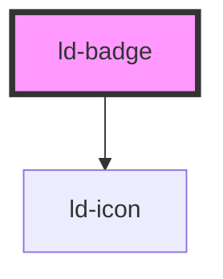

---
eleventyNavigation:
  key: Badge
  parent: Components
layout: layout.njk
title: Badge
permalink: components/ld-badge/
---

<link rel="stylesheet" href="css_components/ld-badge.css">
<link rel="stylesheet" href="css_components/ld-icon.css">

# ld-badge

---

## Default


<ld-badge icon="checkmark"></ld-badge>

<!-- React component -->

<LdBadge icon="checkmark" />

<!-- CSS component -->

  <svg class="ld-icon" viewBox="0 0 14 14" fill="none"><path d="m12 4-6.592 6L2 6.6396" stroke="currentcolor" stroke-width="3" stroke-linecap="round" stroke-linejoin="round"/></svg>



## With custom icon


<ld-badge>
  <svg slot="icon" viewBox="0 0 24 24" fill="none">
    <rect x="1.5" y="1.5" width="21" height="21" rx="4.5" stroke="currentColor" stroke-width="3"/>
    <circle cx="12" cy="12" r="4.5" stroke="currentColor" stroke-width="3"/>
  </svg>
</ld-badge>

<!-- React component -->

<LdBadge>
  <svg {...{ slot: 'icon' }} viewBox="0 0 24 24" fill="none">
    <rect x="1.5" y="1.5" width="21" height="21" rx="4.5" stroke="currentColor" stroke-width="3"/>
    <circle cx="12" cy="12" r="4.5" stroke="currentColor" stroke-width="3"/>
  </svg>
</LdBadge>

<!-- CSS component -->

  <svg class="ld-icon" viewBox="0 0 24 24" fill="none">
    <rect x="1.5" y="1.5" width="21" height="21" rx="4.5" stroke="currentColor" stroke-width="3"/>
    <circle cx="12" cy="12" r="4.5" stroke="currentColor" stroke-width="3"/>
  </svg>



## Different sizes


<ld-badge icon="checkmark"></ld-badge>

<ld-badge icon="checkmark" size="lg"></ld-badge>

<!-- React component -->

<LdBadge icon="checkmark" />

<LdBadge icon="checkmark" size="lg" />

<!-- CSS component -->

  <svg class="ld-icon" viewBox="0 0 14 14" fill="none"><path d="m12 4-6.592 6L2 6.6396" stroke="currentcolor" stroke-width="3" stroke-linecap="round" stroke-linejoin="round"/></svg>

  <svg class="ld-icon" viewBox="0 0 14 14" fill="none"><path d="m12 4-6.592 6L2 6.6396" stroke="currentcolor" stroke-width="3" stroke-linecap="round" stroke-linejoin="round"/></svg>



## With text


<ld-badge>Badge</ld-badge>

<ld-badge size="lg">Badge</ld-badge>

<ld-badge icon="checkmark">Badge</ld-badge>

<ld-badge icon="checkmark" size="lg">Badge</ld-badge>

<!-- React component -->

<LdBadge>Badge</LdBadge>

<LdBadge size="lg">Badge</LdBadge>

<LdBadge icon="checkmark">Badge</LdBadge>

<LdBadge icon="checkmark" size="lg">Badge</LdBadge>

<!-- CSS component -->

Badge

Badge

  <svg class="ld-icon" viewBox="0 0 14 14" fill="none"><path d="m12 4-6.592 6L2 6.6396" stroke="currentcolor" stroke-width="3" stroke-linecap="round" stroke-linejoin="round"/></svg>
  Badge

  <svg class="ld-icon" viewBox="0 0 14 14" fill="none"><path d="m12 4-6.592 6L2 6.6396" stroke="currentcolor" stroke-width="3" stroke-linecap="round" stroke-linejoin="round"/></svg>
  Badge



## On brand color


<ld-badge brand-color icon="checkmark"></ld-badge>

<ld-badge brand-color>Badge</ld-badge>

<!-- React component -->

<LdBadge brandColor icon="checkmark" />

<LdBadge brand-color>Badge</LdBadge>

<!-- CSS component -->

  <svg class="ld-icon" viewBox="0 0 14 14" fill="none"><path d="m12 4-6.592 6L2 6.6396" stroke="currentcolor" stroke-width="3" stroke-linecap="round" stroke-linejoin="round"/></svg>

Badge


## Custom color



<ld-badge class="ld-badge--success" icon="checkmark"></ld-badge>

<ld-badge class="ld-badge--success">Badge</ld-badge>

<!-- React component -->

<LdBadge className="ld-badge--success" icon="checkmark" />

<LdBadge className="ld-badge--success">Badge</LdBadge>

<!-- CSS component -->

  <svg class="ld-icon" viewBox="0 0 14 14" fill="none"><path d="m12 4-6.592 6L2 6.6396" stroke="currentcolor" stroke-width="3" stroke-linecap="round" stroke-linejoin="round"/></svg>

Badge


<!-- Auto Generated Below -->

## Properties

| Property     | Attribute     | Description                                              | Type               | Default     |
| ------------ | ------------- | -------------------------------------------------------- | ------------------ | ----------- |
| `brandColor` | `brand-color` | Defines badge custom color                               | `boolean`          | `undefined` |
| `icon`       | `icon`        | Icon name.                                               | `string`           | `undefined` |
| `key`        | `key`         | for tracking the node's identity when working with lists | `string \| number` | `undefined` |
| `ref`        | `ref`         | reference to component                                   | `any`              | `undefined` |
| `size`       | `size`        | The size of the badge, translated in rem                 | `"lg"`             | `undefined` |

## Shadow Parts

| Part     | Description |
| -------- | ----------- |
| `"icon"` |             |

## Dependencies

### Depends on

- [ld-icon](../ld-icon)

### Graph

----------------------------------------------

*Built with [StencilJS](https://stenciljs.com/)*
