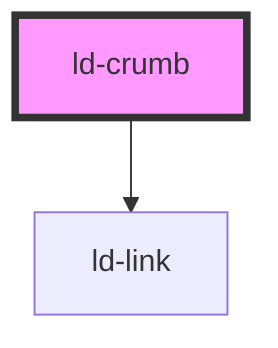

---
eleventyNavigation:
  key: Crumb
  parent: Breadcrumbs
layout: layout.njk
title: Crumb
permalink: components/ld-breadcrumbs/ld-crumb/
---

# ld-crumb

The `ld-crumb` component is a subcomponent for `ld-breadcrumbs`.

Please refer to the [`ld-breadcrumbs` documentation](components/ld-breadcrumbs/) for usage examples.

<!-- Auto Generated Below -->

## Properties

| Property | Attribute | Description                                              | Type               | Default     |
| -------- | --------- | -------------------------------------------------------- | ------------------ | ----------- |
| `href`   | `href`    | The URL that the hyperlink points to.                    | `string`           | `undefined` |
| `key`    | `key`     | for tracking the node's identity when working with lists | `string \| number` | `undefined` |
| `ref`    | `ref`     | reference to component                                   | `any`              | `undefined` |

## Shadow Parts

| Part     | Description     |
| -------- | --------------- |
| `"link"` | Breadcrumb link |

## Dependencies

### Depends on

- [ld-link](../../ld-link)

### Graph

----------------------------------------------

 
