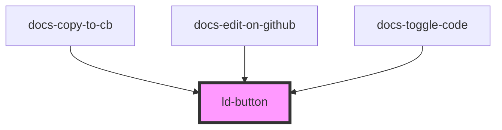

---
eleventyNavigation:
  key: Button
  parent: Components
layout: layout.njk
title: Button
permalink: liquid/components/ld-button/
---

# Button

Buttons are used for triggering important user actions. A button text should be speaking in the sense of the user’s understanding, rather than in the system’s language.
Icon-buttons without visual text should contain a screen-reader-only text.

---

## Web component


<ld-button>Text</ld-button>


### Disabled


<ld-button disabled>Text</ld-button>


The `disabled` attribute applies both attributes, `disabled` and `aria-disabled="true"` on the rendered component.
Although `aria-disabled="true"` is not necessary on a `button` element (or any other HTML control which supports the disabled attribute natively), it is applied just in case you use an [anchor button](#anchor-button).

**If you want the button to stay focusable** even if it is disabled, use `aria-disabled` in place of `disabled`:


<ld-button aria-disabled>Text</ld-button>


> **Note:** Using `aria-disabled` alone does not disable user interactions on the button. You will have to prevent default behaviours with JavaScript event handlers (i.e. with `event.preventDefault()`).

> **Note:** If you are [using the button as an anchor](#anchor-button) (applying the `href` attribute), the `disabled` attribute is not supported natively, so you will have to take care of preventing the default behavior of the element yourself (i.e. using `event.preventDefault()` inside your custom event handlers).

### Highlighted


<ld-button mode="highlight">Text</ld-button>

<ld-button mode="highlight" disabled>Text</ld-button>


### Secondary


<ld-button mode="secondary">Text</ld-button>

<ld-button mode="secondary" disabled>Text</ld-button>


### Ghost


<ld-button mode="ghost">Text</ld-button>

<ld-button mode="ghost" disabled>Text</ld-button>


### Danger


<ld-button mode="danger">Text</ld-button>

<ld-button mode="danger" disabled>Text</ld-button>


### Different sizes


<ld-button size="sm">Text</ld-button>

<ld-button>Text</ld-button>

<ld-button size="lg">Text</ld-button>


### With icon


<ld-button size="sm">
  <ld-icon name="placeholder"></ld-icon>
  <ld-sr-only>Text</ld-sr-only>
</ld-button>

<ld-button>
  <ld-icon name="placeholder"></ld-icon>
  <ld-sr-only>Text</ld-sr-only>
</ld-button>

<ld-button size="lg">
  <ld-icon name="placeholder"></ld-icon>
  <ld-sr-only>Text</ld-sr-only>
</ld-button>

<ld-button mode="highlight" size="sm">
  <ld-icon name="placeholder"></ld-icon>
  Text
</ld-button>

<ld-button mode="danger">
  Text
  <ld-icon name="placeholder"></ld-icon>
</ld-button>

<ld-button mode="secondary" size="lg">
  <ld-icon name="placeholder"></ld-icon>
  Text
</ld-button>


### With custom width


<ld-button style="width: 18rem">
  Text
</ld-button>

<ld-button style="width: 18rem">
  <ld-icon name="placeholder"></ld-icon>
  Text
</ld-button>


### Justify content


<ld-button style="width: 8rem" justify-content="center">
  Text
  <ld-icon name="placeholder"></ld-icon>
</ld-button>

<ld-button style="width: 8rem" justify-content="start">
  Text
  <ld-icon name="placeholder"></ld-icon>
</ld-button>

<ld-button style="width: 8rem" justify-content="end">
  Text
  <ld-icon name="placeholder"></ld-icon>
</ld-button>

<ld-button style="width: 8rem" justify-content="between">
  Text
  <ld-icon name="placeholder"></ld-icon>
</ld-button>


### With way too much content

> ⚠️ Don't do this! Put the description in a label outside of the button instead.


<ld-button>
  Almost before we knew it, we had left the ground.
  A shining crescent far beneath the flying vessel.
  Then came the night of the first falling star.
</ld-button>

<ld-button align-text="left">
  <ld-icon name="placeholder"></ld-icon>
  Almost before we knew it, we had left the ground. 
  A shining crescent far beneath the flying vessel. 
  Then came the night of the first falling star.
</ld-button>

<ld-button align-text="right">
  Almost before we knew it, we had left the ground. 
  A shining crescent far beneath the flying vessel. 
  Then came the night of the first falling star.
  <ld-icon name="placeholder"></ld-icon>
</ld-button>


### Anchor button


<ld-button href="#" target="_blank">
  Text
</ld-button>


> __Note:__ When using `target="_blank"` a `rel` attribute with the value `noreferrer noopener` is applied automatically. Just in case. See [https://web.dev/external-anchors-use-rel-noopener/](https://web.dev/external-anchors-use-rel-noopener/)

## CSS component

If you'd rather like to use the CSS component on a regular button element, inspect and copy the markup and CSS classes from the examples above. You will be able to achieve pretty much the same result. Here are some examples:


<button class="ld-button ld-theme-bg-primary ld-button--sm">
  Text
</button>

<button class="ld-button ld-button--highlight">
  Text
</button>

<button class="ld-button ld-button--secondary ld-button--lg" disabled>
  Text
</button>

<button class="ld-button ld-button--secondary ld-button--sm">
  
    
      <svg viewBox="0 0 24 24" fill="none" xmlns="http://www.w3.org/2000/svg">
        <title>Text</title>
        <rect x="1.5" y="1.5" width="21" height="21" rx="4.5" stroke="currentColor" stroke-width="3"/>
        <circle cx="12" cy="12" r="4.5" stroke="currentColor" stroke-width="3"/>
      </svg>
    
  
</button>

<button class="ld-button ld-button--ghost">
  
    
      <svg viewBox="0 0 24 24" fill="none" xmlns="http://www.w3.org/2000/svg">
        <rect x="1.5" y="1.5" width="21" height="21" rx="4.5" stroke="currentColor" stroke-width="3"/>
        <circle cx="12" cy="12" r="4.5" stroke="currentColor" stroke-width="3"/>
      </svg>
    
    Text
  
</button>

<button class="ld-button ld-button--danger ld-button--lg">
  
    Text
    
      <svg viewBox="0 0 24 24" fill="none" xmlns="http://www.w3.org/2000/svg">
        <rect x="1.5" y="1.5" width="21" height="21" rx="4.5" stroke="currentColor" stroke-width="3"/>
        <circle cx="12" cy="12" r="4.5" stroke="currentColor" stroke-width="3"/>
      </svg>
    
  
</button>


<!-- Auto Generated Below -->

## Properties

| Property         | Attribute         | Description                                                                                                                                                                                                           | Type                                                | Default     |
| ---------------- | ----------------- | --------------------------------------------------------------------------------------------------------------------------------------------------------------------------------------------------------------------- | --------------------------------------------------- | ----------- |
| `alignText`      | `align-text`      | Align text.                                                                                                                                                                                                           | `"left" \| "right"`                                 | `undefined` |
| `disabled`       | `disabled`        | Disabled state of the button.                                                                                                                                                                                         | `boolean`                                           | `false`     |
| `href`           | `href`            | Transforms the button to an anchor element. See [mdn docs](https://developer.mozilla.org/en-US/docs/Web/HTML/Element/a#attr-href) for more information on the `href` attribute.                                       | `string`                                            | `undefined` |
| `justifyContent` | `justify-content` | Justify content.                                                                                                                                                                                                      | `"between" \| "end" \| "start"`                     | `undefined` |
| `mode`           | `mode`            | Highlight mode.                                                                                                                                                                                                       | `"danger" \| "ghost" \| "highlight" \| "secondary"` | `undefined` |
| `size`           | `size`            | Size of the button.                                                                                                                                                                                                   | `"lg" \| "sm"`                                      | `undefined` |
| `target`         | `target`          | The `target` attributed can be used in conjunction with the `href` attribute. See [mdn docs](https://developer.mozilla.org/en-US/docs/Web/HTML/Element/a#attr-target) for more information on the `target` attribute. | `"_blank" \| "_parent" \| "_self" \| "_top"`        | `undefined` |

## Dependencies

### Used by

 - docs-copy-to-cb
 - docs-edit-on-github
 - docs-toggle-code

### Graph

----------------------------------------------

*Built with [StencilJS](https://stenciljs.com/)*
