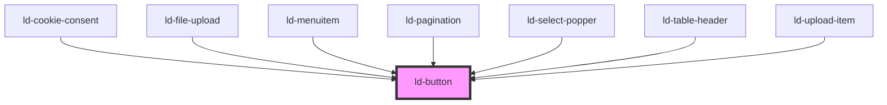

---
eleventyNavigation:
  key: Button
  parent: Components
layout: layout.njk
title: Button
permalink: components/ld-button/
---

<link rel="stylesheet" href="{{ env.base }}/{{ buildstamp }}css_components/ld-button.css">
<link rel="stylesheet" href="{{ env.base }}/{{ buildstamp }}css_components/ld-icon.css">

# ld-button

Buttons allow a user to trigger events on the user interface. A button's text should express what the button does.
Icon-buttons without visual text should either contain a [screen-reader-only](components/ld-sr-only/) text, have an `aria-label`, a `title` element within the svg icon or an `alt` text on an image icon within the button.

---

## Examples

### Primary


<ld-button>Text</ld-button>

<!-- React component -->

<LdButton>Text</LdButton>

<!-- CSS component -->

<button class="ld-button">Text</button>


### Disabled


<ld-button disabled>Text</ld-button>

<!-- React component -->

<LdButton
  disabled
  onClick={() => {
    window.alert('click')
    // The event handler won't be called.
  }}
>
  Text
</LdButton>

<!-- CSS component -->

<button class="ld-button" disabled>Text</button>



The `disabled` attribute applies both attributes, `disabled` and `aria-disabled="true"` on the rendered component.
Although `aria-disabled="true"` is not necessary on a `button` element (or any other HTML control which supports the disabled attribute natively), it is applied just in case you use an [anchor button](components/ld-button/#anchor-button).

**If you want the button to stay focusable** even if it is disabled, use `aria-disabled` in place of `disabled`:


<ld-button aria-disabled="true">Text</ld-button>

<!-- React component -->

<LdButton
  aria-disabled="true"
  onClick={() => {
    window.alert('click')
    // The event handler won't be called.
  }}
>
  Text
</LdButton>

<!-- CSS component -->

<button class="ld-button" aria-disabled="true">
  Text
</button>



<ld-notice headline="Note" mode="warning">
  When <code>aria-disabled</code> is applied on the button, either explicitly or implicitly, the component will try to prevent user interaction using an internal click event handler, calling <code>preventDefault()</code> and <code>stopImmediatePropagation()</code> on the click event. With the CSS component version on the other hand, you will need to take care of preventing the default behaviour of the button yourself. 
</ld-notice>

### Secondary


<ld-button mode="secondary">Text</ld-button>

<!-- React component -->

<LdButton mode="secondary">Text</LdButton>

<!-- CSS component -->

<button class="ld-button ld-button--secondary">Text</button>


### Ghost


<ld-button mode="ghost">Text</ld-button>

<!-- React component -->

<LdButton mode="ghost">Text</LdButton>

<!-- CSS component -->

<button class="ld-button ld-button--ghost">Text</button>


### On brand color


<ld-button brand-color>Text</ld-button>

<ld-button mode="secondary" brand-color>Text</ld-button>

<ld-button mode="ghost" brand-color>Text</ld-button>

<!-- React component -->

<LdButton brandColor>Text</LdButton>

<LdButton mode="secondary" brandColor>Text</LdButton>

<LdButton mode="ghost" brandColor>Text</LdButton>

<!-- CSS component -->

<button class="ld-button ld-button--brand-color">Text</button>

<button class="ld-button ld-button--secondary ld-button--brand-color">Text</button>

<button class="ld-button ld-button--ghost ld-button--brand-color">Text</button>


### Neutral


<ld-button mode="neutral">Text</ld-button>
<ld-button mode="neutral-secondary">Text</ld-button>
<ld-button mode="neutral-ghost">Text</ld-button>

<!-- React component -->

<LdButton mode="neutral">Text</LdButton>
<LdButton mode="neutral-secondary">Text</LdButton>
<LdButton mode="neutral-ghost">Text</LdButton>

<!-- CSS component -->

<button class="ld-button ld-button--neutral">Text</button>
<button class="ld-button ld-button--secondary ld-button--neutral-secondary">Text</button>
<button class="ld-button ld-button--ghost ld-button--neutral-ghost">Text</button>


### Highlight


<ld-button mode="highlight">Text</ld-button>

<!-- React component -->

<LdButton mode="highlight">Text</LdButton>

<!-- CSS component -->

<button class="ld-button ld-button--highlight">Text</button>


### Danger


<ld-button mode="danger">Text</ld-button>
<ld-button mode="danger-secondary">Text</ld-button>
<ld-button mode="danger-ghost">Text</ld-button>

<!-- React component -->

<LdButton mode="danger">Text</LdButton>
<LdButton mode="danger-secondary">Text</LdButton>
<LdButton mode="danger-ghost">Text</LdButton>

<!-- CSS component -->

<button class="ld-button ld-button--danger">Text</button>
<button class="ld-button ld-button--secondary ld-button--danger-secondary">Text</button>
<button class="ld-button ld-button--ghost ld-button--danger-ghost">Text</button>


### Size


<ld-button size="sm">Text</ld-button>

<ld-button>Text</ld-button>

<ld-button size="lg">Text</ld-button>

<!-- React component -->

<LdButton size="sm">Text</LdButton>

<LdButton>Text</LdButton>

<LdButton size="lg">Text</LdButton>

<!-- CSS component -->

<button class="ld-button ld-button--sm">Text</button>

<button class="ld-button">Text</button>

<button class="ld-button ld-button--lg">Text</button>


### With icon


<ld-button size="sm">
  <ld-icon name="placeholder" size="sm" aria-label="Text"></ld-icon>
</ld-button>

<ld-button>
  <ld-icon name="placeholder" aria-label="Text"></ld-icon>
</ld-button>

<ld-button size="lg">
  <ld-icon name="placeholder" size="lg" aria-label="Text"></ld-icon>
</ld-button>

<ld-button mode="highlight" size="sm">
  <ld-icon name="placeholder" size="sm"></ld-icon>
  Text
</ld-button>

<ld-button mode="danger">
  Text
  <ld-icon name="placeholder"></ld-icon>
</ld-button>

<ld-button mode="secondary" size="lg">
  <ld-icon name="placeholder" size="lg"></ld-icon>
  Text
</ld-button>

<!-- React component -->

<LdButton size="sm">
  <LdIcon name="placeholder" size="sm" aria-label="Text" />
</LdButton>

<LdButton>
  <LdIcon name="placeholder" aria-label="Text" />
</LdButton>

<LdButton size="lg">
  <LdIcon name="placeholder" size="lg" aria-label="Text" />
</LdButton>

<LdButton mode="highlight" size="sm">
  <LdIcon name="placeholder" size="sm" />
  Text
</LdButton>

<LdButton mode="danger">
  Text
  <LdIcon name="placeholder" />
</LdButton>

<LdButton mode="secondary" size="lg">
  <LdIcon name="placeholder" size="lg" />
  Text
</LdButton>

<!-- CSS component -->

<button class="ld-button ld-button--sm">
  
    <svg viewBox="0 0 24 24" fill="none">
      <title>Text</title>
      <rect x="1.5" y="1.5" width="21" height="21" rx="4.5" stroke="currentColor" stroke-width="3"/>
      <circle cx="12" cy="12" r="4.5" stroke="currentColor" stroke-width="3"/>
    </svg>
  
</button>

<button class="ld-button">
  
    <svg viewBox="0 0 24 24" fill="none">
      <title>Text</title>
      <rect x="1.5" y="1.5" width="21" height="21" rx="4.5" stroke="currentColor" stroke-width="3"/>
      <circle cx="12" cy="12" r="4.5" stroke="currentColor" stroke-width="3"/>
    </svg>
  
</button>

<button class="ld-button ld-button--lg">
  
    <svg viewBox="0 0 24 24" fill="none">
      <title>Text</title>
      <rect x="1.5" y="1.5" width="21" height="21" rx="4.5" stroke="currentColor" stroke-width="3"/>
      <circle cx="12" cy="12" r="4.5" stroke="currentColor" stroke-width="3"/>
    </svg>
  
</button>

<button class="ld-button ld-button--highlight ld-button--sm">
  
    <svg viewBox="0 0 24 24" fill="none">
      <rect x="1.5" y="1.5" width="21" height="21" rx="4.5" stroke="currentColor" stroke-width="3"/>
      <circle cx="12" cy="12" r="4.5" stroke="currentColor" stroke-width="3"/>
    </svg>
  
  Text
</button>

<button class="ld-button ld-button--danger">
  Text
  
    <svg viewBox="0 0 24 24" fill="none">
      <rect x="1.5" y="1.5" width="21" height="21" rx="4.5" stroke="currentColor" stroke-width="3"/>
      <circle cx="12" cy="12" r="4.5" stroke="currentColor" stroke-width="3"/>
    </svg>
  
</button>

<button class="ld-button ld-button--secondary ld-button--lg">
    
      <svg viewBox="0 0 24 24" fill="none">
        <rect x="1.5" y="1.5" width="21" height="21" rx="4.5" stroke="currentColor" stroke-width="3"/>
        <circle cx="12" cy="12" r="4.5" stroke="currentColor" stroke-width="3"/>
      </svg>
    
    Text
</button>


### With custom width

To give a button a custom width, simply assign the `width` or `min-width` CSS properties to the element, use other techniques (`grid`, `flex` etc.) on the wrapping element or apply utility classes (i.e. from [Tailwind](https://tailwindcss.com/), if that's your tool of choice) on the element.


<ld-button style="width: 18rem">Text</ld-button>

  <ld-button>Text</ld-button>

<!-- React component -->

<LdButton style={ { width: '18rem' } }>
  Text
</LdButton>

  <LdButton>Text</LdButton>

<!-- CSS component -->

<button class="ld-button" style="width: 18rem">Text</button>

  <button class="ld-button">Text</button>



### Justify content


<ld-button style="width: 8rem">
  Text
  <ld-icon name="placeholder"></ld-icon>
</ld-button>

<ld-button style="width: 8rem" justify-content="start">
  Text
  <ld-icon name="placeholder"></ld-icon>
</ld-button>

<ld-button style="width: 8rem" justify-content="end">
  Text
  <ld-icon name="placeholder"></ld-icon>
</ld-button>

<ld-button style="width: 8rem" justify-content="between">
  Text
  <ld-icon name="placeholder"></ld-icon>
</ld-button>

<!-- React component -->

<LdButton
  style={ { width: '8rem' } }
>
  Text
  <LdIcon name="placeholder" />
</LdButton>

<LdButton
  style={ { width: '8rem' } }
  justifyContent="start"
>
  Text
  <LdIcon name="placeholder" />
</LdButton>

<LdButton
  style={ { width: '8rem' } }
  justifyContent="end"
>
  Text
  <LdIcon name="placeholder" />
</LdButton>

<LdButton
  style={ { width: '8rem' } }
  justifyContent="between"
>
  Text
  <LdIcon name="placeholder" />
</LdButton>

<!-- CSS component -->

<button style="width: 8rem" class="ld-button">
  Text
  
    <svg viewBox="0 0 24 24" fill="none">
      <rect x="1.5" y="1.5" width="21" height="21" rx="4.5" stroke="currentColor" stroke-width="3"/>
      <circle cx="12" cy="12" r="4.5" stroke="currentColor" stroke-width="3"/>
    </svg>
  
</button>

<button style="width: 8rem" class="ld-button ld-button--justify-start">
  Text
  
    <svg viewBox="0 0 24 24" fill="none">
      <rect x="1.5" y="1.5" width="21" height="21" rx="4.5" stroke="currentColor" stroke-width="3"/>
      <circle cx="12" cy="12" r="4.5" stroke="currentColor" stroke-width="3"/>
    </svg>
  
</button>

<button style="width: 8rem" class="ld-button ld-button--justify-end">
  Text
  
    <svg viewBox="0 0 24 24" fill="none">
      <rect x="1.5" y="1.5" width="21" height="21" rx="4.5" stroke="currentColor" stroke-width="3"/>
      <circle cx="12" cy="12" r="4.5" stroke="currentColor" stroke-width="3"/>
    </svg>
  
</button>

<button style="width: 8rem" class="ld-button ld-button--justify-between">
  Text
  
    <svg viewBox="0 0 24 24" fill="none">
      <rect x="1.5" y="1.5" width="21" height="21" rx="4.5" stroke="currentColor" stroke-width="3"/>
      <circle cx="12" cy="12" r="4.5" stroke="currentColor" stroke-width="3"/>
    </svg>
  
</button>


### Multi-line

<ld-notice headline="Note" mode="warning">
  You shouldn't use a button with too much text in it! Instead, put the description in a label outside the button.
</ld-notice>

You can align the text inside the button using the `align-text` propperty.


<ld-button>
  Almost before we knew it, we had left the ground.
  A shining crescent far beneath the flying vessel.
  Then came the night of the first falling star.
</ld-button>

<ld-button align-text="left">
  <ld-icon name="placeholder"></ld-icon>
  Almost before we knew it, we had left the ground. 
  A shining crescent far beneath the flying vessel. 
  Then came the night of the first falling star.
</ld-button>

<ld-button align-text="right">
  Almost before we knew it, we had left the ground. 
  A shining crescent far beneath the flying vessel. 
  Then came the night of the first falling star.
  <ld-icon name="placeholder"></ld-icon>
</ld-button>

<!-- React component -->

<LdButton>
  Almost before we knew it, we had left the ground.
  A shining crescent far beneath the flying vessel.
  Then came the night of the first falling star.
</LdButton>

<LdButton alignText="left">
  <LdIcon name="placeholder" />
  Almost before we knew it, we had left the ground.
  A shining crescent far beneath the flying vessel.
  Then came the night of the first falling star.
</LdButton>

<LdButton alignText="right">
  Almost before we knew it, we had left the ground.
  A shining crescent far beneath the flying vessel.
  Then came the night of the first falling star.
  <LdIcon name="placeholder" />
</LdButton>

<!-- CSS component -->

<button class="ld-button">
  Almost before we knew it, we had left the ground. 
  A shining crescent far beneath the flying vessel. 
  Then came the night of the first falling star.
</button>

<button class="ld-button ld-button--align-text-left">
  
    <svg viewBox="0 0 24 24" fill="none">
      <rect x="1.5" y="1.5" width="21" height="21" rx="4.5" stroke="currentColor" stroke-width="3"/>
      <circle cx="12" cy="12" r="4.5" stroke="currentColor" stroke-width="3"/>
    </svg>
  
  Almost before we knew it, we had left the ground. 
  A shining crescent far beneath the flying vessel. 
  Then came the night of the first falling star.
</button>

<button class="ld-button ld-button--align-text-right">
  Almost before we knew it, we had left the ground. 
  A shining crescent far beneath the flying vessel. 
  Then came the night of the first falling star.
  
    <svg viewBox="0 0 24 24" fill="none">
      <rect x="1.5" y="1.5" width="21" height="21" rx="4.5" stroke="currentColor" stroke-width="3"/>
      <circle cx="12" cy="12" r="4.5" stroke="currentColor" stroke-width="3"/>
    </svg>
  
</button>


### Anchor button


<ld-button href="#" target="_blank">Text</ld-button>

<!-- React component -->

<LdButton href="#" target="_blank">Text</LdButton>

<!-- CSS component -->

<a class="ld-button" href="#" target="_blank" rel="noreferrer noopener">Text</a>


<ld-notice headline="Note" mode="warning">
  When using <code>target="_blank"</code>, a <code>rel</code> attribute with the value <code>noreferrer noopener</code> is applied automatically. Just in case. If you are using the CSS component version of the button, you will need to take care of this yourself. See <a href="https://web.dev/external-anchors-use-rel-noopener/" rel="noreferrer noopener" target="_blank">https://web.dev/external-anchors-use-rel-noopener/</a>
</ld-notice>

### Progress button


<ld-button progress="0.75">Text</ld-button>

<ld-button progress="pending">Text</ld-button>

<!-- React component -->

<LdButton progress={0.75}>Text</LdButton>

<LdButton progress="pending">Text</LdButton>

<!-- CSS component -->

<button class="ld-button" aria-busy="true" aria-live="polite">
  Text
  
</button>

<button class="ld-button" aria-busy="true" aria-live="polite">
  Text
  
</button>


<!-- Auto Generated Below -->

## Properties

| Property         | Attribute         | Description                                                                                                                                                                                                           | Type                                                                                                                                               | Default     |
| ---------------- | ----------------- | --------------------------------------------------------------------------------------------------------------------------------------------------------------------------------------------------------------------- | -------------------------------------------------------------------------------------------------------------------------------------------------- | ----------- |
| `alignText`      | `align-text`      | Align text.                                                                                                                                                                                                           | `"left" \| "right"`                                                                                                                                | `undefined` |
| `ariaDisabled`   | `aria-disabled`   | Alternative disabled state that keeps element focusable                                                                                                                                                               | `string`                                                                                                                                           | `undefined` |
| `autofocus`      | `autofocus`       | Automatically focus the form control when the page is loaded.                                                                                                                                                         | `boolean`                                                                                                                                          | `undefined` |
| `brandColor`     | `brand-color`     | Style the button so that it looks good on the current theme's primary color.                                                                                                                                          | `boolean`                                                                                                                                          | `undefined` |
| `disabled`       | `disabled`        | Disabled state of the button.                                                                                                                                                                                         | `boolean`                                                                                                                                          | `undefined` |
| `form`           | `form`            | Associates the control with a form element.                                                                                                                                                                           | `string`                                                                                                                                           | `undefined` |
| `formaction`     | `formaction`      | Overrides the `action` attribute of the button's form owner.                                                                                                                                                          | `string`                                                                                                                                           | `undefined` |
| `formenctype`    | `formenctype`     | Overrides the `enctype` attribute of the button's form owner.                                                                                                                                                         | `string`                                                                                                                                           | `undefined` |
| `formmethod`     | `formmethod`      | Overrides the `method` attribute of the button's form owner.                                                                                                                                                          | `string`                                                                                                                                           | `undefined` |
| `formnovalidate` | `formnovalidate`  | Overrides the `novalidate` attribute of the button's form owner.                                                                                                                                                      | `boolean`                                                                                                                                          | `undefined` |
| `formtarget`     | `formtarget`      | Overrides the `target` attribute of the button's form owner.                                                                                                                                                          | `string`                                                                                                                                           | `undefined` |
| `href`           | `href`            | Transforms the button to an anchor element. See [mdn docs](https://developer.mozilla.org/en-US/docs/Web/HTML/Element/a#attr-href) for more information on the `href` attribute.                                       | `string`                                                                                                                                           | `undefined` |
| `justifyContent` | `justify-content` | Justify content.                                                                                                                                                                                                      | `"between" \| "end" \| "start"`                                                                                                                    | `undefined` |
| `key`            | `key`             | for tracking the node's identity when working with lists                                                                                                                                                              | `string \| number`                                                                                                                                 | `undefined` |
| `ldTabindex`     | `ld-tabindex`     | Tab index of the button.                                                                                                                                                                                              | `number`                                                                                                                                           | `undefined` |
| `mode`           | `mode`            | Display mode.                                                                                                                                                                                                         | `"danger" \| "danger-ghost" \| "danger-secondary" \| "ghost" \| "highlight" \| "neutral" \| "neutral-ghost" \| "neutral-secondary" \| "secondary"` | `undefined` |
| `name`           | `name`            | Used to specify the name of the control.                                                                                                                                                                              | `string`                                                                                                                                           | `undefined` |
| `progress`       | `progress`        | Displays a progress bar at the bottom of the button.                                                                                                                                                                  | `"pending" \| number`                                                                                                                              | `undefined` |
| `ref`            | `ref`             | reference to component                                                                                                                                                                                                | `any`                                                                                                                                              | `undefined` |
| `size`           | `size`            | Size of the button.                                                                                                                                                                                                   | `"lg" \| "sm"`                                                                                                                                     | `undefined` |
| `target`         | `target`          | The `target` attributed can be used in conjunction with the `href` attribute. See [mdn docs](https://developer.mozilla.org/en-US/docs/Web/HTML/Element/a#attr-target) for more information on the `target` attribute. | `"_blank" \| "_parent" \| "_self" \| "_top"`                                                                                                       | `undefined` |
| `type`           | `type`            | Specifies the default behavior of the button.                                                                                                                                                                         | `"button" \| "reset" \| "submit"`                                                                                                                  | `'submit'`  |
| `value`          | `value`           | Defines the value associated with the button’s `name` when it’s submitted with the form data.                                                                                                                         | `string`                                                                                                                                           | `undefined` |

## Methods

### `focusInner() => Promise<void>`

Sets focus on the button

#### Returns

Type: `Promise<void>`

## Shadow Parts

| Part             | Description                     |
| ---------------- | ------------------------------- |
| `"button"`       | Actual button or anchor element |
| `"progress-bar"` | Progress bar                    |

## Dependencies

### Used by

 - [ld-cookie-consent](../ld-cookie-consent)
 - [ld-file-upload](../ld-file-upload)
 - [ld-menuitem](../ld-context-menu/ld-menuitem)
 - [ld-pagination](../ld-pagination)
 - ld-select-popper
 - [ld-table-header](../ld-table/ld-table-header)
 - [ld-upload-item](../ld-file-upload/ld-upload-item)

### Graph

----------------------------------------------

*Built with [StencilJS](https://stenciljs.com/)*
