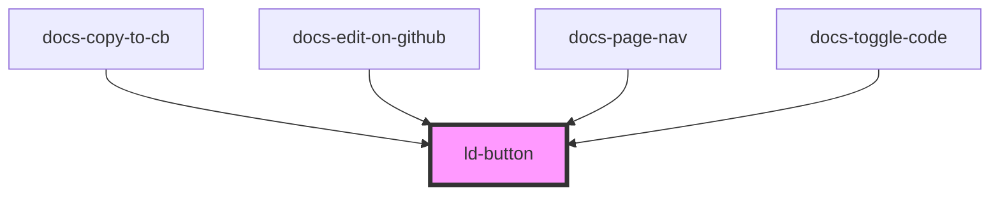

---
eleventyNavigation:
  key: Button
  parent: Components
layout: layout.njk
title: Button
permalink: components/ld-button/
---

# ld-button

Buttons allow a user to trigger events on the user interface. A button's text should express what the button does.
Icon-buttons without visual text should either contain a [screen-reader-only](/components/ld-sr-only/) text, have an `aria-label`, a `title` element within the svg icon or an `alt` text on an image icon within the button.

---

## Examples

### Primary


<ld-button>Text</ld-button>

<!-- CSS component -->

<button class="ld-button">Text</button>


### Disabled


<ld-button disabled>Text</ld-button>

<!-- CSS component -->

<button class="ld-button" disabled>Text</button>


The `disabled` attribute applies both attributes, `disabled` and `aria-disabled="true"` on the rendered component.
Although `aria-disabled="true"` is not necessary on a `button` element (or any other HTML control which supports the disabled attribute natively), it is applied just in case you use an [anchor button](#anchor-button).

**If you want the button to stay focusable** even if it is disabled, use `aria-disabled` in place of `disabled`:


<ld-button id="disabled-button" aria-disabled="true">Text</ld-button>

<!-- CSS component -->

<button id="disabled-button-2" class="ld-button" aria-disabled="true">
  Text
</button>



> **Note:** When `aria-disabled` is applied on the button, either explicitly or implicitly, the component will try to prevent user interaction using an internal click event handler, calling `preventDefault()` and `stopImmediatePropagation()` on the click event. With the CSS component version on the other hand, you will need to take care of preventing the default behaviour of the button yourself. 

### Secondary


<ld-button mode="secondary">Text</ld-button>

<ld-button mode="secondary" disabled>Text</ld-button>

<!-- CSS component -->

<button class="ld-button ld-button--secondary">Text</button>

<button class="ld-button ld-button--secondary" disabled>Text</button>


### On brand color


<ld-button mode="on-brand-color">Text</ld-button>

<ld-button mode="on-brand-color" disabled>Text</ld-button>

<!-- CSS component -->

<button class="ld-button ld-button--on-brand-color">Text</button>

<button class="ld-button ld-button--on-brand-color" disabled>Text</button>


### Secondary on brand color


<ld-button mode="secondary-on-brand-color">Text</ld-button>

<ld-button mode="secondary-on-brand-color" disabled>Text</ld-button>

<!-- CSS component -->

<button class="ld-button ld-button--secondary-on-brand-color">Text</button>

<button class="ld-button ld-button--secondary-on-brand-color" disabled>Text</button>


### Ghost


<ld-button mode="ghost">Text</ld-button>

<ld-button mode="ghost" disabled>Text</ld-button>

<!-- CSS component -->

<button class="ld-button ld-button--ghost">Text</button>

<button class="ld-button ld-button--ghost" disabled>Text</button>


### Highlight


<ld-button mode="highlight">Text</ld-button>

<ld-button mode="highlight" disabled>Text</ld-button>

<!-- CSS component -->

<button class="ld-button ld-button--highlight">Text</button>

<button class="ld-button ld-button--highlight" disabled>Text</button>


### Danger


<ld-button mode="danger">Text</ld-button>

<ld-button mode="danger" disabled>Text</ld-button>

<!-- CSS component -->

<button class="ld-button ld-button--danger">Text</button>

<button class="ld-button ld-button--danger" disabled>Text</button>


### Sizes


<ld-button size="sm">Text</ld-button>

<ld-button>Text</ld-button>

<ld-button size="lg">Text</ld-button>

<!-- CSS component -->

<button class="ld-button ld-button--sm">Text</button>

<button class="ld-button">Text</button>

<button class="ld-button ld-button--lg">Text</button>


### With icon


<ld-button size="sm">
  <ld-icon name="placeholder" aria-label="Text"></ld-icon>
</ld-button>

<ld-button>
  <ld-icon name="placeholder" aria-label="Text"></ld-icon>
</ld-button>

<ld-button size="lg">
  <ld-icon name="placeholder" aria-label="Text"></ld-icon>
</ld-button>

<ld-button mode="highlight" size="sm">
  <ld-icon name="placeholder"></ld-icon>
  Text
</ld-button>

<ld-button mode="danger">
  Text
  <ld-icon name="placeholder"></ld-icon>
</ld-button>

<ld-button mode="secondary" size="lg">
  <ld-icon name="placeholder"></ld-icon>
  Text
</ld-button>

<!-- CSS component -->

<button class="ld-button ld-button--sm">
  
    <svg viewBox="0 0 24 24" fill="none" xmlns="http://www.w3.org/2000/svg">
      <title>Text</title>
      <rect x="1.5" y="1.5" width="21" height="21" rx="4.5" stroke="currentColor" stroke-width="3"/>
      <circle cx="12" cy="12" r="4.5" stroke="currentColor" stroke-width="3"/>
    </svg>
  
</button>

<button class="ld-button">
  
    <svg viewBox="0 0 24 24" fill="none" xmlns="http://www.w3.org/2000/svg">
      <title>Text</title>
      <rect x="1.5" y="1.5" width="21" height="21" rx="4.5" stroke="currentColor" stroke-width="3"/>
      <circle cx="12" cy="12" r="4.5" stroke="currentColor" stroke-width="3"/>
    </svg>
  
</button>

<button class="ld-button ld-button--lg">
  
    <svg viewBox="0 0 24 24" fill="none" xmlns="http://www.w3.org/2000/svg">
      <title>Text</title>
      <rect x="1.5" y="1.5" width="21" height="21" rx="4.5" stroke="currentColor" stroke-width="3"/>
      <circle cx="12" cy="12" r="4.5" stroke="currentColor" stroke-width="3"/>
    </svg>
  
</button>

<button class="ld-button ld-button--highlight ld-button--sm">
  
    <svg viewBox="0 0 24 24" fill="none" xmlns="http://www.w3.org/2000/svg">
      <rect x="1.5" y="1.5" width="21" height="21" rx="4.5" stroke="currentColor" stroke-width="3"/>
      <circle cx="12" cy="12" r="4.5" stroke="currentColor" stroke-width="3"/>
    </svg>
  
  Text
</button>

<button class="ld-button ld-button--danger">
  Text
  
    <svg viewBox="0 0 24 24" fill="none" xmlns="http://www.w3.org/2000/svg">
      <rect x="1.5" y="1.5" width="21" height="21" rx="4.5" stroke="currentColor" stroke-width="3"/>
      <circle cx="12" cy="12" r="4.5" stroke="currentColor" stroke-width="3"/>
    </svg>
  
</button>

<button class="ld-button ld-button--secondary ld-button--lg">
    
      <svg viewBox="0 0 24 24" fill="none" xmlns="http://www.w3.org/2000/svg">
        <rect x="1.5" y="1.5" width="21" height="21" rx="4.5" stroke="currentColor" stroke-width="3"/>
        <circle cx="12" cy="12" r="4.5" stroke="currentColor" stroke-width="3"/>
      </svg>
    
    Text
</button>


### With custom width

To give a button a custom width, simply assign the `width` or `min-width` CSS properties to the element, use other techniques (`grid`, `flex` etc.) on the wrapping element or apply utility classes (i.e. from [Tailwind](https://tailwindcss.com/), if that's your tool of choice) on the element.


<ld-button style="width: 18rem">Text</ld-button>

  <ld-button>Text</ld-button>

<!-- CSS component -->

<button class="ld-button" style="width: 18rem">Text</button>

  <button class="ld-button">Text</button>



### Justify content


<ld-button style="width: 8rem" justify-content="center">
  Text
  <ld-icon name="placeholder"></ld-icon>
</ld-button>

<ld-button style="width: 8rem" justify-content="start">
  Text
  <ld-icon name="placeholder"></ld-icon>
</ld-button>

<ld-button style="width: 8rem" justify-content="end">
  Text
  <ld-icon name="placeholder"></ld-icon>
</ld-button>

<ld-button style="width: 8rem" justify-content="between">
  Text
  <ld-icon name="placeholder"></ld-icon>
</ld-button>

<!-- CSS component -->

<button style="width: 8rem" class="ld-button">
  Text
  
    <svg viewBox="0 0 24 24" fill="none" xmlns="http://www.w3.org/2000/svg">
      <rect x="1.5" y="1.5" width="21" height="21" rx="4.5" stroke="currentColor" stroke-width="3"/>
      <circle cx="12" cy="12" r="4.5" stroke="currentColor" stroke-width="3"/>
    </svg>
  
</button>

<button style="width: 8rem" class="ld-button ld-button--justify-start">
  Text
  
    <svg viewBox="0 0 24 24" fill="none" xmlns="http://www.w3.org/2000/svg">
      <rect x="1.5" y="1.5" width="21" height="21" rx="4.5" stroke="currentColor" stroke-width="3"/>
      <circle cx="12" cy="12" r="4.5" stroke="currentColor" stroke-width="3"/>
    </svg>
  
</button>

<button style="width: 8rem" class="ld-button ld-button--justify-end">
  Text
  
    <svg viewBox="0 0 24 24" fill="none" xmlns="http://www.w3.org/2000/svg">
      <rect x="1.5" y="1.5" width="21" height="21" rx="4.5" stroke="currentColor" stroke-width="3"/>
      <circle cx="12" cy="12" r="4.5" stroke="currentColor" stroke-width="3"/>
    </svg>
  
</button>

<button style="width: 8rem" class="ld-button ld-button--justify-between">
  Text
  
    <svg viewBox="0 0 24 24" fill="none" xmlns="http://www.w3.org/2000/svg">
      <rect x="1.5" y="1.5" width="21" height="21" rx="4.5" stroke="currentColor" stroke-width="3"/>
      <circle cx="12" cy="12" r="4.5" stroke="currentColor" stroke-width="3"/>
    </svg>
  
</button>


### Multi-line

> **Note**: You shouldn't use a button with too much text in it! Instead, put the description in a label outside the button.

You can align the text inside the button using the `align-text` propperty.


<ld-button>
  Almost before we knew it, we had left the ground.
  A shining crescent far beneath the flying vessel.
  Then came the night of the first falling star.
</ld-button>

<ld-button align-text="left">
  <ld-icon name="placeholder"></ld-icon>
  Almost before we knew it, we had left the ground. 
  A shining crescent far beneath the flying vessel. 
  Then came the night of the first falling star.
</ld-button>

<ld-button align-text="right">
  Almost before we knew it, we had left the ground. 
  A shining crescent far beneath the flying vessel. 
  Then came the night of the first falling star.
  <ld-icon name="placeholder"></ld-icon>
</ld-button>

<!-- CSS component -->

<button class="ld-button">
  Almost before we knew it, we had left the ground. 
  A shining crescent far beneath the flying vessel. 
  Then came the night of the first falling star.
</button>

<button class="ld-button ld-button--align-text-left">
  
    <svg viewBox="0 0 24 24" fill="none" xmlns="http://www.w3.org/2000/svg">
      <rect x="1.5" y="1.5" width="21" height="21" rx="4.5" stroke="currentColor" stroke-width="3"/>
      <circle cx="12" cy="12" r="4.5" stroke="currentColor" stroke-width="3"/>
    </svg>
  
  Almost before we knew it, we had left the ground. 
  A shining crescent far beneath the flying vessel. 
  Then came the night of the first falling star.
</button>

<button class="ld-button ld-button--align-text-right">
  Almost before we knew it, we had left the ground. 
  A shining crescent far beneath the flying vessel. 
  Then came the night of the first falling star.
  
    <svg viewBox="0 0 24 24" fill="none" xmlns="http://www.w3.org/2000/svg">
      <rect x="1.5" y="1.5" width="21" height="21" rx="4.5" stroke="currentColor" stroke-width="3"/>
      <circle cx="12" cy="12" r="4.5" stroke="currentColor" stroke-width="3"/>
    </svg>
  
</button>


### Anchor button


<ld-button href="#" target="_blank">Text</ld-button>

<!-- CSS component -->

<a class="ld-button" href="#" target="_blank" rel="noreferrer noopener">Text</a>


> __Note:__ When using `target="_blank"` a `rel` attribute with the value `noreferrer noopener` is applied automatically. Just in case. If you are using the CSS component version of the button, you will need to take care of this yourself. See [https://web.dev/external-anchors-use-rel-noopener/](https://web.dev/external-anchors-use-rel-noopener/)

<!-- Auto Generated Below -->

## Properties

| Property         | Attribute         | Description                                                                                                                                                                                                           | Type                                                                                                  | Default     |
| ---------------- | ----------------- | --------------------------------------------------------------------------------------------------------------------------------------------------------------------------------------------------------------------- | ----------------------------------------------------------------------------------------------------- | ----------- |
| `alignText`      | `align-text`      | Align text.                                                                                                                                                                                                           | `"left" \| "right"`                                                                                   | `undefined` |
| `disabled`       | `disabled`        | Disabled state of the button.                                                                                                                                                                                         | `boolean`                                                                                             | `false`     |
| `href`           | `href`            | Transforms the button to an anchor element. See [mdn docs](https://developer.mozilla.org/en-US/docs/Web/HTML/Element/a#attr-href) for more information on the `href` attribute.                                       | `string`                                                                                              | `undefined` |
| `justifyContent` | `justify-content` | Justify content.                                                                                                                                                                                                      | `"between" \| "end" \| "start"`                                                                       | `undefined` |
| `mode`           | `mode`            | Display mode.                                                                                                                                                                                                         | `"danger" \| "ghost" \| "highlight" \| "on-brand-color" \| "secondary" \| "secondary-on-brand-color"` | `undefined` |
| `size`           | `size`            | Size of the button.                                                                                                                                                                                                   | `"lg" \| "sm"`                                                                                        | `undefined` |
| `target`         | `target`          | The `target` attributed can be used in conjunction with the `href` attribute. See [mdn docs](https://developer.mozilla.org/en-US/docs/Web/HTML/Element/a#attr-target) for more information on the `target` attribute. | `"_blank" \| "_parent" \| "_self" \| "_top"`                                                          | `undefined` |

## Dependencies

### Used by

 - docs-copy-to-cb
 - docs-edit-on-github
 - docs-page-nav
 - docs-toggle-code

### Graph

----------------------------------------------

*Built with [StencilJS](https://stenciljs.com/)*
