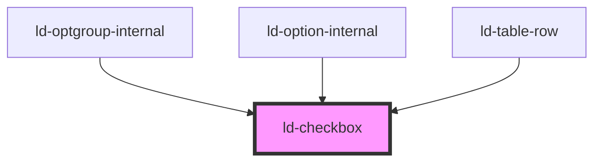

---
eleventyNavigation:
  key: Checkbox
  parent: Components
layout: layout.njk
title: Checkbox
permalink: components/ld-checkbox/
---

<link rel="stylesheet" href="{{ env.base }}/{{ buildstamp }}css_components/ld-checkbox.css">
<link rel="stylesheet" href="{{ env.base }}/{{ buildstamp }}css_components/ld-label.css">
<link rel="stylesheet" href="{{ env.base }}/{{ buildstamp }}css_components/ld-input-message.css">
<link rel="stylesheet" href="{{ env.base }}/{{ buildstamp }}css_components/ld-icon.css">

# ld-checkbox

A checkbox allows the user to select and deselect single values.

This component can be used in conjunction with the [`ld-label`](components/ld-label/) and the [`ld-input-message`](components/ld-input-message/) component.

---

## Examples

### Primary


<ld-checkbox></ld-checkbox>

<!-- React component -->

<LdCheckbox />

<!-- CSS component -->

  <input type="checkbox">
  <svg
    class="ld-checkbox__check"
    width="14"
    height="14"
    fill="none"
    viewBox="0 0 14 14"
  >
    <path
      d="M12 4L5.40795 10L2 6.63964"
      stroke="currentColor"
      stroke-width="3"
      stroke-linecap="round"
      stroke-linejoin="round"
    />
  </svg>
  



### Disabled


<ld-checkbox disabled></ld-checkbox>

<ld-checkbox disabled checked></ld-checkbox>

<!-- React component -->

<LdCheckbox disabled />

<LdCheckbox disabled checked />

<!-- CSS component -->

  <input type="checkbox" disabled>
  <svg
    class="ld-checkbox__check"
    width="14"
    height="14"
    fill="none"
    viewBox="0 0 14 14"
  >
    <path
      d="M12 4L5.40795 10L2 6.63964"
      stroke="currentColor"
      stroke-width="3"
      stroke-linecap="round"
      stroke-linejoin="round"
    />
  </svg>
  

  <input type="checkbox" disabled checked>
  <svg
    class="ld-checkbox__check"
    width="14"
    height="14"
    fill="none"
    viewBox="0 0 14 14"
  >
    <path
      d="M12 4L5.40795 10L2 6.63964"
      stroke="currentColor"
      stroke-width="3"
      stroke-linecap="round"
      stroke-linejoin="round"
    />
  </svg>
  



**If you want the checkbox to stay focusable** even if it is disabled, use `aria-disabled` in place of `disabled`:


<ld-checkbox aria-disabled="true"></ld-checkbox>

<ld-checkbox aria-disabled="true" checked></ld-checkbox>

<!-- React component -->

<LdCheckbox aria-disabled="true" />

<LdCheckbox aria-disabled="true" checked />

<!-- CSS component -->

  <input
    type="checkbox"
    aria-disabled="true">
  <svg
    class="ld-checkbox__check"
    width="14"
    height="14"
    fill="none"
    viewBox="0 0 14 14"
  >
    <path
      d="M12 4L5.40795 10L2 6.63964"
      stroke="currentColor"
      stroke-width="3"
      stroke-linecap="round"
      stroke-linejoin="round"
    />
  </svg>
  

  <input
    type="checkbox"
    aria-disabled="true"
    checked>
  <svg
    class="ld-checkbox__check"
    width="14"
    height="14"
    fill="none"
    viewBox="0 0 14 14"
  >
    <path
      d="M12 4L5.40795 10L2 6.63964"
      stroke="currentColor"
      stroke-width="3"
      stroke-linecap="round"
      stroke-linejoin="round"
    />
  </svg>
  

<!-- Example code for input prevention on aria-disabled checkbox elements -->



<ld-notice headline="Note" mode="warning">
  When <code>aria-disabled</code> is applied on the checkbox, the component will try to prevent user interaction using an internal click event handler, calling <code>preventDefault()</code> on the click event. With the CSS component version on the other hand, you will need to take care of preventing the default behaviour of the checkbox yourself.
</ld-notice>

### Indeterminate

If the `indeterminate` attribute is present on the `ld-checkbox` component, the checkbox's value is neither `true` nor `false`, but is instead _indeterminate_, meaning that its state cannot be determined or stated in pure binary terms. This may happen, for instance, if the state of the checkbox depends on multiple other checkboxes, and those checkboxes have different values. However, the control is never a true tri-state control, even if the element's indeterminate attribute is set to true. The indeterminate IDL attribute only gives the appearance of a third state.

<ld-notice headline="Note" mode="warning">
  When using the CSS Component you need to take care of setting the indeterminate <strong>prop</strong> on the input element with JavaScript.  
</ld-notice>


<ld-checkbox indeterminate></ld-checkbox>

<!-- React component -->

<LdCheckbox indeterminate />

<!-- CSS component -->

  <input type="checkbox">
  <svg
    class="ld-checkbox__check"
    width="14"
    height="14"
    fill="none"
    viewBox="0 0 14 14"
  >
    <path
      d="M12 4L5.40795 10L2 6.63964"
      stroke="currentColor"
      stroke-width="3"
      stroke-linecap="round"
      stroke-linejoin="round"
    />
  </svg>
  



### Dark

<ld-notice headline="Note" mode="warning">
  Dark tone checkboxes should only be used on white backgrounds.
</ld-notice>


<ld-checkbox tone="dark"></ld-checkbox>

<!-- React component -->

<LdCheckbox tone="dark" />

<!-- CSS component -->

  <input type="checkbox">
  <svg
    class="ld-checkbox__check"
    width="14"
    height="14"
    fill="none"
    viewBox="0 0 14 14"
  >
    <path
      d="M12 4L5.40795 10L2 6.63964"
      stroke="currentColor"
      stroke-width="3"
      stroke-linecap="round"
      stroke-linejoin="round"
    />
  </svg>
  



### Highlight


<ld-checkbox mode="highlight"></ld-checkbox>

<!-- React component -->

<LdCheckbox mode="highlight" />

<!-- CSS component -->

  <input type="checkbox">
  <svg
    class="ld-checkbox__check"
    width="14"
    height="14"
    fill="none"
    viewBox="0 0 14 14"
  >
    <path
      d="M12 4L5.40795 10L2 6.63964"
      stroke="currentColor"
      stroke-width="3"
      stroke-linecap="round"
      stroke-linejoin="round"
    />
  </svg>
  



### Invalid


<ld-checkbox invalid></ld-checkbox>

<!-- React component -->

<LdCheckbox invalid />

<!-- CSS component -->

  <input type="checkbox">
  <svg
    class="ld-checkbox__check"
    width="14"
    height="14"
    fill="none"
    viewBox="0 0 14 14"
  >
    <path
      d="M12 4L5.40795 10L2 6.63964"
      stroke="currentColor"
      stroke-width="3"
      stroke-linecap="round"
      stroke-linejoin="round"
    />
  </svg>
  



### Danger

The checkbox in mode "danger" looks and behaves the same as a checkbox with the [`invalid`](components/ld-checkbox/#invalid) property. The only difference lies in the semantics of the properties, which helps to understand the context when reading the code. 


<ld-checkbox mode="danger"></ld-checkbox>

<!-- React component -->

<LdCheckbox mode="danger" />

<!-- CSS component -->

  <input type="checkbox">
  <svg
    class="ld-checkbox__check"
    width="14"
    height="14"
    fill="none"
    viewBox="0 0 14 14"
  >
    <path
      d="M12 4L5.40795 10L2 6.63964"
      stroke="currentColor"
      stroke-width="3"
      stroke-linecap="round"
      stroke-linejoin="round"
    />
  </svg>
  



### With label


<ld-label position="right" size="m">
  I have read the terms of service.*
  <ld-checkbox></ld-checkbox>
</ld-label>

<!-- React component -->

<LdLabel position="right" size="m">
  I have read the terms of service.*
  <LdCheckbox />
</LdLabel>

<!-- CSS component -->

<label class="ld-label ld-label--right ld-label--m">
  I have read the terms of service.*
  

    <input type="checkbox" required>
    <svg
      class="ld-checkbox__check"
      width="14"
      height="14"
      fill="none"
      viewBox="0 0 14 14"
    >
      <path
        d="M12 4L5.40795 10L2 6.63964"
        stroke="currentColor"
        stroke-width="3"
        stroke-linecap="round"
        stroke-linejoin="round"
      />
    </svg>
    

  

</label>


Please reffer to the [ld-label](components/ld-label/) docs for more information on the label component.

### With label and input message



  <ld-label position="right" size="m">
    I have read the terms of service.*
    <ld-checkbox invalid required></ld-checkbox>
    <ld-input-message>To proceed, you must except the terms of service.</ld-input-message>
  </ld-label>

  <ld-label position="right" size="m">
    I'd like to receive a weekly newsletter.
    <ld-checkbox></ld-checkbox>
    <ld-input-message mode="info">You may unsubscribe at any given time.</ld-input-message>
  </ld-label>

<!-- React component -->

  <LdLabel position="right" size="m">
    I have read the terms of service.*
    <LdCheckbox invalid required />
    <LdInputMessage>
      To proceed, you must except the terms of service.
    </LdInputMessage>
  </LdLabel>

  <LdLabel position="right" size="m">
    I'd like to receive a weekly newsletter.
    <LdCheckbox />
    <LdInputMessage mode="info">
      You may unsubscribe at any given time.
    </LdInputMessage>
  </LdLabel>

<!-- CSS component -->

  <label class="ld-label ld-label--right ld-label--m">
    I have read the terms of service.*
    

      <input type="checkbox" required>
      <svg
        class="ld-checkbox__check"
        width="14"
        height="14"
        fill="none"
        viewBox="0 0 14 14"
      >
        <path
          d="M12 4L5.40795 10L2 6.63964"
          stroke="currentColor"
          stroke-width="3"
          stroke-linecap="round"
          stroke-linejoin="round"
        />
      </svg>
      

    

    
      <svg class="ld-input-message__icon ld-icon ld-icon--sm" width="14" height="14" viewBox="0 0 14 14" fill="none">
        <path fill-rule="evenodd" clip-rule="evenodd" d="M7 14C10.866 14 14 10.866 14 7C14 3.13401 10.866 0 7 0C3.13401 0 0 3.13401 0 7C0 10.866 3.13401 14 7 14Z" fill="currentColor"/>
        <path d="M4.66675 4.66699L9.33341 9.33366" stroke="var(--ld-col-wht)" stroke-width="2" stroke-linecap="round" stroke-linejoin="round"/>
        <path d="M4.66675 9.33301L9.33341 4.66634" stroke="var(--ld-col-wht)" stroke-width="2" stroke-linecap="round" stroke-linejoin="round"/>
      </svg>
      To proceed, you must except the terms of service.
    
  </label>
  
  <label class="ld-label ld-label--right ld-label--m">
    I'd like to receive a weekly newsletter.
    

      <input type="checkbox">
      <svg
        class="ld-checkbox__check"
        width="14"
        height="14"
        fill="none"
        viewBox="0 0 14 14"
      >
        <path
          d="M12 4L5.40795 10L2 6.63964"
          stroke="currentColor"
          stroke-width="3"
          stroke-linecap="round"
          stroke-linejoin="round"
        />
      </svg>
      

    

    
      <svg class="ld-input-message__icon ld-icon ld-icon--sm" width="14" height="14" viewBox="0 0 14 14" fill="none">
        <path fill-rule="evenodd" clip-rule="evenodd" d="M7 14C10.866 14 14 10.866 14 7C14 3.13401 10.866 0 7 0C3.13401 0 0 3.13401 0 7C0 10.866 3.13401 14 7 14Z" fill="var(--ld-thm-warning)"/>
        <path fill-rule="evenodd" clip-rule="evenodd" d="M7.18234 11.0254C6.79228 11.0254 6.48657 10.9147 6.26518 10.6933C6.0438 10.472 5.93311 10.1662 5.93311 9.77618V6.12335C5.93311 5.99685 6.0069 5.93359 6.15449 5.93359H6.89771C7.28776 5.93359 7.59348 6.04428 7.81487 6.26567C8.03625 6.48705 8.14694 6.79277 8.14694 7.18283V10.8357C8.14694 10.9622 8.07315 11.0254 7.92556 11.0254H7.18234Z" fill="var(--ld-col-neutral-900)"/>
        <ellipse cx="6.99977" cy="3.80007" rx="1.06667" ry="1.06667" fill="var(--ld-col-neutral-900)"/>
      </svg>
      You may unsubscribe at any given time.
    
  </label>



### Input validation

The `ld-checkbox` Web Component provides a low level API for integrating the component with the form validation solution of your choice. It allows you to listen for `focus`, `input` and `blur` events.

<ld-notice headline="Note" mode="warning">
  You can find examples for different kinds of input validation in the <a href="guides/form-validation/">Form validation</a> documentation. Please also be aware of differences in event handling compared to native elements that come with Web Components. Details can be found in our <a href="guides/event-handling/">Event handling</a> documentation.
</ld-notice>

<!-- Auto Generated Below -->

## Properties

| Property        | Attribute       | Description                                                                                                                                                                          | Type                      | Default     |
| --------------- | --------------- | ------------------------------------------------------------------------------------------------------------------------------------------------------------------------------------ | ------------------------- | ----------- |
| `ariaDisabled`  | `aria-disabled` | Alternative disabled state that keeps element focusable                                                                                                                              | `string`                  | `undefined` |
| `autofocus`     | `autofocus`     | Automatically focus the form control when the page is loaded.                                                                                                                        | `boolean`                 | `undefined` |
| `checked`       | `checked`       | Indicates whether the checkbox is checked.                                                                                                                                           | `boolean`                 | `false`     |
| `disabled`      | `disabled`      | Disabled state of the checkbox.                                                                                                                                                      | `boolean`                 | `undefined` |
| `form`          | `form`          | Associates the control with a form element.                                                                                                                                          | `string`                  | `undefined` |
| `indeterminate` | `indeterminate` | Set this property to `true` to indicate that the checkbox's value is neither true nor false. The prop is removed automatically as soon as the checkbox is clicked (if not disabled). | `boolean`                 | `undefined` |
| `invalid`       | `invalid`       | Set this property to `true` in order to mark the checkbox visually as invalid.                                                                                                       | `boolean`                 | `undefined` |
| `key`           | `key`           | for tracking the node's identity when working with lists                                                                                                                             | `string \| number`        | `undefined` |
| `ldTabindex`    | `ld-tabindex`   | Tab index of the input.                                                                                                                                                              | `number`                  | `undefined` |
| `mode`          | `mode`          | Display mode.                                                                                                                                                                        | `"danger" \| "highlight"` | `undefined` |
| `name`          | `name`          | Used to specify the name of the control.                                                                                                                                             | `string`                  | `undefined` |
| `readonly`      | `readonly`      | The value is not editable.                                                                                                                                                           | `boolean`                 | `undefined` |
| `ref`           | `ref`           | reference to component                                                                                                                                                               | `any`                     | `undefined` |
| `required`      | `required`      | Set this property to `true` in order to mark the checkbox as required.                                                                                                               | `boolean`                 | `undefined` |
| `tone`          | `tone`          | Checkbox tone. Use `'dark'` on white backgrounds. Default is a light tone.                                                                                                           | `"dark"`                  | `undefined` |
| `value`         | `value`         | The input value.                                                                                                                                                                     | `string`                  | `undefined` |

## Events

| Event      | Description                                                       | Type                   |
| ---------- | ----------------------------------------------------------------- | ---------------------- |
| `ldchange` | Emitted when the input value changed and the element loses focus. | `CustomEvent<boolean>` |
| `ldinput`  | Emitted when the input value changed.                             | `CustomEvent<boolean>` |

## Methods

### `focusInner() => Promise<void>`

Sets focus on the checkbox.

#### Returns

Type: `Promise<void>`

## Shadow Parts

| Part      | Description          |
| --------- | -------------------- |
| `"box"`   |                      |
| `"check"` |                      |
| `"input"` | Actual input element |
| `"root"`  |                      |

## Dependencies

### Used by

 - ld-optgroup-internal
 - ld-option-internal
 - [ld-table-row](../ld-table/ld-table-row)

### Graph

----------------------------------------------

*Built with [StencilJS](https://stenciljs.com/)*
