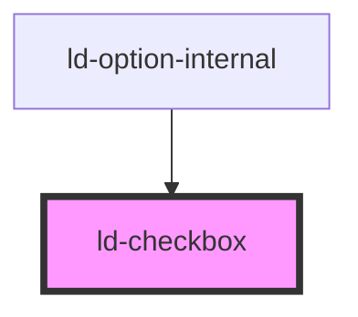

---
eleventyNavigation:
  key: Checkbox
  parent: Components
layout: layout.njk
title: Checkbox
permalink: components/ld-checkbox/
---

# ld-checkbox

A checkbox allows the user to select and deselect single values.

This component can be used in conjunction with the [`ld-label`](components/ld-label/) and the [`ld-input-message`](components/ld-input-message/) component.

---

## Examples

### Primary


<ld-checkbox></ld-checkbox>

<!-- CSS component -->

  <input type="checkbox">
  <svg
    class="ld-checkbox__check"
    width="14"
    height="14"
    fill="none"
    viewBox="0 0 14 14"
    xmlns="http://www.w3.org/2000/svg"
  >
    <path
      d="M12 4L5.40795 10L2 6.63964"
      stroke="currentColor"
      stroke-width="3"
      stroke-linecap="round"
      stroke-linejoin="round"
    />
  </svg>
  



### Disabled


<ld-checkbox disabled></ld-checkbox>

<ld-checkbox disabled checked></ld-checkbox>

<!-- CSS component -->

  <input type="checkbox" disabled>
  <svg
    class="ld-checkbox__check"
    width="14"
    height="14"
    fill="none"
    viewBox="0 0 14 14"
    xmlns="http://www.w3.org/2000/svg"
  >
    <path
      d="M12 4L5.40795 10L2 6.63964"
      stroke="currentColor"
      stroke-width="3"
      stroke-linecap="round"
      stroke-linejoin="round"
    />
  </svg>
  

  <input type="checkbox" disabled checked>
  <svg
    class="ld-checkbox__check"
    width="14"
    height="14"
    fill="none"
    viewBox="0 0 14 14"
    xmlns="http://www.w3.org/2000/svg"
  >
    <path
      d="M12 4L5.40795 10L2 6.63964"
      stroke="currentColor"
      stroke-width="3"
      stroke-linecap="round"
      stroke-linejoin="round"
    />
  </svg>
  



**If you want the checkbox to stay focusable** even if it is disabled, use `aria-disabled` in place of `disabled`:


<ld-checkbox aria-disabled="true"></ld-checkbox>

<ld-checkbox aria-disabled="true" checked></ld-checkbox>

<!-- CSS component -->

  <input
    type="checkbox"
    aria-disabled="true"
    id="focusable-disabled-checkbox-1">
  <svg
    class="ld-checkbox__check"
    width="14"
    height="14"
    fill="none"
    viewBox="0 0 14 14"
    xmlns="http://www.w3.org/2000/svg"
  >
    <path
      d="M12 4L5.40795 10L2 6.63964"
      stroke="currentColor"
      stroke-width="3"
      stroke-linecap="round"
      stroke-linejoin="round"
    />
  </svg>
  

  <input
    type="checkbox"
    aria-disabled="true"
    checked
    id="focusable-disabled-checkbox-2">
  <svg
    class="ld-checkbox__check"
    width="14"
    height="14"
    fill="none"
    viewBox="0 0 14 14"
    xmlns="http://www.w3.org/2000/svg"
  >
    <path
      d="M12 4L5.40795 10L2 6.63964"
      stroke="currentColor"
      stroke-width="3"
      stroke-linecap="round"
      stroke-linejoin="round"
    />
  </svg>
  

<!-- Example code for input prevention on aria-disabled checkbox elements -->



> **Note:** When `aria-disabled` is applied on the checkbox, the component will try to prevent user interaction using an internal click event handler, calling `preventDefault()` on the click event. With the CSS component version on the other hand, you will need to take care of preventing the default behaviour of the checkbox yourself.

### Dark

> **Note**: Dark tone checkboxes should only be used on white backgrounds.


<ld-checkbox tone="dark"></ld-checkbox>

<ld-checkbox tone="dark" disabled></ld-checkbox>

<!-- CSS component -->

  <input type="checkbox">
  <svg
    class="ld-checkbox__check"
    width="14"
    height="14"
    fill="none"
    viewBox="0 0 14 14"
    xmlns="http://www.w3.org/2000/svg"
  >
    <path
      d="M12 4L5.40795 10L2 6.63964"
      stroke="currentColor"
      stroke-width="3"
      stroke-linecap="round"
      stroke-linejoin="round"
    />
  </svg>
  

  <input type="checkbox" disabled>
  <svg
    class="ld-checkbox__check"
    width="14"
    height="14"
    fill="none"
    viewBox="0 0 14 14"
    xmlns="http://www.w3.org/2000/svg"
  >
    <path
      d="M12 4L5.40795 10L2 6.63964"
      stroke="currentColor"
      stroke-width="3"
      stroke-linecap="round"
      stroke-linejoin="round"
    />
  </svg>
  



### Highlight


<ld-checkbox mode="highlight"></ld-checkbox>

<ld-checkbox mode="highlight" disabled></ld-checkbox>

<!-- CSS component -->

  <input type="checkbox">
  <svg
    class="ld-checkbox__check"
    width="14"
    height="14"
    fill="none"
    viewBox="0 0 14 14"
    xmlns="http://www.w3.org/2000/svg"
  >
    <path
      d="M12 4L5.40795 10L2 6.63964"
      stroke="currentColor"
      stroke-width="3"
      stroke-linecap="round"
      stroke-linejoin="round"
    />
  </svg>
  

  <input type="checkbox" disabled>
  <svg
    class="ld-checkbox__check"
    width="14"
    height="14"
    fill="none"
    viewBox="0 0 14 14"
    xmlns="http://www.w3.org/2000/svg"
  >
    <path
      d="M12 4L5.40795 10L2 6.63964"
      stroke="currentColor"
      stroke-width="3"
      stroke-linecap="round"
      stroke-linejoin="round"
    />
  </svg>
  



### Invalid


<ld-checkbox invalid></ld-checkbox>

<ld-checkbox invalid disabled></ld-checkbox>

<!-- CSS component -->

  <input type="checkbox">
  <svg
    class="ld-checkbox__check"
    width="14"
    height="14"
    fill="none"
    viewBox="0 0 14 14"
    xmlns="http://www.w3.org/2000/svg"
  >
    <path
      d="M12 4L5.40795 10L2 6.63964"
      stroke="currentColor"
      stroke-width="3"
      stroke-linecap="round"
      stroke-linejoin="round"
    />
  </svg>
  

  <input type="checkbox" disabled>
  <svg
    class="ld-checkbox__check"
    width="14"
    height="14"
    fill="none"
    viewBox="0 0 14 14"
    xmlns="http://www.w3.org/2000/svg"
  >
    <path
      d="M12 4L5.40795 10L2 6.63964"
      stroke="currentColor"
      stroke-width="3"
      stroke-linecap="round"
      stroke-linejoin="round"
    />
  </svg>
  



### Danger

The checkbox in mode "danger" looks and behaves the same as a checkbox with the [`invalid`](#invalid) property. The only difference lies in the semantics of the properties, which helps to understand the context when reading the code. 


<ld-checkbox mode="danger"></ld-checkbox>

<ld-checkbox mode="danger" disabled></ld-checkbox>

<!-- CSS component -->

  <input type="checkbox">
  <svg
    class="ld-checkbox__check"
    width="14"
    height="14"
    fill="none"
    viewBox="0 0 14 14"
    xmlns="http://www.w3.org/2000/svg"
  >
    <path
      d="M12 4L5.40795 10L2 6.63964"
      stroke="currentColor"
      stroke-width="3"
      stroke-linecap="round"
      stroke-linejoin="round"
    />
  </svg>
  

  <input type="checkbox" disabled>
  <svg
    class="ld-checkbox__check"
    width="14"
    height="14"
    fill="none"
    viewBox="0 0 14 14"
    xmlns="http://www.w3.org/2000/svg"
  >
    <path
      d="M12 4L5.40795 10L2 6.63964"
      stroke="currentColor"
      stroke-width="3"
      stroke-linecap="round"
      stroke-linejoin="round"
    />
  </svg>
  



### With label


<ld-label position="right" size="m">
  I have read the terms of service.*
  <ld-checkbox></ld-checkbox>
</ld-label>

<!-- CSS component -->

<label class="ld-label ld-label--right ld-label--m">
  I have read the terms of service.*
  

    <input type="checkbox" required>
    <svg
      class="ld-checkbox__check"
      width="14"
      height="14"
      fill="none"
      viewBox="0 0 14 14"
      xmlns="http://www.w3.org/2000/svg"
    >
      <path
        d="M12 4L5.40795 10L2 6.63964"
        stroke="currentColor"
        stroke-width="3"
        stroke-linecap="round"
        stroke-linejoin="round"
      />
    </svg>
    

  

</label>


Please reffer to the [ld-label](components/ld-label/) docs for more information on the label component.

### With label and input message



  <ld-label position="right" size="m">
    I have read the terms of service.*
    <ld-checkbox invalid required></ld-checkbox>
    <ld-input-message>To proceed, you must except the terms of service.</ld-input-message>
  </ld-label>

  <ld-label position="right" size="m">
    I'd like to receive a weekly newsletter.
    <ld-checkbox></ld-checkbox>
    <ld-input-message mode="info">You may unsubscribe at any given time.</ld-input-message>
  </ld-label>

<!-- CSS component -->

  <label class="ld-label ld-label--right ld-label--m">
    I have read the terms of service.*
    

      <input type="checkbox" required>
      <svg
        class="ld-checkbox__check"
        width="14"
        height="14"
        fill="none"
        viewBox="0 0 14 14"
        xmlns="http://www.w3.org/2000/svg"
      >
        <path
          d="M12 4L5.40795 10L2 6.63964"
          stroke="currentColor"
          stroke-width="3"
          stroke-linecap="round"
          stroke-linejoin="round"
        />
      </svg>
      

    

    
      <!-- Note that you can use an img element with the class ld-input-message__icon here as well. -->
      <svg class="ld-input-message__icon" width="14" height="14" viewBox="0 0 14 14" fill="none" xmlns="http://www.w3.org/2000/svg">
        <path fill-rule="evenodd" clip-rule="evenodd" d="M7 14C10.866 14 14 10.866 14 7C14 3.13401 10.866 0 7 0C3.13401 0 0 3.13401 0 7C0 10.866 3.13401 14 7 14Z" fill="#E61E50"/>
        <path d="M4.66675 4.66699L9.33341 9.33366" stroke="white" stroke-width="2" stroke-linecap="round" stroke-linejoin="round"/>
        <path d="M4.66675 9.33301L9.33341 4.66634" stroke="white" stroke-width="2" stroke-linecap="round" stroke-linejoin="round"/>
      </svg>
      To proceed, you must except the terms of service.
    
  </label>
  
  <label class="ld-label ld-label--right ld-label--m">
    I'd like to receive a weekly newsletter.
    

      <input type="checkbox">
      <svg
        class="ld-checkbox__check"
        width="14"
        height="14"
        fill="none"
        viewBox="0 0 14 14"
        xmlns="http://www.w3.org/2000/svg"
      >
        <path
          d="M12 4L5.40795 10L2 6.63964"
          stroke="currentColor"
          stroke-width="3"
          stroke-linecap="round"
          stroke-linejoin="round"
        />
      </svg>
      

    

    
      <!-- Note that you can use an img element with the class ld-input-message__icon here as well. -->
      <svg class="ld-input-message__icon" width="14" height="14" viewBox="0 0 14 14" fill="none" xmlns="http://www.w3.org/2000/svg">
        <path fill-rule="evenodd" clip-rule="evenodd" d="M7 14C10.866 14 14 10.866 14 7C14 3.13401 10.866 0 7 0C3.13401 0 0 3.13401 0 7C0 10.866 3.13401 14 7 14Z" fill="#FFC832"/>
        <path fill-rule="evenodd" clip-rule="evenodd" d="M7.18234 11.0254C6.79228 11.0254 6.48657 10.9147 6.26518 10.6933C6.0438 10.472 5.93311 10.1662 5.93311 9.77618V6.12335C5.93311 5.99685 6.0069 5.93359 6.15449 5.93359H6.89771C7.28776 5.93359 7.59348 6.04428 7.81487 6.26567C8.03625 6.48705 8.14694 6.79277 8.14694 7.18283V10.8357C8.14694 10.9622 8.07315 11.0254 7.92556 11.0254H7.18234Z" fill="#091734"/>
        <ellipse cx="6.99977" cy="3.80007" rx="1.06667" ry="1.06667" fill="#091734"/>
      </svg>
      You may unsubscribe at any given time.
    
  </label>



### Input validation

The `ld-checkbox` Web Component provides a low level API for integrating the component with the form validation solution of your choice. It allows you to listen for `focus`, `input` and `blur` events and setting error / info messages via the [`ld-input-message`](components/ld-input-message/) component. The following is an example on how you could implement input validation with vanilla JS:



<form id="example-form" novalidate>
  <ld-label position="right" size="m">
    I have read the terms of service.*
    <ld-checkbox required></ld-checkbox>
    <ld-input-message visible="false">To proceed, you must except the terms of service.</ld-input-message>
  </ld-label>
  <ld-label position="right" size="m">
    I'd like to receive a weekly newsletter.
    <ld-checkbox></ld-checkbox>
    <ld-input-message mode="info">You may unsubscribe at any given time.</ld-input-message>
  </ld-label>
  <ld-button>Submit</ld-button>
</form>



<!-- Auto Generated Below -->

## Properties

| Property   | Attribute  | Description                                                                    | Type                      | Default     |
| ---------- | ---------- | ------------------------------------------------------------------------------ | ------------------------- | ----------- |
| `checked`  | `checked`  | The input value.                                                               | `boolean`                 | `undefined` |
| `disabled` | `disabled` | Disabled state of the checkbox.                                                | `boolean`                 | `undefined` |
| `invalid`  | `invalid`  | Set this property to `true` in order to mark the checkbox visually as invalid. | `boolean`                 | `undefined` |
| `key`      | `key`      | for tracking the node's identity when working with lists                       | `string \| number`        | `undefined` |
| `mode`     | `mode`     | Display mode.                                                                  | `"danger" \| "highlight"` | `undefined` |
| `ref`      | `ref`      | reference to component                                                         | `any`                     | `undefined` |
| `tone`     | `tone`     | Checkbox tone. Use `'dark'` on white backgrounds. Default is a light tone.     | `"dark"`                  | `undefined` |

## Dependencies

### Used by

 - ld-option-internal

### Graph

----------------------------------------------

 
