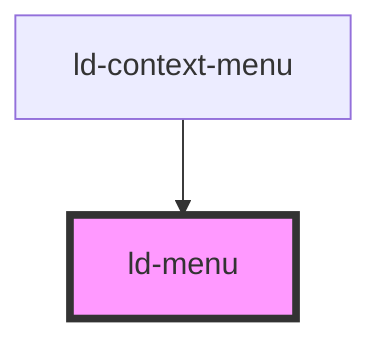

---
eleventyNavigation:
  key: Menu
  parent: Context Menu
layout: layout.njk
title: Menu
permalink: components/ld-context-menu/ld-menu/
---

# ld-menu

The `ld-menu` component is a subcomponent for `ld-context-menu`.

Please refer to the [`ld-context-menu` documentation](components/ld-context-menu) for usage examples.

---

<!-- Auto Generated Below -->

## Properties

| Property | Attribute | Description               | Type           | Default     |
| -------- | --------- | ------------------------- | -------------- | ----------- |
| `size`   | `size`    | Size of the context menu. | `"lg" \| "sm"` | `undefined` |

## Shadow Parts

| Part     | Description |
| -------- | ----------- |
| `"list"` |             |

## Dependencies

### Used by

 - [ld-context-menu](..)

### Graph

----------------------------------------------

*Built with [StencilJS](https://stenciljs.com/)*
