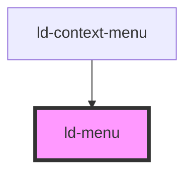

---
eleventyNavigation:
  key: Menu
  parent: Context Menu
layout: layout.njk
title: Menu
permalink: components/ld-context-menu/ld-menu/
---

<link rel="stylesheet" href="css_components/ld-menu.css">
<link rel="stylesheet" href="css_components/ld-menuitem.css">
<link rel="stylesheet" href="css_components/ld-menuitem-group.css">
<link rel="stylesheet" href="css_components/ld-icon.css">
<link rel="stylesheet" href="css_components/ld-button.css">

# ld-menu

The `ld-menu` component is used internally for the `ld-menu`. It is the visual part of the actual menu without the floating/tooltip functionality.

## Examples

### Basic


<ld-menu>
  <ld-menuitem>Menu item 1</ld-menuitem>
  <ld-menuitem>Menu item 2</ld-menuitem>
  <ld-menuitem>Menu item 3</ld-menuitem>
</ld-menu>

<!-- React component -->

<LdMenu>
  <LdMenuitem>Menu item 1</LdMenuitem>
  <LdMenuitem>Menu item 2</LdMenuitem>
  <LdMenuitem>Menu item 3</LdMenuitem>
</LdMenu>

<!-- CSS component -->

<ul class="ld-menu" role="menu">
  <li class="ld-menuitem"  role="menuitemradio">
    <button class="ld-menuitem__button ld-button ld-button--justify-start ld-button--ghost ld-button--neutral-ghost">
      Menu item 1
    </button>
  </li>
  <li class="ld-menuitem"  role="menuitemradio">
    <button class="ld-menuitem__button ld-button ld-button--justify-start ld-button--ghost ld-button--neutral-ghost">
      Menu item 2
    </button>
  </li>
  <li class="ld-menuitem"  role="menuitemradio">
    <button class="ld-menuitem__button ld-button ld-button--justify-start ld-button--ghost ld-button--neutral-ghost">
      Menu item 2
    </button>
  </li>
</ul>


### Size


<ld-menu size="sm">
  <ld-menuitem>Menu item 1</ld-menuitem>
  <ld-menuitem>Menu item 2</ld-menuitem>
  <ld-menuitem>Menu item 3</ld-menuitem>
</ld-menu>

<ld-menu>
  <ld-menuitem>Menu item 1</ld-menuitem>
  <ld-menuitem>Menu item 2</ld-menuitem>
  <ld-menuitem>Menu item 3</ld-menuitem>
</ld-menu>

<ld-menu size="lg">
  <ld-menuitem>Menu item 1</ld-menuitem>
  <ld-menuitem>Menu item 2</ld-menuitem>
  <ld-menuitem>Menu item 3</ld-menuitem>
</ld-menu>

<!-- React component -->

<LdMenu size="sm">
  <LdMenuitem>Menu item 1</LdMenuitem>
  <LdMenuitem>Menu item 2</LdMenuitem>
  <LdMenuitem>Menu item 3</LdMenuitem>
</LdMenu>

<LdMenu>
  <LdMenuitem>Menu item 1</LdMenuitem>
  <LdMenuitem>Menu item 2</LdMenuitem>
  <LdMenuitem>Menu item 3</LdMenuitem>
</LdMenu>

<LdMenu size="lg">
  <LdMenuitem>Menu item 1</LdMenuitem>
  <LdMenuitem>Menu item 2</LdMenuitem>
  <LdMenuitem>Menu item 3</LdMenuitem>
</LdMenu>

<!-- CSS component -->

<ul class="ld-menu" role="menu">
  <li class="ld-menuitem"  role="menuitemradio">
    <button class="ld-menuitem__button ld-button ld-button--justify-start ld-button--ghost ld-button--neutral-ghost ld-button--sm">
      Menu item 1
    </button>
  </li>
  <li class="ld-menuitem"  role="menuitemradio">
    <button class="ld-menuitem__button ld-button ld-button--justify-start ld-button--ghost ld-button--neutral-ghost ld-button--sm">
      Menu item 2
    </button>
  </li>
  <li class="ld-menuitem"  role="menuitemradio">
    <button class="ld-menuitem__button ld-button ld-button--justify-start ld-button--ghost ld-button--neutral-ghost ld-button--sm">
      Menu item 2
    </button>
  </li>
</ul>

<ul class="ld-menu" role="menu">
  <li class="ld-menuitem"  role="menuitemradio">
    <button class="ld-menuitem__button ld-button ld-button--justify-start ld-button--ghost ld-button--neutral-ghost">
      Menu item 1
    </button>
  </li>
  <li class="ld-menuitem"  role="menuitemradio">
    <button class="ld-menuitem__button ld-button ld-button--justify-start ld-button--ghost ld-button--neutral-ghost">
      Menu item 2
    </button>
  </li>
  <li class="ld-menuitem"  role="menuitemradio">
    <button class="ld-menuitem__button ld-button ld-button--justify-start ld-button--ghost ld-button--neutral-ghost">
      Menu item 2
    </button>
  </li>
</ul>

<ul class="ld-menu" role="menu">
  <li class="ld-menuitem"  role="menuitemradio">
    <button class="ld-menuitem__button ld-button ld-button--justify-start ld-button--ghost ld-button--neutral-ghost ld-button--lg">
      Menu item 1
    </button>
  </li>
  <li class="ld-menuitem"  role="menuitemradio">
    <button class="ld-menuitem__button ld-button ld-button--justify-start ld-button--ghost ld-button--neutral-ghost ld-button--lg">
      Menu item 2
    </button>
  </li>
  <li class="ld-menuitem"  role="menuitemradio">
    <button class="ld-menuitem__button ld-button ld-button--justify-start ld-button--ghost ld-button--neutral-ghost ld-button--lg">
      Menu item 2
    </button>
  </li>
</ul>


### Item Groups


<ld-menu>
  <ld-menuitem-group>
    <ld-menuitem>Menu item 1</ld-menuitem>
    <ld-menuitem>Menu item 2</ld-menuitem>
    <ld-menuitem>Menu item 3</ld-menuitem>
  </ld-menuitem-group>
  <ld-menuitem-group>
    <ld-menuitem mode="highlight">
      <ld-icon name="repost"></ld-icon>
      Reset
    </ld-menuitem>
    <ld-menuitem mode="danger">
      <ld-icon name="bin"></ld-icon>
      Delete
    </ld-menuitem>
  </ld-menuitem-group>
</ld-menu>

<!-- React component -->

<LdMenu>
  <LdMenuitemGroup>
    <LdMenuitem>Menu item 1</LdMenuitem>
    <LdMenuitem>Menu item 2</LdMenuitem>
    <LdMenuitem>Menu item 3</LdMenuitem>
  </LdMenuitemGroup>
  <LdMenuitemGroup>
    <LdMenuitem mode="highlight">
      <LdIcon name="repost" />
      Reset
    </LdMenuitem>
    <LdMenuitem mode="danger">
      <LdIcon name="bin" />
      Delete
    </LdMenuitem>
  </LdMenuitemGroup>
</LdMenu>

<!-- CSS component -->

<ul class="ld-menu" role="menu">
  <li class="ld-menuitem-group" role="none">
    <ul class="ld-menuitem-group__list" role="group">
      <li class="ld-menuitem"  role="menuitemradio">
        <button class="ld-menuitem__button ld-button ld-button--justify-start ld-button--ghost ld-button--neutral-ghost">
          Menu item 1
        </button>
      </li>
      <li class="ld-menuitem"  role="menuitemradio">
        <button class="ld-menuitem__button ld-button ld-button--justify-start ld-button--ghost ld-button--neutral-ghost">
          Menu item 2
        </button>
      </li>
      <li class="ld-menuitem"  role="menuitemradio">
        <button class="ld-menuitem__button ld-button ld-button--justify-start ld-button--ghost ld-button--neutral-ghost">
          Menu item 2
        </button>
      </li>
    </ul>
  </li>
  <li class="ld-menuitem-group" role="none">
    <ul class="ld-menuitem-group__list" role="group">
      <li class="ld-menuitem"  role="menuitemradio">
        <button class="ld-menuitem__button ld-button ld-button--justify-start ld-button--ghost">
          <svg class="ld-icon" role="presentation" viewBox="0 0 24 24" fill="none" xmlns="http://www.w3.org/2000/svg"><path fill-rule="evenodd" clip-rule="evenodd" d="M18.7071 15.7071a.9972.9972 0 0 1-.3243.217 1.0001 1.0001 0 0 1-1.0899-.217l-3-3c-.3905-.3905-.3905-1.0237 0-1.4142.3905-.3905 1.0237-.3905 1.4142 0L17 12.5858V8h-7c-.5523 0-1-.4477-1-1s.4477-1 1-1h8c.5523 0 1 .4477 1 1v5.5858l1.2929-1.2929c.3905-.3905 1.0237-.3905 1.4142 0 .3905.3905.3905 1.0237 0 1.4142l-3 3ZM5.2929 8.2929a.9971.9971 0 0 1 .3243-.217 1.0003 1.0003 0 0 1 1.09.217l3 3c.3904.3905.3904 1.0237 0 1.4142-.3906.3905-1.0238.3905-1.4143 0L7 11.4142V16h7c.5523 0 1 .4477 1 1s-.4477 1-1 1H6c-.5523 0-1-.4477-1-1v-5.5858l-1.2929 1.2929c-.3905.3905-1.0237.3905-1.4142 0-.3905-.3905-.3905-1.0237 0-1.4142l3-3Z" fill="currentcolor"/></svg>
          Reset
        </button>
      </li>
      <li class="ld-menuitem"  role="menuitemradio">
        <button class="ld-menuitem__button ld-button ld-button--justify-start ld-button--ghost ld-button--danger-ghost">
          <svg class="ld-icon" role="presentation" viewBox="0 0 24 24" fill="none" xmlns="http://www.w3.org/2000/svg"><path fill-rule="evenodd" clip-rule="evenodd" d="M16 3.6663h2.6669c.7369 0 1.3331.7463 1.3331 1.6663V6.5a.5.5 0 0 1-.5.5h-15a.5.5 0 0 1-.5-.5V5.3326c0-.92.597-1.6663 1.3339-1.6663H8A2.6517 2.6517 0 0 1 10.4618 2h3.0776c1.0838 0 2.0583.66 2.4606 1.6663ZM5.55 8a.5.5 0 0 0-.4978.5474L6 18.5S6 22 12 22s6-3.5 6-3.5l.9479-9.9526A.5.5 0 0 0 18.4501 8H5.5499ZM11 17.5v-6a.5.5 0 0 0-.5-.5h-1a.5.5 0 0 0-.5.5v6a.5.5 0 0 0 .5.5h1a.5.5 0 0 0 .5-.5Zm4-6v6a.5.5 0 0 1-.5.5h-1a.5.5 0 0 1-.5-.5v-6a.5.5 0 0 1 .5-.5h1a.5.5 0 0 1 .5.5Z" fill="currentcolor"/></svg>
          Delete
        </button>
      </li>
    </ul>
  </li>
</ul>


### With custom width


<ld-menu style="width:18rem">
  <ld-menuitem>Menu item 1</ld-menuitem>
  <ld-menuitem>Menu item 2</ld-menuitem>
  <ld-menuitem>Menu item 3</ld-menuitem>
</ld-menu>

<!-- React component -->

<LdMenu style={ { width: '18rem' } }>
  <LdMenuitem>Menu item 1</LdMenuitem>
  <LdMenuitem>Menu item 2</LdMenuitem>
  <LdMenuitem>Menu item 3</LdMenuitem>
</LdMenu>

<!-- CSS component -->

<ul class="ld-menu" role="menu" style="width:18rem">
  <li class="ld-menuitem"  role="menuitemradio">
    <button class="ld-menuitem__button ld-button ld-button--justify-start ld-button--ghost ld-button--neutral-ghost">
      Menu item 1
    </button>
  </li>
  <li class="ld-menuitem"  role="menuitemradio">
    <button class="ld-menuitem__button ld-button ld-button--justify-start ld-button--ghost ld-button--neutral-ghost">
      Menu item 2
    </button>
  </li>
  <li class="ld-menuitem"  role="menuitemradio">
    <button class="ld-menuitem__button ld-button ld-button--justify-start ld-button--ghost ld-button--neutral-ghost">
      Menu item 2
    </button>
  </li>
</ul>


<!-- Auto Generated Below -->

## Properties

| Property | Attribute | Description               | Type           | Default     |
| -------- | --------- | ------------------------- | -------------- | ----------- |
| `size`   | `size`    | Size of the context menu. | `"lg" \| "sm"` | `undefined` |

## Methods

### `getFirstMenuItem() => Promise<HTMLLdMenuitemElement>`

Get the first menu item inside this menu.

#### Returns

Type: `Promise<HTMLLdMenuitemElement>`

## Shadow Parts

| Part     | Description |
| -------- | ----------- |
| `"list"` |             |

## Dependencies

### Used by

 - [ld-context-menu](..)

### Graph

----------------------------------------------

*Built with [StencilJS](https://stenciljs.com/)*
