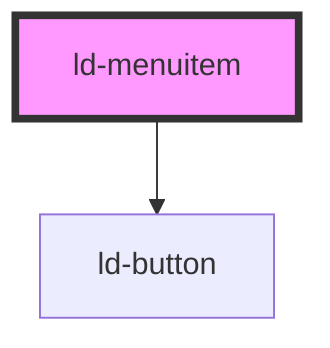

---
eleventyNavigation:
  key: Menuitem
  parent: Context Menu
layout: layout.njk
title: Menuitem
permalink: components/ld-context-menu/ld-menuitem/
---

<link rel="stylesheet" href="css_components/ld-menu.css">
<link rel="stylesheet" href="css_components/ld-menuitem.css">
<link rel="stylesheet" href="css_components/ld-icon.css">
<link rel="stylesheet" href="css_components/ld-button.css">

# ld-menuitem

The `ld-menuitem` component is a subcomponent for `ld-context-menu` / `ld-menu` and is meant to be used in the slot of either the [`ld-context-menu`](..), the [`ld-menu`](../ld-menu) or the [`ld-menuitem-group`](../ld-menuitem-group) component.

---

## Examples

### Default


<ld-menu>
  <ld-menuitem>Menu item</ld-menuitem>
</ld-menu>

<!-- React component -->

<LdMenu>
  <LdMenuitem>Menu item</LdMenuitem>
</LdMenu>

<!-- CSS component -->

<ul class="ld-menu" role="menu">
  <li class="ld-menuitem"  role="menuitemradio">
    <button class="ld-menuitem__button ld-button ld-button--justify-start ld-button--ghost ld-button--neutral-ghost">
      Menu item
    </button>
  </li>
</ul>


### Highlight


<ld-menu>
  <ld-menuitem mode="highlight">Menu item</ld-menuitem>
</ld-menu>

<!-- React component -->

<LdMenu>
  <LdMenuitem mode="highlight">Menu item</LdMenuitem>
</LdMenu>

<!-- CSS component -->

<ul class="ld-menu" role="menu">
  <li class="ld-menuitem"  role="menuitemradio">
    <button class="ld-menuitem__button ld-button ld-button--justify-start ld-button--ghost">
      Menu item
    </button>
  </li>
</ul>


### Danger


<ld-menu>
  <ld-menuitem mode="danger">Menu item</ld-menuitem>
</ld-menu>

<!-- React component -->

<LdMenu>
  <LdMenuitem mode="danger">Menu item</LdMenuitem>
</LdMenu>

<!-- CSS component -->

<ul class="ld-menu" role="menu">
  <li class="ld-menuitem"  role="menuitemradio">
    <button class="ld-menuitem__button ld-button ld-button--justify-start ld-button--ghost ld-button--danger-ghost">
      Menu item
    </button>
  </li>
</ul>


### As link


<ld-menu>
  <ld-menuitem href="#" target="_blank">Menu item</ld-menuitem>
</ld-menu>

<!-- React component -->

<LdMenu>
  <LdMenuitem href="#" target="_blank">Menu item</LdMenuitem>
</LdMenu>

<!-- CSS component -->

<ul class="ld-menu" role="menu">
  <li class="ld-menuitem"  role="menuitemradio">
    <a class="ld-menuitem__button ld-button ld-button--justify-start ld-button--ghost ld-button--neutral-ghost" href="#" target="_blank" rel="noreferrer noopener">
      Menu item
    </a>
  </li>
</ul>


<!-- Auto Generated Below -->

## Properties

| Property     | Attribute     | Description                                                                                                                                                                                                           | Type                                         | Default     |
| ------------ | ------------- | --------------------------------------------------------------------------------------------------------------------------------------------------------------------------------------------------------------------- | -------------------------------------------- | ----------- |
| `href`       | `href`        | Transforms the menu item to an anchor element. See [mdn docs](https://developer.mozilla.org/en-US/docs/Web/HTML/Element/a#attr-href) for more information on the `href` attribute.                                    | `string`                                     | `undefined` |
| `ldTabindex` | `ld-tabindex` | Tab index of the menu item.                                                                                                                                                                                           | `number`                                     | `undefined` |
| `mode`       | `mode`        | Display mode.                                                                                                                                                                                                         | `"danger" \| "highlight" \| "neutral"`       | `'neutral'` |
| `target`     | `target`      | The `target` attributed can be used in conjunction with the `href` attribute. See [mdn docs](https://developer.mozilla.org/en-US/docs/Web/HTML/Element/a#attr-target) for more information on the `target` attribute. | `"_blank" \| "_parent" \| "_self" \| "_top"` | `undefined` |

## Methods

### `focusInner() => Promise<void>`

Sets focus on the anchor or button

#### Returns

Type: `Promise<void>`

## Dependencies

### Depends on

- [ld-button](../../ld-button)

### Graph

----------------------------------------------

*Built with [StencilJS](https://stenciljs.com/)*
