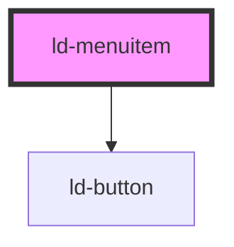

---
eleventyNavigation:
  key: Menuitem
  parent: Context Menu
layout: layout.njk
title: Menuitem
permalink: components/ld-context-menu/ld-menuitem/
---

# ld-menuitem

The `ld-menuitem` component is a subcomponent for `ld-context-menu`.

Please refer to the [`ld-context-menu` documentation](components/ld-context-menu) for usage examples.

---

<!-- Auto Generated Below -->

## Properties

| Property | Attribute | Description                                                                                                                                                                        | Type                                   | Default     |
| -------- | --------- | ---------------------------------------------------------------------------------------------------------------------------------------------------------------------------------- | -------------------------------------- | ----------- |
| `href`   | `href`    | Transforms the menu item to an anchor element. See [mdn docs](https://developer.mozilla.org/en-US/docs/Web/HTML/Element/a#attr-href) for more information on the `href` attribute. | `string`                               | `undefined` |
| `mode`   | `mode`    | Display mode.                                                                                                                                                                      | `"danger" \| "highlight" \| "neutral"` | `'neutral'` |

## Dependencies

### Depends on

- [ld-button](../../ld-button)

### Graph

----------------------------------------------

*Built with [StencilJS](https://stenciljs.com/)*
