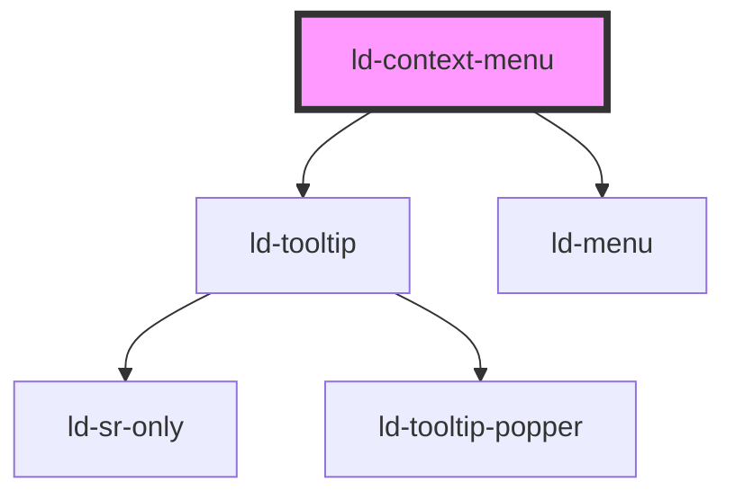

---
eleventyNavigation:
  key: Context Menu
  parent: Components
layout: layout.njk
title: Context Menu
permalink: components/ld-context-menu/
---

# ld-context-menu

## Examples

<ld-notice mode="warning">
  The <code>ld-context-menu</code> is not available as CSS component, because of it's tooltip functionality. To see CSS components examples for the menu without tooltip functionality, please take a look at the <a href="components/ld-context-menu/ld-menu"><code>ld-menu</code>-documentation</a>.
</ld-notice>

### Basic


<ld-context-menu>
  <ld-button slot="trigger">Open menu</ld-button>
  <ld-menuitem>Menu item 1</ld-menuitem>
  <ld-menuitem>Menu item 2</ld-menuitem>
  <ld-menuitem>Menu item 3</ld-menuitem>
</ld-context-menu>

<!-- React component -->

<LdContextMenu>
  <LdButton slot="trigger">Open menu</LdButton>
  <LdMenuitem>Menu item 1</LdMenuitem>
  <LdMenuitem>Menu item 2</LdMenuitem>
  <LdMenuitem>Menu item 3</LdMenuitem>
</LdContextMenu>


### Size


<ld-context-menu size="sm">
  <ld-button slot="trigger">Small</ld-button>
  <ld-menuitem>Menu item 1</ld-menuitem>
  <ld-menuitem>Menu item 2</ld-menuitem>
  <ld-menuitem>Menu item 3</ld-menuitem>
</ld-context-menu>

<ld-context-menu>
  <ld-button slot="trigger">Medium</ld-button>
  <ld-menuitem>Menu item 1</ld-menuitem>
  <ld-menuitem>Menu item 2</ld-menuitem>
  <ld-menuitem>Menu item 3</ld-menuitem>
</ld-context-menu>

<ld-context-menu size="lg">
  <ld-button slot="trigger">Large</ld-button>
  <ld-menuitem>Menu item 1</ld-menuitem>
  <ld-menuitem>Menu item 2</ld-menuitem>
  <ld-menuitem>Menu item 3</ld-menuitem>
</ld-context-menu>

<!-- React component -->

<LdContextMenu size="sm">
  <LdButton slot="trigger">Small</LdButton>
  <LdMenuitem>Menu item 1</LdMenuitem>
  <LdMenuitem>Menu item 2</LdMenuitem>
  <LdMenuitem>Menu item 3</LdMenuitem>
</LdContextMenu>

<LdContextMenu>
  <LdButton slot="trigger">Medium</LdButton>
  <LdMenuitem>Menu item 1</LdMenuitem>
  <LdMenuitem>Menu item 2</LdMenuitem>
  <LdMenuitem>Menu item 3</LdMenuitem>
</LdContextMenu>

<LdContextMenu size="lg">
  <LdButton slot="trigger">Large</LdButton>
  <LdMenuitem>Menu item 1</LdMenuitem>
  <LdMenuitem>Menu item 2</LdMenuitem>
  <LdMenuitem>Menu item 3</LdMenuitem>
</LdContextMenu>


### Item Groups


<ld-context-menu>
  <ld-button slot="trigger">Open menu</ld-button>
  <ld-menuitem-group>
    <ld-menuitem>Menu item 1</ld-menuitem>
    <ld-menuitem>Menu item 2</ld-menuitem>
    <ld-menuitem>Menu item 3</ld-menuitem>
  </ld-menuitem-group>
  <ld-menuitem-group>
    <ld-menuitem mode="highlight">
      <ld-icon name="repost"></ld-icon>
      Reset
    </ld-menuitem>
    <ld-menuitem mode="danger">
      <ld-icon name="bin"></ld-icon>
      Delete
    </ld-menuitem>
  </ld-menuitem-group>
</ld-context-menu>

<!-- React component -->

<LdContextMenu>
  <LdButton slot="trigger">Open menu</LdButton>
  <LdMenuitemGroup>
    <LdMenuitem>Menu item 1</LdMenuitem>
    <LdMenuitem>Menu item 2</LdMenuitem>
    <LdMenuitem>Menu item 3</LdMenuitem>
  </LdMenuitemGroup>
  <LdMenuitemGroup>
    <LdMenuitem mode="highlight">
      <LdIcon name="repost" />
      Reset
    </LdMenuitem>
    <LdMenuitem mode="danger">
      <LdIcon name="bin" />
      Delete
    </LdMenuitem>
  </LdMenuitemGroup>
</LdContextMenu>


### With custom width


<ld-context-menu style="width:18rem">
  <ld-button slot="trigger">Open menu</ld-button>
  <ld-menuitem>Menu item 1</ld-menuitem>
  <ld-menuitem>Menu item 2</ld-menuitem>
  <ld-menuitem>Menu item 3</ld-menuitem>
</ld-context-menu>

<!-- React component -->

<LdContextMenu style={ { width: '18rem' } }>
  <LdButton slot="trigger">Open menu</LdButton>
  <LdMenuitem>Menu item 1</LdMenuitem>
  <LdMenuitem>Menu item 2</LdMenuitem>
  <LdMenuitem>Menu item 3</LdMenuitem>
</LdContextMenu>


### Position


<ld-context-menu position="top right">
  <ld-button slot="trigger">Top right</ld-button>
  <ld-menuitem>Menu item 1</ld-menuitem>
  <ld-menuitem>Menu item 2</ld-menuitem>
  <ld-menuitem>Menu item 3</ld-menuitem>
</ld-context-menu>

<ld-context-menu position="left middle">
  <ld-button slot="trigger">Left middle</ld-button>
  <ld-menuitem>Menu item 1</ld-menuitem>
  <ld-menuitem>Menu item 2</ld-menuitem>
  <ld-menuitem>Menu item 3</ld-menuitem>
</ld-context-menu>

<!-- React component -->

<LdContextMenu position="top right">
  <LdButton slot="trigger">Top right</LdButton>
  <LdMenuitem>Menu item 1</LdMenuitem>
  <LdMenuitem>Menu item 2</LdMenuitem>
  <LdMenuitem>Menu item 3</LdMenuitem>
</LdContextMenu>

<LdContextMenu position="left middle">
  <LdButton slot="trigger">Left middle</LdButton>
  <LdMenuitem>Menu item 1</LdMenuitem>
  <LdMenuitem>Menu item 2</LdMenuitem>
  <LdMenuitem>Menu item 3</LdMenuitem>
</LdContextMenu>


<ld-notice mode="warning">
  The <code>position</code> prop is identical to the one of the <code>ld-tooltip</code> component. Please refer to the <a href="components/ld-tooltip/#positioning"><code>ld-tooltip</code>-documentation</a> for a full example of all available positions.
</ld-notice>

<!-- Auto Generated Below -->

## Properties

| Property   | Attribute  | Description                                                   | Type                                                                                                                                                                                                 | Default         |
| ---------- | ---------- | ------------------------------------------------------------- | ---------------------------------------------------------------------------------------------------------------------------------------------------------------------------------------------------- | --------------- |
| `position` | `position` | Position of the context menu relative to the trigger element. | `"bottom center" \| "bottom left" \| "bottom right" \| "left bottom" \| "left middle" \| "left top" \| "right bottom" \| "right middle" \| "right top" \| "top center" \| "top left" \| "top right"` | `'bottom left'` |
| `size`     | `size`     | Size of the context menu.                                     | `"lg" \| "sm"`                                                                                                                                                                                       | `undefined`     |

## Dependencies

### Depends on

- [ld-tooltip](../ld-tooltip)
- [ld-menu](ld-menu)

### Graph

----------------------------------------------

*Built with [StencilJS](https://stenciljs.com/)*
