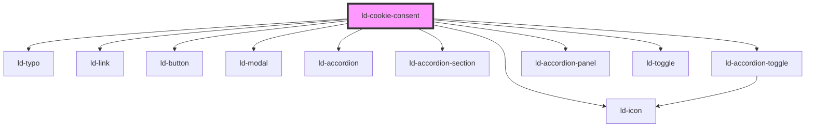

---
eleventyNavigation:
  key: Cookie Consent
  parent: Components
layout: layout.njk
title: Cookie Consent
permalink: components/ld-cookie-consent/
---

<link rel="preconnect" href="https://fonts.googleapis.com"></link>
<link rel="preconnect" href="https://fonts.gstatic.com" crossorigin></link>
<link href="https://fonts.googleapis.com/css2?family=Source+Sans+Pro:wght@400;700&display=swap" rel="stylesheet"></link>

<script>
localStorage.removeItem('ld-cookie-consent');
document.addEventListener('ldCookieConsentDisclaimerShow', function(ev) {
  document.querySelectorAll('ld-cookie-consent').forEach(function(cc) { 
    if (cc !== ev.target) {
      cc.hideDisclaimerAndPreferences()
    }
  })
})
</script>

# ld-cookie-consent

If your web application is using [HTTP cookies](https://developer.mozilla.org/en-US/docs/Web/HTTP/Cookies), you are obligated by law to comply with certain privacy and data protection regulations specific to your locality. The `ld-cookie-consent` component can help you comply with these regulations.

<ld-notice headline="Retrieving geolocation information">
  The <code>ld-cookie-consent</code> component does not retrieve any geolocation information automatically. If you want to configure the component based on the locality of the user, you will need to obtain this information yourself. We recommend using the <ld-link href="https://docs.emddigital.com/ipinfo/" target="_blank">IP Info Service</ld-link>.
</ld-notice>

---

## General usage info

The `ld-cookie-consent` Web Component is configurable using the `settings` prop. By default, the cookie consent disclaimer is shown on page load (after a short delay). However, you can disable this behavior by setting the `showOnLoad` setting to `false` and calling the `showDisclaimer` method of the component, like demonstrated in all the following examples: 


<ld-cookie-consent settings='{
  "categories": [
    {
      "title": "Necessary",
      "details": {
        "description": "These cookies are necessary for the website to operate. Our website cannot function without these cookies, and they can only be disabled by changing your browser preferences."
      },
      "toggle": {
        "value": "necessary",
        "checked": true,
        "disabled": true
      }
    },
    {
      "title": "Functional",
      "details": {
        "description": "These cookies enable the provision of advanced functionalities and are used for personalization. The cookies are set in particular in response to your actions and depend on your specific service requests (e.g., pop-up notification choices)."
      },
      "toggle": {
        "value": "functional",
        "checked": true
      }
    },
    {
      "title": "Targeting",
      "details": {
        "description": "These cookies may be set to learn more about your interests and show you relevant ads on other websites. These cookies work by uniquely identifying your browser and device. By integrating these cookies, we aim to learn more about your interests and your surfing behavior and to be able to place our advertising in a targeted manner.",
        "cookieTable": {
          "headers": [
            "Name",
            "Provider",
            "Description",
            "Lifespan"
          ],
          "rows": [
            ["_ga", "Google LLC", "Used to distinguish unique users...", "2 years"],
            ["_gat", "Google LLC", "Used to throttle the request rate...", "1 minute"]
          ]
        }
      },
      "toggle": {
        "value": "targeting",
        "checked": true
      },
      "autoclear": [
        {
          "name": "_ga",
          "domain": "example.com",
          "path": "/"
        },
        {
          "name": "_gat",
          "domain": "example.com",
          "path": "/"
        }
      ]
    }
  ],
  "privacyStatementURL": "legal/privacy/",
  "showOnLoad": false
}'></ld-cookie-consent>

<ld-button onclick="event.target.previousElementSibling.showDisclaimer()">
  Show cookie consent disclaimer
</ld-button>

<!-- React component -->

const App = () => {
  const cookieConsentRef = useRef(null)
  const cookieConsentSettings = {
    categories: [
      {
        title: 'Necessary',
        details: {
          description:
            'These cookies are necessary for the website to operate. Our website cannot function without these cookies, and they can only be disabled by changing your browser preferences.',
        },
        toggle: {
          value: 'necessary',
          checked: true,
          disabled: true,
        },
      },
      {
        title: 'Functional',
        details: {
          description:
            'These cookies enable the provision of advanced functionalities and are used for personalization. The cookies are set in particular in response to your actions and depend on your specific service requests (e.g., pop-up notification choices).',
        },
        toggle: {
          value: 'functional',
          checked: true,
        },
      },
      {
        title: 'Targeting',
        details: {
          description:
            'These cookies may be set to learn more about your interests and show you relevant ads on other websites. These cookies work by uniquely identifying your browser and device. By integrating these cookies, we aim to learn more about your interests and your surfing behavior and to be able to place our advertising in a targeted manner.',
          cookieTable: {
            headers: ['Name', 'Provider', 'Description', 'Lifespan'],
            rows: [
              [
                '_ga',
                'Google LLC',
                'Used to distinguish unique users...',
                '2 years',
              ],
              [
                '_gat',
                'Google LLC',
                'Used to throttle the request rate...',
                '1 minute',
              ],
            ],
          },
        },
        toggle: {
          value: 'targeting',
          checked: true,
        },
        autoclear: [
          {
            name: '_ga',
            domain: 'example.com',
            path: '/',
          },
          {
            name: '_gat',
            domain: 'example.com',
            path: '/',
          },
        ],
      },
    ],
    privacyStatementURL: 'legal/privacy/',
    showOnLoad: false,
  }
  
  return (
    <>
      <LdCookieConsent
        ref={cookieConsentRef}
        settings={cookieConsentSettings}
      />
      
      <LdButton onClick={(ev) => cookieConsentRef.current.showDisclaimer()}>
        Show cookie consent disclaimer
      </LdButton>
    </>
  )
}


## Modes

Three modes are supported by the `ld-cookie-consent` component:

- `'notice-only'`
- `'opt-in'` (default)
- `'opt-out'`

You may need to use a mode based on your locality and configure the component accordingly.

### Notice only

This is the "bare minimum" mode. All cookies can be set on page load. In other words, they are opted-in (pre-selected by default) and cannot be opted-out. The disclaimer includes only information about the use of cookies and a single button to close the disclaimer. There is no cookie settings modal layer in this mode.


<ld-cookie-consent settings='{
  "mode": "notice-only",
  "privacyStatementURL": "legal/privacy/",
  "showOnLoad": false
}'></ld-cookie-consent>

<ld-button onclick="event.target.previousElementSibling.showDisclaimer()">
  Show cookie consent disclaimer
</ld-button>

<!-- React component -->

const App = () => {
  const cookieConsentRef = useRef(null)
  const cookieConsentSettings = {
    mode: 'notice-only',
    privacyStatementURL: 'legal/privacy/',
    showOnLoad: false
  }

  return (
    <>
      <LdCookieConsent
        ref={cookieConsentRef}
        settings={cookieConsentSettings}
      />

      <LdButton onClick={(ev) => cookieConsentRef.current.showDisclaimer()}>
        Show cookie consent disclaimer
      </LdButton>
    </>
  )
}


### Opt-out

In this mode all cookies can be set on page load. In other words, they are opted-in (pre-selected by default) and can be opted-out by invoking the cookie settings modal layer. Accordingly, the disclaimer includes information about the use of cookies as well as buttons to either accept all cookies or modify the cookie settings.

When using this mode you must provide information about the cookie categories used in your application with the component settings.


<ld-cookie-consent settings='{
  "mode": "opt-out",
  "categories": [
    {
      "title": "Necessary",
      "details": {
        "description": "These cookies are necessary for the website to operate. Our website cannot function without these cookies, and they can only be disabled by changing your browser preferences."
      },
      "toggle": {
        "value": "necessary",
        "checked": true,
        "disabled": true
      }
    },
    {
      "title": "Functional",
      "details": {
        "description": "These cookies enable the provision of advanced functionalities and are used for personalization. The cookies are set in particular in response to your actions and depend on your specific service requests (e.g., pop-up notification choices)."
      },
      "toggle": {
        "value": "functional",
        "checked": true
      }
    },
    {
      "title": "Targeting",
      "details": {
        "description": "These cookies may be set to learn more about your interests and show you relevant ads on other websites. These cookies work by uniquely identifying your browser and device. By integrating these cookies, we aim to learn more about your interests and your surfing behavior and to be able to place our advertising in a targeted manner.",
        "cookieTable": {
          "headers": [
            "Name",
            "Provider",
            "Description",
            "Lifespan"
          ],
          "rows": [
            ["_ga", "Google LLC", "Used to distinguish unique users...", "2 years"],
            ["_gat", "Google LLC", "Used to throttle the request rate...", "1 minute"]
          ]
        }
      },
      "toggle": {
        "value": "targeting",
        "checked": true
      },
      "autoclear": [
        {
          "name": "_ga",
          "domain": "example.com",
          "path": "/"
        },
        {
          "name": "_gat",
          "domain": "example.com",
          "path": "/"
        }
      ]
    }
  ],
  "privacyStatementURL": "legal/privacy/",
  "showOnLoad": false
}'></ld-cookie-consent>

<ld-button onclick="event.target.previousElementSibling.showDisclaimer()">
  Show cookie consent disclaimer
</ld-button>

<!-- React component -->

const App = () => {
  const cookieConsentRef = useRef(null)
  const cookieConsentSettings = {
    mode: 'opt-out',
    categories: [
      {
        title: 'Necessary',
        details: {
          description:
            'These cookies are necessary for the website to operate. Our website cannot function without these cookies, and they can only be disabled by changing your browser preferences.',
        },
        toggle: {
          value: 'necessary',
          checked: true,
          disabled: true,
        },
      },
      {
        title: 'Functional',
        details: {
          description:
            'These cookies enable the provision of advanced functionalities and are used for personalization. The cookies are set in particular in response to your actions and depend on your specific service requests (e.g., pop-up notification choices).',
        },
        toggle: {
          value: 'functional',
          checked: true,
        },
      },
      {
        title: 'Targeting',
        details: {
          description:
            'These cookies may be set to learn more about your interests and show you relevant ads on other websites. These cookies work by uniquely identifying your browser and device. By integrating these cookies, we aim to learn more about your interests and your surfing behavior and to be able to place our advertising in a targeted manner.',
          cookieTable: {
            headers: ['Name', 'Provider', 'Description', 'Lifespan'],
            rows: [
              [
                '_ga',
                'Google LLC',
                'Used to distinguish unique users...',
                '2 years',
              ],
              [
                '_gat',
                'Google LLC',
                'Used to throttle the request rate...',
                '1 minute',
              ],
            ],
          },
        },
        toggle: {
          value: 'targeting',
          checked: true,
        },
        autoclear: [
          {
            name: '_ga',
            domain: 'example.com',
            path: '/',
          },
          {
            name: '_gat',
            domain: 'example.com',
            path: '/',
          },
        ],
      },
    ],
    privacyStatementURL: 'legal/privacy/',
    showOnLoad: false,
  }

  return (
    <>
      <LdCookieConsent
        ref={cookieConsentRef}
        settings={cookieConsentSettings}
      />

      <LdButton onClick={(ev) => cookieConsentRef.current.showDisclaimer()}>
        Show cookie consent disclaimer
      </LdButton>
    </>
  )
}


### Opt-in

This is the default mode. In this mode no cookie is considered accepted as long as the user hasn't given explicit consent, and you should not use any cookie nor load third party scripts which set cookies. In other words, each cookie category must be opted-in by the user by invoking the cookie settings modal layer before you can use any cookies. The disclaimer includes information about the use of cookies as well as buttons to either accept all cookies or modify the cookie settings.

When using this mode you must provide information about the cookie categories used in your application with the component settings.


<ld-cookie-consent settings='{
  "mode": "opt-in",
  "categories": [
    {
      "title": "Necessary",
      "details": {
        "description": "These cookies are necessary for the website to operate. Our website cannot function without these cookies, and they can only be disabled by changing your browser preferences."
      },
      "toggle": {
        "value": "necessary",
        "checked": true,
        "disabled": true
      }
    },
    {
      "title": "Functional",
      "details": {
        "description": "These cookies enable the provision of advanced functionalities and are used for personalization. The cookies are set in particular in response to your actions and depend on your specific service requests (e.g., pop-up notification choices)."
      },
      "toggle": {
        "value": "functional",
        "checked": true
      }
    },
    {
      "title": "Targeting",
      "details": {
        "description": "These cookies may be set to learn more about your interests and show you relevant ads on other websites. These cookies work by uniquely identifying your browser and device. By integrating these cookies, we aim to learn more about your interests and your surfing behavior and to be able to place our advertising in a targeted manner.",
        "cookieTable": {
          "headers": [
            "Name",
            "Provider",
            "Description",
            "Lifespan"
          ],
          "rows": [
            ["_ga", "Google LLC", "Used to distinguish unique users...", "2 years"],
            ["_gat", "Google LLC", "Used to throttle the request rate...", "1 minute"]
          ]
        }
      },
      "toggle": {
        "value": "targeting",
        "checked": true
      },
      "autoclear": [
        {
          "name": "_ga",
          "domain": "example.com",
          "path": "/"
        },
        {
          "name": "_gat",
          "domain": "example.com",
          "path": "/"
        }
      ]
    }
  ],
  "privacyStatementURL": "legal/privacy/",
  "showOnLoad": false
}'></ld-cookie-consent>

<ld-button onclick="event.target.previousElementSibling.showDisclaimer()">
  Show cookie consent disclaimer
</ld-button>

<!-- React component -->

const App = () => {
  const cookieConsentRef = useRef(null)
  const cookieConsentSettings = {
    mode: 'opt-in',
    categories: [
      {
        title: 'Necessary',
        details: {
          description:
            'These cookies are necessary for the website to operate. Our website cannot function without these cookies, and they can only be disabled by changing your browser preferences.',
        },
        toggle: {
          value: 'necessary',
          checked: true,
          disabled: true,
        },
      },
      {
        title: 'Functional',
        details: {
          description:
            'These cookies enable the provision of advanced functionalities and are used for personalization. The cookies are set in particular in response to your actions and depend on your specific service requests (e.g., pop-up notification choices).',
        },
        toggle: {
          value: 'functional',
          checked: true,
        },
      },
      {
        title: 'Targeting',
        details: {
          description:
            'These cookies may be set to learn more about your interests and show you relevant ads on other websites. These cookies work by uniquely identifying your browser and device. By integrating these cookies, we aim to learn more about your interests and your surfing behavior and to be able to place our advertising in a targeted manner.',
          cookieTable: {
            headers: ['Name', 'Provider', 'Description', 'Lifespan'],
            rows: [
              [
                '_ga',
                'Google LLC',
                'Used to distinguish unique users...',
                '2 years',
              ],
              [
                '_gat',
                'Google LLC',
                'Used to throttle the request rate...',
                '1 minute',
              ],
            ],
          },
        },
        toggle: {
          value: 'targeting',
          checked: true,
        },
        autoclear: [
          {
            name: '_ga',
            domain: 'example.com',
            path: '/',
          },
          {
            name: '_gat',
            domain: 'example.com',
            path: '/',
          },
        ],
      },
    ],
    privacyStatementURL: 'legal/privacy/',
    showOnLoad: false,
  }

  return (
    <>
      <LdCookieConsent
        ref={cookieConsentRef}
        settings={cookieConsentSettings}
      />

      <LdButton onClick={(ev) => cookieConsentRef.current.showDisclaimer()}>
        Show cookie consent disclaimer
      </LdButton>
    </>
  )
}


## Dismissable

You can allow the user to dismiss the cookie consent disclaimer in all modes. This will simply hide the disclaimer, without saving any consent information, and make it show up on next page load.


<ld-cookie-consent settings='{
  "dismissable": true,
  "mode": "notice-only",
  "privacyStatementURL": "legal/privacy/",
  "showOnLoad": false
}'></ld-cookie-consent>

<ld-button onclick="event.target.previousElementSibling.showDisclaimer()">
  Show cookie consent disclaimer
</ld-button>

<!-- React component -->

const App = () => {
  const cookieConsentRef = useRef(null)
  const cookieConsentSettings = {
    dismissable: true,
    mode: 'notice-only',
    privacyStatementURL: 'legal/privacy/',
    showOnLoad: false,
  }

  return (
    <>
      <LdCookieConsent
        ref={cookieConsentRef}
        settings={cookieConsentSettings}
      />

      <LdButton onClick={(ev) => cookieConsentRef.current.showDisclaimer()}>
        Show cookie consent disclaimer
      </LdButton>
    </>
  )
}


If you want to delay the next appearance of the disclaimer, you will need to listen to the `ldCookieConsentDismiss` event, persist the timestamp of the dismissal and invoke the disclaimer as soon as needed using you own application logic.

## Rejectable

You can allow rejecting all cookies from the disclaimer in opt-in and opt-out mode.


<ld-cookie-consent settings='{
  "rejectable": true,
  "mode": "opt-in",
  "privacyStatementURL": "legal/privacy/",
  "showOnLoad": false,
  "categories": [
    {
      "title": "Necessary",
      "details": {
        "description": "These cookies are necessary for the website to operate. Our website cannot function without these cookies, and they can only be disabled by changing your browser preferences."
      },
      "toggle": {
        "value": "necessary",
        "checked": true,
        "disabled": true
      }
    },
    {
      "title": "Functional",
      "details": {
        "description": "These cookies enable the provision of advanced functionalities and are used for personalization. The cookies are set in particular in response to your actions and depend on your specific service requests (e.g., pop-up notification choices)."
      },
      "toggle": {
        "value": "functional",
        "checked": true
      }
    },
    {
      "title": "Targeting",
      "details": {
        "description": "These cookies may be set to learn more about your interests and show you relevant ads on other websites. These cookies work by uniquely identifying your browser and device. By integrating these cookies, we aim to learn more about your interests and your surfing behavior and to be able to place our advertising in a targeted manner.",
        "cookieTable": {
          "headers": [
            "Name",
            "Provider",
            "Description",
            "Lifespan"
          ],
          "rows": [
            ["_ga", "Google LLC", "Used to distinguish unique users...", "2 years"],
            ["_gat", "Google LLC", "Used to throttle the request rate...", "1 minute"]
          ]
        }
      },
      "toggle": {
        "value": "targeting",
        "checked": true
      },
      "autoclear": [
        {
          "name": "_ga",
          "domain": "example.com",
          "path": "/"
        },
        {
          "name": "_gat",
          "domain": "example.com",
          "path": "/"
        }
      ]
    }
  ]
}'></ld-cookie-consent>

<ld-button onclick="event.target.previousElementSibling.showDisclaimer()">
  Show cookie consent disclaimer
</ld-button>

<!-- React component -->

const App = () => {
  const cookieConsentRef = useRef(null)
  const cookieConsentSettings = {
    rejectable: true,
    mode: 'opt-in',
    privacyStatementURL: 'legal/privacy/',
    showOnLoad: false,
    categories: [
      {
        title: 'Necessary',
        details: {
          description:
            'These cookies are necessary for the website to operate. Our website cannot function without these cookies, and they can only be disabled by changing your browser preferences.',
        },
        toggle: {
          value: 'necessary',
          checked: true,
          disabled: true,
        },
      },
      {
        title: 'Functional',
        details: {
          description:
            'These cookies enable the provision of advanced functionalities and are used for personalization. The cookies are set in particular in response to your actions and depend on your specific service requests (e.g., pop-up notification choices).',
        },
        toggle: {
          value: 'functional',
          checked: true,
        },
      },
      {
        title: 'Targeting',
        details: {
          description:
            'These cookies may be set to learn more about your interests and show you relevant ads on other websites. These cookies work by uniquely identifying your browser and device. By integrating these cookies, we aim to learn more about your interests and your surfing behavior and to be able to place our advertising in a targeted manner.',
          cookieTable: {
            headers: ['Name', 'Provider', 'Description', 'Lifespan'],
            rows: [
              [
                '_ga',
                'Google LLC',
                'Used to distinguish unique users...',
                '2 years',
              ],
              [
                '_gat',
                'Google LLC',
                'Used to throttle the request rate...',
                '1 minute',
              ],
            ],
          },
        },
        toggle: {
          value: 'targeting',
          checked: true,
        },
        autoclear: [
          {
            name: '_ga',
            domain: 'example.com',
            path: '/',
          },
          {
            name: '_gat',
            domain: 'example.com',
            path: '/',
          },
        ],
      },
    ],
  }

  return (
    <>
      <LdCookieConsent
        ref={cookieConsentRef}
        settings={cookieConsentSettings}
      />

      <LdButton onClick={(ev) => cookieConsentRef.current.showDisclaimer()}>
        Show cookie consent disclaimer
      </LdButton>
    </>
  )
}


## Listing cookie categories

Some common cookie categories are _Necessary_, _Functional_ and _Targeting_. Maybe you need less categories because you are not using that many cookies. Maybe you need more. For instance, if you need to comply with the _California Consumer Privacy Act (CCPA)_, you must include a category called _Sale of Personal Data_, provided you are using cookies of such sort. Simply add or remove categories to or from the `categories` list in the component settings.


<ld-cookie-consent settings='{
  "mode": "opt-out",
  "categories": [
    {
      "title": "Necessary",
      "details": {
        "description": "These cookies are necessary for the website to operate. Our website cannot function without these cookies, and they can only be disabled by changing your browser preferences."
      },
      "toggle": {
        "value": "necessary",
        "checked": true,
        "disabled": true
      }
    },
    {
      "title": "Functional",
      "details": {
        "description": "These cookies enable the provision of advanced functionalities and are used for personalization. The cookies are set in particular in response to your actions and depend on your specific service requests (e.g., pop-up notification choices)."
      },
      "toggle": {
        "value": "functional",
        "checked": true
      }
    },
    {
      "title": "Targeting",
      "details": {
        "description": "These cookies may be set to learn more about your interests and show you relevant ads on other websites. These cookies work by uniquely identifying your browser and device. By integrating these cookies, we aim to learn more about your interests and your surfing behavior and to be able to place our advertising in a targeted manner."
      },
      "toggle": {
        "value": "targeting",
        "checked": true
      }
    },
    {
      "title": "Sale of Personal Data",
      "details": {
        "description": "Under the California Consumer Privacy Act, you have the right to opt-out of the sale of your personal information to third parties. These cookies collect information for analytics and to personalize your experience with targeted ads. You may exercise your right to opt out of the sale of personal information by using this toggle switch. If you opt out we will not be able to offer you personalised ads and will not hand over your personal information to any third parties. Additionally, you may contact our legal department for further clarification about your rights as a California consumer by using this Exercise My Rights link."
      },
      "toggle": {
        "value": "sale_of_personal_data",
        "checked": true
      }
    }
  ],
  "privacyStatementURL": "legal/privacy/",
  "showOnLoad": false
}'></ld-cookie-consent>

<ld-button onclick="event.target.previousElementSibling.showDisclaimer()">
  Show cookie consent disclaimer
</ld-button>

<!-- React component -->

const App = () => {
  const cookieConsentRef = useRef(null)
  const cookieConsentSettings = {
    mode: 'opt-out',
    categories: [
      {
        title: 'Necessary',
        details: {
          description:
            'These cookies are necessary for the website to operate. Our website cannot function without these cookies, and they can only be disabled by changing your browser preferences.',
        },
        toggle: {
          value: 'necessary',
          checked: true,
          disabled: true,
        },
      },
      {
        title: 'Functional',
        details: {
          description:
            'These cookies enable the provision of advanced functionalities and are used for personalization. The cookies are set in particular in response to your actions and depend on your specific service requests (e.g., pop-up notification choices).',
        },
        toggle: {
          value: 'functional',
          checked: true,
        },
      },
      {
        title: 'Targeting',
        details: {
          description:
            'These cookies may be set to learn more about your interests and show you relevant ads on other websites. These cookies work by uniquely identifying your browser and device. By integrating these cookies, we aim to learn more about your interests and your surfing behavior and to be able to place our advertising in a targeted manner.',
        },
        toggle: {
          value: 'targeting',
          checked: true,
        },
      },
      {
        title: 'Sale of Personal Data',
        details: {
          description:
            'Under the California Consumer Privacy Act, you have the right to opt-out of the sale of your personal information to third parties. These cookies collect information for analytics and to personalize your experience with targeted ads. You may exercise your right to opt out of the sale of personal information by using this toggle switch. If you opt out we will not be able to offer you personalised ads and will not hand over your personal information to any third parties. Additionally, you may contact our legal department for further clarification about your rights as a California consumer by using this Exercise My Rights link.',
        },
        toggle: {
          value: 'sale_of_personal_data',
          checked: true,
        },
      },
    ],
    privacyStatementURL: 'legal/privacy/',
    showOnLoad: false,
  }

  return (
    <>
      <LdCookieConsent
        ref={cookieConsentRef}
        settings={cookieConsentSettings}
      />

      <LdButton onClick={(ev) => cookieConsentRef.current.showDisclaimer()}>
        Show cookie consent disclaimer
      </LdButton>
    </>
  )
}


## Loading scripts conditionally

When using the component in `'opt-in'` mode you may need to load scripts conditionally, based on the cookie categories enabled. You can do so by embedding scripts in your page and mapping them to cookie categories in a way, that they are not executed when parsed by the browser, but picked up and loaded later by the `ld-cookie-consent` component, as soon as the user accepts a certain cookie category. For this to work these scripts need to have their `type` set to `"text/plain"` and have the data attribute `data-ld-cookie-category` with the cookie category as the attribute value.

```html
<script type="text/plain"
        data-ld-cookie-category="targeting"
        src="track-me-if-you-can.js"
        async></script>
```

The `data-ld-cookie-category` attribute value must match the cookie category toggle value:

```js/7
{
  "mode": "opt-in",
  "categories": [
    {
      "title": "Targeting",
      "details": { ... },
      "toggle": {
        "value": "targeting",
        "checked": false
      }
    }
  ]
}
```

Alternatively, if you want to manage script loading yourself (for instance by using [Partytown](https://partytown.builder.io/)) you can do so by listening and reacting to the `ldCookieConsentSave` event.

## Clearing cookies automatically

As soon as the user opts-out from a cookie category, you should make sure all cookies which match the category are deleted. You can configure the `ld-cookie-consent` component to do exactly that. For this to work you need to provide a list of cookie information for each category you want to be auto-cleared on user opt-out.

<ld-notice headline="Note" mode="warning">
  Domain and path must match the domain and path of the original cookie.
  The component can only delete cookies that are on the domain, that it is executed from. It cannot delete cross-domain cookies.
</ld-notice>

```js/10
{
  "mode": "opt-out",
  "categories": [
    {
      "title": "Targeting",
      "details": { ... },
      "toggle": {
        "value": "targeting",
        "checked": true
      },
      "autoclear": [
        {
          "name": "_ga",
          "domain": "example.com",
          "path": "/"
        },
        {
          "name": "_gat",
          "domain": "example.com",
          "path": "/"
        }
      ]
    }
  ]
}
```

## Managing revisions

If the privacy policy has changed after the user provided consent, you may need to obtain the consent again. For that, you can increment the revision number (which is `0` by default) in the component settings. If the revision number is higher than that stored with the consent given, the cookie consent disclaimer will be displayed again.

```js/3
{
  "mode": "notice-only",
  "privacyStatementURL": "legal/privacy/",
  "revision": 1
}
```

## Layout options

You can align the cookie consent disclaimer to the left or right of the screen. By default, it is center aligned.

### Align left


<ld-cookie-consent settings='{
  "disclaimerAlignement": "left",
  "mode": "notice-only",
  "privacyStatementURL": "legal/privacy/",
  "showOnLoad": false
}'></ld-cookie-consent>

<ld-button onclick="event.target.previousElementSibling.showDisclaimer()">
  Show cookie consent disclaimer
</ld-button>

<!-- React component -->

const App = () => {
  const cookieConsentRef = useRef(null)
  const cookieConsentSettings = {
    disclaimerAlignement: 'left',
    mode: 'notice-only',
    privacyStatementURL: 'legal/privacy/',
    showOnLoad: false,
  }

  return (
    <>
      <LdCookieConsent
        ref={cookieConsentRef}
        settings={cookieConsentSettings}
      />

      <LdButton onClick={(ev) => cookieConsentRef?.current?.showDisclaimer()}>
        Show cookie consent disclaimer
      </LdButton>
    </>
  )
}


### Align right


<ld-cookie-consent settings='{
  "disclaimerAlignement": "right",
  "mode": "notice-only",
  "privacyStatementURL": "legal/privacy/",
  "showOnLoad": false
}'></ld-cookie-consent>

<ld-button onclick="event.target.previousElementSibling.showDisclaimer()">
  Show cookie consent disclaimer
</ld-button>

<!-- React component -->

const App = () => {
  const cookieConsentRef = useRef(null)
  const cookieConsentSettings = {
    disclaimerAlignement: 'right',
    mode: 'notice-only',
    privacyStatementURL: 'legal/privacy/',
    showOnLoad: false,
  }

  return (
    <>
      <LdCookieConsent
        ref={cookieConsentRef}
        settings={cookieConsentSettings}
      />

      <LdButton onClick={(ev) => cookieConsentRef?.current?.showDisclaimer()}>
        Show cookie consent disclaimer
      </LdButton>
    </>
  )
}


## Theming

You can theme the component using CSS custom properties and customize its content using available slots:


<style>
  .themed-cookie-consent {
    /* font */
    --ld-cookie-consent-font-body: 'Source Sans Pro', sans-serif;
    /* colors */
    --ld-cookie-consent-col-wht: #fff;
    --ld-cookie-consent-br-s: 0px;
    --ld-cookie-consent-br-m: 0px;
    --ld-cookie-consent-br-l: 0px;
    --ld-cookie-consent-col-neutral-010: #fafafd;
    --ld-cookie-consent-col-neutral-050: #8b919b;
    --ld-cookie-consent-col-neutral-100: #b9bdc3;
    --ld-cookie-consent-col-neutral-600: #0b182d;
    --ld-cookie-consent-col-neutral-900: #000;
    --ld-cookie-consent-thm-primary: hsl(260deg, 40%, 54%);
    --ld-cookie-consent-thm-primary-active: hsl(260deg, 40%, 34%);
    --ld-cookie-consent-thm-primary-alpha-low: hsl(260deg, 40%, 54%, 0.2);
    --ld-cookie-consent-thm-primary-alpha-lowest: hsl(260deg, 40%, 54%, 0.1);
    --ld-cookie-consent-thm-primary-focus: hsl(260deg, 40%, 64%);
    --ld-cookie-consent-thm-primary-highlight: hsl(260deg, 40%, 54%, 0.1);
    --ld-cookie-consent-thm-primary-hover: hsl(260deg, 40%, 44%);
    --ld-cookie-consent-thm-secondary: hsl(348deg, 73%, 69%);
    --ld-cookie-consent-thm-secondary-active: hsl(348deg, 73%, 49%);
    --ld-cookie-consent-thm-secondary-focus: hsl(348deg, 73%, 79%);
    --ld-cookie-consent-thm-secondary-highlight: hsl(348deg, 73%, 69%, 0.1);
    --ld-cookie-consent-thm-secondary-hover: hsl(348deg, 73%, 59%);
    /* layout */
    --ld-cookie-consent-max-inline-size: 44rem;
  }
</style>

<ld-cookie-consent class="themed-cookie-consent" settings='{
  "categories": [
    {
      "title": "Necessary",
      "details": {
        "description": "These cookies are necessary for the website to operate. Our website cannot function without these cookies, and they can only be disabled by changing your browser preferences."
      },
      "toggle": {
        "value": "necessary",
        "checked": true,
        "disabled": true
      }
    },
    {
      "title": "Functional",
      "details": {
        "description": "These cookies enable the provision of advanced functionalities and are used for personalization. The cookies are set in particular in response to your actions and depend on your specific service requests (e.g., pop-up notification choices)."
      },
      "toggle": {
        "value": "functional",
        "checked": true
      }
    },
    {
      "title": "Targeting",
      "details": {
        "description": "These cookies may be set to learn more about your interests and show you relevant ads on other websites. These cookies work by uniquely identifying your browser and device. By integrating these cookies, we aim to learn more about your interests and your surfing behavior and to be able to place our advertising in a targeted manner.",
        "cookieTable": {
          "headers": [
            "Name",
            "Provider",
            "Description",
            "Lifespan"
          ],
          "rows": [
            ["_ga", "Google LLC", "Used to distinguish unique users...", "2 years"],
            ["_gat", "Google LLC", "Used to throttle the request rate...", "1 minute"]
          ]
        }
      },
      "toggle": {
        "value": "targeting",
        "checked": true
      },
      "autoclear": [
        {
          "name": "_ga",
          "domain": "example.com",
          "path": "/"
        },
        {
          "name": "_gat",
          "domain": "example.com",
          "path": "/"
        }
      ]
    }
  ],
  "privacyStatementURL": "legal/privacy/",
  "showOnLoad": false
}'>
  <svg slot="disclaimer-logo" width="901" height="870" viewBox="0 0 901 870" fill="none" xmlns="http://www.w3.org/2000/svg"><path d="M461 174.8c133.6 0 244.8 97.4 263.5 224.8h176C881.9 176.1 692 0 461 0v174.8Zm221-70c-1.2 0-1.2 0 0 0Z" fill="#5F82FF"/><path d="M461 694.8c133.6 0 244.8-97.4 263.5-224.8h176C881.9 693.5 692 869.6 461 869.6V694.8Zm221 70c-1.2 0-1.2 0 0 0Z" fill="#EA788E"/><path d="M0 434.7c-.4 110 41 216 115.8 296.8A436 436 0 0 0 403 870V697.1A265 265 0 0 1 173 435a264.1 264.1 0 0 1 230-262.1V0a436 436 0 0 0-287 138.3A434.7 434.7 0 0 0 0 434.7Z" fill="#7959B8"/></svg>
  <svg slot="preferences-logo" width="901" height="870" viewBox="0 0 901 870" fill="none" xmlns="http://www.w3.org/2000/svg"><path d="M461 174.8c133.6 0 244.8 97.4 263.5 224.8h176C881.9 176.1 692 0 461 0v174.8Zm221-70c-1.2 0-1.2 0 0 0Z" fill="#5F82FF"/><path d="M461 694.8c133.6 0 244.8-97.4 263.5-224.8h176C881.9 693.5 692 869.6 461 869.6V694.8Zm221 70c-1.2 0-1.2 0 0 0Z" fill="#EA788E"/><path d="M0 434.7c-.4 110 41 216 115.8 296.8A436 436 0 0 0 403 870V697.1A265 265 0 0 1 173 435a264.1 264.1 0 0 1 230-262.1V0a436 436 0 0 0-287 138.3A434.7 434.7 0 0 0 0 434.7Z" fill="#7959B8"/></svg>
</ld-cookie-consent>

<ld-button onclick="event.target.previousElementSibling.showDisclaimer()">
  Show cookie consent disclaimer
</ld-button>

<!-- React component -->

const App = () => {
  const cookieConsentRef = useRef(null)
  const cookieConsentSettings = {
    categories: [
      {
        title: 'Necessary',
        details: {
          description:
            'These cookies are necessary for the website to operate. Our website cannot function without these cookies, and they can only be disabled by changing your browser preferences.',
        },
        toggle: {
          value: 'necessary',
          checked: true,
          disabled: true,
        },
      },
      {
        title: 'Functional',
        details: {
          description:
            'These cookies enable the provision of advanced functionalities and are used for personalization. The cookies are set in particular in response to your actions and depend on your specific service requests (e.g., pop-up notification choices).',
        },
        toggle: {
          value: 'functional',
          checked: true,
        },
      },
      {
        title: 'Targeting',
        details: {
          description:
            'These cookies may be set to learn more about your interests and show you relevant ads on other websites. These cookies work by uniquely identifying your browser and device. By integrating these cookies, we aim to learn more about your interests and your surfing behavior and to be able to place our advertising in a targeted manner.',
          cookieTable: {
            headers: ['Name', 'Provider', 'Description', 'Lifespan'],
            rows: [
              [
                '_ga',
                'Google LLC',
                'Used to distinguish unique users...',
                '2 years',
              ],
              [
                '_gat',
                'Google LLC',
                'Used to throttle the request rate...',
                '1 minute',
              ],
            ],
          },
        },
        toggle: {
          value: 'targeting',
          checked: true,
        },
        autoclear: [
          {
            name: '_ga',
            domain: 'example.com',
            path: '/',
          },
          {
            name: '_gat',
            domain: 'example.com',
            path: '/',
          },
        ],
      },
    ],
    privacyStatementURL: 'legal/privacy/',
    showOnLoad: false,
  }

  return (
    <>
      <LdCookieConsent
        ref={cookieConsentRef}
        settings={cookieConsentSettings}
        style={ {
          /* font */
          '--ld-cookie-consent-font-body': "'Source Sans Pro', sans-serif'",
          /* colors */
          '--ld-cookie-consent-col-wht': '#fff',
          '--ld-cookie-consent-br-s': '0px',
          '--ld-cookie-consent-br-m': '0px',
          '--ld-cookie-consent-br-l': '0px',
          '--ld-cookie-consent-col-neutral-010': '#fafafd',
          '--ld-cookie-consent-col-neutral-050': '#8b919b',
          '--ld-cookie-consent-col-neutral-100': '#b9bdc3',
          '--ld-cookie-consent-col-neutral-600': '#0b182d',
          '--ld-cookie-consent-col-neutral-900': '#000',
          '--ld-cookie-consent-thm-primary': 'hsl(260deg, 40%, 54%)',
          '--ld-cookie-consent-thm-primary-active': 'hsl(260deg, 40%, 34%)',
          '--ld-cookie-consent-thm-primary-alpha-low':
            'hsl(260deg, 40%, 54%, 0.2)',
          '--ld-cookie-consent-thm-primary-alpha-lowest':
            'hsl(260deg, 40%, 54%, 0.1)',
          '--ld-cookie-consent-thm-primary-focus': 'hsl(260deg, 40%, 64%)',
          '--ld-cookie-consent-thm-primary-highlight':
            'hsl(260deg, 40%, 54%, 0.1)',
          '--ld-cookie-consent-thm-primary-hover': 'hsl(260deg, 40%, 44%)',
          '--ld-cookie-consent-thm-secondary': 'hsl(348deg, 73%, 69%)',
          '--ld-cookie-consent-thm-secondary-active': 'hsl(348deg, 73%, 49%)',
          '--ld-cookie-consent-thm-secondary-focus': 'hsl(348deg, 73%, 79%)',
          '--ld-cookie-consent-thm-secondary-highlight':
            'hsl(348deg, 73%, 69%, 0.1)',
          '--ld-cookie-consent-thm-secondary-hover': 'hsl(348deg, 73%, 59%)',
          /* layout */
          '--ld-cookie-consent-max-inline-size': '44rem',
        } }
      >
        <svg {...{slot: 'disclaimer-logo'}} width="901" height="870" viewBox="0 0 901 870" fill="none" xmlns="http://www.w3.org/2000/svg"><path d="M461 174.8c133.6 0 244.8 97.4 263.5 224.8h176C881.9 176.1 692 0 461 0v174.8Zm221-70c-1.2 0-1.2 0 0 0Z" fill="#5F82FF"/><path d="M461 694.8c133.6 0 244.8-97.4 263.5-224.8h176C881.9 693.5 692 869.6 461 869.6V694.8Zm221 70c-1.2 0-1.2 0 0 0Z" fill="#EA788E"/><path d="M0 434.7c-.4 110 41 216 115.8 296.8A436 436 0 0 0 403 870V697.1A265 265 0 0 1 173 435a264.1 264.1 0 0 1 230-262.1V0a436 436 0 0 0-287 138.3A434.7 434.7 0 0 0 0 434.7Z" fill="#7959B8"/></svg>
        <svg {...{slot: 'preferences-logo'}} width="901" height="870" viewBox="0 0 901 870" fill="none" xmlns="http://www.w3.org/2000/svg"><path d="M461 174.8c133.6 0 244.8 97.4 263.5 224.8h176C881.9 176.1 692 0 461 0v174.8Zm221-70c-1.2 0-1.2 0 0 0Z" fill="#5F82FF"/><path d="M461 694.8c133.6 0 244.8-97.4 263.5-224.8h176C881.9 693.5 692 869.6 461 869.6V694.8Zm221 70c-1.2 0-1.2 0 0 0Z" fill="#EA788E"/><path d="M0 434.7c-.4 110 41 216 115.8 296.8A436 436 0 0 0 403 870V697.1A265 265 0 0 1 173 435a264.1 264.1 0 0 1 230-262.1V0a436 436 0 0 0-287 138.3A434.7 434.7 0 0 0 0 434.7Z" fill="#7959B8"/></svg>
      </LdCookieConsent>

      <LdButton onClick={(ev) => cookieConsentRef?.current?.showDisclaimer()}>
        Show cookie consent disclaimer
      </LdButton>
    </>
  )
}


## CSS Variables

| Variable                                       | Description                                         | Default                              |
| ---------------------------------------------- | --------------------------------------------------- | ------------------------------------ |
| `--ld-cookie-consent-br-s`                     | Small border radius                                 | `var(--ld-br-s)`                     |
| `--ld-cookie-consent-br-m`                     | Medium boder radius                                 | `var(--ld-br-m)`                     |
| `--ld-cookie-consent-br-l`                     | Large boder radius                                  | `var(--ld-br-l)`                     |
| `--ld-cookie-consent-col-neutral-010`          | Neutral color (very light)                          | `var(--ld-col-neutral-010)`          |
| `--ld-cookie-consent-col-neutral-050`          | Neutral color (light)                               | `var(--ld-col-neutral-050)`          |
| `--ld-cookie-consent-col-neutral-100`          | Neutral color                                       | `var(--ld-col-neutral-100)`          |
| `--ld-cookie-consent-col-neutral-600`          | Neutral color (dark)                                | `var(--ld-col-neutral-600)`          |
| `--ld-cookie-consent-col-neutral-900`          | Neutral color (darkest, almost black)               | `var(--ld-col-neutral-900)`          |
| `--ld-cookie-consent-col-wht`                  | White color                                         | `var(--ld-col-wht)`                  |
| `--ld-cookie-consent-font-body`                | Body font                                           | `var(--ld-font-body)`                |
| `--ld-cookie-consent-logo-size`                | Logo size of logo in disclaimer and settings header | `var(--ld-sp-32)`                    |
| `--ld-cookie-consent-max-inline-size`          | Max inline size of disclaimer and settings modal    | `38rem`                              |
| `--ld-cookie-consent-max-block-size`           | Max block size of disclaimer and settings modal     | `70rem`                              |
| `--ld-cookie-consent-min-inline-size`          | Min block size of disclaimer and settings modal     | `18rem`                              |
| `--ld-cookie-consent-thm-primary`              | Primary color                                       | `var(--ld-thm-primary)`              |
| `--ld-cookie-consent-thm-primary-active`       | Primary active color                                | `var(--ld-thm-primary-active)`       |
| `--ld-cookie-consent-thm-primary-alpha-low`    | Primary alpha low color                             | `var(--ld-thm-primary-alpha-low)`    |
| `--ld-cookie-consent-thm-primary-alpha-lowest` | Primary alpha lowest color                          | `var(--ld-thm-primary-alpha-lowest)` |
| `--ld-cookie-consent-thm-primary-focus`        | Primary focus color                                 | `var(--ld-thm-primary-focus)`        |
| `--ld-cookie-consent-thm-primary-highlight`    | Primary highlight color                             | `var(--ld-thm-primary-highlight)`    |
| `--ld-cookie-consent-thm-primary-hover`        | Primary hover color                                 | `var(--ld-thm-primary-hover)`        |
| `--ld-cookie-consent-thm-secondary`            | Secondary color                                     | `var(--ld-thm-secondary)`            |
| `--ld-cookie-consent-thm-secondary-active`     | Secondary active color                              | `var(--ld-thm-secondary-active)`     |
| `--ld-cookie-consent-thm-secondary-focus`      | Secondary focus color                               | `var(--ld-thm-secondary-focus)`      |
| `--ld-cookie-consent-thm-secondary-highlight`  | Secondary highlight color                           | `var(--ld-thm-secondary-highlight)`  |
| `--ld-cookie-consent-thm-secondary-hover`      | Secondary hover color                               | `var(--ld-thm-secondary-hover)`      |

<!-- Auto Generated Below -->


## Properties

| Property                | Attribute  | Description                                                                               | Type                                                                                                                                                                                                                                                                                                                                                                                                                                                                                                                                                                                                                                                                                                                                                                                                               | Default     |
| ----------------------- | ---------- | ----------------------------------------------------------------------------------------- | ------------------------------------------------------------------------------------------------------------------------------------------------------------------------------------------------------------------------------------------------------------------------------------------------------------------------------------------------------------------------------------------------------------------------------------------------------------------------------------------------------------------------------------------------------------------------------------------------------------------------------------------------------------------------------------------------------------------------------------------------------------------------------------------------------------------ | ----------- |
| `key`                   | `key`      | for tracking the node's identity when working with lists                                  | `string \| number`                                                                                                                                                                                                                                                                                                                                                                                                                                                                                                                                                                                                                                                                                                                                                                                                 | `undefined` |
| `ref`                   | `ref`      | reference to component                                                                    | `any`                                                                                                                                                                                                                                                                                                                                                                                                                                                                                                                                                                                                                                                                                                                                                                                                              | `undefined` |
| `settings` _(required)_ | `settings` | Component settings object to be merged with the default options (optionally stringified). | `string \| { backdropBlur?: boolean; buttonAcceptAll?: string; buttonAcceptCookies?: string; buttonAcceptNone?: string; buttonAcceptSelected?: string; buttonAcknowledge?: string; buttonDismiss?: string; buttonPreferences?: string; categories?: { autoclear?: { name: string; domain?: string; path?: string; }[]; details: { description: string; cookieTable?: { headers?: string[]; rows: string[][]; }; }; title: string; toggle: { checked?: boolean; disabled?: boolean; value: string; }; }[]; disclaimerAlignement?: "center" \| "left" \| "right"; dismissable?: boolean; localStorageKey?: string; mode?: "notice-only" \| "opt-in" \| "opt-out"; privacyStatementURL?: string; rejectable?: boolean; revision?: number; scriptSelector?: string; showOnLoad?: boolean; showOnLoadDelay?: number; }` | `undefined` |


## Events

| Event                             | Description                                                                                              | Type                                                                                                                      |
| --------------------------------- | -------------------------------------------------------------------------------------------------------- | ------------------------------------------------------------------------------------------------------------------------- |
| `ldCookieConsentActivateScripts`  | Emitted after activating scripts (only emitted if at least one script has been activated).               | `CustomEvent<undefined>`                                                                                                  |
| `ldCookieConsentAutoclearCookies` | Emitted after clearing cookies which happens after saving setting.                                       | `CustomEvent<undefined>`                                                                                                  |
| `ldCookieConsentDisclaimerShow`   | Emitted when the cookie consent disclaimer is shown.                                                     | `CustomEvent<undefined>`                                                                                                  |
| `ldCookieConsentDismiss`          | Emitted after the cookie consent disclaimer has been dismissed (no consent has been saved in this case). | `CustomEvent<undefined>`                                                                                                  |
| `ldCookieConsentPreferencesShow`  | Emitted when the cookie consent preferences modal layer is shown.                                        | `CustomEvent<undefined>`                                                                                                  |
| `ldCookieConsentSave`             | Emitted after saving cookies preferences to local storage with accepted categories.                      | `CustomEvent<{ acceptedCategories: Set<string>; consentDate: Date; rejectedCategories: Set<string>; revision: number; }>` |
| `ldCookieSavedConsentLoad`        | Emitted after loading saved consent from local storage.                                                  | `CustomEvent<{ acceptedCategories: Set<string>; consentDate: Date; rejectedCategories: Set<string>; revision: number; }>` |


## Methods

### `getAcceptedAndRejectedCategories() => Promise<{ acceptedCategories: Set<string>; rejectedCategories: Set<string>; }>`

Returns accepted categories.

#### Returns

Type: `Promise<{ acceptedCategories: Set<string>; rejectedCategories: Set<string>; }>`


### `hideDisclaimerAndPreferences() => Promise<void>`

Hides cookie consent disclaimer and preferences.

#### Returns

Type: `Promise<void>`


### `isCategoryAccepted(cookieCategory: string) => Promise<boolean>`

Returns true if cookie category has been accepted.

#### Returns

Type: `Promise<boolean>`


### `showDisclaimer(delay?: number) => Promise<void>`

Shows cookie consent disclaimer.

#### Returns

Type: `Promise<void>`


## Slots

| Slot                                  | Description                                                |
| ------------------------------------- | ---------------------------------------------------------- |
| `"disclaimer-description"`            | Slot for description in cookie consent disclaimer.         |
| `"disclaimer-logo"`                   | Slot for logo in cookie consent disclaimer.                |
| `"disclaimer-title"`                  | Slot for title in cookie consent disclaimer.               |
| `"preferences-description"`           | Slot for description in preferences modal layer.           |
| `"preferences-logo"`                  | Slot for logo in preferences modal layer.                  |
| `"preferences-privacy-policy-notice"` | Slot for privacy policy notice in preferences modal layer. |
| `"preferences-title"`                 | Slot for title in preferences modal layer.                 |


## Shadow Parts

| Part                                            | Description                                               |
| ----------------------------------------------- | --------------------------------------------------------- |
| `"disclaimer"`                                  | consent disclaimer container                              |
| `"disclaimer-button-accept-all"`                | accept all cookies button in consent disclaimer           |
| `"disclaimer-button-accept-none"`               | reject all cookies button in consent disclaimer           |
| `"disclaimer-button-dismiss"`                   | x button to hide the disclaimer until next page load      |
| `"disclaimer-button-preferences"`               | show cookie consent preferences button                    |
| `"disclaimer-buttons"`                          | consent disclaimer buttons container                      |
| `"disclaimer-description"`                      | consent disclaimer description typography element         |
| `"disclaimer-description-container"`            | consent disclaimer description container                  |
| `"disclaimer-header"`                           | disclaimer header containing logo and title               |
| `"disclaimer-logo-container"`                   | logo container in the disclaimer header                   |
| `"disclaimer-scroll-container"`                 | scrollable container in consent disclaimer                |
| `"disclaimer-title"`                            | consent disclaimer title typography element               |
| `"preferences"`                                 | the preferences modal layer                               |
| `"preferences-accordion"`                       | cookie category specific accordion                        |
| `"preferences-accordion-panel"`                 | cookie category specific accordion panel                  |
| `"preferences-accordion-section"`               | cookie category specific accordion section                |
| `"preferences-accordion-toggle"`                | cookie category specific accordion toggle                 |
| `"preferences-button-accept-all"`               | accept all button in preferences                          |
| `"preferences-button-accept-none"`              | accept none button in preferences                         |
| `"preferences-button-accept-selected"`          | accept selected button in preferences                     |
| `"preferences-buttons"`                         | preferences buttons container                             |
| `"preferences-category-description"`            | description of category specific category                 |
| `"preferences-category-table"`                  | cookie table                                              |
| `"preferences-category-table-container"`        | cookie table container                                    |
| `"preferences-category-table-td"`               | cookie table data cell                                    |
| `"preferences-category-table-th"`               | cookie table header cell                                  |
| `"preferences-category-table-tr"`               | cookie table row                                          |
| `"preferences-category-title"`                  | title of category specific category                       |
| `"preferences-category-toggle"`                 | toggle of category specific category                      |
| `"preferences-description"`                     | preferences description container                         |
| `"preferences-header"`                          | preferences header containing logo and title              |
| `"preferences-logo-container"`                  | logo container in the preferences header                  |
| `"preferences-privacy-policy-notice"`           | privacy notice in modal layer footer                      |
| `"preferences-privacy-policy-notice-container"` | container for privacy notice slot                         |
| `"preferences-title"`                           | the preferences title displayed in the modal layer header |


## Dependencies

### Depends on

- [ld-icon](../ld-icon)
- [ld-typo](../ld-typo)
- [ld-link](../ld-link)
- [ld-button](../ld-button)
- [ld-modal](../ld-modal)
- [ld-accordion](../ld-accordion)
- [ld-accordion-section](../ld-accordion/ld-accordion-section)
- [ld-accordion-toggle](../ld-accordion/ld-accordion-toggle)
- [ld-accordion-panel](../ld-accordion/ld-accordion-panel)
- [ld-toggle](../ld-toggle)

### Graph


----------------------------------------------

*Built with [StencilJS](https://stenciljs.com/)*
