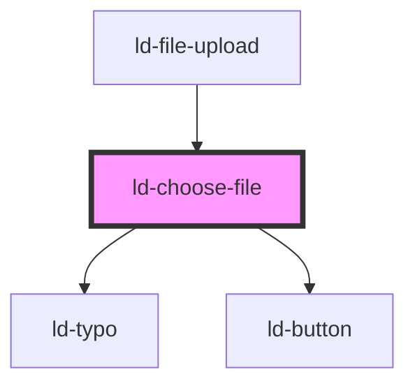

---
eleventyNavigation:
  key: Choose File
  parent: File Upload
layout: layout.njk
title: Choose File
permalink: components/ld-file-upload/ld-choose-file/
---

# ld-choose-file

The `ld-choose-file` component is used internally for the `ld-file-upload`. It is the visual part of the drag and drop area.

## Examples

### Default


<ld-choose-file></ld-choose-file>

<!-- React component -->

<!-- CSS component -->



### In file upload


<ld-choose-file size='sm'></ld-choose-file>

<!-- React component -->

<!-- CSS component -->



<!-- Auto Generated Below -->

## Properties

| Property          | Attribute          | Description                                                                                       | Type           | Default     |
| ----------------- | ------------------ | ------------------------------------------------------------------------------------------------- | -------------- | ----------- |
| `continueClicked` | `continue-clicked` | contineClicked defines whether the continue button has been clicked while startUpload = false     | `boolean`      | `false`     |
| `maxSize`         | `max-size`         | Max. file size in bytes                                                                           | `number`       | `1572864`   |
| `ref`             | `ref`              | reference to component                                                                            | `any`          | `undefined` |
| `selectMultiple`  | `select-multiple`  | selectMultiple defines whether selection of multiple input files is allowed.                      | `boolean`      | `false`     |
| `size`            | `size`             | Size of the choose file area                                                                      | `"bg" \| "sm"` | `'bg'`      |
| `startUpload`     | `start-upload`     | startUpload defines whether upload starts immediately after choosing files or after confirmation. | `boolean`      | `false`     |
| `uploadFiles`     | --                 | Chosen Files                                                                                      | `UploadItem[]` | `[]`        |
| `uploadItems`     | --                 | Chosen Files from the parent component                                                            | `UploadItem[]` | `[]`        |

## Events

| Event           | Description                                     | Type                    |
| --------------- | ----------------------------------------------- | ----------------------- |
| `ldchoosefiles` | Emitted after dropping a file in the drop area. | `CustomEvent<FileList>` |
| `lduploadclick` | Emitted on upload click.                        | `CustomEvent<any>`      |

## Dependencies

### Used by

 - [ld-file-upload](..)

### Depends on

- [ld-typo](../../ld-typo)
- [ld-button](../../ld-button)

### Graph

----------------------------------------------

*Built with [StencilJS](https://stenciljs.com/)*
