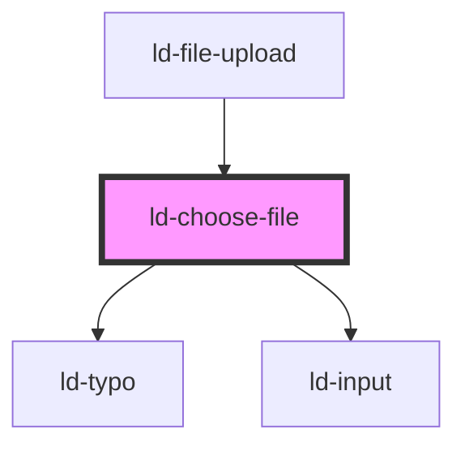

---
eleventyNavigation:
  key: Choose File
  parent: File Upload
layout: layout.njk
title: Choose File
permalink: components/ld-file-upload/ld-choose-file/
---

<link rel="stylesheet" href="css_components/ld-choose-file.css">
<link rel="stylesheet" href="css_components/ld-upload-progress.css">
<link rel="stylesheet" href="css_components/ld-upload-item.css">
<link rel="stylesheet" href="css_components/ld-icon.css">
<link rel="stylesheet" href="css_components/ld-button.css">

# ld-choose-file

The `ld-choose-file` component is used internally for the `ld-file-upload`. It is the visual part of the drag and drop area.

## Examples

### Default


<ld-choose-file></ld-choose-file>

<!-- React component -->

<!-- CSS component -->



<!-- Auto Generated Below -->

## Overview

TODO: emit files chosen event with file list, that's it.

## Properties

| Property      | Attribute  | Description                                              | Type                                                                                                                            | Default     |
| ------------- | ---------- | -------------------------------------------------------- | ------------------------------------------------------------------------------------------------------------------------------- | ----------- |
| `key`         | `key`      | for tracking the node's identity when working with lists | `string \| number`                                                                                                              | `undefined` |
| `maxSize`     | `max-size` | Max. file size in bytes                                  | `number`                                                                                                                        | `1572864`   |
| `ref`         | `ref`      | reference to component                                   | `any`                                                                                                                           | `undefined` |
| `uploadFiles` | --         | Chosen Files                                             | `{ state: "pending" \| "uploading" \| "uploaded" \| "upload failed"; fileName: string; fileSize: number; progress: number; }[]` | `[]`        |

## Events

| Event           | Description | Type                    |
| --------------- | ----------- | ----------------------- |
| `ldchoosefiles` |             | `CustomEvent<FileList>` |

## Shadow Parts

| Part     | Description                            |
| -------- | -------------------------------------- |
| `"list"` | `ul` element wrapping the default slot |

## Dependencies

### Used by

 - [ld-file-upload](..)

### Depends on

- [ld-typo](../../ld-typo)
- [ld-input](../../ld-input)

### Graph

----------------------------------------------

*Built with [StencilJS](https://stenciljs.com/)*
