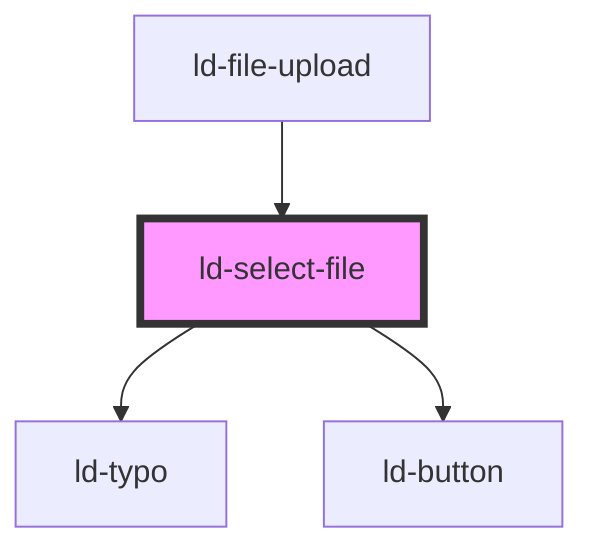

---
eleventyNavigation:
  key: Select File
  parent: File Upload
layout: layout.njk
title: Select File
permalink: components/ld-file-upload/ld-select-file/
---

# ld-select-file

The `ld-select-file` component is a subcomponent for `ld-file-upload`.

Please refer to the [`ld-file-upload` documentation](components/ld-file-upload) for usage examples.

<!-- Auto Generated Below -->

## Properties

| Property                 | Attribute                  | Description                                                                                    | Type           | Default                                                                             |
| ------------------------ | -------------------------- | ---------------------------------------------------------------------------------------------- | -------------- | ----------------------------------------------------------------------------------- |
| `compact`                | `compact`                  | Defines whether only one file can be selected and uploaded.                                    | `boolean`      | `false`                                                                             |
| `immediate`              | `immediate`                | Defines whether upload starts immediately after selecting files or after confirmation.         | `boolean`      | `false`                                                                             |
| `labelDragInstructions`  | `label-drag-instructions`  | Label to be used as a header with instructions for drag and drop or file upload.               | `string`       | ``Drag your file${     this.multiple ? '(s)' : ''   } here or browse``              |
| `labelSelectFile`        | `label-select-file`        | Label to be used for the select files button.                                                  | `string`       | ``Select ${this.multiple ? '' : 'a'} file${     this.multiple ? '(s)' : ''   }``    |
| `labelUploadConstraints` | `label-upload-constraints` | Label to be used to describe upload constraints like the maximum file size.                    | `string`       | ``${     this.maxFileSize !== undefined ? 'max. $maxFileSize file size' : ''   }``  |
| `labelUploadCount`       | `label-upload-count`       | Label to be used to count the amount of files that have been uploaded.                         | `string`       | ``$filesUploaded of $filesTotal file${     this.multiple ? 's' : ''   } uploaded.`` |
| `labelUploadFile`        | `label-upload-file`        | Label to be used for the upload files button.                                                  | `string`       | ``Upload ${this.multiple ? '' : 'a'} file${     this.multiple ? '(s)' : ''   }``    |
| `labelUploadPercentage`  | `label-upload-percentage`  | Label to be used to show the total upload percentage.                                          | `string`       | ``$uploadProgress % uploaded.``                                                     |
| `labelUploadState`       | `label-upload-state`       | Label to be used for the upload state header.                                                  | `string`       | ``Upload state:``                                                                   |
| `maxFileSize`            | `max-file-size`            | Max. file size in bytes                                                                        | `number`       | `undefined`                                                                         |
| `multiple`               | `multiple`                 | Defines whether selection of multiple input files is allowed.                                  | `boolean`      | `false`                                                                             |
| `ref`                    | `ref`                      | reference to component                                                                         | `any`          | `undefined`                                                                         |
| `showProgress`           | `show-progress`            | Defines whether the total progress of all uploading files will be shown in the progress button | `boolean`      | `false`                                                                             |
| `uploadItems`            | --                         | Selected files from the parent component                                                       | `UploadItem[]` | `[]`                                                                                |

## Events

| Event           | Description                                     | Type                    |
| --------------- | ----------------------------------------------- | ----------------------- |
| `ldselectfiles` | Emitted after dropping a file in the drop area. | `CustomEvent<FileList>` |
| `lduploadclick` | Emitted on upload click.                        | `CustomEvent<any>`      |

## Dependencies

### Used by

 - [ld-file-upload](..)

### Depends on

- [ld-typo](../../ld-typo)
- [ld-button](../../ld-button)

### Graph

----------------------------------------------

*Built with [StencilJS](https://stenciljs.com/)*
