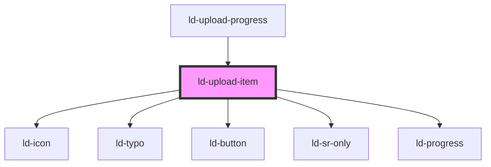

---
eleventyNavigation:
  key: Upload Item
  parent: File Upload
layout: layout.njk
title: Upload Item
permalink: components/ld-file-upload/ld-upload-item/
---

# ld-upload-item

The `ld-upload-item` component is a subcomponent for `ld-file-upload` / `ld-upload-progress` and is meant to be used in the slot of the [`ld-upload-progress`](../ld-upload-progress) component.

## Examples

### Default


<ld-upload-item file-name='Liquid' file-size='1.28'></ld-upload-item>

<!-- React component -->

<!-- CSS component -->



### Uploading


<ld-upload-item state='uploading' file-name='Liquid' file-size='1.28' progress='25'></ld-upload-item>

<!-- React component -->

<!-- CSS component -->



### Uploading interactive


<ld-upload-item state='uploading' file-name='Liquid' file-size='1.28' progress='25'></ld-upload-item>
<ld-slider value="25" max="100" width="14rem"></ld-slider>

<!-- React component -->

<!-- CSS component -->



### Uploaded


<ld-upload-item state='uploaded' file-name='Liquid' file-size='1.28'></ld-upload-item>

<!-- React component -->

<!-- CSS component -->



### Upload failed


<ld-upload-item state='upload failed' file-name='Liquid' file-size='1.28'></ld-upload-item>

<!-- React component -->

<!-- CSS component -->



<!-- Auto Generated Below -->

## Properties

| Property     | Attribute     | Description                                                             | Type                                                                                       | Default     |
| ------------ | ------------- | ----------------------------------------------------------------------- | ------------------------------------------------------------------------------------------ | ----------- |
| `fileName`   | `file-name`   | Name of the uploaded file.                                              | `string`                                                                                   | `undefined` |
| `fileSize`   | `file-size`   | Size of the uploaded file in bytes.                                     | `number`                                                                                   | `undefined` |
| `fileType`   | `file-type`   | Type of the uploaded file.                                              | `string`                                                                                   | `undefined` |
| `icons`      | --            | Maps file types to icon path                                            | `{ pdf?: string; zip?: string; jpeg?: string; txt?: string; png?: string; rtf?: string; }` | `{}`        |
| `key`        | `key`         | for tracking the node's identity when working with lists                | `string \| number`                                                                         | `undefined` |
| `ldTabindex` | `ld-tabindex` | Tab index of the progress item.                                         | `number`                                                                                   | `undefined` |
| `mode`       | `mode`        | Display mode.                                                           | `"danger" \| "highlight" \| "neutral"`                                                     | `'neutral'` |
| `previewUrl` | `preview-url` | URL of the uploaded image. Preview of image will be shown after upload. | `string`                                                                                   | `undefined` |
| `progress`   | `progress`    | Upload progress in percent.                                             | `number`                                                                                   | `0`         |
| `ref`        | `ref`         | reference to component                                                  | `any`                                                                                      | `undefined` |
| `state`      | `state`       | State of the file.                                                      | `"pending" \| "upload failed" \| "uploaded" \| "uploading"`                                | `'pending'` |

## Shadow Parts

| Part         | Description                                   |
| ------------ | --------------------------------------------- |
| `"button"`   | `ld-button` element wrapping the default slot |
| `"listitem"` | `li` element wrapping the `ld-button` element |

## Dependencies

### Used by

 - [ld-upload-progress](../ld-upload-progress)

### Depends on

- [ld-icon](../../ld-icon)
- [ld-typo](../../ld-typo)
- [ld-button](../../ld-button)
- [ld-sr-only](../../ld-sr-only)
- [ld-progress](../../ld-progress)

### Graph

----------------------------------------------

*Built with [StencilJS](https://stenciljs.com/)*
