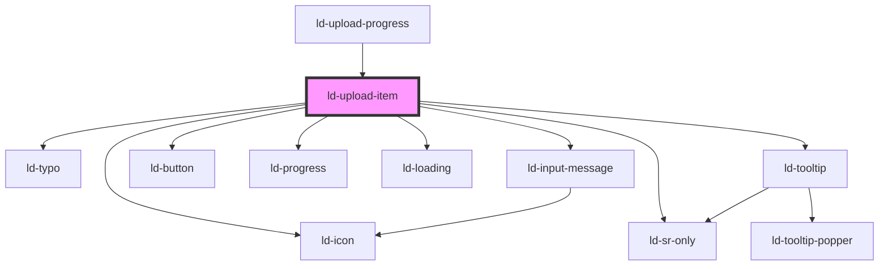

---
eleventyNavigation:
  key: Upload Item
  parent: File Upload
layout: layout.njk
title: Upload Item
permalink: components/ld-file-upload/ld-upload-item/
---

# ld-upload-item

The `ld-upload-item` component is a subcomponent for `ld-file-upload` / `ld-upload-progress`.

Please refer to the [`ld-file-upload` documentation](components/ld-file-upload) for usage examples.

<!-- Auto Generated Below -->

## Properties

| Property               | Attribute                | Description                                                                                                     | Type                                                                                   | Default      |
| ---------------------- | ------------------------ | --------------------------------------------------------------------------------------------------------------- | -------------------------------------------------------------------------------------- | ------------ |
| `allowPause`           | `allow-pause`            | allowPause defines whether the user will be able to pause uploads.                                              | `boolean`                                                                              | `undefined`  |
| `file`                 | --                       | File of type File.                                                                                              | `File`                                                                                 | `undefined`  |
| `fileName`             | `file-name`              | Name of the uploaded file.                                                                                      | `string`                                                                               | `undefined`  |
| `fileSize`             | `file-size`              | Size of the uploaded file in bytes.                                                                             | `number`                                                                               | `undefined`  |
| `fileType`             | `file-type`              | Type of the uploaded file.                                                                                      | `string`                                                                               | `undefined`  |
| `labelTooltipDelete`   | `label-tooltip-delete`   | Label to be used for the tooltip of the delete button.                                                          | `string`                                                                               | ``Delete``   |
| `labelTooltipDownload` | `label-tooltip-download` | Label to be used for the tooltip of the download button.                                                        | `string`                                                                               | ``Download`` |
| `labelTooltipRemove`   | `label-tooltip-remove`   | Label to be used for the tooltip of the remove button.                                                          | `string`                                                                               | ``Remove``   |
| `labelTooltipRetry`    | `label-tooltip-retry`    | Label to be used for the tooltip of the retry button.                                                           | `string`                                                                               | ``Retry``    |
| `ldTabindex`           | `ld-tabindex`            | Tab index of the progress item.                                                                                 | `number`                                                                               | `undefined`  |
| `progress`             | `progress`               | Upload progress in percent.                                                                                     | `number`                                                                               | `0`          |
| `ref`                  | `ref`                    | reference to component                                                                                          | `any`                                                                                  | `undefined`  |
| `showProgress`         | `show-progress`          | showTotalProgress defines whether the total progress of all upoading files will be shown in the progress button | `boolean`                                                                              | `false`      |
| `state`                | `state`                  | State of the file.                                                                                              | `"cancelled" \| "paused" \| "pending" \| "upload failed" \| "uploaded" \| "uploading"` | `'pending'`  |
| `uploadItems`          | --                       | List of files                                                                                                   | `UploadItem[]`                                                                         | `[]`         |

## Dependencies

### Used by

 - [ld-upload-progress](../ld-upload-progress)

### Depends on

- [ld-icon](../../ld-icon)
- [ld-typo](../../ld-typo)
- [ld-tooltip](../../ld-tooltip)
- [ld-button](../../ld-button)
- [ld-sr-only](../../ld-sr-only)
- [ld-progress](../../ld-progress)
- [ld-loading](../../ld-loading)
- [ld-input-message](../../ld-input-message)

### Graph

----------------------------------------------

*Built with [StencilJS](https://stenciljs.com/)*
