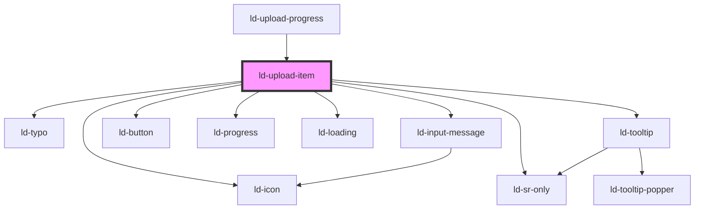

---
eleventyNavigation:
  key: Upload Item
  parent: File Upload
layout: layout.njk
title: Upload Item
permalink: components/ld-file-upload/ld-upload-item/
---

# ld-upload-item

The `ld-upload-item` component is a subcomponent for `ld-file-upload` / `ld-upload-progress` and is meant to be used in the slot of the [`ld-upload-progress`](../ld-upload-progress) component.

## Examples

### Default / Pending


<ld-upload-item file-name='Liquid' file-size='1.28'></ld-upload-item>

<!-- React component -->

<!-- CSS component -->



#### Show progress


<ld-upload-item show-progress file-name='Liquid' file-size='1.28'></ld-upload-item>

<!-- React component -->

<!-- CSS component -->



### Paused


<ld-upload-item allow-pause state='paused' file-name='Liquid' file-size='1.28' progress='25'></ld-upload-item>

<!-- React component -->

<!-- CSS component -->



#### Show progress


<ld-upload-item show-progress state='paused' file-name='Liquid' file-size='1.28' progress='25'></ld-upload-item>

<!-- React component -->

<!-- CSS component -->



### Cancelled


<ld-upload-item state='cancelled' file-name='Liquid' file-size='1.28' progress='25'></ld-upload-item>

<!-- React component -->

<!-- CSS component -->



### Uploading


<ld-upload-item state='uploading' file-name='Liquid' file-size='1.28' progress='25'></ld-upload-item>

<!-- React component -->

<!-- CSS component -->



#### Allow pause


<ld-upload-item allow-pause state='uploading' file-name='Liquid' file-size='1.28' progress='25'></ld-upload-item>

<!-- React component -->

<!-- CSS component -->



### Uploading interactive


<ld-upload-item show-progress state='uploading' file-name='Liquid' file-size='1.28' progress='25'></ld-upload-item>
<ld-slider value="25" max="100" width="14rem"></ld-slider>

<!-- React component -->

<!-- CSS component -->



### Uploaded


<ld-upload-item state='uploaded' file-name='Liquid' file-size='1.28'></ld-upload-item>

<!-- React component -->

<!-- CSS component -->



### Upload failed


<ld-upload-item state='upload failed' file-name='Liquid' file-size='1.28'></ld-upload-item>

<!-- React component -->

<!-- CSS component -->



<!-- Auto Generated Below -->

## Properties

| Property       | Attribute       | Description                                                                                                     | Type                                                                                   | Default     |
| -------------- | --------------- | --------------------------------------------------------------------------------------------------------------- | -------------------------------------------------------------------------------------- | ----------- |
| `allowPause`   | `allow-pause`   | allowPause defines whether the user will be able to pause uploads.                                              | `boolean`                                                                              | `undefined` |
| `fileName`     | `file-name`     | Name of the uploaded file.                                                                                      | `string`                                                                               | `undefined` |
| `fileSize`     | `file-size`     | Size of the uploaded file in bytes.                                                                             | `number`                                                                               | `undefined` |
| `fileType`     | `file-type`     | Type of the uploaded file.                                                                                      | `string`                                                                               | `undefined` |
| `ldTabindex`   | `ld-tabindex`   | Tab index of the progress item.                                                                                 | `number`                                                                               | `undefined` |
| `progress`     | `progress`      | Upload progress in percent.                                                                                     | `number`                                                                               | `0`         |
| `ref`          | `ref`           | reference to component                                                                                          | `any`                                                                                  | `undefined` |
| `showProgress` | `show-progress` | showTotalProgress defines whether the total progress of all upoading files will be shown in the progress button | `boolean`                                                                              | `false`     |
| `state`        | `state`         | State of the file.                                                                                              | `"cancelled" \| "paused" \| "pending" \| "upload failed" \| "uploaded" \| "uploading"` | `'pending'` |

## Dependencies

### Used by

 - [ld-upload-progress](../ld-upload-progress)

### Depends on

- [ld-icon](../../ld-icon)
- [ld-typo](../../ld-typo)
- [ld-tooltip](../../ld-tooltip)
- [ld-button](../../ld-button)
- [ld-sr-only](../../ld-sr-only)
- [ld-progress](../../ld-progress)
- [ld-loading](../../ld-loading)
- [ld-input-message](../../ld-input-message)

### Graph

----------------------------------------------

*Built with [StencilJS](https://stenciljs.com/)*
