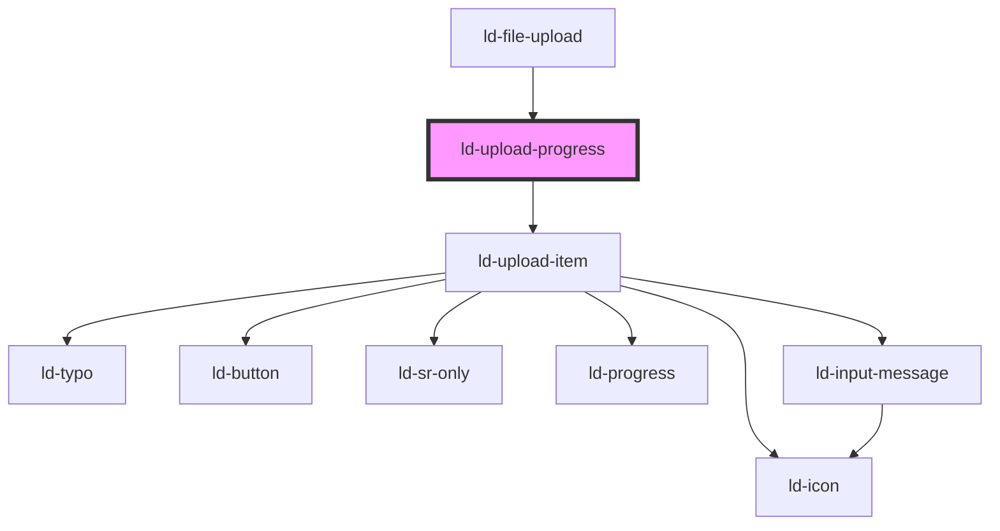

---
eleventyNavigation:
  key: Upload Progress
  parent: File Upload
layout: layout.njk
title: Upload Progress
permalink: components/ld-file-upload/ld-upload-progress/
---

# ld-upload-progress

The `ld-upload-progress` component is a subcomponent for `ld-file-upload`.

Please refer to the [`ld-file-upload` documentation](components/ld-file-upload) for usage examples.

<!-- Auto Generated Below -->

## Properties

| Property                  | Attribute                    | Description                                                                                   | Type           | Default                                    |
| ------------------------- | ---------------------------- | --------------------------------------------------------------------------------------------- | -------------- | ------------------------------------------ |
| `allowPause`              | `allow-pause`                | Defines whether the user will be able to pause uploads.                                       | `boolean`      | `undefined`                                |
| `immediate`               | `immediate`                  | Defines whether upload starts immediately after choosing files or after confirmation.         | `boolean`      | `false`                                    |
| `labelDelete`             | `label-delete`               | Label to be used for the tooltip of the delete button.                                        | `string`       | ``Delete``                                 |
| `labelDownload`           | `label-download`             | Label to be used for the tooltip of the download button.                                      | `string`       | ``Download``                               |
| `labelRemove`             | `label-remove`               | Label to be used for the tooltip of the remove button.                                        | `string`       | ``Remove``                                 |
| `labelRetry`              | `label-retry`                | Label to be used for the tooltip of the retry button.                                         | `string`       | ``Retry``                                  |
| `labelUploadCancelledMsg` | `label-upload-cancelled-msg` | Label to be used for upload cancelled message.                                                | `string`       | ``Upload of this file has been cancelled`` |
| `labelUploadErrorMsg`     | `label-upload-error-msg`     | Label to be used for upload error message.                                                    | `string`       | ``Error! Upload was unsuccessful``         |
| `labelUploadSuccessMsg`   | `label-upload-success-msg`   | Label to be used for upload success message.                                                  | `string`       | ``Upload was successful!``                 |
| `ref`                     | `ref`                        | reference to component                                                                        | `any`          | `undefined`                                |
| `showProgress`            | `show-progress`              | Defines whether the total progress of all upoading files will be shown in the progress button | `boolean`      | `false`                                    |
| `uploadItems`             | --                           | List of files                                                                                 | `UploadItem[]` | `[]`                                       |

## Dependencies

### Used by

 - [ld-file-upload](..)

### Depends on

- [ld-upload-item](../ld-upload-item)

### Graph

----------------------------------------------

*Built with [StencilJS](https://stenciljs.com/)*
