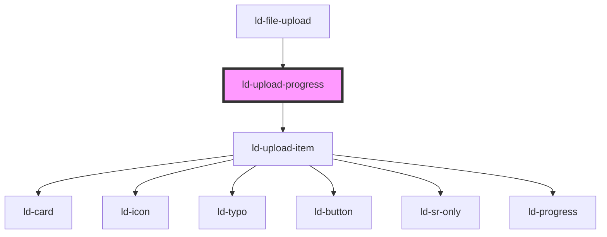

---
eleventyNavigation:
  key: Upload Progress
  parent: File Upload
layout: layout.njk
title: Upload Progress
permalink: components/ld-file-upload/ld-upload-progress/
---

<link rel="stylesheet" href="css_components/ld-upload-progress.css">
<link rel="stylesheet" href="css_components/ld-upload-item.css">
<link rel="stylesheet" href="css_components/ld-icon.css">
<link rel="stylesheet" href="css_components/ld-button.css">

# ld-upload-progress

The `ld-upload-progress` component is used internally for the `ld-file-upload`. It is the visual part of the list of files and their current upload progress.

## Examples

### Default


<ld-upload-progress start-upload='false'>
<ld-upload-item state='pending' file-name='Liquid' file-size='1.28'></ld-upload-item>
<ld-upload-item file-name='Liquid' file-size='1.28'></ld-upload-item>
<ld-upload-item file-name='Liquid' file-size='1.28'></ld-upload-item>
<ld-upload-item file-name='Liquid' file-size='1.28'></ld-upload-item>
</ld-upload-progress>

<!-- React component -->

<!-- CSS component -->



<!-- Auto Generated Below -->

## Properties

| Property      | Attribute      | Description                                                                                       | Type               | Default                                                                                                                                                                                                                             |
| ------------- | -------------- | ------------------------------------------------------------------------------------------------- | ------------------ | ----------------------------------------------------------------------------------------------------------------------------------------------------------------------------------------------------------------------------------- |
| `key`         | `key`          | for tracking the node's identity when working with lists                                          | `string \| number` | `undefined`                                                                                                                                                                                                                         |
| `ref`         | `ref`          | reference to component                                                                            | `any`              | `undefined`                                                                                                                                                                                                                         |
| `size`        | `size`         | Size of the context menu.                                                                         | `"lg" \| "sm"`     | `undefined`                                                                                                                                                                                                                         |
| `startUpload` | `start-upload` | startUpload defines whether upload starts immediately after choosing files or after confirmation. | `boolean`          | `false`                                                                                                                                                                                                                             |
| `uploadItems` | --             |                                                                                                   | `UploadItem[]`     | `[     {       state: 'pending',       fileName: 'file1.png',       fileSize: 100000,       progress: 0,     },     {       state: 'uploading',       fileName: 'file2.png',       fileSize: 200000,       progress: 0,     },   ]` |

## Shadow Parts

| Part     | Description                            |
| -------- | -------------------------------------- |
| `"list"` | `ul` element wrapping the default slot |

## Dependencies

### Used by

 - [ld-file-upload](..)

### Depends on

- [ld-upload-item](../ld-upload-item)

### Graph

----------------------------------------------

*Built with [StencilJS](https://stenciljs.com/)*
