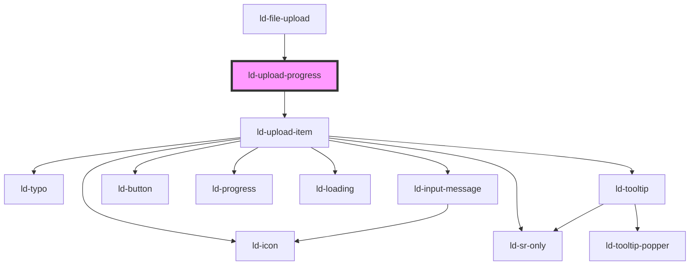

---
eleventyNavigation:
  key: Upload Progress
  parent: File Upload
layout: layout.njk
title: Upload Progress
permalink: components/ld-file-upload/ld-upload-progress/
---

# ld-upload-progress

The `ld-upload-progress` component is used internally for the `ld-file-upload`. It is the visual part of the list of files and their current upload progress.

## Examples

### Default


<ld-upload-progress start-upload='false'>
<ld-upload-item state='pending' file-name='Liquid' file-size='1.28'></ld-upload-item>
<ld-upload-item file-name='Liquid' file-size='1.28'></ld-upload-item>
<ld-upload-item file-name='Liquid' file-size='1.28'></ld-upload-item>
<ld-upload-item file-name='Liquid' file-size='1.28'></ld-upload-item>
</ld-upload-progress>

<!-- React component -->

<!-- CSS component -->



<!-- Auto Generated Below -->

## Properties

| Property       | Attribute       | Description                                                                                                     | Type                                                                                       | Default     |
| -------------- | --------------- | --------------------------------------------------------------------------------------------------------------- | ------------------------------------------------------------------------------------------ | ----------- |
| `allowPause`   | `allow-pause`   | allowPause defines whether the user will be able to pause uploads.                                              | `boolean`                                                                                  | `undefined` |
| `icons`        | --              | Maps file types to icon path                                                                                    | `{ pdf?: string; zip?: string; jpeg?: string; txt?: string; png?: string; rtf?: string; }` | `undefined` |
| `ref`          | `ref`           | reference to component                                                                                          | `any`                                                                                      | `undefined` |
| `showProgress` | `show-progress` | showTotalProgress defines whether the total progress of all upoading files will be shown in the progress button | `boolean`                                                                                  | `false`     |
| `size`         | `size`          | Size of the context menu.                                                                                       | `"lg" \| "sm"`                                                                             | `undefined` |
| `startUpload`  | `start-upload`  | startUpload defines whether upload starts immediately after choosing files or after confirmation.               | `boolean`                                                                                  | `false`     |
| `uploadItems`  | --              | List of files                                                                                                   | `UploadItem[]`                                                                             | `[]`        |

## Dependencies

### Used by

 - [ld-file-upload](..)

### Depends on

- [ld-upload-item](../ld-upload-item)

### Graph

----------------------------------------------

*Built with [StencilJS](https://stenciljs.com/)*
