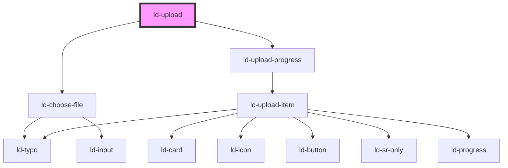

---
eleventyNavigation:
  key: Upload
  parent: File Upload
layout: layout.njk
title: Upload
permalink: components/ld-file-upload/ld-file-upload/
---

<link rel="stylesheet" href="css_components/ld-upload.css">
<link rel="stylesheet" href="css_components/ld-choose-file.css">
<link rel="stylesheet" href="css_components/ld-upload-progress.css">
<link rel="stylesheet" href="css_components/ld-upload-item.css">

# ld-upload

The `ld-upload` component can be used to upload files.

## Examples

### Default


<ld-upload></ld-upload>

<!-- React component -->

<!-- CSS component -->



<!-- Auto Generated Below -->

## Properties

| Property | Attribute | Description                                              | Type               | Default     |
| -------- | --------- | -------------------------------------------------------- | ------------------ | ----------- |
| `key`    | `key`     | for tracking the node's identity when working with lists | `string \| number` | `undefined` |
| `ref`    | `ref`     | reference to component                                   | `any`              | `undefined` |

## Shadow Parts

| Part     | Description                            |
| -------- | -------------------------------------- |
| `"list"` | `ul` element wrapping the default slot |

## Dependencies

### Depends on

- [ld-choose-file](../ld-choose-file)
- [ld-upload-progress](../ld-upload-progress)

### Graph

----------------------------------------------

*Built with [StencilJS](https://stenciljs.com/)*
