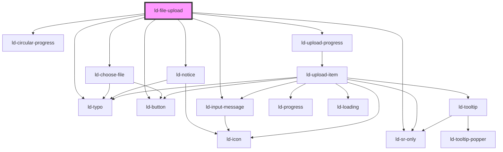

---
eleventyNavigation:
  key: File Upload
  parent: Components
layout: layout.njk
title: File Upload
permalink: components/ld-file-upload/
---

# ld-file-upload

File upload allows the user to upload files.

## Examples

### Default

In default mode, files to be uploaded can be chosen in multiple steps but upload can only be started once on start upload click.


<ld-file-upload></ld-file-upload>

<!-- React component -->
<LdFileUpload />

<!-- CSS component -->



#### State management:

State management such as changing the upload state or progress of a file has to be done by the user. Every event emits a an upload item (`UploadItem = {
  state:
    | 'pending'
    | 'paused'
    | 'cancelled'
    | 'uploading'
    | 'uploaded'
    | 'upload failed'
  fileName: string
  fileSize: number
  fileType: string
  progress: number
  file: File
}`) or an array of upload items. For each event, the states need to be changed using methods.

Unless the width of the component is specified, it will adjust to the available space depending on its content.


<ld-file-upload>
</ld-file-upload>

<!-- React component -->

<!-- <LdFileUpload
onLdchoosefiles={async (ev) => {
uploadItems = ev.detail
ldUpload.updateUploadItems(uploadItems)
}}

onLdfileuploadready={async (ev) => {
uploadItems = ev.detail
uploadingItems = []
for (let item in uploadItems) {
newItem = uploadItems[item]
newItem.state = 'uploading'
uploadingItems.push(newItem)
ldUpload.updateUploadItem(newItem)
}
}}

onLduploaditempause={async (ev) => {
uploadItem = ev.detail
uploadItem.state = 'paused'
ldUpload.updateUploadItem(uploadItem)
}}

onLduploaditemcontinue={async (ev) => {
uploadItem = ev.detail
uploadItem.state = 'uploading'
ldUpload.updateUploadItem(uploadItem)
}}

onLduploaditemremove={async (ev) => {
uploadItem = ev.detail
uploadItem.state = 'cancelled'
ldUpload.updateUploadItem(uploadItem)
}}

onLduploaditemdelete={async (ev) => {
uploadItem = ev.detail
ldUpload.deleteUploadItem(uploadItem)
}}

onLduploaditemdeleteall={async (ev) => {
ldUpload.deleteUploadItems()
}}

onLdfileuploadpausealluploads={async (ev) => {
uploadItems = ev.detail
for (let item in uploadItems) {
newItem = uploadItems[item]
newItem.state = 'paused'
ldUpload.updateUploadItem(newItem)
}}}

onLdfileuploadcontinueuploads={async (ev) => {
uploadItems = ev.detail
for (let item in uploadItems) {
newItem = uploadItems[item]
newItem.state = 'uploading'
ldUpload.updateUploadItem(newItem)
}
}}

/> -->

<!-- CSS component -->



#### Upload with XMLHttpRequest

Files to be uploaded can be accessed through the `file` property of the UploadItem objects emitted on `ldfileuploadready`. XMLHttpRequest can be used to update the upload progress in the component.


<ld-file-upload select-multiple show-progress style="width: 30rem">
</ld-file-upload>

<!-- style="width: 30rem, height: 50rem"> -->

<!-- React component -->

<!-- CSS component -->



#### Upload with XMLHttpRequest with random success

This is just for testing. Upload success is overwritten with a random true/false value to test the retry feature.


<ld-file-upload select-multiple show-progress style="width: 30rem">
</ld-file-upload>

<!-- React component -->

<!-- CSS component -->



#### Upload with XMLHttpRequest, starting upload immediately


<ld-file-upload select-multiple show-progress start-upload style="width: 30rem">
</ld-file-upload>

<!-- style="width: 30rem, height: 50rem"> -->

<!-- React component -->

<!-- CSS component -->



#### Upload with XMLHttpRequest with circular progress


<ld-file-upload select-multiple show-progress circular-progress style="width: 30rem">
</ld-file-upload>

<!-- style="width: 30rem, height: 50rem"> -->

<!-- React component -->

<!-- CSS component -->



#### Fake Upload

Fake upload, just for testing. Can be removed from the documentation.


<ld-file-upload select-multiple>
</ld-file-upload>

<!-- React component -->

<!-- CSS component -->



### Circular progress

Mode in which only a circular progress representation of the total upload progress is shown instead of seperade progess items for all files.


<ld-file-upload select-multiple circular-progress>
</ld-file-upload>

<!-- React component -->

<!-- CSS component -->



#### Circular progress with max size


<ld-file-upload select-multiple circular-progress max-size=500>
</ld-file-upload>

<!-- React component -->

<!-- CSS component -->



### Start upload immediately after choosing files

In `start-upload` mode, upload of files will start immediately after the files are chosen.


<ld-file-upload start-upload></ld-file-upload>

<!-- React component -->

<!-- CSS component -->



#### Start upload immediately after choosing files with max size


<ld-file-upload start-upload max-size=500></ld-file-upload>

<!-- React component -->

<!-- CSS component -->



### Allow pause

In `allow-pause` mode, the upload of all files can be paused (and continued) on pause all files click.


<ld-file-upload allow-pause>
</ld-file-upload>

<!-- React component -->

<!-- CSS component -->



### Show progress

In `show-progress` mode, a progress bar representing the upload progress of a file will be shown.


<ld-file-upload show-progress>
</ld-file-upload>

<!-- React component -->

<!-- CSS component -->



### Select multiple


<ld-file-upload select-multiple>
</ld-file-upload>

<!-- React component -->

<!-- CSS component -->



### Max size


<ld-file-upload max-size=500>
</ld-file-upload>

<!-- React component -->

<!-- CSS component -->



#### Max size with custom text


<ld-file-upload max-size=500 label-upload-constraints='File size must be smaller than $maxSize'>
</ld-file-upload>

<!-- React component -->

<!-- CSS component -->



### Custom icons

Custom icons for specific file types can be added to the icons slot.


<ld-file-upload>

<ld-icon slot='icons' data-upload-icon='application/pdf' name='pdf' size='lg'></ld-icon>

<!-- <ld-icon data-upload-icon='text/rtf' name='placeholder'></ld-icon> -->
<!--  -->
</ld-file-upload>

<!-- React component -->

<!-- CSS component -->



### German

Example for changing the language of the component to German by using the test labels.


<ld-file-upload max-size=500
label-drag-instructions="Dateien hierher ziehen oder auswählen"
label-upload-constraints="max. Dateigröße: $maxSize"
label-select-file="Dateien auswählen"
label-upload-file="Dateien hochladen"
label-upload-state="Upload Status:"
label-upload-count="$filesUploaded von $filesTotal Dateien wurden hochgeladen."
label-upload-percentage="$uploadProgress % hochgeladen."
label-start-upload="Upload beginnen"
label-uploading="Dateien werden hochgeladen"
label-upload-completed="Upload abgeschlossen"
label-delete-all-files="Alle Dateien löschen"
label-pause-all-uploads="Alle Uploads pausieren"
label-continue-paused-uploads="Pausierte Uploads fortführen"
label-error-header="Ein Fehler ist aufgetreten"
label-file-already-chosen-error="$duplicateFiles können nicht ausgewählt werden, da Dateien mit den gleichen Namen bereits ausgewählt wurden. Um diese Dateien dennoch hochzuladen müssen die Dateien mit den gleichen Namen entfernt werden."
label-max-size-exceeded-error="$filesExceedingMaxSize können nicht ausgewählt werden, da die Dateien die maximale Dateigröße überschreiten."
label-c-p-upload-count="$filesUploading Dateien werden hochgeladen"
label-c-p-uploaded-size="$uploadedSize hochgeladen..."
label-c-p-cancel="Abbrechen"
label-tooltip-remove="Entfernen"
label-tooltip-download="Herunterladen"
label-tooltip-retry="Erneut versuchen"
label-tooltip-delete="Löschen">
</ld-file-upload>

<!-- React component -->

<!-- CSS component -->



### Combined examples


<ld-file-upload allow-pause select-multiple icons='{"rtf": "{{ env.base }}/{{ buildstamp }}assets/examples/file-upload-jpeg.svg"}'>

<ld-icon slot='icons' data-upload-icon='application/pdf' name='pdf' size='lg'></ld-icon>

<!-- <ld-icon data-upload-icon='text/rtf' name='placeholder'></ld-icon> -->

</ld-file-upload>

<!-- style="width: 30rem" -->

<!-- React component -->

<!-- CSS component -->



### Examples with mock files


<ld-file-upload circular-progress allow-pause=false show-progress icons='{"pdf": "documents"}'></ld-file-upload>

<ld-button>Click</ld-button>

<!-- React component -->

<!-- CSS component -->




<ld-file-upload start-upload></ld-file-upload>

<ld-button>Click</ld-button>

<!-- React component -->

<!-- CSS component -->



#### Default example with mock files


<ld-file-upload>
</ld-file-upload>

<ld-button>Click</ld-button>

<!-- React component -->

<!-- CSS component -->



#### Circular progress example with mock files


<ld-file-upload circular-progress>
</ld-file-upload>

<ld-button>Click</ld-button>

<!-- React component -->

<!-- CSS component -->



<!-- Auto Generated Below -->

## Overview

File upload:
  - listen for files chosen event (from ld-choose-file.tsx) with file list
    -> emit upload ready event (if startUpload prop is set to true)
  - listen for click event of continue button and emit upload ready event (if startUpload prop is set to false)
  - The upload ready event contains the file list as its payload

## Properties

| Property                      | Attribute                         | Description                                                                                                      | Type      | Default                                                                                                                                                                                                                                                                                                                                                                  |
| ----------------------------- | --------------------------------- | ---------------------------------------------------------------------------------------------------------------- | --------- | ------------------------------------------------------------------------------------------------------------------------------------------------------------------------------------------------------------------------------------------------------------------------------------------------------------------------------------------------------------------------ |
| `allowPause`                  | `allow-pause`                     | allowPause defines whether the user will be able to pause uploads.                                               | `boolean` | `false`                                                                                                                                                                                                                                                                                                                                                                  |
| `circularProgress`            | `circular-progress`               | circularProgress defines whether only the circular progress indicator will be shown during upload.               | `boolean` | `false`                                                                                                                                                                                                                                                                                                                                                                  |
| `dirname`                     | `dirname`                         | Name of form field to use for sending the element's directionality in form submission.                           | `string`  | `undefined`                                                                                                                                                                                                                                                                                                                                                              |
| `form`                        | `form`                            | Associates the control with a form element.                                                                      | `string`  | `undefined`                                                                                                                                                                                                                                                                                                                                                              |
| `labelCPCancel`               | `label-c-p-cancel`                | Label to be used for the cancel button in circular progress mode.                                                | `string`  | ``Cancel``                                                                                                                                                                                                                                                                                                                                                               |
| `labelCPUploadCount`          | `label-c-p-upload-count`          | Label to be used to count th uploaded files in circular progress mode.                                           | `string`  | ``Uploading $filesUploading file${     this.selectMultiple ? 's' : ''   }``                                                                                                                                                                                                                                                                                              |
| `labelCPUploadedSize`         | `label-c-p-uploaded-size`         | Label to be used to show the total uploaded file size in circular progress mode.                                 | `string`  | ``$uploadedSize uploaded...``                                                                                                                                                                                                                                                                                                                                            |
| `labelContinuePausedUploads`  | `label-continue-paused-uploads`   | Label to be used for the continue paused uploads button.                                                         | `string`  | ``Continue paused uploads``                                                                                                                                                                                                                                                                                                                                              |
| `labelDeleteAllFiles`         | `label-delete-all-files`          | Label to be used for the delete all files button.                                                                | `string`  | ``Delete all files``                                                                                                                                                                                                                                                                                                                                                     |
| `labelDragInstructions`       | `label-drag-instructions`         | Label to be used as a header with instructions for drag and drop or file upload.                                 | `string`  | ``Drag your file${     this.selectMultiple ? '(s)' : ''   } here or browse``                                                                                                                                                                                                                                                                                             |
| `labelErrorHeader`            | `label-error-header`              | Label to be used for the header of error messages.                                                               | `string`  | ``An error occurred``                                                                                                                                                                                                                                                                                                                                                    |
| `labelFileAlreadyChosenError` | `label-file-already-chosen-error` | Label to be used for the error message that is shown if a file that has already been chosen is selected again.   | `string`  | ``$duplicateFiles cannot be chosen since ${     this.cannotBeChosen.length > 1       ? 'cannot be chosen since files with the same names have been chosen already. To upload these files please remove the files with the same names.'       : 'a file with the same name has been chosen already. To upload this file please remove the file with the same name.'   }`` |
| `labelMaxSizeExceededError`   | `label-max-size-exceeded-error`   | Label to be used for the error message that is shown if chosen file exceeds the maximum file size.               | `string`  | ``$filesExceedingMaxSize cannot be chosen since ${     this.exceedMaxSize.length > 1       ? 'the files exceed the maximum file size.'       : 'the file exceeds the maximum file size.'   }``                                                                                                                                                                           |
| `labelPauseAllUploads`        | `label-pause-all-uploads`         | Label to be used for the pause all uploads button.                                                               | `string`  | ``Pause all uploads``                                                                                                                                                                                                                                                                                                                                                    |
| `labelSelectFile`             | `label-select-file`               | Label to be used for the select files button.                                                                    | `string`  | ``Select ${this.selectMultiple ? '' : 'a'} file${     this.selectMultiple ? '(s)' : ''   }``                                                                                                                                                                                                                                                                             |
| `labelStartUpload`            | `label-start-upload`              | Label to be used for the start upload button.                                                                    | `string`  | ``Start upload``                                                                                                                                                                                                                                                                                                                                                         |
| `labelTooltipDelete`          | `label-tooltip-delete`            | Label to be used for the tooltip of the delete button.                                                           | `string`  | ``Delete``                                                                                                                                                                                                                                                                                                                                                               |
| `labelTooltipDownload`        | `label-tooltip-download`          | Label to be used for the tooltip of the download button.                                                         | `string`  | ``Download``                                                                                                                                                                                                                                                                                                                                                             |
| `labelTooltipRemove`          | `label-tooltip-remove`            | Label to be used for the tooltip of the remove button.                                                           | `string`  | ``Remove``                                                                                                                                                                                                                                                                                                                                                               |
| `labelTooltipRetry`           | `label-tooltip-retry`             | Label to be used for the tooltip of the retry button.                                                            | `string`  | ``Retry``                                                                                                                                                                                                                                                                                                                                                                |
| `labelUploadCompleted`        | `label-upload-completed`          | Label to be used for the (disabled) upload completed button.                                                     | `string`  | ``Upload completed``                                                                                                                                                                                                                                                                                                                                                     |
| `labelUploadConstraints`      | `label-upload-constraints`        | Label to be used to describe upload constraints like the maximum file size.                                      | `string`  | ``${     this.maxSize !== undefined ? 'max. $maxSize file size' : ''   }``                                                                                                                                                                                                                                                                                               |
| `labelUploadCount`            | `label-upload-count`              | Label to be used to count the amount of files that have been uploaded.                                           | `string`  | ``$filesUploaded of $filesTotal file${     this.selectMultiple ? 's' : ''   } uploaded.``                                                                                                                                                                                                                                                                                |
| `labelUploadFile`             | `label-upload-file`               | Label to be used for the upload files button.                                                                    | `string`  | ``Upload ${this.selectMultiple ? '' : 'a'} file${     this.selectMultiple ? '(s)' : ''   }``                                                                                                                                                                                                                                                                             |
| `labelUploadPercentage`       | `label-upload-percentage`         | Label to be used to show the total upload percentage.                                                            | `string`  | ``$uploadProgress % uploaded.``                                                                                                                                                                                                                                                                                                                                          |
| `labelUploadState`            | `label-upload-state`              | Label to be used for the upload state header.                                                                    | `string`  | ``Upload state:``                                                                                                                                                                                                                                                                                                                                                        |
| `labelUploading`              | `label-uploading`                 | Label to be used for the (disabled) uploading button.                                                            | `string`  | ``Uploading``                                                                                                                                                                                                                                                                                                                                                            |
| `maxSize`                     | `max-size`                        | TODO: is used to display and validate maximum file size in Bytes                                                 | `number`  | `undefined`                                                                                                                                                                                                                                                                                                                                                              |
| `name`                        | `name`                            | Used to specify the name of the control.                                                                         | `string`  | `undefined`                                                                                                                                                                                                                                                                                                                                                              |
| `ref`                         | `ref`                             | reference to component                                                                                           | `any`     | `undefined`                                                                                                                                                                                                                                                                                                                                                              |
| `selectMultiple`              | `select-multiple`                 | selectMultiple defines whether selection of multiple input files is allowed.                                     | `boolean` | `false`                                                                                                                                                                                                                                                                                                                                                                  |
| `showProgress`                | `show-progress`                   | showTotalProgress defines whether the progress of uploading files will be shown, or only an uploading indicator. | `boolean` | `false`                                                                                                                                                                                                                                                                                                                                                                  |
| `startUpload`                 | `start-upload`                    | startUpload defines whether upload starts immediately after choosing files or after confirmation.                | `boolean` | `false`                                                                                                                                                                                                                                                                                                                                                                  |
| `value`                       | `value`                           | The input value.                                                                                                 | `string`  | `undefined`                                                                                                                                                                                                                                                                                                                                                              |

## Events

| Event                         | Description                                                                                               | Type                        |
| ----------------------------- | --------------------------------------------------------------------------------------------------------- | --------------------------- |
| `ldchoosefiles`               | Emitted after choosing files.                                                                             | `CustomEvent<UploadItem[]>` |
| `ldfileuploadcontinueuploads` | Emitted on continue all uploads click.                                                                    | `CustomEvent<UploadItem[]>` |
| `ldfileuploaddeleteall`       | Emitted on delete all files click.                                                                        | `CustomEvent<UploadItem[]>` |
| `ldfileuploadpausealluploads` | Emitted on pause all uploads click.                                                                       | `CustomEvent<UploadItem[]>` |
| `ldfileuploadready`           | Emitted on start upload click or after choosing files, if upload starts immediately after choosing files. | `CustomEvent<UploadItem[]>` |

## Methods

### `deleteUploadItem(uploadItem: UploadItem) => Promise<void>`

Accepts a file from component consumer (name, progress, state etc.)
and deletes the upload items.

#### Returns

Type: `Promise<void>`

### `deleteUploadItems() => Promise<void>`

Accepts a file list from component consumer (name, progress, state etc.)
and deletes the upload items.

#### Returns

Type: `Promise<void>`

### `updateUploadItem(uploadItem: UploadItem) => Promise<void>`

Accepts a file from component consumer (name, progress, state etc.)
and updates the upload item state.

#### Returns

Type: `Promise<void>`

### `updateUploadItems(uploadItems: UploadItem[]) => Promise<void>`

Accepts a file list from component consumer (name, progress, state etc.)
and updates the upload items state.

#### Returns

Type: `Promise<void>`

## Dependencies

### Depends on

- [ld-choose-file](ld-choose-file)
- [ld-notice](../ld-notice)
- [ld-sr-only](../ld-sr-only)
- [ld-circular-progress](../ld-circular-progress)
- [ld-typo](../ld-typo)
- [ld-button](../ld-button)
- [ld-input-message](../ld-input-message)
- [ld-upload-progress](ld-upload-progress)

### Graph

----------------------------------------------

*Built with [StencilJS](https://stenciljs.com/)*
