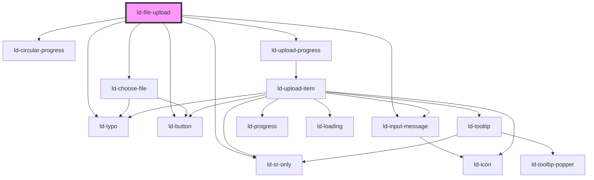

---
eleventyNavigation:
  key: File Upload
  parent: Components
layout: layout.njk
title: File Upload
permalink: components/ld-file-upload/
---

# ld-file-upload

File upload allows the user to upload files.

## Examples

### Default


<ld-file-upload></ld-file-upload>

<!-- React component -->

<!-- CSS component -->



#### State management:

State management such as changing the upload state or progress of a file has to be done by the user. Every event emits a an upload item (`UploadItem = {
  state:
    | 'pending'
    | 'paused'
    | 'cancelled'
    | 'uploading'
    | 'uploaded'
    | 'upload failed'
  fileName: string
  fileSize: number
  fileType: string
  progress: number
}`) or an array of upload items. For each event, the states need to be changed using methods.


<ld-file-upload>
</ld-file-upload>

<!-- React component -->

<!-- CSS component -->



### Circular progress


<ld-file-upload select-multiple circular-progress>
</ld-file-upload>

<!-- React component -->

<!-- CSS component -->



### Start upload immediately after choosing files


<ld-file-upload start-upload></ld-file-upload>

<!-- React component -->

<!-- CSS component -->



### Allow pause


<ld-file-upload allow-pause>
</ld-file-upload>

<!-- React component -->

<!-- CSS component -->



### Show progress


<ld-file-upload show-progress>
</ld-file-upload>

<!-- React component -->

<!-- CSS component -->



### Select multiple


<ld-file-upload select-multiple>
</ld-file-upload>

<!-- React component -->

<!-- CSS component -->



### Max size


<ld-file-upload max-size=500>
</ld-file-upload>

<!-- React component -->

<!-- CSS component -->



### Custom icons


<ld-file-upload>

<ld-icon slot='icons' data-upload-icon='application/pdf' name='pdf' size='lg'></ld-icon>

<!-- <ld-icon data-upload-icon='text/rtf' name='placeholder'></ld-icon> -->

</ld-file-upload>

<!-- React component -->

<!-- CSS component -->



### Combined examples


<ld-file-upload allow-pause select-multiple icons='{"rtf": "{{ env.base }}/{{ buildstamp }}assets/examples/file-upload-jpeg.svg"}'>

<ld-icon slot='icons' data-upload-icon='application/pdf' name='pdf' size='lg'></ld-icon>

<!-- <ld-icon data-upload-icon='text/rtf' name='placeholder'></ld-icon> -->

</ld-file-upload>

<!-- style="width: 30rem" -->

<!-- React component -->

<!-- CSS component -->



### Examples with dummy files


<ld-file-upload circular-progress allow-pause=false show-progress icons='{"pdf": "documents"}'></ld-file-upload>

<button>Click</button>

<!-- React component -->

<!-- CSS component -->




<ld-file-upload start-upload></ld-file-upload>

<button>Click</button>

<!-- React component -->

<!-- CSS component -->



<!-- Auto Generated Below -->

## Overview

TODO:
  - listen for files chosen event (from ld-choose-file.tsx) with file list
    -> emit upload ready event (if startUpload prop is set to true)
  - listen for click event of continue button and emit upload ready event (if startUpload prop is set to false)
  - The upload ready event contains the file list as its payload
  - Keep a state of files chosen and pass them as a prop (uploadItems) to ld-upload-progress.tsx
  - Implement callback methods, which accept a file list (name, progress, state etc.) and update the upload items

## Properties

| Property           | Attribute           | Description                                                                                                      | Type      | Default     |
| ------------------ | ------------------- | ---------------------------------------------------------------------------------------------------------------- | --------- | ----------- |
| `allowPause`       | `allow-pause`       | allowPause defines whether the user will be able to pause uploads.                                               | `boolean` | `false`     |
| `circularProgress` | `circular-progress` | circularProgress defines whether only the circular progress indicator will be shown during upload.               | `boolean` | `false`     |
| `dirname`          | `dirname`           | Name of form field to use for sending the element's directionality in form submission.                           | `string`  | `undefined` |
| `form`             | `form`              | Associates the control with a form element.                                                                      | `string`  | `undefined` |
| `maxSize`          | `max-size`          | TODO: is used to display and validate maximum file size in Bytes                                                 | `number`  | `undefined` |
| `name`             | `name`              | Used to specify the name of the control.                                                                         | `string`  | `undefined` |
| `ref`              | `ref`               | reference to component                                                                                           | `any`     | `undefined` |
| `selectMultiple`   | `select-multiple`   | selectMultiple defines whether selection of multiple input files is allowed.                                     | `boolean` | `false`     |
| `showProgress`     | `show-progress`     | showTotalProgress defines whether the progress of uploading files will be shown, or only an uploading indicator. | `boolean` | `false`     |
| `startUpload`      | `start-upload`      | startUpload defines whether upload starts immediately after choosing files or after confirmation.                | `boolean` | `false`     |
| `value`            | `value`             | The input value.                                                                                                 | `string`  | `undefined` |

## Events

| Event                         | Description | Type                        |
| ----------------------------- | ----------- | --------------------------- |
| `ldchoosefiles`               |             | `CustomEvent<UploadItem[]>` |
| `ldfileuploadcontinueuploads` |             | `CustomEvent<any>`          |
| `ldfileuploaddeleteall`       |             | `CustomEvent<any>`          |
| `ldfileuploadpausealluploads` |             | `CustomEvent<any>`          |
| `ldfileuploadready`           |             | `CustomEvent<UploadItem[]>` |

## Methods

### `deleteUploadItem(uploadItem: UploadItem) => Promise<void>`

Accepts a file from component consumer (name, progress, state etc.)
and deletes the upload items.

#### Returns

Type: `Promise<void>`

### `deleteUploadItems() => Promise<void>`

Accepts a file list from component consumer (name, progress, state etc.)
and deletes the upload items.

#### Returns

Type: `Promise<void>`

### `updateUploadItem(uploadItem: UploadItem) => Promise<void>`

Accepts a file from component consumer (name, progress, state etc.)
and updates the upload item state.

#### Returns

Type: `Promise<void>`

### `updateUploadItems(uploadItems: UploadItem[]) => Promise<void>`

Accepts a file list from component consumer (name, progress, state etc.)
and updates the upload items state.

#### Returns

Type: `Promise<void>`

## Dependencies

### Depends on

- [ld-choose-file](ld-choose-file)
- [ld-sr-only](../ld-sr-only)
- [ld-circular-progress](../ld-circular-progress)
- [ld-typo](../ld-typo)
- [ld-button](../ld-button)
- [ld-input-message](../ld-input-message)
- [ld-upload-progress](ld-upload-progress)

### Graph

----------------------------------------------

*Built with [StencilJS](https://stenciljs.com/)*
