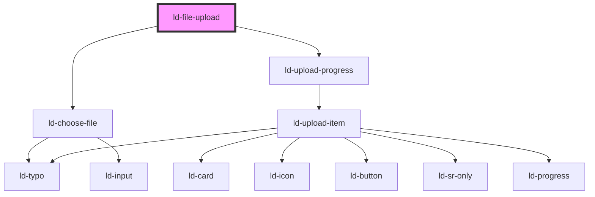

---
eleventyNavigation:
  key: File Upload
  parent: Components
layout: layout.njk
title: File Upload
permalink: components/ld-file-upload/
---

# ld-file-upload

File upload allows the user to upload files.

## Examples

### Default


<ld-file-upload></ld-file-upload>

<!-- React component -->

<!-- CSS component -->



<!-- Auto Generated Below -->

## Overview

TODO:
  - listen for files chosen event (from ld-choose-file.tsx) with file list
    -> update upload items accordingly
    -> emit upload ready event (if startUpload prop is set to true)
  - listen for click event of continue button and emit upload ready event (if startUpload prop is set to false)
  - The upload ready event contains the file list as its payload
  - Keep a state of files chosen and pass them as a prop (uploadItems) to ld-upload-progress.tsx
  - Implement callback methods, which accept a file list (name, progress, state etc.) and update the upload items

## Properties

| Property | Attribute | Description                                              | Type               | Default     |
| -------- | --------- | -------------------------------------------------------- | ------------------ | ----------- |
| `key`    | `key`     | for tracking the node's identity when working with lists | `string \| number` | `undefined` |
| `ref`    | `ref`     | reference to component                                   | `any`              | `undefined` |

## Events

| Event           | Description | Type                    |
| --------------- | ----------- | ----------------------- |
| `ldchoosefiles` |             | `CustomEvent<FileList>` |

## Methods

### `updateUploadItem(uploadItem: UploadItem) => Promise<void>`

Accepts a file from component consumer (name, progress, state etc.)
and updates the upload item state.

#### Returns

Type: `Promise<void>`

### `updateUploadItems(uploadItems: UploadItem[]) => Promise<void>`

Accepts a file list from component consumer (name, progress, state etc.)
and updates the upload items state.

#### Returns

Type: `Promise<void>`

## Shadow Parts

| Part     | Description                            |
| -------- | -------------------------------------- |
| `"list"` | `ul` element wrapping the default slot |

## Dependencies

### Depends on

- [ld-choose-file](ld-choose-file)
- [ld-upload-progress](ld-upload-progress)

### Graph

----------------------------------------------

*Built with [StencilJS](https://stenciljs.com/)*
