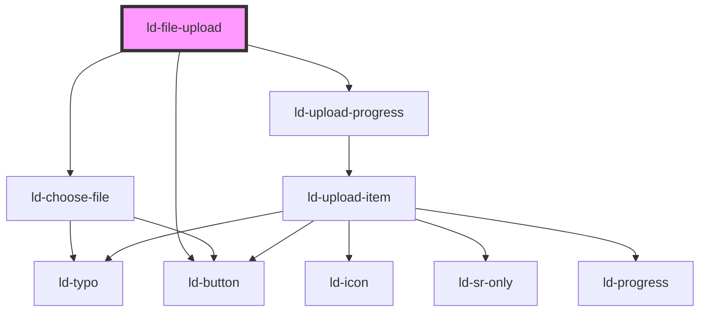

---
eleventyNavigation:
  key: File Upload
  parent: Components
layout: layout.njk
title: File Upload
permalink: components/ld-file-upload/
---

# ld-file-upload

File upload allows the user to upload files.

## Examples

### Default


<ld-file-upload icons='{"pdf": "documents"}'></ld-file-upload>

<button>Click</button>

<!-- React component -->

<!-- CSS component -->




<ld-file-upload start-upload></ld-file-upload>

<!-- React component -->

<!-- CSS component -->




<ld-file-upload start-upload></ld-file-upload>

<button>Click</button>

<!-- React component -->

<!-- CSS component -->



<!-- Auto Generated Below -->

## Overview

TODO:
  - listen for files chosen event (from ld-choose-file.tsx) with file list
    -> emit upload ready event (if startUpload prop is set to true)
  - listen for click event of continue button and emit upload ready event (if startUpload prop is set to false)
  - The upload ready event contains the file list as its payload
  - Keep a state of files chosen and pass them as a prop (uploadItems) to ld-upload-progress.tsx
  - Implement callback methods, which accept a file list (name, progress, state etc.) and update the upload items

## Properties

| Property      | Attribute      | Description                                                                                       | Type                                                                                                 | Default     |
| ------------- | -------------- | ------------------------------------------------------------------------------------------------- | ---------------------------------------------------------------------------------------------------- | ----------- |
| `dirname`     | `dirname`      | Name of form field to use for sending the element's directionality in form submission.            | `string`                                                                                             | `undefined` |
| `form`        | `form`         | Associates the control with a form element.                                                       | `string`                                                                                             | `undefined` |
| `icons`       | `icons`        | Maps file types to icon path                                                                      | `string \| { pdf?: string; zip?: string; jpeg?: string; txt?: string; png?: string; rtf?: string; }` | `undefined` |
| `key`         | `key`          | for tracking the node's identity when working with lists                                          | `string \| number`                                                                                   | `undefined` |
| `maxSize`     | `max-size`     | TODO: is used to display and validate maximum file size                                           | `number`                                                                                             | `undefined` |
| `name`        | `name`         | Used to specify the name of the control.                                                          | `string`                                                                                             | `undefined` |
| `ref`         | `ref`          | reference to component                                                                            | `any`                                                                                                | `undefined` |
| `startUpload` | `start-upload` | startUpload defines whether upload starts immediately after choosing files or after confirmation. | `boolean`                                                                                            | `false`     |
| `value`       | `value`        | The input value.                                                                                  | `string`                                                                                             | `undefined` |

## Events

| Event               | Description | Type                        |
| ------------------- | ----------- | --------------------------- |
| `ldchoosefiles`     |             | `CustomEvent<FileList>`     |
| `ldfileuploadready` |             | `CustomEvent<UploadItem[]>` |

## Methods

### `updateUploadItem(uploadItem: UploadItem) => Promise<void>`

Accepts a file from component consumer (name, progress, state etc.)
and updates the upload item state.

#### Returns

Type: `Promise<void>`

### `updateUploadItems(uploadItems: UploadItem[]) => Promise<void>`

Accepts a file list from component consumer (name, progress, state etc.)
and updates the upload items state.

#### Returns

Type: `Promise<void>`

## Shadow Parts

| Part     | Description                            |
| -------- | -------------------------------------- |
| `"list"` | `ul` element wrapping the default slot |

## Dependencies

### Depends on

- [ld-choose-file](ld-choose-file)
- [ld-upload-progress](ld-upload-progress)
- [ld-button](../ld-button)

### Graph

----------------------------------------------

*Built with [StencilJS](https://stenciljs.com/)*
