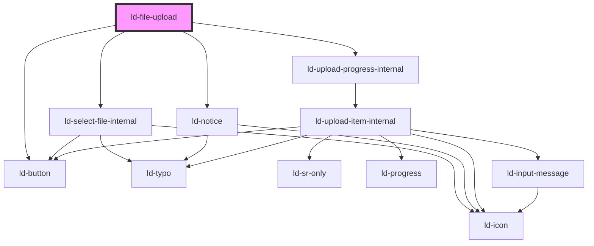

---
eleventyNavigation:
  key: File Upload
  parent: Components
layout: layout.njk
title: File Upload
permalink: components/ld-file-upload/
---

# ld-file-upload

File upload allows the user to upload files.

## Component state

You control the component&apos;s state by listening to events emitted by the ld-file-upload component. You then adjust the files&apos; upload state or progress based on these events and your application&apos;s logic using the component&apos;s props or methods.

Every event emitted contains either a list or a singe upload item with the following type signature:

```ts
type UploadItem = {
  state:
    | 'pending'
    | 'paused'
    | 'cancelled'
    | 'uploading'
    | 'uploaded'
    | 'uploadFailed'
  fileName: string
  fileSize: number
  fileType: string
  progress: number
  file: File
}
```

## Examples

### Default

In the default mode, you can select files for upload in multiple steps, but the upload can only be initiated by clicking "Start Upload" once.

Here is a simple example implementation of a single file upload illustrating the usage of various event listeners and component methods:


<ld-file-upload></ld-file-upload>

<script>
  ;(() => {
    const ldUpload = document.currentScript.previousElementSibling

    ldUpload.addEventListener('ldselectfiles', async (ev) => {
      uploadItems = ev.detail
      ldUpload.addUploadItems(uploadItems)
    })

    ldUpload.addEventListener('ldfileuploadready', async (ev) => {
      uploadItems = ev.detail
      uploadingItems = []
      for (let item in uploadItems) {
        if (item.state !== 'cancelled') {
          newItem = uploadItems[item]
          newItem.state = 'uploading'
          uploadingItems.push(newItem)
          ldUpload.updateUploadItem(newItem)
        }
      }
    })

    ldUpload.addEventListener('lduploaditempause', async (ev) => {
      uploadItem = ev.detail
      uploadItem.state = 'paused'
      ldUpload.updateUploadItem(uploadItem)
    })

    ldUpload.addEventListener('lduploaditemcancel', async (ev) => {
      uploadItem = ev.detail
      uploadItem.state = 'cancelled'
      ldUpload.updateUploadItem(uploadItem)
    })

    ldUpload.addEventListener('lduploaditemcontinue', async (ev) => {
      uploadItem = ev.detail
      uploadItem.state = 'uploading'
      ldUpload.updateUploadItem(uploadItem)
    })

    ldUpload.addEventListener('lduploaditemremove', async (ev) => {
      uploadItem = ev.detail
      ldUpload.removeUploadItem(uploadItem)
    })

    ldUpload.addEventListener('ldfileuploadremoveall', async (ev) => {
      ldUpload.removeAllUploadItems()
    })

    ldUpload.addEventListener('ldfileuploadpausealluploads', async (ev) => {
      uploadItems = ev.detail
      for (let item in uploadItems) {
        newItem = uploadItems[item]
        newItem.state = 'paused'
        ldUpload.updateUploadItem(newItem)
      }
    })

    ldUpload.addEventListener('ldfileuploadcontinueuploads', async (ev) => {
      uploadItems = ev.detail
      for (let item in uploadItems) {
        newItem = uploadItems[item]
        newItem.state = 'uploading'
        ldUpload.updateUploadItem(newItem)
      }
    })
  })()
</script>

<!-- React component -->

const App = () => {
  const fileUploadRef = useRef(null)

  return (
    <LdFileUpload
      ref={fileUploadRef}
      onLdselectfiles={(ev) => {
        const uploadItems = ev.detail
        if (fileUploadRef.current) {
          fileUploadRef.current.addUploadItems(uploadItems)
        }
      } }
      onLdfileuploadready={async (ev) => {
        const uploadItems = ev.detail
        for (const item in uploadItems) {
          const newItem = uploadItems[item]
          newItem.state = 'uploading'
          if (fileUploadRef.current) {
            fileUploadRef.current.updateUploadItem(newItem)
          }
        }
      } }
      onLduploaditemcancel={async (ev) => {
        const uploadItem = ev.detail
        uploadItem.state = 'cancelled'
        if (fileUploadRef.current) {
          fileUploadRef.current.updateUploadItem(uploadItem)
        }
      } }
      onLduploaditemremove={async (ev) => {
        const uploadItem = ev.detail
        if (fileUploadRef.current) {
          fileUploadRef.current.removeUploadItem(uploadItem)
        }
      } }
      onldfileuploadremoveall={async () => {
        if (fileUploadRef.current) {
          fileUploadRef.current.removeAllUploadItems()
        }
      } }
      onLdfileuploadpausealluploads={async (ev) => {
        const uploadItems = ev.detail
        for (const item in uploadItems) {
          const newItem = uploadItems[item]
          newItem.state = 'paused'
          if (fileUploadRef.current) {
            fileUploadRef.current.updateUploadItem(newItem)
          }
        }
      } }
    >
    </LdFileUpload>
  )
}



### Multiple

To allow uploading multiple files, use the `multiple` prop.


<ld-file-upload multiple></ld-file-upload>

<script>
  ;(() => {
    const ldUpload = document.currentScript.previousElementSibling

    ldUpload.addEventListener('ldselectfiles', async (ev) => {
      uploadItems = ev.detail
      ldUpload.addUploadItems(uploadItems)
    })

    ldUpload.addEventListener('ldfileuploadready', async (ev) => {
      uploadItems = ev.detail
      uploadingItems = []
      for (let item in uploadItems) {
        newItem = uploadItems[item]
        newItem.state = 'uploading'
        uploadingItems.push(newItem)
        ldUpload.updateUploadItem(newItem)
      }
    })

    ldUpload.addEventListener('lduploaditemcancel', async (ev) => {
      uploadItem = ev.detail
      uploadItem.state = 'cancelled'
      ldUpload.updateUploadItem(uploadItem)
    })

    ldUpload.addEventListener('lduploaditemremove', async (ev) => {
      uploadItem = ev.detail
      ldUpload.removeUploadItem(uploadItem)
    })
  })()
</script>

<!-- React component -->

const App = () => {
  const fileUploadRef = useRef(null)

  return (
    <LdFileUpload
      ref={fileUploadRef}
      multiple
      onLdselectfiles={async (ev) => {
        const uploadItems = ev.detail
        if (fileUploadRef.current) {
          fileUploadRef.current.addUploadItems(uploadItems)
        }
      } }
      onLdfileuploadready={async (ev) => {
        const uploadItems = ev.detail
        for (const item in uploadItems) {
          const newItem = uploadItems[item]
          newItem.state = 'uploading'
          if (fileUploadRef.current) {
            fileUploadRef.current.updateUploadItem(newItem)
          }
        }
      } }
      onLduploaditemcancel={async (ev) => {
        const uploadItem = ev.detail
        uploadItem.state = 'cancelled'
        if (fileUploadRef.current) {
          fileUploadRef.current.updateUploadItem(uploadItem)
        }
      } }
      onLduploaditemremove={async (ev) => {
        const uploadItem = ev.detail
        if (fileUploadRef.current) {
          fileUploadRef.current.removeUploadItem(uploadItem)
        }
      } }
    />
  )
}



### Show progress

If your server provides you with upload progress status updates, you can activate the display of progress indicators and labels using the `show-progress` attribute.

The following example illustrates how you can allow uploading multiple files to an actual server using [`XMLHttpRequest`](https://developer.mozilla.org/en-US/docs/Web/API/XMLHttpRequest). The files to be uploaded are accessed through the `file` property of the `UploadItem` objects emitted on `ldfileuploadready`. `XMLHttpRequest` is used to update the upload progress in the component.

<ld-notice mode="info">
  If you have a fast upload connection but still want to see how the component behaves during the upload, you can throttle the network in your browser dev-tools.
</ld-notice>


<ld-file-upload multiple show-progress></ld-file-upload>

<script>
  ;(() => {
    const ldUpload = document.currentScript.previousElementSibling

    ldUpload.addEventListener('ldselectfiles', async (ev) => {
      uploadItems = ev.detail
      ldUpload.addUploadItems(uploadItems)
    })

    ldUpload.addEventListener('ldfileuploadready', async (ev) => {
      uploadItems = ev.detail
      for (let item in uploadItems) {
        newItem = uploadItems[item]
        newItem.state = 'uploading'
        ldUpload.updateUploadItem(newItem)
        file = uploadItems[item].file

        const xhr = new XMLHttpRequest()
        const success = await new Promise((resolve) => {
          xhr.upload.addEventListener("progress", (event) => {
            if (event.lengthComputable) {
              newItem = uploadItems[item]
              newItem.progress = event.loaded / event.total * 100
              ldUpload.updateUploadItem(newItem)
            }
          });
          xhr.addEventListener("loadend", () => {
            resolve(xhr.readyState === 4 && xhr.status === 200)
          })
          ldUpload.addEventListener('lduploaditemcancel', async (ev) => {
            uploadItem = ev.detail
            if (uploadItem.fileName === uploadItems[item].fileName) {
              newItem = uploadItems[item]
              newItem.state = 'cancelled'
              ldUpload.updateUploadItem(newItem)
              xhr.abort(ev.detail.file)
            }
          })
          xhr.open("PUT", "https://httpbin.org/put", true)
          xhr.setRequestHeader("Content-Type", "application/octet-stream")
          xhr.send(file)
        })

        if (success) {
          newItem = uploadItems[item]
          newItem.state = 'uploaded'
          ldUpload.updateUploadItem(newItem)
        } else if (uploadItems[item].state !== 'cancelled') {
          newItem = uploadItems[item]
          newItem.state = "upload failed"
          ldUpload.updateUploadItem(newItem)
        }
      }
    })

    ldUpload.addEventListener('lduploaditemdownload', async (ev) => {
      uploadItem = ev.detail
      window.alert("Replace this alert call with code that opens your file.")
    })

    ldUpload.addEventListener('lduploaditemretry', async (ev) => {
      uploadItem = ev.detail
      uploadItems = []
      uploadItems.push(uploadItem)
      event = new CustomEvent('ldfileuploadready', { detail: uploadItems });
      ldUpload.dispatchEvent(event)
    })

    ldUpload.addEventListener('lduploaditemcancel', async (ev) => {
      uploadItem = ev.detail
      uploadItem.state = 'cancelled'
      ldUpload.updateUploadItem(uploadItem)
    })

    ldUpload.addEventListener('lduploaditemremove', async (ev) => {
      uploadItem = ev.detail
      ldUpload.removeUploadItem(uploadItem)
    })
  })()
</script>

<!-- React component -->

const App = () => {
  const fileUploadRef = useRef(null)

  return (
    <LdFileUpload
      ref={fileUploadRef}
      multiple
      show-progress

      onLdselectfiles={async (ev) => {
        const uploadItems = ev.detail
        if (fileUploadRef.current) {
          fileUploadRef.current.addUploadItems(uploadItems)
        }
      } }
      onLdfileuploadready={async (ev) => {
        const uploadItems = ev.detail
        for (const item in uploadItems) {
          const newItem = uploadItems[item]
          newItem.state = 'uploading'
          if (fileUploadRef.current) {
            fileUploadRef.current.updateUploadItem(newItem)
          }

          const file = uploadItems[item].file

          const xhr = new XMLHttpRequest()
          const success = await new Promise((resolve) => {
            xhr.upload.addEventListener('progress', (event) => {
              if (event.lengthComputable) {
                const newItem = uploadItems[item]
                newItem.progress = (event.loaded / event.total) * 100
                if (fileUploadRef.current) {
                  fileUploadRef.current.updateUploadItem(newItem)
                }
              }
            })
            xhr.addEventListener('loadend', () => {
              resolve(xhr.readyState === 4 && xhr.status === 200)
            })

            if (fileUploadRef.current) {
              fileUploadRef.current.addEventListener(
                'lduploaditemcancel',
                async (ev) => {
                  const uploadItem = ev.detail
                  if (uploadItem.fileName === uploadItems[item].fileName) {
                    const newItem = uploadItems[item]
                    newItem.state = 'cancelled'
                    fileUploadRef.current.updateUploadItem(newItem)
                    xhr.abort(ev.detail.file)
                  }
                }
              )
            }

            xhr.open('PUT', 'https://httpbin.org/put', true)
            xhr.setRequestHeader('Content-Type', 'application/octet-stream')
            xhr.send(file)
          })
          if (success) {
            const newItem = uploadItems[item]
            newItem.state = 'uploaded'
            if (fileUploadRef.current) {
              fileUploadRef.current.updateUploadItem(newItem)
            }
          } else if (uploadItems[item].state !== 'cancelled') {
            const newItem = uploadItems[item]
            newItem.state = 'uploadFailed'
            if (fileUploadRef.current) {
              fileUploadRef.current.updateUploadItem(newItem)
            }
          }
        }
      } }
      onLduploaditemdownload={async () => {
        window.open('https://liquid.merck.design/liquid/')
      } }
      onLduploaditemretry={async (ev) => {
        const uploadItem = ev.detail
        const uploadItems = []
        uploadItems.push(uploadItem)
        const uploadevent = new CustomEvent('ldfileuploadready', {
          detail: uploadItems,
        })
        if (fileUploadRef.current) {
          fileUploadRef.current.dispatchEvent(uploadevent)
        }
      } }
      onLduploaditemcancel={async (ev) => {
        const uploadItem = ev.detail
        uploadItem.state = 'cancelled'
        if (fileUploadRef.current) {
          fileUploadRef.current.updateUploadItem(uploadItem)
        }
      } }
      onLduploaditemremove={async (ev) => {
        const uploadItem = ev.detail
        if (fileUploadRef.current) {
          fileUploadRef.current.removeUploadItem(uploadItem)
        }
      } }
    />
  )
}



In case your server does not provide you with detailed information on the upload status, you can omit the `'progress'` event listener on the `XMLHttpRequest` instance and the `show-progress` attribute on the component.

### Immediate

In `immediate` mode, the upload starts immediately after the selection of the files.


<ld-file-upload immediate></ld-file-upload>

<script>
  ;(() => {
    const ldUpload = document.currentScript.previousElementSibling

    ldUpload.addEventListener('ldselectfiles', async (ev) => {
      uploadItems = ev.detail
      ldUpload.addUploadItems(uploadItems)
    })

    ldUpload.addEventListener('ldfileuploadready', async (ev) => {
      uploadItems = ev.detail
      uploadingItems = []
      for (let item in uploadItems) {
        newItem = uploadItems[item]
        newItem.state = 'uploading'
        uploadingItems.push(newItem)
        ldUpload.updateUploadItem(newItem)
      }
    })

    ldUpload.addEventListener('lduploaditemcancel', async (ev) => {
      uploadItem = ev.detail
      uploadItem.state = 'cancelled'
      ldUpload.updateUploadItem(uploadItem)
    })

    ldUpload.addEventListener('lduploaditemremove', async (ev) => {
      uploadItem = ev.detail
      ldUpload.removeUploadItem(uploadItem)
    })
  })()
</script>

<!-- React component -->

const App = () => {
  const fileUploadRef = useRef(null)

  return (
    <LdFileUpload
      ref={fileUploadRef}
      immediate
      onLdselectfiles={async (ev) => {
        const uploadItems = ev.detail
        if (fileUploadRef.current) {
          fileUploadRef.current.addUploadItems(uploadItems)
        }
      } }
      onLdfileuploadready={async (ev) => {
        const uploadItems = ev.detail
        for (const item in uploadItems) {
          const newItem = uploadItems[item]
          newItem.state = 'uploading'
          if (fileUploadRef.current) {
            fileUploadRef.current.updateUploadItem(newItem)
          }
        }
      } }
      onLduploaditemcancel={async (ev) => {
        const uploadItem = ev.detail
        uploadItem.state = 'cancelled'
        if (fileUploadRef.current) {
          fileUploadRef.current.updateUploadItem(uploadItem)
        }
      } }
      onLduploaditemremove={async (ev) => {
        const uploadItem = ev.detail
        if (fileUploadRef.current) {
          fileUploadRef.current.removeUploadItem(uploadItem)
        }
      } }
    />
  )
}



### Maximum file size

You can set a maximum file size constrain on the component using the `max-file-size` attribute.


<ld-file-upload max-file-size=10000></ld-file-upload>

<script>
  ;(() => {
    const ldUpload = document.currentScript.previousElementSibling

    ldUpload.addEventListener('ldselectfiles', async (ev) => {
      uploadItems = ev.detail
      ldUpload.addUploadItems(uploadItems)
    })

    ldUpload.addEventListener('ldfileuploadready', async (ev) => {
      uploadItems = ev.detail
      uploadingItems = []
      for (let item in uploadItems) {
        newItem = uploadItems[item]
        newItem.state = 'uploading'
        uploadingItems.push(newItem)
        ldUpload.updateUploadItem(newItem)
      }
    })

    ldUpload.addEventListener('lduploaditemcancel', async (ev) => {
      uploadItem = ev.detail
      uploadItem.state = 'cancelled'
      ldUpload.updateUploadItem(uploadItem)
    })

    ldUpload.addEventListener('lduploaditemremove', async (ev) => {
      uploadItem = ev.detail
      ldUpload.removeUploadItem(uploadItem)
    })
  })()
</script>

<!-- React component -->

const App = () => {
  const fileUploadRef = useRef(null)

  return (
    <LdFileUpload
      ref={fileUploadRef}
      maxFileSize={10000}
      onLdselectfiles={async (ev) => {
        const uploadItems = ev.detail
        if (fileUploadRef.current) {
          fileUploadRef.current.addUploadItems(uploadItems)
        }
      } }
      onLdfileuploadready={async (ev) => {
        const uploadItems = ev.detail
        for (const item in uploadItems) {
          const newItem = uploadItems[item]
          newItem.state = 'uploading'
          if (fileUploadRef.current) {
            fileUploadRef.current.updateUploadItem(newItem)
          }
        }
      } }
      onLduploaditemcancel={async (ev) => {
        const uploadItem = ev.detail
        uploadItem.state = 'cancelled'
        if (fileUploadRef.current) {
          fileUploadRef.current.updateUploadItem(uploadItem)
        }
      } }
      onLduploaditemremove={async (ev) => {
        const uploadItem = ev.detail
        if (fileUploadRef.current) {
          fileUploadRef.current.removeUploadItem(uploadItem)
        }
      } }
    />
  )
}



### Allow pause

If your server supports pausing uploads, you can use the `allow-pause` attribute to enable UI elements for pause and continue interactions.


<ld-file-upload allow-pause></ld-file-upload>

<script>
  ;(() => {
    const ldUpload = document.currentScript.previousElementSibling

    ldUpload.addEventListener('ldselectfiles', async (ev) => {
      uploadItems = ev.detail
      ldUpload.addUploadItems(uploadItems)
    })

    ldUpload.addEventListener('ldfileuploadready', async (ev) => {
      uploadItems = ev.detail
      uploadingItems = []
      for (let item in uploadItems) {
        newItem = uploadItems[item]
        newItem.state = 'uploading'
        uploadingItems.push(newItem)
        ldUpload.updateUploadItem(newItem)
      }
    })

    ldUpload.addEventListener('lduploaditemcancel', async (ev) => {
      uploadItem = ev.detail
      uploadItem.state = 'cancelled'
      ldUpload.updateUploadItem(uploadItem)
    })

    ldUpload.addEventListener('lduploaditemremove', async (ev) => {
      uploadItem = ev.detail
      ldUpload.removeUploadItem(uploadItem)
    })

    ldUpload.addEventListener('ldfileuploadpausealluploads', async (ev) => {
      uploadItems = ev.detail
      for (let item in uploadItems) {
        newItem = uploadItems[item]
        newItem.state = 'paused'
        ldUpload.updateUploadItem(newItem)
      }
    })

    ldUpload.addEventListener('ldfileuploadcontinueuploads', async (ev) => {
      uploadItems = ev.detail
      for (let item in uploadItems) {
        newItem = uploadItems[item]
        newItem.state = 'uploading'
        ldUpload.updateUploadItem(newItem)
      }
    })
  })()
</script>

<!-- React component -->

const App = () => {
  const fileUploadRef = useRef(null)

  return (
    <LdFileUpload
      ref={fileUploadRef}
      allow-pause
      onLdselectfiles={async (ev) => {
        const uploadItems = ev.detail
        if (fileUploadRef.current) {
          fileUploadRef.current.addUploadItems(uploadItems)
        }
      } }
      onLdfileuploadready={async (ev) => {
        const uploadItems = ev.detail
        for (const item in uploadItems) {
          const newItem = uploadItems[item]
          newItem.state = 'uploading'
          if (fileUploadRef.current) {
            fileUploadRef.current.updateUploadItem(newItem)
          }
        }
      } }
      onLduploaditemcancel={async (ev) => {
        const uploadItem = ev.detail
        uploadItem.state = 'cancelled'
        if (fileUploadRef.current) {
          fileUploadRef.current.updateUploadItem(uploadItem)
        }
      } }
      onLduploaditemremove={async (ev) => {
        const uploadItem = ev.detail
        if (fileUploadRef.current) {
          fileUploadRef.current.removeUploadItem(uploadItem)
        }
      } }
      onLdfileuploadpausealluploads={async (ev) => {
        const uploadItems = ev.detail
        for (const item in uploadItems) {
          const newItem = uploadItems[item]
          newItem.state = 'paused'
          if (fileUploadRef.current) {
            fileUploadRef.current.updateUploadItem(newItem)
          }
        }
      } }
      onLdfileuploadcontinueuploads={async (ev) => {
        const uploadItems = ev.detail
        for (const item in uploadItems) {
          const newItem = uploadItems[item]
          newItem.state = 'uploading'
          if (fileUploadRef.current) {
            fileUploadRef.current.updateUploadItem(newItem)
          }
        }
      } }
    />
  )
}



### Custom icons

Custom icons for specific file types can be added to the icons slot.


<ld-file-upload>
  <ld-icon slot='icons' data-upload-icon='application/pdf' name='pdf' size='lg'></ld-icon>
  
</ld-file-upload>

<script>
  ;(() => {
    const ldUpload = document.currentScript.previousElementSibling

    ldUpload.addEventListener('ldselectfiles', async (ev) => {
      uploadItems = ev.detail
      ldUpload.addUploadItems(uploadItems)
    })

    ldUpload.addEventListener('ldfileuploadready', async (ev) => {
      uploadItems = ev.detail
      uploadingItems = []
      for (let item in uploadItems) {
        newItem = uploadItems[item]
        newItem.state = 'uploading'
        uploadingItems.push(newItem)
        ldUpload.updateUploadItem(newItem)
      }
    })

    ldUpload.addEventListener('lduploaditemcancel', async (ev) => {
      uploadItem = ev.detail
      uploadItem.state = 'cancelled'
      ldUpload.updateUploadItem(uploadItem)
    })

    ldUpload.addEventListener('lduploaditemremove', async (ev) => {
      uploadItem = ev.detail
      ldUpload.removeUploadItem(uploadItem)
    })

    ldUpload.addEventListener('ldfileuploadpausealluploads', async (ev) => {
      uploadItems = ev.detail
      for (let item in uploadItems) {
        newItem = uploadItems[item]
        newItem.state = 'paused'
        ldUpload.updateUploadItem(newItem)
      }
    })

    ldUpload.addEventListener('ldfileuploadcontinueuploads', async (ev) => {
      uploadItems = ev.detail
      for (let item in uploadItems) {
        newItem = uploadItems[item]
        newItem.state = 'uploading'
        ldUpload.updateUploadItem(newItem)
      }
    })
  })()
</script>

<!-- React component -->

<LdFileUpload
  ref={fileUploadRef}
  onLdselectfiles={async (ev) => {
    const uploadItems = ev.detail
    if (fileUploadRef.current) {
      fileUploadRef.current.addUploadItems(uploadItems)
    }
  } }
  onLdfileuploadready={async (ev) => {
    const uploadItems = ev.detail
    for (const item in uploadItems) {
      const newItem = uploadItems[item]
      newItem.state = 'uploading'
      if (fileUploadRef.current) {
        fileUploadRef.current.updateUploadItem(newItem)
      }
    }
  } }
  onLduploaditemcancel={async (ev) => {
    const uploadItem = ev.detail
    uploadItem.state = 'cancelled'
    if (fileUploadRef.current) {
      fileUploadRef.current.updateUploadItem(uploadItem)
    }
  } }
  onLduploaditemremove={async (ev) => {
    const uploadItem = ev.detail
    if (fileUploadRef.current) {
      fileUploadRef.current.removeUploadItem(uploadItem)
    }
  } }
  onLdfileuploadpausealluploads={async (ev) => {
    const uploadItems = ev.detail
    for (const item in uploadItems) {
      const newItem = uploadItems[item]
      newItem.state = 'paused'
      if (fileUploadRef.current) {
        fileUploadRef.current.updateUploadItem(newItem)
      }
    }
  } }
  onLdfileuploadcontinueuploads={async (ev) => {
    const uploadItems = ev.detail
    for (const item in uploadItems) {
      const newItem = uploadItems[item]
      newItem.state = 'uploading'
      if (fileUploadRef.current) {
        fileUploadRef.current.updateUploadItem(newItem)
      }
    }
  } } >
  <LdIcon
    slot="icons"
    data-upload-icon="application/pdf"
    name="pdf"
    size="lg"
  ></LdIcon>
  
</LdFileUpload>



### Internationalization (i18n)

You can change all lables of the component using the `label-*` attributes.


<ld-file-upload
  max-file-size=10000
  label-cancel="Abbrechen"
  label-continue-paused-uploads="Pausierte Uploads fortführen"
  label-delete="Löschen"
  label-download="Herunterladen"
  label-drag-instructions="Dateien hierher ziehen"
  label-error-header="Ein Fehler ist aufgetreten"
  label-file-already-selected-error="$duplicateFiles können nicht ausgewählt werden, da Dateien mit den gleichen Namen bereits ausgewählt wurden. Um diese Dateien dennoch hochzuladen müssen die Dateien mit den gleichen Namen entfernt werden."
  label-max-file-size-exceeded-error="$filesExceedingmaxFileSize können nicht ausgewählt werden, da die Dateien die maximale Dateigröße überschreiten."
  label-select-file="Auswählen"
  label-start-upload="Upload beginnen"
  label-pause-all-uploads="Alle Uploads pausieren"
  label-remove="Entfernen"
  label-retry="Erneut versuchen"
  label-upload-completed="Upload abgeschlossen"
  label-upload-count="$filesUploaded von $filesTotal Dateien wurden hochgeladen."
  label-upload-file="Dateien hochladen"
  label-upload-percentage="$uploadProgress % hochgeladen."
  label-upload-state="Upload Status:"
  label-upload-constraints="max. Dateigröße: $maxFileSize"
  label-uploading="Dateien werden hochgeladen"
></ld-file-upload>

<script>
  ;(() => {
    const ldUpload = document.currentScript.previousElementSibling

    ldUpload.addEventListener('ldselectfiles', async (ev) => {
      uploadItems = ev.detail
      ldUpload.addUploadItems(uploadItems)
    })

    ldUpload.addEventListener('ldfileuploadready', async (ev) => {
      uploadItems = ev.detail
      uploadingItems = []
      for (let item in uploadItems) {
        newItem = uploadItems[item]
        newItem.state = 'uploading'
        uploadingItems.push(newItem)
        ldUpload.updateUploadItem(newItem)
      }
    })

    ldUpload.addEventListener('lduploaditemcancel', async (ev) => {
      uploadItem = ev.detail
      uploadItem.state = 'cancelled'
      ldUpload.updateUploadItem(uploadItem)
    })

    ldUpload.addEventListener('lduploaditemremove', async (ev) => {
      uploadItem = ev.detail
      ldUpload.removeUploadItem(uploadItem)
    })
  })()
</script>

<!-- React component -->

const App = () => {
  const fileUploadRef = useRef(null)

  return (
    <LdFileUpload
      ref={fileUploadRef}
      maxFileSize={10000}
      labelCancel="Abbrechen"
      labelContinuePausedUploads="Pausierte Uploads fortführen"
      labelDelete="Löschen"
      labelDownload="Herunterladen"
      labelDragInstructions="Dateien hierher ziehen oder auswählen"
      labelErrorHeader="Ein Fehler ist aufgetreten"
      labelFileAlreadySelectedError="$duplicateFiles können nicht ausgewählt werden, da Dateien mit den gleichen Namen bereits ausgewählt wurden. Um diese Dateien dennoch hochzuladen müssen die Dateien mit den gleichen Namen entfernt werden."
      labelMaxFileSizeExceededError="$filesExceedingmaxFileSize können nicht ausgewählt werden, da die Dateien die maximale Dateigröße überschreiten."
      labelSelectFile="Dateien auswählen"
      labelStartUpload="Upload beginnen"
      labelPauseAllUploads="Alle Uploads pausieren"
      labelRemove="Entfernen"
      labelRetry="Erneut versuchen"
      labelUploadCompleted="Upload abgeschlossen"
      labelUploadCount="$filesUploaded von $filesTotal Dateien wurden hochgeladen."
      labelUploadFile="Dateien hochladen"
      labelUploadPercentage="$uploadProgress % hochgeladen."
      labelUploadState="Upload Status:"
      labelUploadConstraints="max. Dateigröße: $maxFileSize"
      labelUploading="Dateien werden hochgeladen"
      onLdselectfiles={async (ev) => {
        const uploadItems = ev.detail
        if (fileUploadRef.current) {
          fileUploadRef.current.addUploadItems(uploadItems)
        }
      } }
      onLdfileuploadready={async (ev) => {
        const uploadItems = ev.detail
        for (const item in uploadItems) {
          const newItem = uploadItems[item]
          newItem.state = 'uploading'
          if (fileUploadRef.current) {
            fileUploadRef.current.updateUploadItem(newItem)
          }
        }
      } }
      onLduploaditemcancel={async (ev) => {
        const uploadItem = ev.detail
        uploadItem.state = 'cancelled'
        if (fileUploadRef.current) {
          fileUploadRef.current.updateUploadItem(uploadItem)
        }
      } }
      onLduploaditemremove={async (ev) => {
        const uploadItem = ev.detail
        if (fileUploadRef.current) {
          fileUploadRef.current.removeUploadItem(uploadItem)
        }
      } }
    />
  )
}




<!-- Auto Generated Below -->


## Properties

| Property                        | Attribute                           | Description                                                                                                                                                                                                    | Type               | Default                                                                                                                                                                                  |
| ------------------------------- | ----------------------------------- | -------------------------------------------------------------------------------------------------------------------------------------------------------------------------------------------------------------- | ------------------ | ---------------------------------------------------------------------------------------------------------------------------------------------------------------------------------------- |
| `allowPause`                    | `allow-pause`                       | Defines whether the user will be able to pause uploads.                                                                                                                                                        | `boolean`          | `false`                                                                                                                                                                                  |
| `dirname`                       | `dirname`                           | Name of form field to use for sending the element's directionality in form submission.                                                                                                                         | `string`           | `undefined`                                                                                                                                                                              |
| `form`                          | `form`                              | Associates the control with a form element.                                                                                                                                                                    | `string`           | `undefined`                                                                                                                                                                              |
| `immediate`                     | `immediate`                         | Defines whether upload starts immediately after selecting files or after confirmation.                                                                                                                         | `boolean`          | `false`                                                                                                                                                                                  |
| `key`                           | `key`                               | for tracking the node's identity when working with lists                                                                                                                                                       | `string \| number` | `undefined`                                                                                                                                                                              |
| `labelCancel`                   | `label-cancel`                      | Label to be used for the cancel button.                                                                                                                                                                        | `string`           | `'Cancel'`                                                                                                                                                                               |
| `labelContinuePausedUploads`    | `label-continue-paused-uploads`     | Label to be used for the continue paused uploads button.                                                                                                                                                       | `string`           | `'Continue paused uploads'`                                                                                                                                                              |
| `labelDownload`                 | `label-download`                    | Label to be used for the download button.                                                                                                                                                                      | `string`           | `'Download'`                                                                                                                                                                             |
| `labelDragInstructions`         | `label-drag-instructions`           | Label to be used as a header with instructions for drag and drop or file upload.                                                                                                                               | `string`           | ``Drag your file${     this.multiple ? '(s)' : ''   } here``                                                                                                                             |
| `labelErrorHeader`              | `label-error-header`                | Label to be used for the header of error messages.                                                                                                                                                             | `string`           | `'An error occurred'`                                                                                                                                                                    |
| `labelFileAlreadySelectedError` | `label-file-already-selected-error` | Label to be used for the error message that is shown if a file that has already been selected is selected again.                                                                                               | `string`           | `'$duplicateFiles cannot be selected since file(s) with the same name(s) has/have been selected already. To upload this/these file(s) please remove the file(s) with the same name(s).'` |
| `labelPauseAllUploads`          | `label-pause-all-uploads`           | Label to be used for the pause all uploads button.                                                                                                                                                             | `string`           | `'Pause all uploads'`                                                                                                                                                                    |
| `labelRemove`                   | `label-remove`                      | Label to be used for the remove button.                                                                                                                                                                        | `string`           | `'Remove'`                                                                                                                                                                               |
| `labelRetry`                    | `label-retry`                       | Label to be used for the retry button.                                                                                                                                                                         | `string`           | `'Retry'`                                                                                                                                                                                |
| `labelSelectFile`               | `label-select-file`                 | Label to be used for the select files button.                                                                                                                                                                  | `string`           | ``Select ${this.multiple ? '' : 'a'} file${     this.multiple ? '(s)' : ''   }``                                                                                                         |
| `labelStartUpload`              | `label-start-upload`                | Label to be used for the start upload button.                                                                                                                                                                  | `string`           | `'Start upload'`                                                                                                                                                                         |
| `labelUploadCancelledMsg`       | `label-upload-cancelled-msg`        | Label to be used for upload cancelled message.                                                                                                                                                                 | `string`           | `'Upload of this file has been cancelled'`                                                                                                                                               |
| `labelUploadCompleted`          | `label-upload-completed`            | Label to be used for the (disabled) upload completed button.                                                                                                                                                   | `string`           | `'Upload completed'`                                                                                                                                                                     |
| `labelUploadConstraints`        | `label-upload-constraints`          | Label to be used to describe upload constraints like the maximum file size.                                                                                                                                    | `string`           | ``${     this.maxFileSize !== undefined ? 'max. $maxFileSize file size' : ''   }``                                                                                                       |
| `labelUploadCount`              | `label-upload-count`                | Label to be used to count the amount of files that have been uploaded.                                                                                                                                         | `string`           | ``$filesUploaded of $filesTotal file${     this.multiple ? 's' : ''   } uploaded.``                                                                                                      |
| `labelUploadErrorMsg`           | `label-upload-error-msg`            | Label to be used for upload error message.                                                                                                                                                                     | `string`           | `'Upload failed'`                                                                                                                                                                        |
| `labelUploadFile`               | `label-upload-file`                 | Label to be used for the upload files button.                                                                                                                                                                  | `string`           | ``Upload ${this.multiple ? '' : 'a'} file${     this.multiple ? '(s)' : ''   }``                                                                                                         |
| `labelUploadPercentage`         | `label-upload-percentage`           | Label to be used to show the total upload percentage.                                                                                                                                                          | `string`           | ``$uploadProgress % uploaded.``                                                                                                                                                          |
| `labelUploadState`              | `label-upload-state`                | Label to be used for the upload state header.                                                                                                                                                                  | `string`           | ``Upload state:``                                                                                                                                                                        |
| `labelUploadSuccessMsg`         | `label-upload-success-msg`          | Label to be used for upload success message.                                                                                                                                                                   | `string`           | `'Upload was successful'`                                                                                                                                                                |
| `labelUploading`                | `label-uploading`                   | Label to be used for the (disabled) uploading button.                                                                                                                                                          | `string`           | `'Uploading'`                                                                                                                                                                            |
| `labelmaxFileSizeExceededError` | `labelmax-file-size-exceeded-error` | Label to be used for the error message that is shown if selected file exceeds the maximum file size.                                                                                                           | `string`           | `'$filesExceedingmaxFileSize cannot be selected since the file(s) exceed(s) the maximum file size.'`                                                                                     |
| `maxFileSize`                   | `max-file-size`                     | Is used to display and validate maximum file size in Bytes                                                                                                                                                     | `number`           | `undefined`                                                                                                                                                                              |
| `multiple`                      | `multiple`                          | Defines whether selection of multiple input files is allowed.                                                                                                                                                  | `boolean`          | `false`                                                                                                                                                                                  |
| `ref`                           | `ref`                               | reference to component                                                                                                                                                                                         | `any`              | `undefined`                                                                                                                                                                              |
| `showProgress`                  | `show-progress`                     | Defines whether the progress of uploading files will be shown, or only an uploading indicator. Also defines is exact progress will be shown in uploading progress button, as well as in the upload state area. | `boolean`          | `false`                                                                                                                                                                                  |
| `value`                         | `value`                             | The input value.                                                                                                                                                                                               | `string`           | `undefined`                                                                                                                                                                              |


## Events

| Event                         | Description                                                                                                                                                                                                                                                                                       | Type                                                                                                                                                                                               |
| ----------------------------- | ------------------------------------------------------------------------------------------------------------------------------------------------------------------------------------------------------------------------------------------------------------------------------------------------- | -------------------------------------------------------------------------------------------------------------------------------------------------------------------------------------------------- |
| `ldfileuploadcontinueuploads` | Emitted on continue all uploads click. UploadItems emitted can be updated using the updateUploadItem() method.                                                                                                                                                                                    | `CustomEvent<LdUploadItem[]>`                                                                                                                                                                      |
| `ldfileuploadpausealluploads` | Emitted on pause all uploads click. UploadItems emitted can be updated using the updateUploadItem() method.                                                                                                                                                                                       | `CustomEvent<LdUploadItem[]>`                                                                                                                                                                      |
| `ldfileuploadready`           | Emitted on start upload click or after selecting files, if upload starts immediately after selecting files. UploadItems emitted can be added to the list of selected files by using the addUploadItems() method or updated, if they have been added already, using the updateUploadItem() method. | `CustomEvent<LdUploadItem[]>`                                                                                                                                                                      |
| `ldselectfiles`               | Emitted after selecting files. UploadItems emitted can be added to the list of selected files by using the addUploadItems() method.                                                                                                                                                               | `CustomEvent<LdUploadItem[]>`                                                                                                                                                                      |
| `lduploaditemcancel`          | Emitted on cancel button click. UploadItem emitted can be updated using the updateUploadItem() method.                                                                                                                                                                                            | `CustomEvent<{ state: "pending" \| "paused" \| "cancelled" \| "uploading" \| "uploaded" \| "uploadFailed"; fileName: string; fileSize: number; fileType: string; progress: number; file: File; }>` |
| `lduploaditemcontinue`        | Emitted on continue button click. UploadItem emitted can be updated using the updateUploadItem() method.                                                                                                                                                                                          | `CustomEvent<{ state: "pending" \| "paused" \| "cancelled" \| "uploading" \| "uploaded" \| "uploadFailed"; fileName: string; fileSize: number; fileType: string; progress: number; file: File; }>` |
| `lduploaditemdownload`        | Emitted on download button click. UploadItem emitted can be updated using the updateUploadItem() method.                                                                                                                                                                                          | `CustomEvent<{ state: "pending" \| "paused" \| "cancelled" \| "uploading" \| "uploaded" \| "uploadFailed"; fileName: string; fileSize: number; fileType: string; progress: number; file: File; }>` |
| `lduploaditempause`           | Emitted on pause button click. UploadItem emitted can be updated using the updateUploadItem() method.                                                                                                                                                                                             | `CustomEvent<{ state: "pending" \| "paused" \| "cancelled" \| "uploading" \| "uploaded" \| "uploadFailed"; fileName: string; fileSize: number; fileType: string; progress: number; file: File; }>` |
| `lduploaditemremove`          | Emitted on remove button click. UploadItem emitted can be updated using the updateUploadItem() method.                                                                                                                                                                                            | `CustomEvent<{ state: "pending" \| "paused" \| "cancelled" \| "uploading" \| "uploaded" \| "uploadFailed"; fileName: string; fileSize: number; fileType: string; progress: number; file: File; }>` |
| `lduploaditemretry`           | Emitted on retry button click. UploadItem emitted can be updated using the updateUploadItem() method.                                                                                                                                                                                             | `CustomEvent<{ state: "pending" \| "paused" \| "cancelled" \| "uploading" \| "uploaded" \| "uploadFailed"; fileName: string; fileSize: number; fileType: string; progress: number; file: File; }>` |


## Methods

### `addUploadItems(uploadItems: LdUploadItem[]) => Promise<void>`

Accepts a file list from component consumer (name, progress, state etc.)
and adds the items to the upload items state.

#### Returns

Type: `Promise<void>`


### `removeAllUploadItems() => Promise<void>`

Removes all upload items.

#### Returns

Type: `Promise<void>`


### `removeUploadItem(uploadItem: LdUploadItem) => Promise<void>`

Removes the upload item.

#### Returns

Type: `Promise<void>`


### `updateUploadItem(uploadItem: LdUploadItem) => Promise<void>`

Accepts a file from component consumer (name, progress, state etc.)
and updates the upload item state of items that have been added already.

#### Returns

Type: `Promise<void>`


## Slots

| Slot      | Description                                        |
| --------- | -------------------------------------------------- |
| `"icons"` | allows using custom icons for specified mime types |


## Shadow Parts

| Part                       | Description                    |
| -------------------------- | ------------------------------ |
| `"buttons"`                | buttons container              |
| `"continue-paused-button"` | continue-paused-uploads button |
| `"error-notice"`           | error notice                   |
| `"input"`                  | the input element              |
| `"pause-all-button"`       | pause all button               |
| `"progress"`               | progress indicator component   |
| `"select-file"`            | select file component          |
| `"start-upload-button"`    | start upload button            |


## Dependencies

### Depends on

- ld-select-file-internal
- [ld-notice](../ld-notice)
- ld-upload-progress-internal
- [ld-button](../ld-button)

### Graph


----------------------------------------------

*Built with [StencilJS](https://stenciljs.com/)*
