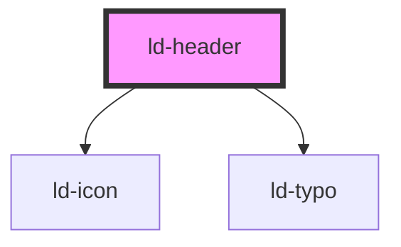

---
eleventyNavigation:
  key: Header
  parent: Components
layout: layout.njk
title: Header
permalink: components/ld-header/
---

# ld-header

A header component including a logo, site name, menu and optional additional buttons.

---

## Examples

### Default


<ld-header site-name="Liquid Oxygen" logo-title="Home" logo-url="#">
  <ld-menu slot="menu">
    <ld-menu-item href="#">Home</ld-menu-item>
    <ld-menu-item href="#">
      Products
      <ld-menu title="Products">
        <ld-menu-item href="#">Product 1</ld-menu-item>
        <ld-menu-item href="#">Product 2</ld-menu-item>
        <ld-menu-item href="#">Product 3</ld-menu-item>
        <ld-menu-item href="#">
          Product 4
          <ld-menu title="Product 4">
            <ld-menu-item href="#">Features</ld-menu-item>
            <ld-menu-item href="#">Pricing</ld-menu-item>
            <ld-menu-item href="#">Resources</ld-menu-item>
          </ld-menu>
        </ld-menu-item>
      </ld-menu>
    </ld-menu-item>
    <ld-menu-item href="#">Support</ld-menu-item>
  </ld-menu>
  <ld-button mode="on-brand-color" size="sm" slot="buttons">Register</ld-button>
  <ld-button mode="secondary-on-brand-color" size="sm" slot="buttons">Login</ld-button>
</ld-header>


<!-- Auto Generated Below -->

## Properties

| Property       | Attribute        | Description                                                                             | Type               | Default     |
| -------------- | ---------------- | --------------------------------------------------------------------------------------- | ------------------ | ----------- |
| `hideOnScroll` | `hide-on-scroll` | Hide the header when the user scrolls down and show it again, when the user scrolls up. | `boolean`          | `false`     |
| `key`          | `key`            | for tracking the node's identity when working with lists                                | `string \| number` | `undefined` |
| `logoTitle`    | `logo-title`     | Title attribute of the logo link.                                                       | `string`           | `undefined` |
| `logoUrl`      | `logo-url`       | URL that the logo links to.                                                             | `string`           | `undefined` |
| `ref`          | `ref`            | reference to component                                                                  | `any`              | `undefined` |
| `siteName`     | `site-name`      | Name shown on the right side of the logo.                                               | `string`           | `undefined` |
| `sticky`       | `sticky`         | Make the header sticky.                                                                 | `boolean`          | `false`     |

## Slots

| Slot        | Description                                       |
| ----------- | ------------------------------------------------- |
| `"buttons"` | (optional) Items on the right side of the header. |
| `"logo"`    | (optional) Custom logo.                           |
| `"menu"`    | Main menu.                                        |

## Shadow Parts

| Part          | Description                                                       |
| ------------- | ----------------------------------------------------------------- |
| `"buttons"`   | Wrapper around the buttons slot                                   |
| `"container"` | Actual header element that limits the width of the header content |
| `"logo"`      | Logo                                                              |
| `"site-name"` | `ld-typo` element containing the site name                        |

## Dependencies

### Depends on

- [ld-icon](../ld-icon)
- [ld-typo](../ld-typo)

### Graph

----------------------------------------------

 
