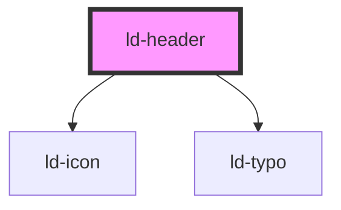

---
eleventyNavigation:
  key: Header
  parent: Components
layout: layout.njk
title: Header
permalink: components/ld-header/
---

# ld-header

A header component including a logo, site name, menu and optional additional buttons.

---

## Examples

### Default


<ld-header site-name="Liquid Oxygen" logo-title="Home"></ld-header>


### With linked logo


<ld-header site-name="Liquid Oxygen" logo-title="Home" logo-url="#"></ld-header>


### With custom logo


<ld-header site-name="Rocket Science" logo-title="Home">
  <ld-icon name="rocket" size="lg" slot="logo"></ld-icon>
</ld-header>


### With buttons


<ld-header site-name="Liquid Oxygen" logo-title="Home" logo-url="#">
  <ld-button id="register" slot="end" type="button">
    <ld-icon name="pen"></ld-icon>
    Register
  </ld-button>
  <ld-button id="login-lg" mode="ghost" slot="end" title="Login" type="button">
    <ld-icon name="user"></ld-icon>
  </ld-button>
  <ld-button id="login-sm" mode="secondary" slot="end" type="button">
    <ld-icon name="user"></ld-icon>
    Login
  </ld-button>
</ld-header>



### With burger menu button


<ld-header site-name="Liquid Oxygen" logo-title="Home" logo-url="#">
  <ld-button mode="ghost" slot="start" type="button">
    <ld-icon name="burger-menu"></ld-icon>
  </ld-button>
</ld-header>


### Sticky

You can add the `sticky` property to the `ld-header` web component, to make the component stick to the top of the page. It's necessary that you place your component as a direct child of the `<body>` to make the stickiness work.

### Hide on scroll

If you want the header to hide (slide up behind the top of the window) when the user is scrolling down, you can add the `hide-on-scroll` prop to the `ld-header` web component. With this prop set, the header will hide when scrolling down and show again, when scrolling up.

> This prop only works in combination with the `sticky` prop.

<!-- Auto Generated Below -->

## Properties

| Property       | Attribute        | Description                                                                             | Type               | Default     |
| -------------- | ---------------- | --------------------------------------------------------------------------------------- | ------------------ | ----------- |
| `hidden`       | `hidden`         | Hides header.                                                                           | `boolean`          | `false`     |
| `hideOnScroll` | `hide-on-scroll` | Hide the header when the user scrolls down and show it again, when the user scrolls up. | `boolean`          | `false`     |
| `key`          | `key`            | for tracking the node's identity when working with lists                                | `string \| number` | `undefined` |
| `logoTitle`    | `logo-title`     | Title attribute of the logo link.                                                       | `string`           | `undefined` |
| `logoUrl`      | `logo-url`       | URL that the logo links to.                                                             | `string`           | `undefined` |
| `ref`          | `ref`            | reference to component                                                                  | `any`              | `undefined` |
| `siteName`     | `site-name`      | Name shown on the right side of the logo.                                               | `string`           | `undefined` |
| `sticky`       | `sticky`         | Make the header sticky.                                                                 | `boolean`          | `false`     |

## Slots

| Slot      | Description                            |
| --------- | -------------------------------------- |
| `"end"`   | Items on the right side of the header. |
| `"logo"`  | Custom logo.                           |
| `"menu"`  | Main menu.                             |
| `"start"` | Items on the left side of the header.  |

## Shadow Parts

| Part          | Description                                                       |
| ------------- | ----------------------------------------------------------------- |
| `"container"` | Actual header element that limits the width of the header content |
| `"logo"`      | `ld-icon` element containing the default logo                     |
| `"site-name"` | `ld-typo` element containing the site name                        |

## Dependencies

### Depends on

- [ld-icon](../ld-icon)
- [ld-typo](../ld-typo)

### Graph

----------------------------------------------

 
