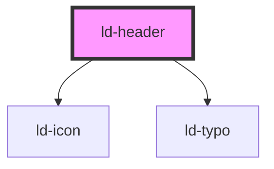

---
eleventyNavigation:
  key: Header
  parent: Components
layout: layout.njk
title: Header
permalink: components/ld-header/
---

<link rel="stylesheet" href="css_components/ld-header.css">
<link rel="stylesheet" href="css_components/ld-button.css">
<link rel="stylesheet" href="css_components/ld-icon.css">
<link rel="stylesheet" href="css_components/ld-typo.css">

# ld-header

The `ld-header` component contains a logo, a site name and slots for additional custom content, like a menu, buttons, search input or anything else. Slots can be used to place content left or right of the logo and site name, or on the very right side of the header. The `ld-header` component takes care of the following:

* It adds a space between all its direct children.
* It only allows small buttons as children and automatically applies props accordingly.

You can easily make the header sticky and make it hide when the user is scrolling down by using the `sticky` and `hide-on-scroll` props.

---

## Examples

### Default


<ld-header site-name="Liquid Oxygen"></ld-header>

<!-- CSS component -->

<header class="ld-header">
  

    <svg aria-label="Merck KGaA, Darmstadt, Germany" class="ld-header__logo ld-icon" viewBox="0 0 24 24" fill="none" xmlns="http://www.w3.org/2000/svg"><path fill-rule="evenodd" clip-rule="evenodd" d="M20.5921 7H19.1a.2882.2882 0 0 0-.1926.076l-2.9895 2.7586c-1.0241.9456-2.4024 1.4765-3.9177 1.4765-1.5796 0-3.0088-.5797-4.0444-1.5964 0 0-2.199-2.0294-2.2179-2.0477A2.5535 2.5535 0 0 0 4.0665 7h-1.785C2.126 7 2 7.1239 2 7.2766v7.7509c0 .765.6301 1.3843 1.4083 1.3843h.9133c.1564 0 .2831-.1249.2831-.2783l.0007-2.7582c0-.7208.5987-1.3155 1.3204-1.3155 1.3434 0 2.3067 1.1309 3.177 1.8863 1.0661.9254 1.8871 1.8169 2.8974 1.8169 1.0092 0 1.8306-.8915 2.8966-1.8169.8707-.7554 1.834-1.8863 3.1767-1.8863.718 0 1.3137.5887 1.3208 1.3039v1.6638c0 .765.6305 1.3829 1.4089 1.3829h.6079c.1588 0 .3061.0014.3061.0014.1561 0 .2828-.1249.2828-.2779V8.3842C22 7.6196 21.3692 7 20.5921 7Z" fill="currentcolor"/></svg>
    
Liquid Oxygen

  

</header>


### With linked logo


<ld-header site-name="Liquid Oxygen" logo-title="Home" logo-url="#"></ld-header>

<!-- CSS component -->

<header class="ld-header">
  

    <a aria-label="Home" class="ld-header__logo-wrapper" href="#">
      <svg class="ld-header__logo ld-icon" viewBox="0 0 24 24" fill="none" xmlns="http://www.w3.org/2000/svg"><path fill-rule="evenodd" clip-rule="evenodd" d="M20.5921 7H19.1a.2882.2882 0 0 0-.1926.076l-2.9895 2.7586c-1.0241.9456-2.4024 1.4765-3.9177 1.4765-1.5796 0-3.0088-.5797-4.0444-1.5964 0 0-2.199-2.0294-2.2179-2.0477A2.5535 2.5535 0 0 0 4.0665 7h-1.785C2.126 7 2 7.1239 2 7.2766v7.7509c0 .765.6301 1.3843 1.4083 1.3843h.9133c.1564 0 .2831-.1249.2831-.2783l.0007-2.7582c0-.7208.5987-1.3155 1.3204-1.3155 1.3434 0 2.3067 1.1309 3.177 1.8863 1.0661.9254 1.8871 1.8169 2.8974 1.8169 1.0092 0 1.8306-.8915 2.8966-1.8169.8707-.7554 1.834-1.8863 3.1767-1.8863.718 0 1.3137.5887 1.3208 1.3039v1.6638c0 .765.6305 1.3829 1.4089 1.3829h.6079c.1588 0 .3061.0014.3061.0014.1561 0 .2828-.1249.2828-.2779V8.3842C22 7.6196 21.3692 7 20.5921 7Z" fill="currentcolor"/></svg>
    </a>
    
Liquid Oxygen

  

</header>


### With custom logo


<ld-header logo-title="Rocket Inc." site-name="Rocket Science">
  <ld-icon name="rocket" size="lg" slot="logo"></ld-icon>
</ld-header>

<!-- CSS component -->

<header class="ld-header">
  

    <svg aria-label="Rocket Inc." class="ld-icon ld-icon--lg" xmlns="http://www.w3.org/2000/svg" viewBox="0 0 24 24" fill="none"><path fill-rule="evenodd" clip-rule="evenodd" d="m16.9524 14.422.0379.0948c.6824 1.4596.3791 3.2036-.7773 4.36l-1.6492 1.6492c-.3602.3792-.9857.2654-1.2132-.2085l-1.2322-2.6729-1.4407.9099c-.3602.2086-.8152.1517-1.0995-.1327l-3.981-3.9809a.8934.8934 0 0 1-.1326-1.0995l.9099-1.4407-2.673-1.2322c-.4738-.2085-.5876-.834-.2084-1.2132L5.1423 7.806c1.1564-1.1374 2.8814-1.4597 4.36-.7773l.0759.019c4.4927-4.2463 8.7039-3.882 10.2773-3.6924A.726.726 0 0 1 20.5 4c.1896 1.5734.6987 5.9292-3.5476 10.422zm-3.7345-6.4833c-.7962.7962-.7962 2.0663 0 2.8625.7962.7773 2.0852.7773 2.8624 0 .7773-.7962.7962-2.0663 0-2.8624-.7961-.7962-2.0662-.7962-2.8624 0zm-7.6587 10.161c0 .2085.1706.3601.3602.3601.0415-.0023.0866-.0046.135-.0071.3502-.0178.8746-.0446 1.4573-.1445l1.3468.626c.0661.0308.0778.1198.0206.1651-1.5787 1.253-3.6632 1.2568-4.7117 1.2587a17.4489 17.4489 0 0 0-.3072.0022c-.2085 0-.3602-.1706-.3602-.3602l.0021-.1117c.0174-.9543.0564-3.0902 1.399-4.7683a.098.098 0 0 1 .1651.0204l.6447 1.3669c-.1138.6635-.1517 1.2511-.1517 1.5924z" fill="currentcolor"/></svg>
    
Rocket Science

  

</header>


### With buttons


<ld-header>
  <ld-typo tag="div" variant="h5">
    Liquid Oxygen
  </ld-typo>
  <ld-button id="register" slot="end" type="button">
    <ld-icon name="pen" size="sm"></ld-icon>
    Register
  </ld-button>
  <ld-button id="login-sm" mode="ghost" slot="end" title="Login" type="button">
    <ld-icon aria-label="Login" name="user" size="lg"></ld-icon>
  </ld-button>
  <ld-button id="login-lg" mode="secondary" slot="end" type="button">
    <ld-icon name="user" size="sm"></ld-icon>
    Login
  </ld-button>
</ld-header>

<!-- CSS component -->

<header class="ld-header">
  

    <svg aria-label="Merck KGaA, Darmstadt, Germany" class="ld-header__logo ld-icon" viewBox="0 0 24 24" fill="none" xmlns="http://www.w3.org/2000/svg"><path fill-rule="evenodd" clip-rule="evenodd" d="M20.5921 7H19.1a.2882.2882 0 0 0-.1926.076l-2.9895 2.7586c-1.0241.9456-2.4024 1.4765-3.9177 1.4765-1.5796 0-3.0088-.5797-4.0444-1.5964 0 0-2.199-2.0294-2.2179-2.0477A2.5535 2.5535 0 0 0 4.0665 7h-1.785C2.126 7 2 7.1239 2 7.2766v7.7509c0 .765.6301 1.3843 1.4083 1.3843h.9133c.1564 0 .2831-.1249.2831-.2783l.0007-2.7582c0-.7208.5987-1.3155 1.3204-1.3155 1.3434 0 2.3067 1.1309 3.177 1.8863 1.0661.9254 1.8871 1.8169 2.8974 1.8169 1.0092 0 1.8306-.8915 2.8966-1.8169.8707-.7554 1.834-1.8863 3.1767-1.8863.718 0 1.3137.5887 1.3208 1.3039v1.6638c0 .765.6305 1.3829 1.4089 1.3829h.6079c.1588 0 .3061.0014.3061.0014.1561 0 .2828-.1249.2828-.2779V8.3842C22 7.6196 21.3692 7 20.5921 7Z" fill="currentcolor"/></svg>
    

      Liquid Oxygen
    

    <button class="ld-button ld-button--brand-color ld-button--sm" id="register" type="button">
      <svg class="ld-icon ld-icon--sm" xmlns="http://www.w3.org/2000/svg" role="none" viewBox="0 0 24 24" fill="none"><path fill-rule="evenodd" clip-rule="evenodd" d="M5.6192 15.1453a3.806 3.806 0 0 1 1.5674.3358c.4564.2056 1.0133.1824 1.3673-.1716L19.4353 4.4282c.4358-.4358.3698-1.1738-.227-1.3275A3.1966 3.1966 0 0 0 18.4098 3c-.5539 0-1.074.2154-1.4654.6068L5.5567 14.9944c-.0557.0557-.0163.1509.0625.1509zm.3803 1.3126H5.154a.5.5 0 0 0-.485.3787l-.639 2.5557c-.0894.3571.0277.6916.2536.9168.2252.2259.5597.3428.916.2536l2.5565-.639a.5.5 0 0 0 .3787-.4851v-.8455c0-1.1772-.958-2.1352-2.1354-2.1352zM21.5923 6.1824c0 .5542-.2154 1.0744-.6068 1.4658L9.5979 19.036c-.0557.0556-.1508.0162-.1508-.0625a3.806 3.806 0 0 0-.3358-1.5673c-.2057-.4565-.1826-1.0135.1715-1.3675L20.1635 5.1582c.4362-.4362 1.1748-.3697 1.3285.2276a3.194 3.194 0 0 1 .1003.7966z" fill="currentcolor"/></svg>
      Register
    </button>
    <button class="ld-button ld-button--brand-color ld-button--ghost ld-button--sm ld-button--icon-only" id="login-sm" title="Login" type="button">
      <svg aria-label="Login" class="ld-icon ld-icon--lg" xmlns="http://www.w3.org/2000/svg" viewBox="0 0 24 24" fill="none"><path fill-rule="evenodd" clip-rule="evenodd" d="M11.9315 2C9.4767 2 7.455 3.6606 7.455 6.8376c0 2.0938.9386 4.1877 2.2383 5.4873.4332 1.1552-.4332 1.8051-.5776 1.8773-2.5993.9386-5.6318 2.6714-5.6318 4.3321v.6498c0 2.2383 4.4043 2.7437 8.4476 2.8159 4.1156-.0722 8.5199-.5776 8.5199-2.8159v-.6498c0-1.6607-3.0325-3.3935-5.6318-4.3321-.2166-.0722-1.083-.7221-.5776-1.8773 1.2996-1.2996 2.2383-3.3935 2.2383-5.4873C16.4803 3.6606 14.3864 2 11.9315 2z" fill="currentcolor"/></svg>
    </button>
    <button class="ld-button ld-button--brand-color ld-button--secondary ld-button--sm" id="login-lg" type="button">
      <svg class="ld-icon ld-icon--sm" xmlns="http://www.w3.org/2000/svg" role="none" viewBox="0 0 24 24" fill="none"><path fill-rule="evenodd" clip-rule="evenodd" d="M11.9315 2C9.4767 2 7.455 3.6606 7.455 6.8376c0 2.0938.9386 4.1877 2.2383 5.4873.4332 1.1552-.4332 1.8051-.5776 1.8773-2.5993.9386-5.6318 2.6714-5.6318 4.3321v.6498c0 2.2383 4.4043 2.7437 8.4476 2.8159 4.1156-.0722 8.5199-.5776 8.5199-2.8159v-.6498c0-1.6607-3.0325-3.3935-5.6318-4.3321-.2166-.0722-1.083-.7221-.5776-1.8773 1.2996-1.2996 2.2383-3.3935 2.2383-5.4873C16.4803 3.6606 14.3864 2 11.9315 2z" fill="currentcolor"/></svg>
      Login
    </button>
  

</header>



### With burger menu button


<ld-header site-name="Liquid Oxygen">
  <ld-button mode="ghost" slot="start" title="Open menu" type="button">
    <ld-icon aria-label="Open menu" name="burger-menu" size="lg"></ld-icon>
  </ld-button>
</ld-header>

<!-- CSS component -->

<header class="ld-header">
  

    <button class="ld-button ld-button--brand-color ld-button--ghost ld-button--sm ld-button--icon-only" title="Open menu" type="button">
      <svg aria-label="Open menu" class="ld-icon ld-icon--lg" xmlns="http://www.w3.org/2000/svg" viewBox="0 0 24 24" fill="none"><rect x="5" y="6" width="14" height="2" rx="1" fill="currentcolor"/><rect x="5" y="11" width="14" height="2" rx="1" fill="currentcolor"/><rect x="5" y="16" width="14" height="2" rx="1" fill="currentcolor"/></svg>
    </button>
    <svg aria-label="Merck KGaA, Darmstadt, Germany" class="ld-header__logo ld-icon" viewBox="0 0 24 24" fill="none" xmlns="http://www.w3.org/2000/svg"><path fill-rule="evenodd" clip-rule="evenodd" d="M20.5921 7H19.1a.2882.2882 0 0 0-.1926.076l-2.9895 2.7586c-1.0241.9456-2.4024 1.4765-3.9177 1.4765-1.5796 0-3.0088-.5797-4.0444-1.5964 0 0-2.199-2.0294-2.2179-2.0477A2.5535 2.5535 0 0 0 4.0665 7h-1.785C2.126 7 2 7.1239 2 7.2766v7.7509c0 .765.6301 1.3843 1.4083 1.3843h.9133c.1564 0 .2831-.1249.2831-.2783l.0007-2.7582c0-.7208.5987-1.3155 1.3204-1.3155 1.3434 0 2.3067 1.1309 3.177 1.8863 1.0661.9254 1.8871 1.8169 2.8974 1.8169 1.0092 0 1.8306-.8915 2.8966-1.8169.8707-.7554 1.834-1.8863 3.1767-1.8863.718 0 1.3137.5887 1.3208 1.3039v1.6638c0 .765.6305 1.3829 1.4089 1.3829h.6079c.1588 0 .3061.0014.3061.0014.1561 0 .2828-.1249.2828-.2779V8.3842C22 7.6196 21.3692 7 20.5921 7Z" fill="currentcolor"/></svg>
    
Liquid Oxygen

  

</header>


### Sticky

You can add the `sticky` property to the `ld-header` web component, to make the component stick to the top of the page.


<ld-header site-name="Liquid Oxygen" sticky></ld-header>

<!-- CSS component -->

<!-- Add the class `ld-header--hidden` to hide the sticky header. -->
<header class="ld-header ld-header--sticky">
  

    <svg aria-label="Merck KGaA, Darmstadt, Germany" class="ld-header__logo ld-icon" viewBox="0 0 24 24" fill="none" xmlns="http://www.w3.org/2000/svg"><path fill-rule="evenodd" clip-rule="evenodd" d="M20.5921 7H19.1a.2882.2882 0 0 0-.1926.076l-2.9895 2.7586c-1.0241.9456-2.4024 1.4765-3.9177 1.4765-1.5796 0-3.0088-.5797-4.0444-1.5964 0 0-2.199-2.0294-2.2179-2.0477A2.5535 2.5535 0 0 0 4.0665 7h-1.785C2.126 7 2 7.1239 2 7.2766v7.7509c0 .765.6301 1.3843 1.4083 1.3843h.9133c.1564 0 .2831-.1249.2831-.2783l.0007-2.7582c0-.7208.5987-1.3155 1.3204-1.3155 1.3434 0 2.3067 1.1309 3.177 1.8863 1.0661.9254 1.8871 1.8169 2.8974 1.8169 1.0092 0 1.8306-.8915 2.8966-1.8169.8707-.7554 1.834-1.8863 3.1767-1.8863.718 0 1.3137.5887 1.3208 1.3039v1.6638c0 .765.6305 1.3829 1.4089 1.3829h.6079c.1588 0 .3061.0014.3061.0014.1561 0 .2828-.1249.2828-.2779V8.3842C22 7.6196 21.3692 7 20.5921 7Z" fill="currentcolor"/></svg>
    
Liquid Oxygen

  

</header>


<ld-notice mode="warning">
  As the CSS property <code>position: sticky;</code> is used here to achieve this behavior, the <code>ld-header</code> "sticks" to its nearest ancestor that has a "scrolling mechanism" (created when overflow is hidden, scroll, auto, or overlay), even if that ancestor isn't the nearest actually scrolling ancestor. So you need to take care of where you place the <code>ld-header</code> in the DOM.
</ld-notice>

### Hide on scroll

If you want the header to hide (slide up behind the top of the window) when the user is scrolling down, you can add the `hide-on-scroll` prop to the `ld-header` web component. With this prop set, the header will hide when scrolling down and show again, when scrolling up.

<ld-notice mode="warning">
  This prop only works in combination with the <code>sticky</code> prop.
</ld-notice>

## CSS Variables

| Variable                | Description                                   | Default  |
| ----------------------- | --------------------------------------------- | -------- |
| `--ld-header-height`    | Height of the `ld-header` component.          | 3.125rem |
| `--ld-header-max-width` | Max width that the header content expands to. | 90rem    |

<!-- Auto Generated Below -->

## Properties

| Property       | Attribute        | Description                                                                             | Type               | Default     |
| -------------- | ---------------- | --------------------------------------------------------------------------------------- | ------------------ | ----------- |
| `hidden`       | `hidden`         | Hides header.                                                                           | `boolean`          | `false`     |
| `hideOnScroll` | `hide-on-scroll` | Hide the header when the user scrolls down and show it again, when the user scrolls up. | `boolean`          | `false`     |
| `key`          | `key`            | for tracking the node's identity when working with lists                                | `string \| number` | `undefined` |
| `logoTitle`    | `logo-title`     | Title attribute of the logo link.                                                       | `string`           | `undefined` |
| `logoUrl`      | `logo-url`       | URL that the logo links to.                                                             | `string`           | `undefined` |
| `ref`          | `ref`            | reference to component                                                                  | `any`              | `undefined` |
| `siteName`     | `site-name`      | Name shown on the right side of the logo.                                               | `string`           | `undefined` |
| `sticky`       | `sticky`         | Make the header sticky.                                                                 | `boolean`          | `false`     |

## Slots

| Slot      | Description                            |
| --------- | -------------------------------------- |
| `"end"`   | Items on the right side of the header. |
| `"logo"`  | Custom logo.                           |
| `"start"` | Items on the left side of the header.  |

## Shadow Parts

| Part             | Description                                                        |
| ---------------- | ------------------------------------------------------------------ |
| `"container"`    | Actual header element that limits the width of the header content  |
| `"logo"`         | The default logo                                                   |
| `"logo-wrapper"` | The element wrapping the logo slot (div or anchor, if linked)      |
| `"site-name"`    | `ld-typo` element containing the site name                         |
| `"spacer"`       | Element adding the space between the default slot and the end slot |

## Dependencies

### Depends on

- [ld-icon](../ld-icon)
- [ld-typo](../ld-typo)

### Graph

----------------------------------------------

 
