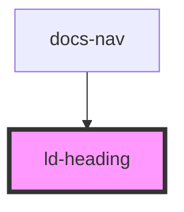

---
eleventyNavigation:
  key: Heading
  parent: Components
layout: layout.njk
title: Heading
permalink: liquid/components/ld-heading/
---

# Heading

Headings are used as an introduction into a topic and for visual differentiation between content blocks. Headlines require hierarchies and a placement conform with these.

---

## Examples

### With heading level


<ld-heading level="1">
  Almost before we knew it, we had left the ground.
</ld-heading>

<ld-heading level="2">
  Almost before we knew it, we had left the ground.
</ld-heading>

<ld-heading level="3">
  Almost before we knew it, we had left the ground.
</ld-heading>

<ld-heading level="4">
  Almost before we knew it, we had left the ground.
</ld-heading>

<ld-heading level="5">
  Almost before we knew it, we had left the ground.
</ld-heading>

<ld-heading level="6">
  Almost before we knew it, we had left the ground.
</ld-heading>

<!-- CSS component -->

<h1 class="ld-heading ld-heading--h1">
  Almost before we knew it, we had left the ground.
</h1>

<h2 class="ld-heading ld-heading--h2">
  Almost before we knew it, we had left the ground.
</h2>

<h3 class="ld-heading ld-heading--h3">
  Almost before we knew it, we had left the ground.
</h3>

<h4 class="ld-heading ld-heading--h4">
  Almost before we knew it, we had left the ground.
</h4>

<h5 class="ld-heading ld-heading--h5">
  Almost before we knew it, we had left the ground.
</h5>

<h6 class="ld-heading ld-heading--h6">
  Almost before we knew it, we had left the ground.
</h6>


### With deviating visual level `b*`


<ld-heading level="1" visual-level="b1" aria-label="Almost before we knew it, we had left the ground.">
Almost before we knew it, we had left the ground.
</ld-heading>

<ld-heading level="2" visual-level="b2" aria-label="Almost before we knew it, we had left the ground.">
  Almost before we knew it, we had left the ground.
</ld-heading>

<ld-heading level="3" visual-level="b3" aria-label="Almost before we knew it, we had left the ground.">
  Almost before we knew it, we had left the ground.
</ld-heading>

<ld-heading level="4" visual-level="b4" aria-label="Almost before we knew it, we had left the ground.">
  Almost before we knew it, we had left the ground.
</ld-heading>

<ld-heading level="5" visual-level="b5" aria-label="Almost before we knew it, we had left the ground.">
  Almost before we knew it, we had left the ground.
</ld-heading>

<ld-heading level="6" visual-level="b6" aria-label="Almost before we knew it, we had left the ground.">
  Almost before we knew it, we had left the ground.
</ld-heading>

<!-- CSS component -->

<h1 class="ld-heading ld-heading--b1" aria-label="Almost before we knew it, we had left the ground.">
  Almost before we knew it, we had left the ground.
</h1>

<h2 class="ld-heading ld-heading--b2" aria-label="Almost before we knew it, we had left the ground.">
  Almost before we knew it, we had left the ground.
</h2>

<h3 class="ld-heading ld-heading--b3" aria-label="Almost before we knew it, we had left the ground.">
  Almost before we knew it, we had left the ground.
</h3>

<h4 class="ld-heading ld-heading--b4" aria-label="Almost before we knew it, we had left the ground.">
  Almost before we knew it, we had left the ground.
</h4>

<h5 class="ld-heading ld-heading--b5" aria-label="Almost before we knew it, we had left the ground.">
  Almost before we knew it, we had left the ground.
</h5>

<h6 class="ld-heading ld-heading--b6" aria-label="Almost before we knew it, we had left the ground.">
  Almost before we knew it, we had left the ground.
</h6>


### With deviating visual level `xh*`


<ld-heading level="1" visual-level="xh1">
  Almost before we knew it, we had left the ground.
</ld-heading>

<ld-heading level="2" visual-level="xh2">
  Almost before we knew it, we had left the ground.
</ld-heading>

<ld-heading level="3" visual-level="xh3">
  Almost before we knew it, we had left the ground.
</ld-heading>

<!-- CSS component -->

<h1 class="ld-heading ld-heading--xh1">
  Almost before we knew it, we had left the ground.
</h1>

<h2 class="ld-heading ld-heading--xh2">
  Almost before we knew it, we had left the ground.
</h2>

<h3 class="ld-heading ld-heading--xh3">
  Almost before we knew it, we had left the ground.
</h3>


### With deviating visual level `xb*`


<ld-heading level="1" visual-level="xb1" aria-label="Almost before we knew it, we had left the ground.">
  Almost before we knew it, we had left the ground.
</ld-heading>

<ld-heading level="2" visual-level="xb2" aria-label="Almost before we knew it, we had left the ground.">
  Almost before we knew it, we had left the ground.
</ld-heading>

<ld-heading level="3" visual-level="xb3" aria-label="Almost before we knew it, we had left the ground.">
  Almost before we knew it, we had left the ground.
</ld-heading>

<!-- CSS component -->

<h1 class="ld-heading ld-heading--xb1" aria-label="Almost before we knew it, we had left the ground.">
  Almost before we knew it, we had left the ground.
</h1>

<h2 class="ld-heading ld-heading--xb2" aria-label="Almost before we knew it, we had left the ground.">
  Almost before we knew it, we had left the ground.
</h2>

<h3 class="ld-heading ld-heading--xb3" aria-label="Almost before we knew it, we had left the ground.">
  Almost before we knew it, we had left the ground.
</h3>


<!-- Auto Generated Below -->

## Properties

| Property             | Attribute      | Description                                                                                                                                                                                                                                                 | Type                                                                                                                                                                            | Default     |
| -------------------- | -------------- | ----------------------------------------------------------------------------------------------------------------------------------------------------------------------------------------------------------------------------------------------------------- | ------------------------------------------------------------------------------------------------------------------------------------------------------------------------------- | ----------- |
| `ariaLabel`          | `aria-label`   | **This prop is required if you're using a b1 to b6 or xb1 to xb3 visual level**: Since b1 to b6 headings are uppercase headings, screen readers need to be served a (non-uppercase) aria-label (otherwise they will read out the heading letter by letter). | `string`                                                                                                                                                                        | `undefined` |
| `level` _(required)_ | `level`        | The heading level.                                                                                                                                                                                                                                          | `"1" \| "2" \| "3" \| "4" \| "5" \| "6" \| 1 \| 2 \| 3 \| 4 \| 5 \| 6`                                                                                                          | `undefined` |
| `visualLevel`        | `visual-level` | The heading style. Overrides the style inferred from the heading level.                                                                                                                                                                                     | `"h1" \| "h2" \| "h3" \| "h4" \| "h5" \| "h6" \| "b1" \| "b2" \| "b3" \| "b4" \| "b5" \| "b6" \| "xb1" \| "xb2" \| "xb3" \| "xh1" \| "xh2" \| "xh3" \| "xh4" \| "xh5" \| "xh6"` | `undefined` |

## Dependencies

### Used by

 - docs-nav

### Graph

----------------------------------------------

*Built with [StencilJS](https://stenciljs.com/)*
