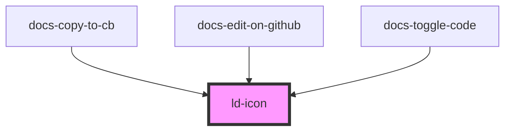

---
eleventyNavigation:
  key: Icon
  parent: Components
layout: layout.njk
title: Icon
permalink: liquid/components/ld-icon/
---

# Icon

## Web component


<ld-icon name="placeholder"></ld-icon>
__

### Different sizes


<ld-icon name="placeholder" size="sm"></ld-icon>

<ld-icon name="placeholder"></ld-icon>

<ld-icon name="placeholder" size="lg"></ld-icon>


### Color

Liquid's icons use the [`currentColor`](https://developer.mozilla.org/en-US/docs/Web/CSS/color_value#currentcolor_keyword) value for fills or strokes, which means that you can adjust the icon color by setting the `color` property value of the `ld-icon` component or a wrapping element.


<ld-icon name="placeholder" style="color: var(--ld-col-vc-default)"></ld-icon>

  <ld-icon name="placeholder"></ld-icon>



### With custom SVG icon


<ld-icon>
<svg viewBox="0 0 24 24"><path fill="currentColor" d="M16.48 20.335a3.622 3.622 0 01-7.244 0h7.244zm2.748-6.48l2.024 1.94c.297.284.464.677.464 1.088v.801c0 .833-.675 1.51-1.508 1.51h-14.7A1.51 1.51 0 014 17.683v-.76c0-.434.188-.848.516-1.134l1.922-1.683c.328-.286.516-.7.516-1.135V8.858a5.878 5.878 0 013.498-5.37c.556-.249.931-.78.931-1.39v-.622a1.476 1.476 0 112.952 0v.622c0 .61.375 1.141.931 1.39 2.06.918 3.5 2.97 3.5 5.37v3.908c0 .411.167.805.463 1.09z" fill-rule="evenodd"/></svg>
</ld-icon>


<!-- Auto Generated Below -->

## Properties

| Property | Attribute | Description                               | Type           | Default     |
| -------- | --------- | ----------------------------------------- | -------------- | ----------- |
| `filled` | `filled`  | (optional) Set to true for a filled icon. | `boolean`      | `null`      |
| `name`   | `name`    | The icon name.                            | `string`       | `null`      |
| `size`   | `size`    | Size of the icon.                         | `"lg" \| "sm"` | `undefined` |

## Slots

| Slot | Description                                                |
| ---- | ---------------------------------------------------------- |
|      | (optional) Custom SVG icon (only valid without name prop). |

## Dependencies

### Used by

 - docs-copy-to-cb
 - docs-edit-on-github
 - docs-toggle-code

### Graph

----------------------------------------------

*Built with [StencilJS](https://stenciljs.com/)*
