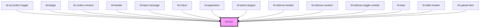

---
eleventyNavigation:
  key: Icon
  parent: Components
layout: layout.njk
title: Icon
permalink: components/ld-icon/
---

# ld-icon

<link rel="stylesheet" href="{{ env.base }}/{{ buildstamp }}css_components/ld-icon.css">

An icon provides a visual hint for content or interactions. Combine it with textual information for a better user experience. When using an icon on its own, make sure to either apply an [`aria-label`](https://developer.mozilla.org/en-US/docs/Web/Accessibility/ARIA/ARIA_Techniques/Using_the_aria-label_attribute) or use the [ld-sr-only](components/ld-sr-only/) component.

---

## Examples


<ld-icon name="placeholder"></ld-icon>

<!-- React component -->

<LdIcon name="placeholder" />

<!-- CSS component -->

  <svg viewBox="0 0 24 24" fill="none">
    <rect x="1.5" y="1.5" width="21" height="21" rx="4.5" stroke="currentColor" stroke-width="3"/>
    <circle cx="12" cy="12" r="4.5" stroke="currentColor" stroke-width="3"/>
  </svg>



### Different sizes


<ld-icon name="placeholder" size="sm"></ld-icon>

<ld-icon name="placeholder"></ld-icon>

<ld-icon name="placeholder" size="lg"></ld-icon>

<!-- React component -->

<LdIcon name="placeholder" size="sm" />

<LdIcon name="placeholder" />

<LdIcon name="placeholder" size="lg" />

<!-- CSS component -->

  <svg viewBox="0 0 24 24" fill="none">
    <rect x="1.5" y="1.5" width="21" height="21" rx="4.5" stroke="currentColor" stroke-width="3"/>
    <circle cx="12" cy="12" r="4.5" stroke="currentColor" stroke-width="3"/>
  </svg>

  <svg viewBox="0 0 24 24" fill="none">
    <rect x="1.5" y="1.5" width="21" height="21" rx="4.5" stroke="currentColor" stroke-width="3"/>
    <circle cx="12" cy="12" r="4.5" stroke="currentColor" stroke-width="3"/>
  </svg>

  <svg viewBox="0 0 24 24" fill="none">
    <rect x="1.5" y="1.5" width="21" height="21" rx="4.5" stroke="currentColor" stroke-width="3"/>
    <circle cx="12" cy="12" r="4.5" stroke="currentColor" stroke-width="3"/>
  </svg>



### Color

Liquid's icons use the [`currentColor`](https://developer.mozilla.org/en-US/docs/Web/CSS/color_value#currentcolor_keyword) value for fills or strokes, which means that you can adjust the icon color by setting the `color` property value of the `ld-icon` component or a wrapping element.


<ld-icon name="placeholder" style="color: var(--ld-col-vc)"></ld-icon>

  <ld-icon name="placeholder"></ld-icon>

<!-- React component -->

<LdIcon name="placeholder" style={ { color: 'var(--ld-col-vc)' } } />

  <LdIcon name="placeholder" />

<!-- CSS component -->

  <svg viewBox="0 0 24 24" fill="none">
    <rect x="1.5" y="1.5" width="21" height="21" rx="4.5" stroke="currentColor" stroke-width="3"/>
    <circle cx="12" cy="12" r="4.5" stroke="currentColor" stroke-width="3"/>
  </svg>

  
    <svg viewBox="0 0 24 24" fill="none">
      <rect x="1.5" y="1.5" width="21" height="21" rx="4.5" stroke="currentColor" stroke-width="3"/>
      <circle cx="12" cy="12" r="4.5" stroke="currentColor" stroke-width="3"/>
    </svg>
  



### With custom SVG icon


<ld-icon>
  <svg viewBox="0 0 24 24"><path fill="currentColor" d="M16.48 20.335a3.622 3.622 0 01-7.244 0h7.244zm2.748-6.48l2.024 1.94c.297.284.464.677.464 1.088v.801c0 .833-.675 1.51-1.508 1.51h-14.7A1.51 1.51 0 014 17.683v-.76c0-.434.188-.848.516-1.134l1.922-1.683c.328-.286.516-.7.516-1.135V8.858a5.878 5.878 0 013.498-5.37c.556-.249.931-.78.931-1.39v-.622a1.476 1.476 0 112.952 0v.622c0 .61.375 1.141.931 1.39 2.06.918 3.5 2.97 3.5 5.37v3.908c0 .411.167.805.463 1.09z" fill-rule="evenodd"/></svg>
</ld-icon>

<!-- React component -->

<LdIcon>
  <svg viewBox="0 0 24 24"><path fill="currentColor" d="M16.48 20.335a3.622 3.622 0 01-7.244 0h7.244zm2.748-6.48l2.024 1.94c.297.284.464.677.464 1.088v.801c0 .833-.675 1.51-1.508 1.51h-14.7A1.51 1.51 0 014 17.683v-.76c0-.434.188-.848.516-1.134l1.922-1.683c.328-.286.516-.7.516-1.135V8.858a5.878 5.878 0 013.498-5.37c.556-.249.931-.78.931-1.39v-.622a1.476 1.476 0 112.952 0v.622c0 .61.375 1.141.931 1.39 2.06.918 3.5 2.97 3.5 5.37v3.908c0 .411.167.805.463 1.09z" fillRule="evenodd"/></svg>
</LdIcon>

<!-- CSS component -->

  <svg viewBox="0 0 24 24"><path fill="currentColor" d="M16.48 20.335a3.622 3.622 0 01-7.244 0h7.244zm2.748-6.48l2.024 1.94c.297.284.464.677.464 1.088v.801c0 .833-.675 1.51-1.508 1.51h-14.7A1.51 1.51 0 014 17.683v-.76c0-.434.188-.848.516-1.134l1.922-1.683c.328-.286.516-.7.516-1.135V8.858a5.878 5.878 0 013.498-5.37c.556-.249.931-.78.931-1.39v-.622a1.476 1.476 0 112.952 0v.622c0 .61.375 1.141.931 1.39 2.06.918 3.5 2.97 3.5 5.37v3.908c0 .411.167.805.463 1.09z" fill-rule="evenodd"/></svg>



## Available icons

All icons listed below are bundled with Liquid. As a developer, you don't need to download any of the icons. Just use the `ld-icon` component and insert the name of the desired icon, as illustrated in the examples above. Right-click on the icons below to copy their technical names for use in the `ld-icon` component.

Right-click an icon below to download its SVG file. To download all icons at once, use this button:

<ld-button class="ld-theme-bubblegum" href="https://downgit.github.io/#/home?url=https:%2F%2Fgithub.com%2Femdgroup-liquid%2Fliquid%2Ftree%2Fmain%2Fsrc%2Fliquid%2Fcomponents%2Fld-icon%2Fassets">Download all icons</ld-button>

<docs-icon-group name="System Technical">
  <docs-icon identifier="phone" name="Phone"></docs-icon>
  <docs-icon identifier="bin" name="Bin"></docs-icon>
  <docs-icon identifier="lock-save" name="Lock Save"></docs-icon>
  <docs-icon identifier="bulb" name="Bulb"></docs-icon>
  <docs-icon identifier="layer" name="Layer"></docs-icon>
  <docs-icon identifier="dashboard" name="Dashboard"></docs-icon>
  <docs-icon identifier="control" name="Control"></docs-icon>
  <docs-icon identifier="house" name="House"></docs-icon>
  <docs-icon identifier="favorite" name="Favorite"></docs-icon>
  <docs-icon identifier="mail" name="Mail"></docs-icon>
  <docs-icon identifier="settings" name="Settings"></docs-icon>
  <docs-icon identifier="m-card" name="M Card"></docs-icon>
  <docs-icon identifier="user" name="User"></docs-icon>
  <docs-icon identifier="clip" name="Clip"></docs-icon>
  <docs-icon identifier="share" name="Share"></docs-icon>
  <docs-icon identifier="wi-fi" name="Wi Fi"></docs-icon>
  <docs-icon identifier="shield" name="Shield"></docs-icon>
  <docs-icon identifier="secure-conncetion" name="Secure Conncetion"></docs-icon>
  <docs-icon identifier="security" name="Security"></docs-icon>
</docs-icon-group>

<docs-icon-group name="UXSD">
  <docs-icon identifier="ux" name="UX"></docs-icon>
  <docs-icon identifier="donut" name="Donut"></docs-icon>
  <docs-icon identifier="beard" name="Beard"></docs-icon>
  <docs-icon identifier="sock" name="Sock"></docs-icon>
  <docs-icon identifier="website" name="Website"></docs-icon>
  <docs-icon identifier="monkey" name="Monkey"></docs-icon>
  <docs-icon identifier="baby" name="Baby"></docs-icon>
  <docs-icon identifier="choir" name="Choir"></docs-icon>
  <docs-icon identifier="cabriolet" name="Cabriolet"></docs-icon>
  <docs-icon identifier="football" name="Football"></docs-icon>
  <docs-icon identifier="plant" name="Plant"></docs-icon>
  <docs-icon identifier="youtube" name="YouTube"></docs-icon>
  <docs-icon identifier="pisces" name="Pisces"></docs-icon>
  <docs-icon identifier="san-francisco" name="San Francisco"></docs-icon>
  <docs-icon identifier="gamepad" name="Gamepad"></docs-icon>
  <docs-icon identifier="tea-pot" name="Tea Pot"></docs-icon>
  <docs-icon identifier="burger" name="Burger"></docs-icon>
  <docs-icon identifier="meetup" name="Meetup"></docs-icon>
  <docs-icon identifier="matryoshka" name="Matryoshka"></docs-icon>
</docs-icon-group>

<docs-icon-group name="Documentation">
  <docs-icon identifier="documents" name="Documents"></docs-icon>
  <docs-icon identifier="pdf" name="PDF"></docs-icon>
  <docs-icon identifier="zip" name="ZIP"></docs-icon>
  <docs-icon identifier="documents-storage" name="Documents Storage"></docs-icon>
  <docs-icon identifier="files" name="Files"></docs-icon>
  <docs-icon identifier="jpeg" name="JPEG"></docs-icon>
</docs-icon-group>

<docs-icon-group name="Technology">
  <docs-icon identifier="camera" name="Camera"></docs-icon>
  <docs-icon identifier="camcorder" name="Camcorder"></docs-icon>
  <docs-icon identifier="data-storage" name="Data Storage"></docs-icon>
  <docs-icon identifier="cloud" name="Cloud"></docs-icon>
  <docs-icon identifier="cloud-download" name="Cloud Download"></docs-icon>
  <docs-icon identifier="cloud-upload" name="Cloud Upload"></docs-icon>
  <docs-icon identifier="laptop" name="Laptop"></docs-icon>
  <docs-icon identifier="mobile" name="Mobile"></docs-icon>
  <docs-icon identifier="laptop-mobile" name="Laptop + Mobile"></docs-icon>
  <docs-icon identifier="watch" name="Watch"></docs-icon>
  <docs-icon identifier="vr" name="VR"></docs-icon>
  <docs-icon identifier="battery" name="Battery"></docs-icon>
  <docs-icon identifier="battery-full" name="Battery Full"></docs-icon>
  <docs-icon identifier="battery-half" name="Battery Half"></docs-icon>
  <docs-icon identifier="battery-low" name="Battery Low"></docs-icon>
  <docs-icon identifier="battery-empty" name="Battery Empty"></docs-icon>
</docs-icon-group>

<docs-icon-group name="Healtcare">
  <docs-icon identifier="pulse" name="Pulse"></docs-icon>
  <docs-icon identifier="syringe" name="Syringe"></docs-icon>
  <docs-icon identifier="monitor" name="Monitor"></docs-icon>
  <docs-icon identifier="big-cross" name="Big Cross"></docs-icon>
  <docs-icon identifier="pill" name="Pill"></docs-icon>
  <docs-icon identifier="medicine" name="Medicine"></docs-icon>
  <docs-icon identifier="medical-file" name="Medical File"></docs-icon>
  <docs-icon identifier="stethoscope" name="Stethoscope"></docs-icon>
  <docs-icon identifier="first-aid" name="First Aid"></docs-icon>
</docs-icon-group>

<docs-icon-group name="Science">
  <docs-icon identifier="flask" name="Flask"></docs-icon>
  <docs-icon identifier="test-tube" name="Test Tube"></docs-icon>
  <docs-icon identifier="pipette" name="Pipette"></docs-icon>
  <docs-icon identifier="beaker" name="Beaker"></docs-icon>
  <docs-icon identifier="bottle" name="Bottle"></docs-icon>
  <docs-icon identifier="dna" name="DNA"></docs-icon>
  <docs-icon identifier="atom" name="Atom"></docs-icon>
  <docs-icon identifier="bacteria-microscope-view" name="Bacteria Microscope View"></docs-icon>
  <docs-icon identifier="virus" name="Virus"></docs-icon>
  <docs-icon identifier="microscope" name="Microscope"></docs-icon>
  <docs-icon identifier="scientific-paper" name="Scientific Paper"></docs-icon>
</docs-icon-group>

<docs-icon-group name="Creative Break">
  <docs-icon identifier="pretzel" name="Pretzel"></docs-icon>
  <docs-icon identifier="coffee" name="Coffee"></docs-icon>
  <docs-icon identifier="pen" name="Pen"></docs-icon>
  <docs-icon identifier="chat" name="Chat"></docs-icon>
  <docs-icon identifier="conversation" name="Conversation"></docs-icon>
  <docs-icon identifier="scissors" name="Scissors"></docs-icon>
  <docs-icon identifier="education" name="Education"></docs-icon>
  <docs-icon identifier="keys" name="Keys"></docs-icon>
  <docs-icon identifier="puzzle" name="Puzzle"></docs-icon>
  <docs-icon identifier="3d" name="3D"></docs-icon>
</docs-icon-group>

<docs-icon-group name="Transport">
  <docs-icon identifier="truck" name="Truck"></docs-icon>
  <docs-icon identifier="location" name="Location"></docs-icon>
  <docs-icon identifier="world" name="World"></docs-icon>
  <docs-icon identifier="plane" name="Plane"></docs-icon>
  <docs-icon identifier="energy" name="Energy"></docs-icon>
  <docs-icon identifier="rocket" name="Rocket"></docs-icon>
  <docs-icon identifier="car" name="Car"></docs-icon>
  <docs-icon identifier="electric-car" name="Electric Car"></docs-icon>
  <docs-icon identifier="logistic" name="Logistic"></docs-icon>
  <docs-icon identifier="satelite" name="Satelite"></docs-icon>
</docs-icon-group>

<docs-icon-group name="Finance">
  <docs-icon identifier="euro" name="Euro"></docs-icon>
  <docs-icon identifier="pound" name="Pound"></docs-icon>
  <docs-icon identifier="dollar" name="Dollar"></docs-icon>
  <docs-icon identifier="bitcoin" name="Bitcoin"></docs-icon>
  <docs-icon identifier="cost-center" name="Cost Center"></docs-icon>
  <docs-icon identifier="money" name="Money"></docs-icon>
  <docs-icon identifier="credit-card" name="Credit Card"></docs-icon>
  <docs-icon identifier="savings" name="Savings"></docs-icon>
  <docs-icon identifier="finance" name="Finance"></docs-icon>
</docs-icon-group>

<docs-icon-group name="Shopping">
  <docs-icon identifier="coupon" name="Coupon"></docs-icon>
  <docs-icon identifier="basket" name="Basket"></docs-icon>
</docs-icon-group>

<docs-icon-group name="Sustainability">
  <docs-icon identifier="eco" name="Eco"></docs-icon>
  <docs-icon identifier="solar-power" name="Solar Power"></docs-icon>
</docs-icon-group>

<docs-icon-group name="Modifiers">
  <docs-icon identifier="add" name="Add"></docs-icon>
  <docs-icon identifier="magnifier" name="Magnifier"></docs-icon>
  <docs-icon identifier="cross" name="Cross"></docs-icon>
  <docs-icon identifier="option" name="Option"></docs-icon>
  <docs-icon identifier="attention" name="Attention"></docs-icon>
  <docs-icon identifier="list" name="List"></docs-icon>
  <docs-icon identifier="burger-menu" name="Burger Menu"></docs-icon>
  <docs-icon identifier="cards" name="Cards"></docs-icon>
  <docs-icon identifier="navigator" name="Navigator"></docs-icon>
  <docs-icon identifier="external-export" name="External/ Export"></docs-icon>
  <docs-icon identifier="upload" name="Upload"></docs-icon>
  <docs-icon identifier="repost" name="Repost"></docs-icon>
  <docs-icon identifier="visibility" name="Visibility"></docs-icon>
  <docs-icon identifier="checkmark" name="Checkmark"></docs-icon>
  <docs-icon identifier="filter" name="Filter"></docs-icon>
  <docs-icon identifier="play" name="Play"></docs-icon>
  <docs-icon identifier="pause" name="Pause"></docs-icon>
  <docs-icon identifier="stop" name="Stop"></docs-icon>
  <docs-icon identifier="rewind" name="Rewind"></docs-icon>
  <docs-icon identifier="fast-forward" name="Fast Forward"></docs-icon>
  <docs-icon identifier="audio" name="Audio"></docs-icon>
  <docs-icon identifier="mic" name="Mic"></docs-icon>
  <docs-icon identifier="arrow-down" name="Arrow Down"></docs-icon>
  <docs-icon identifier="arrow-up" name="Arrow Up"></docs-icon>
  <docs-icon identifier="arrow-left" name="Arrow Left"></docs-icon>
  <docs-icon identifier="arrow-right" name="Arrow Right"></docs-icon>
  <docs-icon identifier="arrow-up-n-down" name="Arrow Up n’Down"></docs-icon>
  <docs-icon identifier="arrow-double-left" name="Arrow Double Left"></docs-icon>
  <docs-icon identifier="arrow-double-right" name="Arrow Double Right"></docs-icon>
  <docs-icon identifier="real-arrow" name="Real Arrow"></docs-icon>
  <docs-icon identifier="star" name="Star"></docs-icon>
  <docs-icon identifier="half-star" name="Half Star"></docs-icon>
  <docs-icon identifier="dot" name="Dot"></docs-icon>
  <docs-icon identifier="half-dot" name="Half Dot"></docs-icon>
  <docs-icon identifier="calendar" name="Calendar"></docs-icon>
  <docs-icon identifier="clock" name="Clock"></docs-icon>
  <docs-icon identifier="bell" name="Bell"></docs-icon>
  <docs-icon identifier="copy" name="Copy"></docs-icon>
  <docs-icon identifier="hyperlink" name="Hyperlink"></docs-icon>
</docs-icon-group>

<!-- Auto Generated Below -->

## Properties

| Property | Attribute | Description                                              | Type               | Default     |
| -------- | --------- | -------------------------------------------------------- | ------------------ | ----------- |
| `key`    | `key`     | for tracking the node's identity when working with lists | `string \| number` | `undefined` |
| `name`   | `name`    | The icon name.                                           | `string`           | `null`      |
| `ref`    | `ref`     | reference to component                                   | `any`              | `undefined` |
| `size`   | `size`    | Size of the icon.                                        | `"lg" \| "sm"`     | `undefined` |

## Slots

| Slot | Description                                                |
| ---- | ---------------------------------------------------------- |
|      | (optional) Custom SVG icon (only valid without name prop). |

## Shadow Parts

| Part     | Description        |
| -------- | ------------------ |
| `"icon"` | Actual SVG element |

## Dependencies

### Used by

 - [ld-accordion-toggle](../ld-accordion/ld-accordion-toggle)
 - [ld-badge](../ld-badge)
 - [ld-cookie-consent](../ld-cookie-consent)
 - [ld-header](../ld-header)
 - [ld-input-message](../ld-input-message)
 - [ld-notice](../ld-notice)
 - [ld-pagination](../ld-pagination)
 - ld-select-popper
 - [ld-sidenav-header](../ld-sidenav/ld-sidenav-header)
 - [ld-sidenav-navitem](../ld-sidenav/ld-sidenav-navitem)
 - [ld-sidenav-toggle-outside](../ld-sidenav/ld-sidenav-toggle-outside)
 - [ld-step](../ld-stepper/ld-step)
 - [ld-table-header](../ld-table/ld-table-header)
 - [ld-upload-item](../ld-file-upload/ld-upload-item)

### Graph

----------------------------------------------

*Built with [StencilJS](https://stenciljs.com/)*
