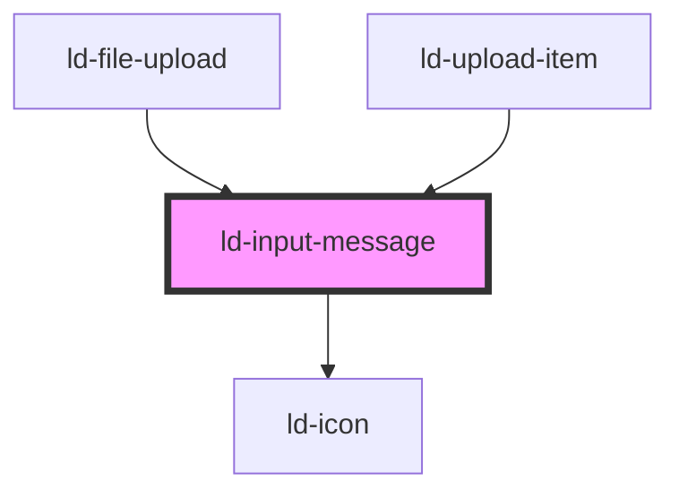

---
eleventyNavigation:
  key: Input Message
  parent: Components
layout: layout.njk
title: Input Message
permalink: components/ld-input-message/
---

# ld-input-message

<link rel="stylesheet" href="{{ env.base }}/{{ buildstamp }}css_components/ld-input-message.css">
<link rel="stylesheet" href="{{ env.base }}/{{ buildstamp }}css_components/ld-icon.css">

This component is meant to be used in conjunction with the [`ld-input`](components/ld-input/) and the [`ld-label`](components/ld-label/) component. Please reffer to the [`ld-input`](components/ld-input/) docs for further usage examples.

<ld-notice headline="Note" mode="warning">
  The <code>ld-input-message</code> with a mode other than <code>"info"</code> is supposed to be used on white background only, as on other backgrounds the color contrast of the text is insufficient against the background. 
</ld-notice>

<ld-notice headline="Note" mode="warning">
  If you choose to use the CSS component and plan to conditionally show the message, such as when an input field becomes invalid after user interaction, you will need to make sure that screen readers or other assistive technology become aware of a message as soon as it becomes visible. You might want to use <a href="https://developer.mozilla.org/en-US/docs/Web/Accessibility/ARIA/ARIA_Live_Regions" rel="noreferrer noopener" target="_blank">ARIA live regions</a> for this matter.
</ld-notice>

## Examples

### As error message


<ld-input-message>This field is required.</ld-input-message>

<!-- React component -->

<LdInputMessage>This field is required.</LdInputMessage>

<!-- CSS component -->

  <!-- Note that you can use an img element with the class ld-input-message__icon here, as well. -->
  <svg class="ld-input-message__icon ld-icon ld-icon--sm" width="14" height="14" viewBox="0 0 14 14" fill="none">
    <path fill-rule="evenodd" clip-rule="evenodd" d="M7 14C10.866 14 14 10.866 14 7C14 3.13401 10.866 0 7 0C3.13401 0 0 3.13401 0 7C0 10.866 3.13401 14 7 14Z" fill="currentColor"/>
    <path d="M4.66675 4.66699L9.33341 9.33366" stroke="var(--ld-col-wht)" stroke-width="2" stroke-linecap="round" stroke-linejoin="round"/>
    <path d="M4.66675 9.33301L9.33341 4.66634" stroke="var(--ld-col-wht)" stroke-width="2" stroke-linecap="round" stroke-linejoin="round"/>
  </svg>
  This field is required.



### As info message


<ld-input-message mode="info">This field will destroy itself on form submission.</ld-input-message>

<!-- React component -->

<LdInputMessage mode="info">This field will destroy itself on form submission.</LdInputMessage>

<!-- CSS component -->

  <!-- Note that you can use an img element with the class ld-input-message__icon here, as well. -->
  <svg class="ld-input-message__icon ld-icon ld-icon--sm" width="14" height="14" viewBox="0 0 14 14" fill="none">
    <path fill-rule="evenodd" clip-rule="evenodd" d="M7 14C10.866 14 14 10.866 14 7C14 3.13401 10.866 0 7 0C3.13401 0 0 3.13401 0 7C0 10.866 3.13401 14 7 14Z" fill="var(--ld-thm-warning)"/>
    <path fill-rule="evenodd" clip-rule="evenodd" d="M7.18234 11.0254C6.79228 11.0254 6.48657 10.9147 6.26518 10.6933C6.0438 10.472 5.93311 10.1662 5.93311 9.77618V6.12335C5.93311 5.99685 6.0069 5.93359 6.15449 5.93359H6.89771C7.28776 5.93359 7.59348 6.04428 7.81487 6.26567C8.03625 6.48705 8.14694 6.79277 8.14694 7.18283V10.8357C8.14694 10.9622 8.07315 11.0254 7.92556 11.0254H7.18234Z" fill="var(--ld-col-neutral-900)"/>
    <ellipse cx="6.99977" cy="3.80007" rx="1.06667" ry="1.06667" fill="var(--ld-col-neutral-900)"/>
  </svg>
  This field will destroy itself on form submission.



### As success message


<ld-input-message mode="valid">That's correct!</ld-input-message>

<!-- React component -->

<LdInputMessage mode="valid">That's correct!</LdInputMessage>

<!-- CSS component -->

  <!-- Note that you can use an img element with the class ld-input-message__icon here, as well. -->
  <svg class="ld-input-message__icon ld-icon ld-icon--sm" width="14" height="14" viewBox="0 0 14 14" fill="none">
    <circle cx="7" cy="7" r="7" fill="currentColor"/>
    <path stroke="var(--ld-col-wht)" stroke-linecap="round" stroke-linejoin="round" stroke-width="2" d="M10.1 5.1L6.1 9 3.8 6.8"/>
  </svg>
  That's correct!



<!-- Auto Generated Below -->

## Properties

| Property | Attribute | Description                                              | Type                           | Default     |
| -------- | --------- | -------------------------------------------------------- | ------------------------------ | ----------- |
| `key`    | `key`     | for tracking the node's identity when working with lists | `string \| number`             | `undefined` |
| `mode`   | `mode`    | Input message mode.                                      | `"error" \| "info" \| "valid"` | `'error'`   |
| `ref`    | `ref`     | reference to component                                   | `any`                          | `undefined` |

## Shadow Parts

| Part     | Description                 |
| -------- | --------------------------- |
| `"icon"` | Image tag used for the icon |

## Dependencies

### Used by

 - [ld-file-upload](../ld-file-upload)
 - [ld-upload-item](../ld-file-upload/ld-upload-item)

### Depends on

- [ld-icon](../ld-icon)

### Graph

----------------------------------------------

*Built with [StencilJS](https://stenciljs.com/)*
