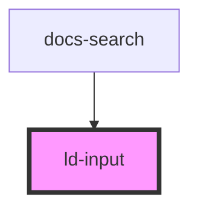

---
eleventyNavigation:
  key: Input
  parent: Components
layout: layout.njk
title: Input
permalink: liquid/components/ld-input/
---

# ld-input

---

## Web component


<ld-input placeholder="Placeholder"></ld-input>
<ld-input value="Value"></ld-input>


### Disabled


<ld-input placeholder="Placeholder" disabled></ld-input>
<ld-input disabled value="Value"></ld-input>


**If you want the input to stay focusable** even if it is disabled, use `aria-disabled` in place of `disabled`:


<ld-input placeholder="Placeholder" aria-disabled></ld-input>
<ld-input aria-disabled value="Value"></ld-input>


> **Note:** When `aria-disabled` is applied on the input, the component will try to prevent user input  by resetting the input to its previous value on each input event.

### Light mode


<ld-input mode="light" placeholder="Placeholder"></ld-input>
<ld-input mode="light" value="Value"></ld-input>


### Light mode, disabled


<ld-input mode="light" disabled placeholder="Placeholder"></ld-input>
<ld-input mode="light" disabled value="Value"></ld-input>


### With label


<ld-label>
  Email Address
  <ld-input placeholder="jane.doe@example.com"></ld-input>
</ld-label>


Please reffer to the [ld-label](/liquid/components/ld-label/) docs for more information on the label component.

### With label and input message



  <ld-label>
    Email Address
    <ld-input invalid placeholder="jane.doe@example.com" value="yolo"></ld-input>
    <ld-input-message>The email address is invalid.</ld-input-message>
  </ld-label>

  <ld-label>
    Password
    <ld-input type="password" value="asdf1234" type password></ld-input>
    <ld-input-message mode="info">Use at least one special character (~!@#$%^&*_-+=|\(){}[]:;<>,.?/)</ld-input-message>
  </ld-label>



#### On input message width and placement

By default, the input field stretches to the maximum width of its wrapping label, which in turn stretches to the width of its content (the computed width of the `ld-input-message` component). So, if you want to set certain constraints on the width of all three components, you can do so by setting the constraint on the wrapping element – the `ld-label` component.


<ld-label>
  Email Address
  <ld-input placeholder="jane.doe@example.com"></ld-input>
  <ld-input-message mode="info">This info message is extremely long and makes all three components (the label, the input and itself) grow horizontaly.</ld-input-message>
</ld-label>

<ld-label style="max-width: 20rem">
  Email Address
  <ld-input placeholder="jane.doe@example.com"></ld-input>
  <ld-input-message mode="info">This info message is also extremely long, but since the label has a max width, all three components (the label, the input and itself) can take only the maximum width of the label.</ld-input-message>
</ld-label>


When displaying input messages conditionally (i.e. an error message becomes visible as soon as an input has been interacted with, but the value is still invalid) you should try to position UI elements in a way that prevents [layout shifts](https://web.dev/cls/). For instance, you can “reserve space” for your messages and then make them appear in the reserved space without pushing other content to the bottom (i.e. using `position: absolute` or some “flexy” layout). Needless to say, results look best if you keep the messages short.

### With type search


<ld-input placeholder="Search" type="search"></ld-input>


### With slotted elements

You can use [slots](#slots) in order to add static or interactive elements, such as icons or buttons into the input component.

#### With icon


<ld-input placeholder="Placeholder">
  <ld-icon name="placeholder" size="sm" slot="item-end"></ld-icon>
</ld-input>
  <ld-input placeholder="Placeholder">
<ld-icon name="placeholder" size="sm" slot="item-start"></ld-icon>
</ld-input>
<ld-input placeholder="Placeholder">
  <ld-icon name="placeholder" size="sm" slot="item-start"></ld-icon>
  <ld-icon name="placeholder" size="sm" slot="item-end"></ld-icon>
</ld-input>


#### With button


<ld-input placeholder="Placeholder">
  <ld-button mode="ghost" slot="item-end">
    <ld-icon name="placeholder" size="sm"></ld-icon>
  </ld-button>
</ld-input>
<ld-input placeholder="Placeholder">
  <ld-button mode="ghost" slot="item-start">
    <ld-icon name="placeholder" size="sm"></ld-icon>
  </ld-button>
</ld-input>
<ld-input placeholder="Placeholder">
  <ld-button mode="ghost" slot="item-start">
    <ld-icon name="placeholder" size="sm"></ld-icon>
  </ld-button>
  <ld-button mode="ghost" slot="item-end">
    <ld-icon name="placeholder" size="sm"></ld-icon>
  </ld-button>
</ld-input>
<ld-input placeholder="Placeholder">
  <ld-button slot="item-end">
    <ld-icon name="placeholder" size="sm"></ld-icon>
  </ld-button>
</ld-input>
<ld-input placeholder="Placeholder">
  <ld-button slot="item-end">
    search <ld-icon name="placeholder" size="sm"></ld-icon>
  </ld-button>
</ld-input>
<ld-input placeholder="Placeholder">
  <ld-button size="sm" slot="item-end">
    search <ld-icon name="placeholder" size="sm"></ld-icon>
  </ld-button>
</ld-input>


### Input validation

The `ld-input` component does not provide any properties or methods for validating the input value internally. Instead, it provides a low level API for integrating the component with the form validation solution of your choice. It allows you to listen for `focus`, `input` and `blur` events and setting error / info messages via the [`ld-input-message`](/liquid/components/ld-input-message/) component. The following is an example on how you could implement form validation with vanilla JS:



<form id="example-form" novalidate>
  <ld-label>
    Login*
    <ld-input required placeholder="login"></ld-input>
    <ld-input-message visible="false">This field is required.</ld-input-message>
  </ld-label>
  <ld-label>
    Password*
    <ld-input required placeholder="password" type="password"></ld-input>
    <ld-input-message visible="false">This field is required.</ld-input-message>
  </ld-label>
  <ld-button>Submit</ld-button>
</form>



<!-- Auto Generated Below -->

## Properties

| Property      | Attribute     | Description                                                                        | Type                | Default     |
| ------------- | ------------- | ---------------------------------------------------------------------------------- | ------------------- | ----------- |
| `invalid`     | `invalid`     | Set this property to `true` in order to mark the field visually as invalid.        | `boolean`           | `undefined` |
| `mode`        | `mode`        | Input mode. Use `'dark'` on white backgrounds, use `'light'` on other backgrounds. | `"dark" \| "light"` | `'dark'`    |
| `placeholder` | `placeholder` | The input placeholder.                                                             | `string`            | `undefined` |
| `type`        | `type`        | The input type.                                                                    | `string`            | `undefined` |
| `value`       | `value`       | The input value.                                                                   | `string`            | `undefined` |

## Slots

| Slot           | Description                                                                                                                                                                                                                                                                                                                                                           |
| -------------- | --------------------------------------------------------------------------------------------------------------------------------------------------------------------------------------------------------------------------------------------------------------------------------------------------------------------------------------------------------------------- |
| `"item-end"`   | The purpose of this slot is to add icons or buttons to the input, __justifying the item to the start of the component__. Styling for `ld-icon` and `ld-button` is provided within the `ld-input` component. If you choose to place something different into the slot, you will probably need to adjust some styles on the slotted item in order to make it fit right. |
| `"item-start"` | The purpose of this slot is to add icons or buttons to the input, __justifying the item to the end of the component__. Styling for `ld-icon` and `ld-button` is provided within the `ld-input` component. If you choose to place something different into the slot, you will probably need to adjust some styles on the slotted item in order to make it fit right.   |

## Dependencies

### Used by

 - docs-search

### Graph

----------------------------------------------

*Built with [StencilJS](https://stenciljs.com/)*
