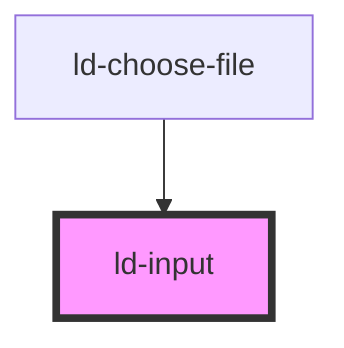

---
eleventyNavigation:
  key: Input
  parent: Components
layout: layout.njk
title: Input
permalink: components/ld-input/
---

<link rel="stylesheet" href="{{ env.base }}/{{ buildstamp }}css_components/ld-input.css">
<link rel="stylesheet" href="{{ env.base }}/{{ buildstamp }}css_components/ld-icon.css">
<link rel="stylesheet" href="{{ env.base }}/{{ buildstamp }}css_components/ld-button.css">
<link rel="stylesheet" href="{{ env.base }}/{{ buildstamp }}css_components/ld-label.css">
<link rel="stylesheet" href="{{ env.base }}/{{ buildstamp }}css_components/ld-input-message.css">

# ld-input

The `ld-input` component can be used in forms to accept data from the user. While the [native HTML input element](https://developer.mozilla.org/en-US/docs/Web/HTML/Element/input) supports a wide variety of types of input data and offers different control widgets, depending on the user agent, this component supports only a subset of the types available in the native HTML input element. All officially supported types of `ld-input` are documented here. Other form input widgets either have been implemented as separate components or may eventually be concidered for implementation in the future.

This component can be used in conjunction with the [`ld-label`](components/ld-label/) and the [`ld-input-message`](components/ld-input-message/) component.

---

## Examples

### Default

By default, the `ld-input` component is of [type `text`](https://developer.mozilla.org/en-US/docs/Web/HTML/Element/input/text).


<ld-input placeholder="Placeholder"></ld-input>

<!-- React component -->

<LdInput placeholder="Placeholder" />

<!-- CSS component -->

  <input placeholder="Placeholder">



### With value


<ld-input placeholder="Placeholder" value="Hello"></ld-input>

<!-- React component -->

<LdInput placeholder="Placeholder" value="Hello" />

<!-- CSS component -->

  <input placeholder="Placeholder" value="Hello">



### Disabled


<ld-input placeholder="Placeholder" disabled></ld-input>

<!-- React component -->

<LdInput placeholder="Placeholder" disabled />

<!-- CSS component -->

  <input placeholder="Placeholder" disabled>



**If you want the input to stay focusable** even if it is disabled, use `aria-disabled` in place of `disabled`:


<ld-input placeholder="Placeholder" aria-disabled="true"></ld-input>

<!-- React component -->

<LdInput placeholder="Placeholder" aria-disabled="true" />

<!-- CSS component -->

  <input
    placeholder="Placeholder"
    aria-disabled="true"
    id="focusable-disabled-input-1">

<!-- Example code for input prevention on aria-disabled input elements -->



<ld-notice headline="Note" mode="warning">
  When <code>aria-disabled</code> is applied on the input, the component will try to prevent user input by resetting the input to its previous value on each input event. However, if you are using the CSS component version of <code>ld-input</code> with <code>aria-disabled</code>, you will have to prevent the default behaviour of the input element yourself. 
</ld-notice>

### Dark

<ld-notice headline="Note" mode="warning">
  Dark tone inputs should only be used on white backgrounds.
</ld-notice>


<ld-input tone="dark" placeholder="Placeholder"></ld-input>

<!-- React component -->

<LdInput tone="dark" placeholder="Placeholder" />

<!-- CSS component -->

  <input placeholder="Placeholder">



### Invalid


<ld-input invalid placeholder="Placeholder"></ld-input>

<!-- React component -->

<LdInput invalid placeholder="Placeholder" />

<!-- CSS component -->

  <input placeholder="Placeholder">



### Type date

<ld-notice headline="Note" mode="info">
  The <code>ld-input</code> component of <code>type="date"</code> acts as a wrapper around the native <a href="https://developer.mozilla.org/en-US/docs/Web/HTML/Element/input/date"><code>input</code> element of<code>type="date"</code></a>, fully relying on its built-in features and only enhancing it visually. The component is lightweight, respects the user preferences for display format configured in the user's <abbr title="operating system">OS</abbr> settings, separates presentation format from wire format and is accessible out of the box by offering a familiar <abbr title="user interface">UI</abbr>.
</ld-notice>


<ld-input placeholder="Birthday" type="date" value="2017-06-01"></ld-input>

<!-- React component -->

<LdInput placeholder="Birthday" type="date" value="2017-06-01" />

<!-- CSS component -->

  <input placeholder="Birthday" type="date" value="2017-06-01">



### Type datetime-local

<ld-notice headline="Note" mode="info">
  The <code>ld-input</code> component of <code>type="datetime-local"</code> acts as a wrapper around the native <a href="https://developer.mozilla.org/en-US/docs/Web/HTML/Element/input/datetime-local"><code>input</code> element of<code>type="datetime-local"</code></a>, fully relying on its built-in features and only enhancing it visually. The component is lightweight, respects the user preferences for display format configured in the user's <abbr title="operating system">OS</abbr> settings, separates presentation format from wire format and is accessible out of the box by offering a familiar <abbr title="user interface">UI</abbr>.
</ld-notice>


<ld-input placeholder="Birthday" type="datetime-local" value="2017-06-01T19:30"></ld-input>

<!-- React component -->

<LdInput placeholder="Birthday" type="datetime-local" value="2017-06-01T19:30" />

<!-- CSS component -->

  <input placeholder="Birthday" type="datetime-local" value="2017-06-01T19:30">



### Type email

Triggerts associated keyboard in supporting browsers and devices with dynamic keyboards.


<ld-input placeholder="Your email address" type="email"></ld-input>

<!-- React component -->

<LdInput placeholder="Your email address" type="email" />

<!-- CSS component -->

  <input placeholder="Your email address" type="email">



### Type file


<ld-input placeholder="Your profile picture" type="file" accept="image/png, image/jpeg"></ld-input>

<!-- React component -->

<LdInput placeholder="Your profile picture" type="file" accept="image/png, image/jpeg" />


#### Handling files

If you are using the `ld-input` component within a `form` and are posting the form, there is no need to access the selected files and the underlying data, because they are submitted as part of the form data automatically.

However, if you want to compose the form data yourself or want to read the files on the client side, you can do so using the _readonly_ `files` prop.


<ld-input
  placeholder="Your profile picture"
  type="file"
  accept="image/png, image/jpeg"
></ld-input>

<!-- React component -->

<LdInput
  placeholder="Your profile picture"
  type="file"
  accept="image/png, image/jpeg"
  onLdchange={async (ev) => {
    const files = ev.target.files
    if (!files || !files.length) return

    // Read the file on the client side.
    const fileReader = new FileReader()
    fileReader.readAsDataURL(files[0])
    fileReader.onerror = (progressEvent) => {
      // Handle error...
    }
    fileReader.onloadend = (progressEvent) => {
      // Use file data...
    }

    // Or post the file to the server.
    const data = new FormData()
    data.append('userpic', files[0])
    const requestOptions = {
      method: 'POST',
      body: data,
    }
    try {
      await fetch('/api/user/profile/picture', requestOptions)
      // success!
    } catch (err) {
      // Handle error...
    }
  }}
/>


### Type number


<ld-input placeholder="Your age in years" type="number" min="0"></ld-input>

<!-- React component -->

<LdInput placeholder="Your age in years" type="number" min="0" />

<!-- CSS component -->

  <input placeholder="Your age in years" type="number" min="0">



### Type password


<ld-input placeholder="Password" type="password" min="0"></ld-input>

<!-- React component -->

<LdInput placeholder="Password" type="password" min="0" />

<!-- CSS component -->

  <input placeholder="Password" type="password" min="0">



### Type search


<ld-input placeholder="Search" type="search"></ld-input>

<!-- React component -->

<LdInput placeholder="Search" type="search" />

<!-- CSS component -->

  <input placeholder="Search" type="search">



### Type tel

Triggers a telephone keypad in some devices with dynamic keypads.


<ld-input placeholder="Your phone number" type="tel"></ld-input>

<!-- React component -->

<LdInput placeholder="Your phone number" type="tel" />

<!-- CSS component -->

  <input placeholder="Your phone number" type="tel">



### Type time


<ld-input placeholder="Time of reservation" type="time" value="13:30"></ld-input>

<!-- React component -->

<LdInput placeholder="Time of reservation" type="time" value="13:30" />

<!-- CSS component -->

  <input placeholder="Time of reservation" type="time" value="13:30">



### Type url

Triggerts associated keyboard in supporting browsers and devices with dynamic keyboards.


<ld-input placeholder="Your website URL" type="url"></ld-input>

<!-- React component -->

<LdInput placeholder="Your website URL" type="url" />

<!-- CSS component -->

  <input placeholder="Your website URL" type="url">



### Multiline (as textarea)

The `multiline` attribute transforms the component to a textarea element instead of an input element internally. Setting this attribute to `true` disables the attribute `type` and both slots.


<ld-input placeholder="Tell us your story..." multiline rows="5" cols="33"></ld-input>

<!-- React component -->

<LdInput placeholder="Tell us your story..." multiline rows={5} cols={33} />

<!-- CSS component -->

  <textarea placeholder="Tell us your story..." rows="5" cols="33"></textarea>



#### Resizing

You can change the way how the multiline input element can be resized by the user by applying the `resize` prop on the `ld-input` element.


<ld-input resize="horizontal" placeholder="Tell us your story..." multiline rows="5" cols="33"></ld-input>

<ld-input resize="vertical" placeholder="Tell us your story..." multiline rows="5" cols="33"></ld-input>

<!-- React component -->

<LdInput resize="horizontal" placeholder="Tell us your story..." multiline rows={5} cols={33} />

<LdInput resize="vertical" placeholder="Tell us your story..." multiline rows={5} cols={33} />

<!-- CSS component -->

  <textarea placeholder="Tell us your story..." rows="5" cols="33"></textarea>

  <textarea placeholder="Tell us your story..." rows="5" cols="33"></textarea>



### Size


<ld-input placeholder="Placeholder" size="sm"></ld-input>

<ld-input placeholder="Placeholder"></ld-input>

<ld-input placeholder="Placeholder" size="lg"></ld-input>

<!-- React component -->

<LdInput placeholder="Placeholder" size="sm" />

<LdInput placeholder="Placeholder" />

<LdInput placeholder="Placeholder" size="lg" />

<!-- CSS component -->

  <input placeholder="Placeholder">

  <input placeholder="Placeholder">

  <input placeholder="Placeholder">



### With label


<ld-label>
  Email Address
  <ld-input placeholder="jane.doe@example.com" type="email"></ld-input>
</ld-label>

<!-- React component -->

<LdLabel>
  Email Address
  <LdInput placeholder="jane.doe@example.com" type="email" />
</LdLabel>

<!-- CSS component -->

<label class="ld-label">
  Email Address
  

    <input placeholder="jane.doe@example.com" type="email">
  

</label>


Please reffer to the [ld-label](components/ld-label/) docs for more information on the label component.

### With label and input message



  <ld-label>
    Email Address
    <ld-input invalid placeholder="jane.doe@example.com" value="yolo" type="email"></ld-input>
    <ld-input-message>The email address is invalid.</ld-input-message>
  </ld-label>

  <ld-label>
    Password
    <ld-input type="password" value="asdf1234"></ld-input>
    <ld-input-message mode="info">Use at least one special character (~!@#$%^&*_-+=|\(){}[]:;<>,.?/)</ld-input-message>
  </ld-label>

<!-- React component -->

  <LdLabel>
    Email Address
    <LdInput invalid placeholder="jane.doe@example.com" value="yolo" type="email" />
    <LdInputMessage>The email address is invalid.</LdInputMessage>
  </LdLabel>

  <LdLabel>
    Password
    <LdInput type="password" value="asdf1234" />
    <LdInputMessage mode="info">Use at least one special character (~!@#$%^&*_-+=|()&#123;&#125;[]:;&lt;&gt;,.?/)</LdInputMessage>
  </LdLabel>

<!-- CSS component -->

  <label class="ld-label">
    Email Address
    

      <input placeholder="jane.doe@example.com" value="yolo" type="email">
    

    
      <svg class="ld-input-message__icon ld-icon ld-icon--sm" width="14" height="14" viewBox="0 0 14 14" fill="none">
        <path fill-rule="evenodd" clip-rule="evenodd" d="M7 14C10.866 14 14 10.866 14 7C14 3.13401 10.866 0 7 0C3.13401 0 0 3.13401 0 7C0 10.866 3.13401 14 7 14Z" fill="currentColor"/>
        <path d="M4.66675 4.66699L9.33341 9.33366" stroke="var(--ld-col-wht)" stroke-width="2" stroke-linecap="round" stroke-linejoin="round"/>
        <path d="M4.66675 9.33301L9.33341 4.66634" stroke="var(--ld-col-wht)" stroke-width="2" stroke-linecap="round" stroke-linejoin="round"/>
      </svg>
      The email address is invalid.
    
  </label>
  
  <label class="ld-label">
    Password
    

      <input type="password" value="asdf1234">
    

    
      <svg class="ld-input-message__icon ld-icon ld-icon--sm" width="14" height="14" viewBox="0 0 14 14" fill="none">
        <path fill-rule="evenodd" clip-rule="evenodd" d="M7 14C10.866 14 14 10.866 14 7C14 3.13401 10.866 0 7 0C3.13401 0 0 3.13401 0 7C0 10.866 3.13401 14 7 14Z" fill="var(--ld-thm-warning)"/>
        <path fill-rule="evenodd" clip-rule="evenodd" d="M7.18234 11.0254C6.79228 11.0254 6.48657 10.9147 6.26518 10.6933C6.0438 10.472 5.93311 10.1662 5.93311 9.77618V6.12335C5.93311 5.99685 6.0069 5.93359 6.15449 5.93359H6.89771C7.28776 5.93359 7.59348 6.04428 7.81487 6.26567C8.03625 6.48705 8.14694 6.79277 8.14694 7.18283V10.8357C8.14694 10.9622 8.07315 11.0254 7.92556 11.0254H7.18234Z" fill="var(--ld-col-neutral-900)"/>
        <ellipse cx="6.99977" cy="3.80007" rx="1.06667" ry="1.06667" fill="var(--ld-col-neutral-900)"/>
      </svg>
      Use at least one special character (~!@#$%^&*_-+=|\(){}[]:;<>,.?/)
    
  </label>



#### On input message width and placement

By default, the input field stretches to the maximum width of its wrapping label, which in turn stretches to the width of its content (the computed width of the `ld-input-message` component). So, if you want to set certain constraints on the width of all three components, you can do so by setting the constraint on the wrapping element – the `ld-label` component.


<ld-label>
  Email Address
  <ld-input placeholder="jane.doe@example.com" type="email"></ld-input>
  <ld-input-message mode="info">This info message is extremely long and makes all three components (the label, the input and itself) grow horizontaly.</ld-input-message>
</ld-label>

<ld-label style="max-width: 20rem">
  Email Address
  <ld-input placeholder="jane.doe@example.com" type="email"></ld-input>
  <ld-input-message mode="info">This info message is also extremely long, but since the label has a max width, all three components (the label, the input and itself) can take only the maximum width of the label.</ld-input-message>
</ld-label>

<!-- React component -->

<LdLabel>
  Email Address
  <LdInput placeholder="jane.doe@example.com" type="email" />
  <LdInputMessage mode="info">This info message is extremely long and makes all three components (the label, the input and itself) grow horizontaly.</LdInputMessage>
</LdLabel>

<LdLabel style={ { maxWidth: '20rem' } }>
  Email Address
  <LdInput placeholder="jane.doe@example.com" type="email" />
  <LdInputMessage mode="info">This info message is also extremely long, but since the label has a max width, all three components (the label, the input and itself) can take only the maximum width of the label.</LdInputMessage>
</LdLabel>

<!-- CSS component -->

<label class="ld-label">
  Email Address
  

    <input placeholder="jane.doe@example.com" type="email">
  

  
      <svg class="ld-input-message__icon ld-icon ld-icon--sm" width="14" height="14" viewBox="0 0 14 14" fill="none">
        <path fill-rule="evenodd" clip-rule="evenodd" d="M7 14C10.866 14 14 10.866 14 7C14 3.13401 10.866 0 7 0C3.13401 0 0 3.13401 0 7C0 10.866 3.13401 14 7 14Z" fill="var(--ld-thm-warning)"/>
        <path fill-rule="evenodd" clip-rule="evenodd" d="M7.18234 11.0254C6.79228 11.0254 6.48657 10.9147 6.26518 10.6933C6.0438 10.472 5.93311 10.1662 5.93311 9.77618V6.12335C5.93311 5.99685 6.0069 5.93359 6.15449 5.93359H6.89771C7.28776 5.93359 7.59348 6.04428 7.81487 6.26567C8.03625 6.48705 8.14694 6.79277 8.14694 7.18283V10.8357C8.14694 10.9622 8.07315 11.0254 7.92556 11.0254H7.18234Z" fill="var(--ld-col-neutral-900)"/>
        <ellipse cx="6.99977" cy="3.80007" rx="1.06667" ry="1.06667" fill="var(--ld-col-neutral-900)"/>
      </svg>
    This info message is extremely long and makes all three components (the label, the input and itself) grow horizontaly.
  
</label>

<label class="ld-label" style="max-width: 20rem">
  Email Address
  

    <input placeholder="jane.doe@example.com" type="email">
  

  
    <svg class="ld-input-message__icon ld-icon ld-icon--sm" width="14" height="14" viewBox="0 0 14 14" fill="none">
      <path fill-rule="evenodd" clip-rule="evenodd" d="M7 14C10.866 14 14 10.866 14 7C14 3.13401 10.866 0 7 0C3.13401 0 0 3.13401 0 7C0 10.866 3.13401 14 7 14Z" fill="var(--ld-thm-warning)"/>
      <path fill-rule="evenodd" clip-rule="evenodd" d="M7.18234 11.0254C6.79228 11.0254 6.48657 10.9147 6.26518 10.6933C6.0438 10.472 5.93311 10.1662 5.93311 9.77618V6.12335C5.93311 5.99685 6.0069 5.93359 6.15449 5.93359H6.89771C7.28776 5.93359 7.59348 6.04428 7.81487 6.26567C8.03625 6.48705 8.14694 6.79277 8.14694 7.18283V10.8357C8.14694 10.9622 8.07315 11.0254 7.92556 11.0254H7.18234Z" fill="var(--ld-col-neutral-900)"/>
      <ellipse cx="6.99977" cy="3.80007" rx="1.06667" ry="1.06667" fill="var(--ld-col-neutral-900)"/>
    </svg>
    This info message is also extremely long, but since the label has a max width, all three components (the label, the input and itself) can take only the maximum width of the label.
  
</label>


When displaying input messages conditionally (i.e. an error message becomes visible as soon as an input has been interacted with, but the value is still invalid) you should try to position UI elements in a way that prevents [layout shifts](https://web.dev/cls/). For instance, you can "reserve space" for your messages and then make them appear in the reserved space without pushing other content to the bottom (i.e. using `position: absolute` or some “flexy” layout). Needless to say, results look best if you keep the messages short.

### With slotted elements

You can use [slots](components/ld-input/#slots) in order to add static or interactive elements, such as icons or buttons into the input component.

#### With icon


<ld-input placeholder="Placeholder">
  <ld-icon name="placeholder" slot="end"></ld-icon>
</ld-input>

<ld-input placeholder="Placeholder">
  <ld-icon name="placeholder" slot="start"></ld-icon>
</ld-input>

<ld-input placeholder="Placeholder">
  <ld-icon name="placeholder" slot="start"></ld-icon>
  <ld-icon name="placeholder" slot="end"></ld-icon>
</ld-input>

<!-- React component -->

<LdInput placeholder="Placeholder">
  <LdIcon name="placeholder" slot="end" />
</LdInput>

<LdInput placeholder="Placeholder">
  <LdIcon name="placeholder" slot="start" />
</LdInput>

<LdInput placeholder="Placeholder">
  <LdIcon name="placeholder" slot="start" />
  <LdIcon name="placeholder" slot="end" />
</LdInput>

<!-- CSS component -->

  <input placeholder="Placeholder">
  
    <svg viewBox="0 0 24 24" fill="none">
      <title>Text</title>
      <rect x="1.5" y="1.5" width="21" height="21" rx="4.5" stroke="currentColor" stroke-width="3"/>
      <circle cx="12" cy="12" r="4.5" stroke="currentColor" stroke-width="3"/>
    </svg>
  

  
    <svg viewBox="0 0 24 24" fill="none">
      <title>Text</title>
      <rect x="1.5" y="1.5" width="21" height="21" rx="4.5" stroke="currentColor" stroke-width="3"/>
      <circle cx="12" cy="12" r="4.5" stroke="currentColor" stroke-width="3"/>
    </svg>
  
  <input placeholder="Placeholder">

  
    <svg viewBox="0 0 24 24" fill="none">
      <title>Text</title>
      <rect x="1.5" y="1.5" width="21" height="21" rx="4.5" stroke="currentColor" stroke-width="3"/>
      <circle cx="12" cy="12" r="4.5" stroke="currentColor" stroke-width="3"/>
    </svg>
  
  <input placeholder="Placeholder">
  
    <svg viewBox="0 0 24 24" fill="none">
      <title>Text</title>
      <rect x="1.5" y="1.5" width="21" height="21" rx="4.5" stroke="currentColor" stroke-width="3"/>
      <circle cx="12" cy="12" r="4.5" stroke="currentColor" stroke-width="3"/>
    </svg>
  



<ld-notice headline="Note" mode="warning">
  The Web Component <code>ld-input</code> listens for <code>click</code> events on the contained <code>ld-icon</code> component and automatically focuses the input field on icon click. The CSS component version of <code>ld-input</code> doesn't do that.
</ld-notice>

#### With button


<ld-input placeholder="Placeholder">
  <ld-button slot="end" aria-label="Submit">
    <ld-icon name="placeholder"></ld-icon>
  </ld-button>
</ld-input>

<ld-input placeholder="Placeholder">
  <ld-button slot="end">
    Submit <ld-icon name="placeholder"></ld-icon>
  </ld-button>
</ld-input>

<!-- React component -->

<LdInput placeholder="Placeholder">
  <LdButton slot="end" aria-label="Submit">
    <LdIcon name="placeholder" />
  </LdButton>
</LdInput>

<LdInput placeholder="Placeholder">
  <LdButton slot="end">
    Submit <LdIcon name="placeholder" />
  </LdButton>
</LdInput>

<!-- CSS component -->

  <input placeholder="Placeholder">
  <button class="ld-button" aria-label="Submit">
    
      <svg viewBox="0 0 24 24" fill="none">
        <rect x="1.5" y="1.5" width="21" height="21" rx="4.5" stroke="currentColor" stroke-width="3"/>
        <circle cx="12" cy="12" r="4.5" stroke="currentColor" stroke-width="3"/>
      </svg>
    
  </button>

  <input placeholder="Placeholder">
  <button class="ld-button">
    Submit
    
      <svg viewBox="0 0 24 24" fill="none">
        <rect x="1.5" y="1.5" width="21" height="21" rx="4.5" stroke="currentColor" stroke-width="3"/>
        <circle cx="12" cy="12" r="4.5" stroke="currentColor" stroke-width="3"/>
      </svg>
    
  </button>



#### With ghost button


<ld-input placeholder="Placeholder">
  <ld-button mode="ghost" slot="end" aria-label="Submit">
    <ld-icon name="placeholder"></ld-icon>
  </ld-button>
</ld-input>

<ld-input placeholder="Placeholder">
  <ld-button mode="ghost" slot="start" aria-label="Submit">
    <ld-icon name="placeholder"></ld-icon>
  </ld-button>
</ld-input>

<ld-input placeholder="Placeholder">
  <ld-button mode="ghost" slot="start" aria-label="Submit">
    <ld-icon name="placeholder"></ld-icon>
  </ld-button>
  <ld-button mode="ghost" slot="end" aria-label="Submit">
    <ld-icon name="placeholder"></ld-icon>
  </ld-button>
</ld-input>

<!-- React component -->

<LdInput placeholder="Placeholder">
  <LdButton mode="ghost" slot="end" aria-label="Submit">
    <LdIcon name="placeholder" />
  </LdButton>
</LdInput>

<LdInput placeholder="Placeholder">
  <LdButton mode="ghost" slot="start" aria-label="Submit">
    <LdIcon name="placeholder" />
  </LdButton>
</LdInput>

<LdInput placeholder="Placeholder">
  <LdButton mode="ghost" slot="start" aria-label="Submit">
    <LdIcon name="placeholder" />
  </LdButton>
  <LdButton mode="ghost" slot="end" aria-label="Submit">
    <LdIcon name="placeholder" />
  </LdButton>
</LdInput>

<!-- CSS component -->

  <input placeholder="Placeholder">
  <button class="ld-button ld-button--ghost" aria-label="Submit">
    
      <svg viewBox="0 0 24 24" fill="none">
        <rect x="1.5" y="1.5" width="21" height="21" rx="4.5" stroke="currentColor" stroke-width="3"/>
        <circle cx="12" cy="12" r="4.5" stroke="currentColor" stroke-width="3"/>
      </svg>
    
  </button>

  <button class="ld-button ld-button--ghost" aria-label="Submit">
    
      <svg viewBox="0 0 24 24" fill="none">
        <rect x="1.5" y="1.5" width="21" height="21" rx="4.5" stroke="currentColor" stroke-width="3"/>
        <circle cx="12" cy="12" r="4.5" stroke="currentColor" stroke-width="3"/>
      </svg>
    
  </button>
  <input placeholder="Placeholder">

  <button class="ld-button ld-button--ghost" aria-label="Submit">
    
      <svg viewBox="0 0 24 24" fill="none">
        <rect x="1.5" y="1.5" width="21" height="21" rx="4.5" stroke="currentColor" stroke-width="3"/>
        <circle cx="12" cy="12" r="4.5" stroke="currentColor" stroke-width="3"/>
      </svg>
    
  </button>
  <input placeholder="Placeholder">
  <button class="ld-button ld-button--ghost" aria-label="Submit">
    
      <svg viewBox="0 0 24 24" fill="none">
        <rect x="1.5" y="1.5" width="21" height="21" rx="4.5" stroke="currentColor" stroke-width="3"/>
        <circle cx="12" cy="12" r="4.5" stroke="currentColor" stroke-width="3"/>
      </svg>
    
  </button>



#### With custom component


<ld-input placeholder="Placeholder">
  🤓
</ld-input>

<!-- React component -->

<LdInput placeholder="Placeholder">
  🤓
</LdInput>

<!-- CSS component -->

  <input placeholder="Placeholder">
  🤓



### Input validation

The `ld-input` Web Component does not provide any properties or methods for validating the input value internally. Instead, it provides a low level API for integrating the component with the form validation solution of your choice. It allows you to listen for `focus`, `input` and `blur` events, as well as custom events (see [Events](components/ld-input/#events) for details).

<ld-notice headline="Note" mode="warning">
  You can find examples for different kinds of input validation in the <a href="guides/form-validation/">Form validation</a> documentation. Please also be aware of differences in event handling compared to native elements that come with Web Components. Details can be found in our <a href="guides/event-handling/">Event handling</a> documentation.
</ld-notice>

<!-- Auto Generated Below -->

## Overview

The `ld-input` component. You can use it in conjunction with the `ld-label`
and the `ld-input-message` component. See examples in the docs for a better
understanding on how they can be used together.

## Properties

| Property       | Attribute       | Description                                                                                                           | Type                                             | Default     |
| -------------- | --------------- | --------------------------------------------------------------------------------------------------------------------- | ------------------------------------------------ | ----------- |
| `accept`       | `accept`        | Hint for expected file type in file upload controls.                                                                  | `string`                                         | `undefined` |
| `ariaDisabled` | `aria-disabled` | Alternative disabled state that keeps element focusable                                                               | `string`                                         | `undefined` |
| `autocomplete` | `autocomplete`  | Hint for form autofill feature.                                                                                       | `string`                                         | `undefined` |
| `autofocus`    | `autofocus`     | Automatically focus the form control when the page is loaded.                                                         | `boolean`                                        | `undefined` |
| `capture`      | `capture`       | Media capture input method in file upload controls.                                                                   | `string`                                         | `undefined` |
| `cols`         | `cols`          | The number of columns.                                                                                                | `number`                                         | `undefined` |
| `dirname`      | `dirname`       | Name of form field to use for sending the element's directionality in form submission.                                | `string`                                         | `undefined` |
| `disabled`     | `disabled`      | Whether the form control is disabled.                                                                                 | `boolean`                                        | `undefined` |
| `files`        | `files`         | Selected files for ld-input with type file (readonly).                                                                | `FileList \| undefined`                          | `undefined` |
| `form`         | `form`          | Associates the control with a form element.                                                                           | `string`                                         | `undefined` |
| `invalid`      | `invalid`       | Set this property to `true` in order to mark the field visually as invalid.                                           | `boolean`                                        | `undefined` |
| `key`          | `key`           | for tracking the node's identity when working with lists                                                              | `string \| number`                               | `undefined` |
| `ldTabindex`   | `ld-tabindex`   | Tab index of the input.                                                                                               | `number`                                         | `undefined` |
| `list`         | `list`          | Value of the id attribute of the `<datalist>` of autocomplete options.                                                | `string`                                         | `undefined` |
| `max`          | `max`           | Maximum value.                                                                                                        | `number \| string`                               | `undefined` |
| `maxlength`    | `maxlength`     | Maximum length (number of characters) of `value`.                                                                     | `string`                                         | `undefined` |
| `min`          | `min`           | Minimum value.                                                                                                        | `number \| string`                               | `undefined` |
| `minlength`    | `minlength`     | Minimum length (number of characters) of `value`.                                                                     | `string`                                         | `undefined` |
| `multiline`    | `multiline`     | Uses textarea instead of input internally. Setting this attribute to true disables the attribute type and both slots. | `boolean`                                        | `undefined` |
| `multiple`     | `multiple`      | Boolean. Whether to allow multiple values.                                                                            | `boolean`                                        | `undefined` |
| `name`         | `name`          | Used to specify the name of the control.                                                                              | `string`                                         | `undefined` |
| `pattern`      | `pattern`       | Pattern the `value` must match to be valid.                                                                           | `string`                                         | `undefined` |
| `placeholder`  | `placeholder`   | The input placeholder.                                                                                                | `string`                                         | `undefined` |
| `readonly`     | `readonly`      | The value is not editable.                                                                                            | `boolean`                                        | `undefined` |
| `ref`          | `ref`           | reference to component                                                                                                | `any`                                            | `undefined` |
| `required`     | `required`      | A value is required for the form to be submittable.                                                                   | `boolean`                                        | `undefined` |
| `resize`       | `resize`        | Whether the multiline input is resizable, and if so, in which directions.                                             | `"both" \| "horizontal" \| "none" \| "vertical"` | `'both'`    |
| `rows`         | `rows`          | The number of rows.                                                                                                   | `number`                                         | `undefined` |
| `size`         | `size`          | Size of the input.                                                                                                    | `"lg" \| "sm"`                                   | `undefined` |
| `step`         | `step`          | Incremental values that are valid.                                                                                    | `string`                                         | `undefined` |
| `tone`         | `tone`          | Input tone. Use `'dark'` on white backgrounds. Default is a light tone.                                               | `"dark"`                                         | `undefined` |
| `type`         | `type`          | The input type.                                                                                                       | `string`                                         | `undefined` |
| `value`        | `value`         | The input value.                                                                                                      | `string`                                         | `undefined` |

## Events

| Event      | Description                                                       | Type                  |
| ---------- | ----------------------------------------------------------------- | --------------------- |
| `ldchange` | Emitted when the input value changed and the element loses focus. | `CustomEvent<string>` |
| `ldinput`  | Emitted when the input value changed.                             | `CustomEvent<string>` |

## Methods

### `focusInner() => Promise<void>`

Sets focus on the input

#### Returns

Type: `Promise<void>`

## Slots

| Slot      | Description                                                                                                                                                                                                                                                                                                                                                           |
| --------- | --------------------------------------------------------------------------------------------------------------------------------------------------------------------------------------------------------------------------------------------------------------------------------------------------------------------------------------------------------------------- |
| `"end"`   | The purpose of this slot is to add icons or buttons to the input, __justifying the item to the start of the component__. Styling for `ld-icon` and `ld-button` is provided within the `ld-input` component. If you choose to place something different into the slot, you will probably need to adjust some styles on the slotted item in order to make it fit right. |
| `"start"` | The purpose of this slot is to add icons or buttons to the input, __justifying the item to the end of the component__. Styling for `ld-icon` and `ld-button` is provided within the `ld-input` component. If you choose to place something different into the slot, you will probably need to adjust some styles on the slotted item in order to make it fit right.   |

## Shadow Parts

| Part            | Description                                |
| --------------- | ------------------------------------------ |
| `"input"`       | Actual input/textarea element              |
| `"placeholder"` | Placeholder rendered for input type "file" |

## Dependencies

### Used by

 - [ld-choose-file](../ld-file-upload/ld-choose-file)

### Graph

----------------------------------------------

*Built with [StencilJS](https://stenciljs.com/)*
