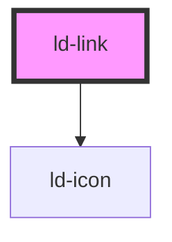

---
eleventyNavigation:
  key: Link
  parent: Components
layout: layout.njk
title: Link
permalink: components/ld-link/
---

# ld-link

<link rel="stylesheet" href="css_components/ld-link.css">
<link rel="stylesheet" href="css_components/ld-icon.css">

This component is meant to be used in conjunction with the [`ld-icon`](components/ld-icon/). Please reffer to the [`ld-icon`](components/ld-icon/) docs for further usage examples.

## Examples

### Basic


<ld-link>Link</ld-link>

<!-- CSS component -->

<a class="ld-link">Link</a>



### Different sizes


<ld-link size="sm">Link</ld-link>
<ld-link>Link</ld-link>
<ld-link size="lg">Link</ld-link>

<!-- CSS component -->

<a class="ld-link ld-link--sm">Link</a>
<a class="ld-link">Link</a>
<a class="ld-link ld-link--lg">Link</a>



### Disabled state


<ld-link disabled>Link</ld-link>

<!-- CSS component -->

<a class="ld-link ld-link--disabled">Link</a>



### With link to new address


<ld-link href="introduction/getting-started/">Link</ld-link>

<!-- CSS component -->

<a href="introduction/getting-started/" class="ld-link">Link</a>



### With _blank target


<ld-link target="_blank" href="introduction/getting-started/">Link</ld-link>

<!-- CSS component -->

<a target="_blank" href="introduction/getting-started/" class="ld-link">Link</a>



### With chevron icon


<ld-link show-icon>Link</ld-link>

<!-- CSS component -->

<a class="ld-link">
<svg class="ld-link__icon ld-icon" viewBox="0 0 16 16" fill="none" xmlns="http://www.w3.org/2000/svg">
<path d="m7 13 4-5-4-5" stroke="currentcolor" stroke-width="2" stroke-linecap="round" stroke-linejoin="round"/>
</svg>Link</a>



<!-- Auto Generated Below -->

## Properties

| Property   | Attribute   | Description                                                       | Type               | Default     |
| ---------- | ----------- | ----------------------------------------------------------------- | ------------------ | ----------- |
| `disabled` | `disabled`  | Sets the disabled state                                           | `boolean`          | `undefined` |
| `href`     | `href`      | Sets the link address                                             | `string`           | `undefined` |
| `key`      | `key`       | for tracking the node's identity when working with lists          | `string \| number` | `undefined` |
| `ref`      | `ref`       | reference to component                                            | `any`              | `undefined` |
| `showIcon` | `show-icon` | Displays chevron icon as prefix                                   | `boolean`          | `undefined` |
| `size`     | `size`      | Sets the size of the text                                         | `"lg" \| "sm"`     | `undefined` |
| `target`   | `target`    | Sets target of the link - _blank\|_self\|_parent\|_top\|framename | `string`           | `undefined` |

## Shadow Parts

| Part         | Description                         |
| ------------ | ----------------------------------- |
| `"arrow"`    | adds chevron arrow before link text |
| `"disabled"` | sets the disabled state             |
| `"href"`     | sets the link address               |
| `"icon"`     |                                     |
| `"showIcon"` | displays chevron icon as prefix     |
| `"size"`     | sets the size of the text           |
| `"target"`   | sets target of the link             |

## Dependencies

### Depends on

- [ld-icon](../ld-icon)

### Graph

----------------------------------------------

 
