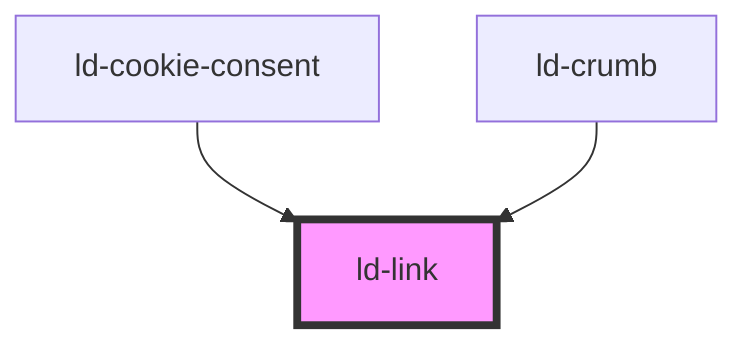

---
eleventyNavigation:
  key: Link
  parent: Components
layout: layout.njk
title: Link
permalink: components/ld-link/
---

# ld-link

<link rel="stylesheet" href="{{ env.base }}/{{ buildstamp }}css_components/ld-link.css">
<link rel="stylesheet" href="{{ env.base }}/{{ buildstamp }}css_components/ld-icon.css">
<link rel="stylesheet" href="{{ env.base }}/{{ buildstamp }}css_components/ld-typo.css">

This component is meant to be used in conjunction with the [`ld-icon`](components/ld-icon/). Please reffer to the [`ld-icon`](components/ld-icon/) docs for further usage examples.

## Examples

### Basic


<ld-link>Link</ld-link>

<!-- React component -->

<LdLink>Link</LdLink>

<!-- CSS component -->

<a class="ld-link">Link</a>


### Different sizes

The `ld-link` component inherits its font-size and line-height.


<ld-typo variant="body-xs">
  <b>XS</b>: Lorem ipsum <ld-link>dolor sit amet</ld-link>, consectetur adipiscing elit.
</ld-typo>

<ld-typo variant="body-s">
  <b>S</b>: Lorem ipsum <ld-link>dolor sit amet</ld-link>, consectetur adipiscing elit.
</ld-typo>

<ld-typo variant="body-m">
  <b>M</b>: Lorem ipsum <ld-link>dolor sit amet</ld-link>, consectetur adipiscing elit.
</ld-typo>

<!-- React component -->

<LdTypo variant="body-xs">
  <b>XS</b>: Lorem ipsum <LdLink>dolor sit amet</LdLink>, consectetur adipiscing elit.
</LdTypo>

<LdTypo variant="body-s">
  <b>S</b>: Lorem ipsum <LdLink>dolor sit amet</LdLink>, consectetur adipiscing elit.
</LdTypo>

<LdTypo variant="body-m">
  <b>M</b>: Lorem ipsum <LdLink>dolor sit amet</LdLink>, consectetur adipiscing elit.
</LdTypo>

<!-- CSS component -->

  <b>XS</b>: Lorem ipsum <a class="ld-link">dolor sit amet</a>, consectetur adipiscing elit.

  <b>S</b>: Lorem ipsum <a class="ld-link">dolor sit amet</a>, consectetur adipiscing elit.

  <b>M</b>: Lorem ipsum <a class="ld-link">dolor sit amet</a>, consectetur adipiscing elit.



### Disabled state

There are several ways to disable a link. The simplest one is by not using a `href` prop. However, this renders the link non-focusable. If you want the link to stay focusable even when it is supposed to be disabled, use the `disabled` prop on the Web Component, respectively set the `aria-disabled` attribute to `true` on the CSS component and keep the `href` set. The Web Component version of the link will prevent the default behavior of the anchor element on click. The CSS component will obviously not do this out of the box, so you will have to handle this on your side.


<ld-link href="#" disabled>Link</ld-link>

<!-- React component -->

<LdLink href="#" disabled>Link</LdLink>

<!-- CSS component -->

<a id="disabled-link" class="ld-link" href="#" aria-disabled="true">Link</a>



### With target

<ld-notice headline="Note" mode="warning">
  When using <code>target="_blank"</code>, a <code>rel</code> attribute with the value <code>noreferrer noopener</code> is applied automatically. Just in case. If you are using the CSS component version of the link, you will need to take care of this yourself. See <a href="https://web.dev/external-anchors-use-rel-noopener/" rel="noreferrer noopener" target="_blank">https://web.dev/external-anchors-use-rel-noopener/</a>
</ld-notice>


<ld-link href="#" target="_blank">
  Link which opens in a new tab
</ld-link>

<!-- React component -->

<LdLink href="#" target="_blank">
  Link which opens in a new tab
</LdLink>

<!-- CSS component -->

<a class="ld-link" href="#" target="_blank" rel="noreferrer noopener">
  Link which opens in a new tab
</a>


### With chevron icon


<ld-link chevron="start">Link</ld-link>
<ld-link chevron="end">Link</ld-link>

<!-- React component -->

<LdLink chevron="start">Link</LdLink>
<LdLink chevron="end">Link</LdLink>

<!-- CSS component -->

<a class="ld-link ld-link--chevron-start">Link</a>
<a class="ld-link ld-link--chevron-end">Link</a>


<!-- Auto Generated Below -->

## Properties

| Property         | Attribute        | Description                                                                                                                                                                                                           | Type                                         | Default     |
| ---------------- | ---------------- | --------------------------------------------------------------------------------------------------------------------------------------------------------------------------------------------------------------------- | -------------------------------------------- | ----------- |
| `chevron`        | `chevron`        | Displays chevron icon.                                                                                                                                                                                                | `"end" \| "start"`                           | `undefined` |
| `disabled`       | `disabled`       | The disabled attribute sets `aria-disabled="true"` on the rendered anchor element.                                                                                                                                    | `boolean`                                    | `undefined` |
| `download`       | `download`       | Causes the browser to treat the linked URL as a download.                                                                                                                                                             | `boolean \| string`                          | `undefined` |
| `href`           | `href`           | The URL that the hyperlink points to.                                                                                                                                                                                 | `string`                                     | `undefined` |
| `hreflang`       | `hreflang`       | Hints at the human language of the linked URL.                                                                                                                                                                        | `string`                                     | `undefined` |
| `key`            | `key`            | for tracking the node's identity when working with lists                                                                                                                                                              | `string \| number`                           | `undefined` |
| `ldTabindex`     | `ld-tabindex`    | Tab index of the input.                                                                                                                                                                                               | `number`                                     | `undefined` |
| `ping`           | `ping`           | A space-separated list of URLs to ping on link follow.                                                                                                                                                                | `string`                                     | `undefined` |
| `ref`            | `ref`            | reference to component                                                                                                                                                                                                | `any`                                        | `undefined` |
| `referrerpolicy` | `referrerpolicy` | A space-separated list of URLs to ping on link follow.                                                                                                                                                                | `string`                                     | `undefined` |
| `target`         | `target`         | The `target` attributed can be used in conjunction with the `href` attribute. See [mdn docs](https://developer.mozilla.org/en-US/docs/Web/HTML/Element/a#attr-target) for more information on the `target` attribute. | `"_blank" \| "_parent" \| "_self" \| "_top"` | `undefined` |

## Methods

### `focusInner() => Promise<void>`

Sets focus on the anchor.

#### Returns

Type: `Promise<void>`

## Shadow Parts

| Part       | Description     |
| ---------- | --------------- |
| `"anchor"` | the link anchor |

## Dependencies

### Used by

 - [ld-cookie-consent](../ld-cookie-consent)
 - [ld-crumb](../ld-breadcrumbs/ld-crumb)

### Graph

----------------------------------------------

*Built with [StencilJS](https://stenciljs.com/)*
