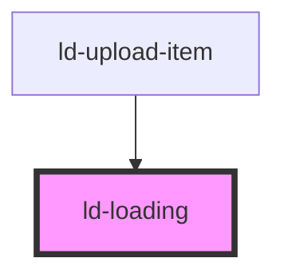

---
eleventyNavigation:
  key: Loading Indicator
  parent: Components
layout: layout.njk
title: Loading Indicator
permalink: components/ld-loading/
---

<link rel="stylesheet" href="{{ env.base }}/{{ buildstamp }}css_components/ld-loading.css">

# ld-loading

Use the `ld-loading` component to indicate that the user should wait for a process to complete. Combine it with textual information on what is going on for a better user experience. 

## Basic


<ld-loading></ld-loading>

<!-- React component -->

<LdLoading />

<!-- CSS component -->

<svg class="ld-loading" viewBox="0 0 100 100" preserveAspectRatio="xMidYMid meet">
  <title>Loading</title>
  <circle cx="50" cy="50" r="50" />
  <g>
    <circle cx="50" cy="50" r="50" />
    <circle cx="50" cy="50" r="50" />
    <circle cx="50" cy="50" r="50" />
    <animateTransform
      attributeName="transform"
      attributeType="XML"
      type="rotate"
      from="0 50 50"
      to="360 50 50"
      dur="0.9s"
      repeatCount="indefinite"
    />
  </g>
</svg>


## Neutral


<ld-loading neutral></ld-loading>

<!-- React component -->

<LdLoading neutral />

<!-- CSS component -->

<svg class="ld-loading ld-loading--neutral" viewBox="0 0 100 100" preserveAspectRatio="xMidYMid meet">
  <title>Loading</title>
  <circle cx="50" cy="50" r="50" />
  <g>
    <circle cx="50" cy="50" r="50" />
    <circle cx="50" cy="50" r="50" />
    <circle cx="50" cy="50" r="50" />
    <animateTransform
      attributeName="transform"
      attributeType="XML"
      type="rotate"
      from="0 50 50"
      to="360 50 50"
      dur="0.9s"
      repeatCount="indefinite"
    />
  </g>
</svg>


## CSS Variables

| Variable                     | Description                               | Default                   |
| ---------------------------- | ----------------------------------------- | ------------------------- |
| `--ld-loading-col-base`      | Base color of the loading indicator.      | `var(--ld-thm-warning)`   |
| `--ld-loading-col-primary`   | Primary color of the loading indicator.   | `var(--ld-thm-primary)`   |
| `--ld-loading-col-secondary` | Secondary color of the loading indicator. | `var(--ld-thm-secondary)` |
| `--ld-loading-size`          | Size of the loading indicator.            | `var(--ld-sp-24)`         |

<!-- Auto Generated Below -->

## Properties

| Property  | Attribute | Description                                              | Type               | Default     |
| --------- | --------- | -------------------------------------------------------- | ------------------ | ----------- |
| `key`     | `key`     | for tracking the node's identity when working with lists | `string \| number` | `undefined` |
| `label`   | `label`   | Used as svg title element content.                       | `string`           | `'Loading'` |
| `neutral` | `neutral` | Uses neutral colors.                                     | `boolean`          | `undefined` |
| `paused`  | `paused`  | Pauses all animations.                                   | `boolean`          | `undefined` |
| `ref`     | `ref`     | reference to component                                   | `any`              | `undefined` |

## Dependencies

### Used by

 - [ld-upload-item](../ld-file-upload/ld-upload-item)

### Graph

----------------------------------------------

*Built with [StencilJS](https://stenciljs.com/)*
