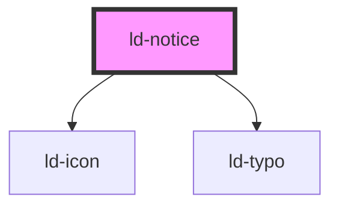

---
eleventyNavigation:
  key: Notice
  parent: Components
layout: layout.njk
title: Notice
permalink: components/ld-notice/
---

# ld-notice

<link rel="stylesheet" href="css_components/ld-notice.css">
<link rel="stylesheet" href="css_components/ld-icon.css">
<link rel="stylesheet" href="css_components/ld-typo.css">

This component is meant to be used in conjunction with the [`ld-input`](components/ld-input/) and the [`ld-label`](components/ld-label/) component. Please reffer to the [`ld-input`](components/ld-input/) docs for further usage examples.

## Examples

### As error message


<ld-notice headline="An error occurred" mode="error">Lorem ipsum dolor sit amet, consectetur adipiscing elit. Metus pellentesque facilisi nunc iaculis. Laoreet eget eu lacus cursus odio quam ut elementum. Faucibus cursus in placerat enim non senectus. In molestie volutpat at sem bibendum ac id. Suspendisse erat malesuada vulputate et congue blandit in erat ornare. Rhoncus interdum.</ld-notice>

<!-- CSS component -->

  <!-- Note that you can use an img element with the class ld-notice__icon here, as well. -->
  <svg class="ld-notice__icon ld-icon ld-icon--lg" width="14" height="14" viewBox="0 0 14 14" fill="none" xmlns="http://www.w3.org/2000/svg">
    <path fill-rule="evenodd" clip-rule="evenodd" d="M7 14C10.866 14 14 10.866 14 7C14 3.13401 10.866 0 7 0C3.13401 0 0 3.13401 0 7C0 10.866 3.13401 14 7 14Z" fill="currentColor"/>
    <path fill-rule="evenodd" clip-rule="evenodd" d="M7.18234 11.0254C6.79228 11.0254 6.48657 10.9147 6.26518 10.6933C6.0438 10.472 5.93311 10.1662 5.93311 9.77618V6.12335C5.93311 5.99685 6.0069 5.93359 6.15449 5.93359H6.89771C7.28776 5.93359 7.59348 6.04428 7.81487 6.26567C8.03625 6.48705 8.14694 6.79277 8.14694 7.18283V10.8357C8.14694 10.9622 8.07315 11.0254 7.92556 11.0254H7.18234Z" fill="var(--ld-icon-secondary-col)"/>
    <ellipse cx="6.99977" cy="3.80007" rx="1.06667" ry="1.06667" fill="var(--ld-icon-secondary-col)"/>
  </svg>
  
An error occurred

  Lorem ipsum dolor sit amet, consectetur adipiscing elit. Metus pellentesque facilisi nunc iaculis. Laoreet eget eu lacus cursus odio quam ut elementum. Faucibus cursus in placerat enim non senectus. In molestie volutpat at sem bibendum ac id. Suspendisse erat malesuada vulputate et congue blandit in erat ornare. Rhoncus interdum.



### As info message


<ld-notice headline="Information">Lorem ipsum dolor sit amet, consectetur adipiscing elit. Metus pellentesque facilisi nunc iaculis. Laoreet eget eu lacus cursus odio quam ut elementum. Faucibus cursus in placerat enim non senectus. In molestie volutpat at sem bibendum ac id. Suspendisse erat malesuada vulputate et congue blandit in erat ornare. Rhoncus interdum.</ld-notice>

<!-- CSS component -->

  <!-- Note that you can use an img element with the class ld-notice__icon here, as well. -->
  <svg class="ld-notice__icon ld-icon ld-icon--lg" width="14" height="14" viewBox="0 0 14 14" fill="none" xmlns="http://www.w3.org/2000/svg">
    <path fill-rule="evenodd" clip-rule="evenodd" d="M7 14C10.866 14 14 10.866 14 7C14 3.13401 10.866 0 7 0C3.13401 0 0 3.13401 0 7C0 10.866 3.13401 14 7 14Z" fill="currentColor"/>
    <path fill-rule="evenodd" clip-rule="evenodd" d="M7.18234 11.0254C6.79228 11.0254 6.48657 10.9147 6.26518 10.6933C6.0438 10.472 5.93311 10.1662 5.93311 9.77618V6.12335C5.93311 5.99685 6.0069 5.93359 6.15449 5.93359H6.89771C7.28776 5.93359 7.59348 6.04428 7.81487 6.26567C8.03625 6.48705 8.14694 6.79277 8.14694 7.18283V10.8357C8.14694 10.9622 8.07315 11.0254 7.92556 11.0254H7.18234Z" fill="var(--ld-icon-secondary-col)"/>
    <ellipse cx="6.99977" cy="3.80007" rx="1.06667" ry="1.06667" fill="var(--ld-icon-secondary-col)"/>
  </svg>
  
Information

  Lorem ipsum dolor sit amet, consectetur adipiscing elit. Metus pellentesque facilisi nunc iaculis. Laoreet eget eu lacus cursus odio quam ut elementum. Faucibus cursus in placerat enim non senectus. In molestie volutpat at sem bibendum ac id. Suspendisse erat malesuada vulputate et congue blandit in erat ornare. Rhoncus interdum.



### As warning message


<ld-notice headline="Warning!" mode="warning">Lorem ipsum dolor sit amet, consectetur adipiscing elit. Metus pellentesque facilisi nunc iaculis. Laoreet eget eu lacus cursus odio quam ut elementum. Faucibus cursus in placerat enim non senectus. In molestie volutpat at sem bibendum ac id. Suspendisse erat malesuada vulputate et congue blandit in erat ornare. Rhoncus interdum.</ld-notice>

<!-- CSS component -->

  <!-- Note that you can use an img element with the class ld-notice__icon here, as well. -->
  <svg class="ld-notice__icon ld-icon ld-icon--lg" width="14" height="14" viewBox="0 0 14 14" fill="none" xmlns="http://www.w3.org/2000/svg">
    <path fill-rule="evenodd" clip-rule="evenodd" d="M7 14C10.866 14 14 10.866 14 7C14 3.13401 10.866 0 7 0C3.13401 0 0 3.13401 0 7C0 10.866 3.13401 14 7 14Z" fill="currentColor"/>
    <path fill-rule="evenodd" clip-rule="evenodd" d="M7.18234 11.0254C6.79228 11.0254 6.48657 10.9147 6.26518 10.6933C6.0438 10.472 5.93311 10.1662 5.93311 9.77618V6.12335C5.93311 5.99685 6.0069 5.93359 6.15449 5.93359H6.89771C7.28776 5.93359 7.59348 6.04428 7.81487 6.26567C8.03625 6.48705 8.14694 6.79277 8.14694 7.18283V10.8357C8.14694 10.9622 8.07315 11.0254 7.92556 11.0254H7.18234Z" fill="var(--ld-icon-secondary-col)"/>
    <ellipse cx="6.99977" cy="3.80007" rx="1.06667" ry="1.06667" fill="var(--ld-icon-secondary-col)"/>
  </svg>
  
Warning!

  Lorem ipsum dolor sit amet, consectetur adipiscing elit. Metus pellentesque facilisi nunc iaculis. Laoreet eget eu lacus cursus odio quam ut elementum. Faucibus cursus in placerat enim non senectus. In molestie volutpat at sem bibendum ac id. Suspendisse erat malesuada vulputate et congue blandit in erat ornare. Rhoncus interdum.



<!-- Auto Generated Below -->

## Properties

| Property   | Attribute  | Description                                              | Type                             | Default     |
| ---------- | ---------- | -------------------------------------------------------- | -------------------------------- | ----------- |
| `headline` | `headline` | Headline of the notice.                                  | `string`                         | `undefined` |
| `key`      | `key`      | for tracking the node's identity when working with lists | `string \| number`               | `undefined` |
| `mode`     | `mode`     | Mode of the notice.                                      | `"error" \| "info" \| "warning"` | `'info'`    |
| `ref`      | `ref`      | reference to component                                   | `any`                            | `undefined` |

## Shadow Parts

| Part         | Description                             |
| ------------ | --------------------------------------- |
| `"headline"` | `ld-typo` element used for the headline |
| `"icon"`     | Image tag used for the icon             |

## Dependencies

### Depends on

- [ld-icon](../ld-icon)
- [ld-typo](../ld-typo)

### Graph

----------------------------------------------

 
