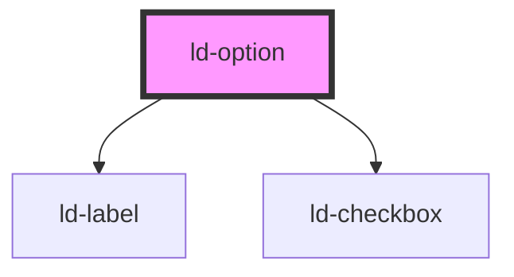

# ld-option

<!-- Auto Generated Below -->

## Properties

| Property   | Attribute  | Description                                                                                                                                                                                                     | Type      | Default     |
| ---------- | ---------- | --------------------------------------------------------------------------------------------------------------------------------------------------------------------------------------------------------------- | --------- | ----------- |
| `selected` | `selected` | If present, this boolean attribute indicates that the option is selected.                                                                                                                                       | `boolean` | `undefined` |
| `value`    | `value`    | The content of this attribute represents the value to be submitted with the form, should this option be selected. If this attribute is omitted, the value is taken from the text content of the option element. | `string`  | `undefined` |

## Dependencies

### Depends on

- [ld-label](../ld-label)
- [ld-checkbox](../ld-checkbox)

### Graph

----------------------------------------------

*Built with [StencilJS](https://stenciljs.com/)*
