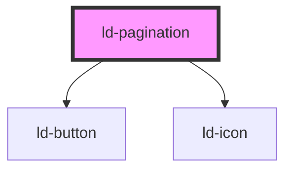

---
eleventyNavigation:
  key: Pagination
  parent: Components
layout: layout.njk
title: Pagination
permalink: components/ld-pagination/
---

# ld-pagination

An pagination provides a visual hint for content or interactions. Combine it with textual information for a better user experience. When using an pagination on its own, make sure to either apply an [`aria-label`](https://developer.mozilla.org/en-US/docs/Web/Accessibility/ARIA/ARIA_Techniques/Using_the_aria-label_attribute) or use the [ld-sr-only](components/ld-sr-only/) component.

---

## Examples


<ld-pagination length="4444"></ld-pagination>
<ld-pagination length="8"></ld-pagination>
<ld-pagination length="7"></ld-pagination>
<ld-pagination length="6"></ld-pagination>
<ld-pagination length="5"></ld-pagination>


### Dots mode


<ld-pagination length="15" mode="dots"></ld-pagination>


### Select mode


<ld-pagination length="15" mode="select"></ld-pagination>


### Different sizes


<ld-pagination length="15" size="sm"></ld-pagination>

<ld-pagination length="15"></ld-pagination>

<ld-pagination length="15" size="lg"></ld-pagination>

<ld-pagination length="15" mode="dots" size="sm"></ld-pagination>

<ld-pagination length="15" mode="dots"></ld-pagination>

<ld-pagination length="15" mode="dots" size="lg"></ld-pagination>

<ld-pagination length="15" mode="select" size="sm"></ld-pagination>

<ld-pagination length="15" mode="select"></ld-pagination>

<ld-pagination length="15" mode="select" size="lg"></ld-pagination>


### Preselected index


<ld-pagination selectedIndex="7" length="15"></ld-pagination>


<!-- Auto Generated Below -->

## Properties

| Property        | Attribute        | Description                                                               | Type                 | Default     |
| --------------- | ---------------- | ------------------------------------------------------------------------- | -------------------- | ----------- |
| `itemLabel`     | `item-label`     | Label to communicate the type of an item.                                 | `string`             | `'Page'`    |
| `key`           | `key`            | for tracking the node's identity when working with lists                  | `string \| number`   | `undefined` |
| `length`        | `length`         | The maximum number of items.                                              | `number`             | `Infinity`  |
| `mode`          | `mode`           | Mode of the pagination.                                                   | `"dots" \| "select"` | `undefined` |
| `ref`           | `ref`            | reference to component                                                    | `any`                | `undefined` |
| `selectedIndex` | `selected-index` | The currently selected item (an index of `-1` means nothing is selected). | `number`             | `0`         |
| `size`          | `size`           | Size of the pagination.                                                   | `"lg" \| "sm"`       | `undefined` |

## Events

| Event      | Description                                | Type                  |
| ---------- | ------------------------------------------ | --------------------- |
| `ldchange` | Dispatched, if the selected index changes. | `CustomEvent<number>` |

## Slots

| Slot | Description                                                      |
| ---- | ---------------------------------------------------------------- |
|      | (optional) Custom SVG pagination (only valid without name prop). |

## Shadow Parts

| Part           | Description        |
| -------------- | ------------------ |
| `"pagination"` | Actual SVG element |

## Dependencies

### Depends on

- [ld-button](../ld-button)
- [ld-icon](../ld-icon)

### Graph

----------------------------------------------

 
