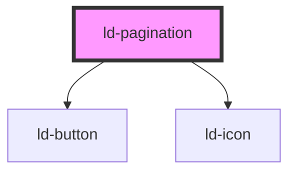

---
eleventyNavigation:
  key: Pagination
  parent: Components
layout: layout.njk
title: Pagination
permalink: components/ld-pagination/
---

# ld-pagination

An pagination provides a visual hint for content or interactions. Combine it with textual information for a better user experience. When using an pagination on its own, make sure to either apply an [`aria-label`](https://developer.mozilla.org/en-US/docs/Web/Accessibility/ARIA/ARIA_Techniques/Using_the_aria-label_attribute) or use the [ld-sr-only](components/ld-sr-only/) component.

---

## Examples

### Default


<ld-pagination length="15"></ld-pagination>


### With sticky items


<ld-pagination sticky="1" length="15"></ld-pagination>
<ld-pagination sticky="3" length="15"></ld-pagination>


### Offset


<ld-pagination offset="1" length="15"></ld-pagination>
<ld-pagination offset="0" length="15"></ld-pagination>


### Indefinite length


<ld-pagination></ld-pagination>


### Item label


<ld-pagination item-label="Slide" length="15"></ld-pagination>


### Hide arrow buttons


<ld-pagination hide-prev-next hide-start-end length="15"></ld-pagination>
<ld-pagination hide-prev-next length="15"></ld-pagination>
<ld-pagination hide-start-end length="15"></ld-pagination>


### Text instead of arrow buttons


<ld-pagination end-label="Last" length="15" next-label="Next" prev-label="Prev" start-label="First"></ld-pagination>
<ld-pagination hide-prev-next length="15" start-label="First" end-label="Last"></ld-pagination>
<ld-pagination hide-start-end length="15" next-label="Next" prev-label="Prev"></ld-pagination>


### Size


<ld-pagination length="15" size="sm"></ld-pagination>
<ld-pagination length="15"></ld-pagination>
<ld-pagination length="15" size="lg"></ld-pagination>


### Preselected index


<ld-pagination selected-index="7" length="15"></ld-pagination>


### Programmatic manipulation


<ld-button onclick="jump(-10);"><< 10</ld-button>
<ld-pagination id="pagination-1" length="15"></ld-pagination>
<ld-button onclick="jump(10);">>> 10</ld-button>
<ld-button onclick="add(-10);">Remove 10</ld-button>
<ld-button onclick="add(10);">Add 10</ld-button>



### Event handling


<ld-pagination id="pagination-2" length="15"></ld-pagination>



### Dots mode


<ld-pagination mode="dots" hide-prev-next hide-start-end selected-index="3" size="sm" length="7"></ld-pagination>
<ld-pagination mode="dots" hide-prev-next hide-start-end selected-index="3" length="15"></ld-pagination>
<ld-pagination mode="dots" hide-prev-next hide-start-end selected-index="3" size="lg" length="7"></ld-pagination>


### Dots mode with custom space


<ld-pagination space="1.5rem" mode="dots" hide-prev-next hide-start-end length="7"></ld-pagination>


### On brand color


<ld-pagination brand-color mode="dots" hide-prev-next hide-start-end length="7"></ld-pagination>
<ld-pagination brand-color length="7"></ld-pagination>


<!-- Auto Generated Below -->

## Properties

| Property        | Attribute        | Description                                                                                               | Type                  | Default     |
| --------------- | ---------------- | --------------------------------------------------------------------------------------------------------- | --------------------- | ----------- |
| `brandColor`    | `brand-color`    | Switch colors for brand background                                                                        | `boolean`             | `undefined` |
| `endLabel`      | `end-label`      | Label text for the end button (replaces the icon).                                                        | `string`              | `undefined` |
| `hidePrevNext`  | `hide-prev-next` | Hide the buttons to navigate forward/backward.                                                            | `boolean`             | `false`     |
| `hideStartEnd`  | `hide-start-end` | Hide the buttons to navigate to the first/last item.                                                      | `boolean`             | `false`     |
| `itemLabel`     | `item-label`     | Label to communicate the type of an item.                                                                 | `string`              | `'Page'`    |
| `key`           | `key`            | for tracking the node's identity when working with lists                                                  | `string \| number`    | `undefined` |
| `length`        | `length`         | The number of items/pages available for pagination (required to let the user jump to the last item/page). | `number`              | `Infinity`  |
| `mode`          | `mode`           | Items display mode, default as numbers                                                                    | `"dots" \| "numbers"` | `'numbers'` |
| `nextLabel`     | `next-label`     | Label text for the forward button (replaces the icon).                                                    | `string`              | `undefined` |
| `offset`        | `offset`         | Number of next/previous items visible.                                                                    | `number`              | `2`         |
| `prevLabel`     | `prev-label`     | Label text for the backward button (replaces the icon).                                                   | `string`              | `undefined` |
| `ref`           | `ref`            | reference to component                                                                                    | `any`                 | `undefined` |
| `selectedIndex` | `selected-index` | The currently selected item (an index of `-1` means nothing is selected).                                 | `number`              | `0`         |
| `size`          | `size`           | Size of the pagination.                                                                                   | `"lg" \| "sm"`        | `undefined` |
| `space`         | `space`          | Space between column dot items, translated in rem (default 0.25rem)                                       | `string`              | `undefined` |
| `startLabel`    | `start-label`    | Label text for the start button (replaces the icon).                                                      | `string`              | `undefined` |
| `sticky`        | `sticky`         | Number of items permanently visible at the start/end.                                                     | `number`              | `0`         |

## Events

| Event      | Description                                | Type                  |
| ---------- | ------------------------------------------ | --------------------- |
| `ldchange` | Dispatched, if the selected index changes. | `CustomEvent<number>` |

## Shadow Parts

| Part               | Description                                                         |
| ------------------ | ------------------------------------------------------------------- |
| `"arrow"`          | all arrow items (`ld-button` elements)                              |
| `"end"`            | arrow to jump to the last item (`ld-button` element)                |
| `"focusable"`      |                                                                     |
| `"item"`           | all pagination items containing a number (`ld-button` elements)     |
| `"items"`          | list containing all slidable items and the marker                   |
| `"list-wrapper"`   | list-item containing the `ul` element with slidable items           |
| `"marker"`         | marker highlighting the selected item                               |
| `"mode"`           | items display mode, 'dots' \| 'numbers'(default)                    |
| `"more-indicator"` | list-items containing more-indicator                                |
| `"next"`           | arrow to go to the next item (`ld-button` element)                  |
| `"onBrand"`        | switches the colors to white                                        |
| `"prev"`           | arrow to go to the previous item (`ld-button` element)              |
| `"slide-wrapper"`  |                                                                     |
| `"space"`          | Space between column dot items, translated in rem (default 0.25rem) |
| `"start"`          | arrow to jump to the first item (`ld-button` element)               |
| `"sticky"`         | all sticky items (`ld-button` elements)                             |
| `"wrapper"`        | list containing all pagination items                                |

## Dependencies

### Depends on

- [ld-button](../ld-button)
- [ld-icon](../ld-icon)

### Graph

----------------------------------------------

 
