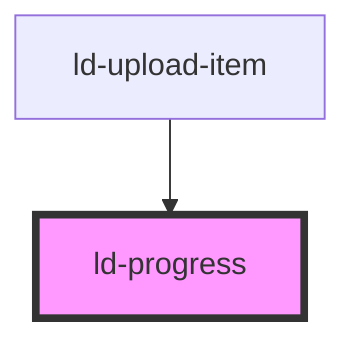

---
eleventyNavigation:
  key: Progress
  parent: Components
layout: layout.njk
title: Progress
permalink: components/ld-progress/
---

<link rel="stylesheet" href="{{ env.base }}/{{ buildstamp }}css_components/ld-progress.css">
<link rel="stylesheet" href="{{ env.base }}/{{ buildstamp }}css_components/ld-sr-only.css">

# ld-progress

The `ld-progress` component can be used to displays the progress status for tasks that take a long time.

---

## Default


<ld-sr-only id="progress-label">Progress</ld-sr-only>
<ld-progress aria-labeledby="progress-label" aria-valuenow="25"></ld-progress>

<!-- React component -->

<LdSrOnly id="progress-label">Progress</LdSrOnly>
<LdProgress aria-labeledby="progress-label" aria-valuenow={25} />

<!-- CSS component -->

Progress



Interactive example:


<ld-sr-only id="progress-label">Progress</ld-sr-only>
<ld-progress aria-labeledby="progress-label" aria-valuenow="25"></ld-progress>

<ld-slider value="25" max="200" width="14rem"></ld-slider>

<!-- React component -->

const progressRef = useRef(null)

return (
  <>
    <LdSrOnly id="progress-label">Progress</LdSrOnly>
    <LdProgress
      aria-labeledby="progress-label"
      aria-valuenow={25}
      ref={progressRef}
     />

    <LdSlider
      value="25"
      max={200}
      width="14rem"
      onLdchange={(ev) => {
        progressRef.current.ariaValuenow = ev.detail[0]
      }}
    />
  </>
)

<!-- CSS component -->

Progress

<ld-slider value="25" max="200" width="14rem"></ld-slider>



## With custom min and max values


<ld-progress aria-valuemax="300"
             aria-valuemin="100"
             aria-valuenow="150"></ld-progress>

<!-- React component -->

<LdProgress aria-valuemax={300}
            aria-valuemin={100}
            aria-valuenow={150} />

<!-- CSS component -->



## Overflow

The component can visualize an overflow value up to 200% of the maximum progress value.


<ld-progress aria-valuenow="125"></ld-progress>
<ld-progress aria-valuenow="225"></ld-progress>

<!-- React component -->

<LdProgress aria-valuenow={125} />
<LdProgress aria-valuenow={225} />

<!-- CSS component -->



## Steps


<ld-progress aria-valuemax="4" aria-valuenow="1" steps></ld-progress>

<!-- React component -->

<LdProgress aria-valuemax={4} aria-valuenow={1} steps />

<!-- CSS component -->



## Pending


<ld-progress pending aria-valuetext="indeterminate"></ld-progress>
<ld-progress pending aria-valuenow="25"></ld-progress>

<!-- React component -->

<LdProgress pending aria-valuetext="indeterminate" />
<LdProgress pending aria-valuenow={25} />

<!-- CSS component -->



## On brand color

Use this mode on backgrounds with brand color.


<ld-progress brand-color aria-valuenow="25"></ld-progress>

<!-- React component -->

<LdProgress brandColor aria-valuenow={25} />

<!-- CSS component -->



<!-- Auto Generated Below -->

## Properties

| Property        | Attribute        | Description                                                                                                                                                                                | Type               | Default     |
| --------------- | ---------------- | ------------------------------------------------------------------------------------------------------------------------------------------------------------------------------------------ | ------------------ | ----------- |
| `ariaLabeledby` | `aria-labeledby` | Defines the string value or identifies the element (or elements) that label the progressbar element providing an accessible name.                                                          | `string`           | `undefined` |
| `ariaValuemax`  | `aria-valuemax`  | Set to a decimal value representing the maximum value, and greater than aria-valuemin. If not present, the default value is 100.                                                           | `number`           | `100`       |
| `ariaValuemin`  | `aria-valuemin`  | Set to a decimal value representing the minimum value, and less than aria-valuemax. If not present, the default value is 0.                                                                | `number`           | `0`         |
| `ariaValuenow`  | `aria-valuenow`  | Only present and required if the value is not indeterminate. Set to a decimal value between 0, or valuemin if present, and aria-valuemax indicating the current value of the progress bar. | `number`           | `undefined` |
| `ariaValuetext` | `aria-valuetext` | Assistive technologies often present the value of aria-valuenow as a percentage. If this would not be accurate use this property to make the progress bar value understandable.            | `string`           | `undefined` |
| `brandColor`    | `brand-color`    | Styles the progress bar in a way that it looks good on the primary color of the current theme.                                                                                             | `boolean`          | `undefined` |
| `key`           | `key`            | for tracking the node's identity when working with lists                                                                                                                                   | `string \| number` | `undefined` |
| `pending`       | `pending`        | Used to show indeterminate or pending progress state.                                                                                                                                      | `boolean`          | `undefined` |
| `ref`           | `ref`            | reference to component                                                                                                                                                                     | `any`              | `undefined` |
| `steps`         | `steps`          | Devides progress bar in multiple progress steps.                                                                                                                                           | `boolean`          | `undefined` |

## Dependencies

### Used by

 - [ld-upload-item](../ld-file-upload/ld-upload-item)

### Graph

----------------------------------------------

*Built with [StencilJS](https://stenciljs.com/)*
