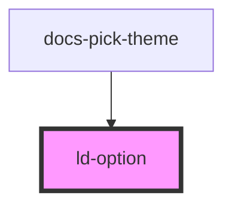

---
eleventyNavigation:
  key: Option
  parent: Select
layout: layout.njk
title: Option
permalink: components/ld-select/ld-option/
---

# ld-option

The `ld-option` component is a subcomponent for `ld-select`.

Please refer to the [`ld-select` documentation](components/ld-select) for usage examples.

---

<!-- Auto Generated Below -->

## Properties

| Property   | Attribute  | Description                                                                                                                                                                                                     | Type               | Default     |
| ---------- | ---------- | --------------------------------------------------------------------------------------------------------------------------------------------------------------------------------------------------------------- | ------------------ | ----------- |
| `disabled` | `disabled` | Disables the option.                                                                                                                                                                                            | `boolean`          | `undefined` |
| `key`      | `key`      | for tracking the node's identity when working with lists                                                                                                                                                        | `string \| number` | `undefined` |
| `ref`      | `ref`      | reference to component                                                                                                                                                                                          | `any`              | `undefined` |
| `selected` | `selected` | If present, this boolean attribute indicates that the option is selected.                                                                                                                                       | `boolean`          | `undefined` |
| `value`    | `value`    | The content of this attribute represents the value to be submitted with the form, should this option be selected. If this attribute is omitted, the value is taken from the text content of the option element. | `string`           | `undefined` |

## Dependencies

### Used by

 - docs-pick-theme

### Graph

----------------------------------------------

*Built with [StencilJS](https://stenciljs.com/)*
